# Interprocess Communication: Pipes - Complete Guide

## Table of Contents
1. [Introduction](#introduction)
2. [What is a Pipe?](#what-is-a-pipe)
3. [Types of Pipes](#types-of-pipes)
4. [Kernel-Level Architecture](#kernel-level-architecture)
5. [Pipe System Calls](#pipe-system-calls)
6. [Anonymous Pipes (Unnamed Pipes)](#anonymous-pipes)
7. [Named Pipes (FIFOs)](#named-pipes)
8. [Behind the Hood: Kernel Implementation](#behind-the-hood)
9. [Buffer Management](#buffer-management)
10. [Blocking vs Non-Blocking Operations](#blocking-vs-non-blocking)
11. [Real-World Usage](#real-world-usage)
12. [Practical Examples](#practical-examples)
13. [Advanced Concepts](#advanced-concepts)
14. [Best Practices](#best-practices)
15. [Limitations and Considerations](#limitations)
16. [Comprehensive Resources](#comprehensive-resources)
17. [Practice Exercises](#practice-exercises)

---

## Introduction

**Interprocess Communication (IPC)** refers to mechanisms that allow processes to exchange data and synchronize their actions. Pipes are one of the oldest and most fundamental IPC mechanisms in UNIX/Linux systems.

### Why Pipes?

- **Simple:** Easy to understand and use
- **Efficient:** Kernel-level buffering, no disk I/O
- **Unidirectional:** Clear data flow direction
- **Automatic synchronization:** Blocking operations provide natural flow control
- **Universal:** Available on all UNIX-like systems

---

## What is a Pipe?

A **pipe** is a unidirectional communication channel that allows data to flow from one process to another.

### Conceptual Model

```
Process A (Writer)  --->  [PIPE BUFFER]  --->  Process B (Reader)
```

### Key Characteristics

1. **Unidirectional:** Data flows in one direction only
2. **FIFO:** First In, First Out (queue behavior)
3. **Byte stream:** No message boundaries
4. **Kernel-buffered:** Data stored in kernel space
5. **Automatic blocking:** Reader waits if empty, writer waits if full

### Mental Model

Think of a pipe like a physical water pipe:
- Water (data) flows in one direction
- You pour water at one end (write)
- Water comes out the other end (read)
- Pipe has limited capacity (buffer size)
- If pipe is full, you must wait to pour more
- If pipe is empty, you must wait for water to arrive

---

## Types of Pipes

### 1. Anonymous Pipes (Unnamed Pipes)

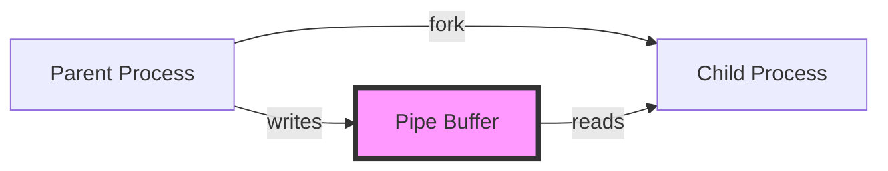

**Characteristics:**
- Created with `pipe()` system call
- No name in filesystem
- Only accessible by processes with file descriptor
- Typically used between parent and child processes
- Cannot be accessed by unrelated processes

**Use Case:** Parent-child communication after `fork()`

### 2. Named Pipes (FIFOs)

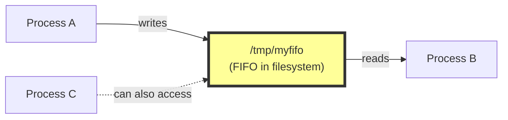

**Characteristics:**
- Created with `mkfifo()` or `mknod()`
- Has a name in the filesystem
- Any process with proper permissions can access
- Persists until explicitly deleted
- Allows unrelated processes to communicate

**Use Case:** Communication between unrelated processes

---

## Kernel-Level Architecture

### File Descriptor Table

Every process has a file descriptor table pointing to kernel objects:

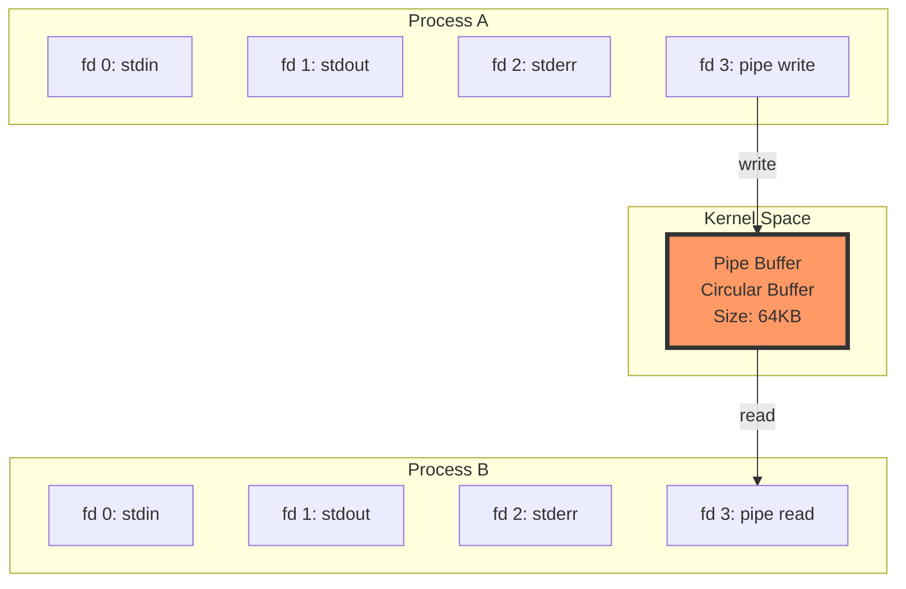

### Three-Level Architecture

```
User Space          System Call Interface          Kernel Space
-----------         ----------------------          ------------

write(fd, buf, n) ─────────────────> sys_write()
                                            │
                                            v
                                      VFS Layer
                                            │
                                            v
                                     Pipe Operations
                                            │
                                            v
                                    [Pipe Buffer]
                                            │
                                            v
                                     Pipe Operations
                                            │
                                            v
                                      VFS Layer
                                            │
                                            v
read(fd, buf, n) <───────────────── sys_read()
```

**Layers:**

1. **User Space:** Application code with file descriptors
2. **System Call Interface:** Entry point to kernel
3. **VFS (Virtual File System):** Abstraction layer treating pipes like files
4. **Pipe Operations:** Specific pipe read/write logic
5. **Pipe Buffer:** Actual data storage in kernel memory

---

## Pipe System Calls

### 1. `pipe()` - Create Anonymous Pipe

```c
#include <unistd.h>

int pipe(int pipefd[2]);
```

**Parameters:**
- `pipefd[2]`: Array of two integers to store file descriptors
  - `pipefd[0]`: Read end
  - `pipefd[1]`: Write end

**Returns:**
- `0` on success
- `-1` on error (sets `errno`)

**How it works:**

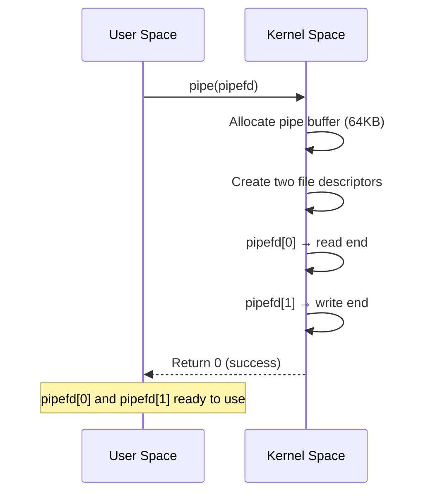

**Behind the scenes:**
1. Kernel allocates a circular buffer (default 64KB on Linux)
2. Creates two file structures in kernel
3. Links them to the same pipe buffer
4. Returns file descriptors to user space
5. File descriptors are indices in process's file descriptor table

### 2. `read()` - Read from Pipe

```c
#include <unistd.h>

ssize_t read(int fd, void *buf, size_t count);
```

**Parameters:**
- `fd`: File descriptor (pipe read end)
- `buf`: Buffer to store read data
- `count`: Maximum bytes to read

**Returns:**
- Number of bytes read
- `0` if write end closed (EOF)
- `-1` on error

**Blocking Behavior:**
- If pipe is empty and write end is open: **blocks** until data available
- If pipe is empty and write end is closed: returns `0` (EOF)

### 3. `write()` - Write to Pipe

```c
#include <unistd.h>

ssize_t write(int fd, const void *buf, size_t count);
```

**Parameters:**
- `fd`: File descriptor (pipe write end)
- `buf`: Data to write
- `count`: Number of bytes to write

**Returns:**
- Number of bytes written
- `-1` on error

**Blocking Behavior:**
- If pipe buffer is full: **blocks** until space available
- If read end is closed: process receives `SIGPIPE` signal (usually terminates)

**Atomicity:**
- Writes ≤ `PIPE_BUF` bytes (4096 on Linux) are atomic
- Larger writes may be interleaved with other writers

### 4. `close()` - Close Pipe End

```c
#include <unistd.h>

int close(int fd);
```

**Why close is critical:**
- Closing write end signals EOF to readers
- Closing unused ends prevents deadlocks
- Reduces file descriptor consumption

### 5. `mkfifo()` - Create Named Pipe

```c
#include <sys/types.h>
#include <sys/stat.h>

int mkfifo(const char *pathname, mode_t mode);
```

**Parameters:**
- `pathname`: Path in filesystem
- `mode`: Permissions (like file permissions)

**Returns:**
- `0` on success
- `-1` on error

---

## Anonymous Pipes

### Basic Usage Pattern

```c
int pipefd[2];
pipe(pipefd);

if (fork() == 0) {
    // Child
    close(pipefd[1]);  // Close write end
    read(pipefd[0], buf, size);
    close(pipefd[0]);
} else {
    // Parent
    close(pipefd[0]);  // Close read end
    write(pipefd[1], data, size);
    close(pipefd[1]);
}
```

### Data Flow Visualization

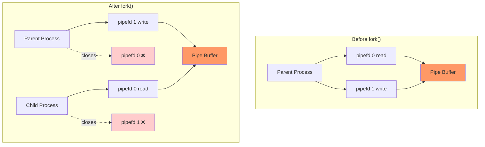

### Complete Example: Parent to Child

```c
#include <stdio.h>
#include <unistd.h>
#include <string.h>

int main() {
    int pipefd[2];
    pid_t pid;
    char write_msg[] = "Hello from parent";
    char read_msg[100];

    // Create pipe
    if (pipe(pipefd) == -1) {
        perror("pipe");
        return 1;
    }

    pid = fork();

    if (pid == 0) {
        // Child process - reader
        close(pipefd[1]);  // Close unused write end

        int n = read(pipefd[0], read_msg, sizeof(read_msg));
        printf("Child received: %s\n", read_msg);

        close(pipefd[0]);
    } else {
        // Parent process - writer
        close(pipefd[0]);  // Close unused read end

        write(pipefd[1], write_msg, strlen(write_msg) + 1);
        printf("Parent sent: %s\n", write_msg);

        close(pipefd[1]);
    }

    return 0;
}
```

**Execution Flow:**

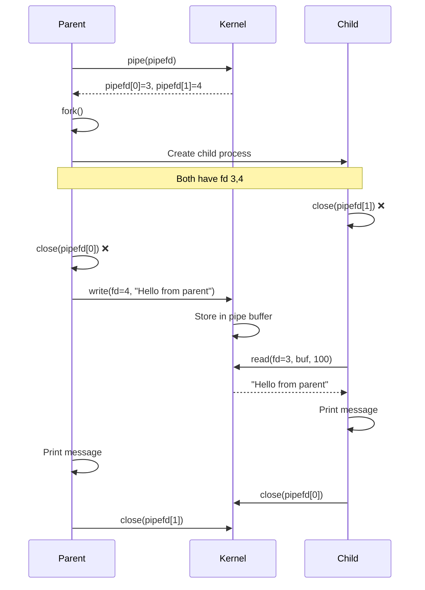

### Bidirectional Communication (Two Pipes)

For bidirectional communication, use two pipes:

```c
int pipe1[2];  // Parent → Child
int pipe2[2];  // Child → Parent

pipe(pipe1);
pipe(pipe2);

if (fork() == 0) {
    // Child
    close(pipe1[1]);  // Don't write to pipe1
    close(pipe2[0]);  // Don't read from pipe2

    read(pipe1[0], buf, size);   // Read from parent
    write(pipe2[1], buf, size);  // Write to parent

} else {
    // Parent
    close(pipe1[0]);  // Don't read from pipe1
    close(pipe2[1]);  // Don't write to pipe2

    write(pipe1[1], data, size); // Write to child
    read(pipe2[0], buf, size);   // Read from child
}
```

**Visualization:**

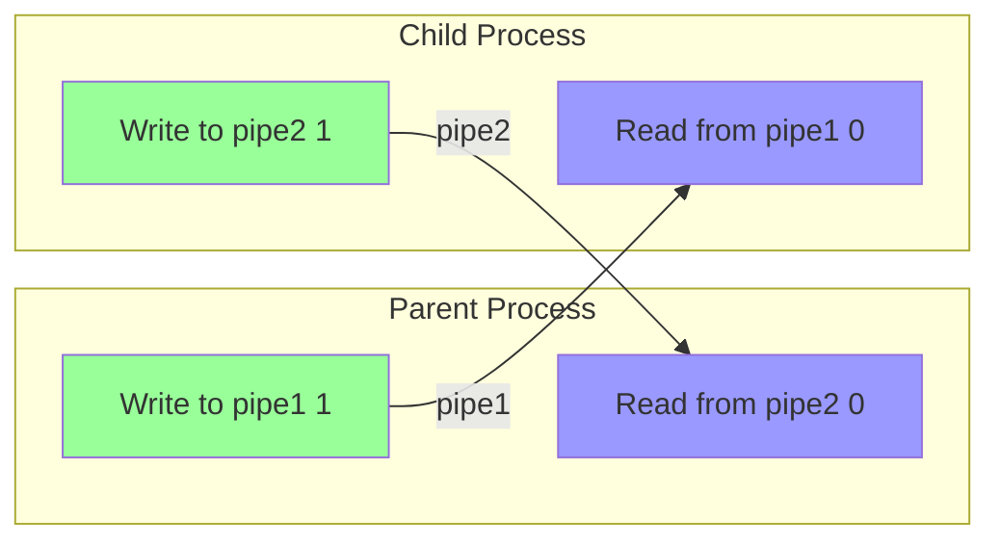

---

## Named Pipes (FIFOs)

### Creating a Named Pipe

**Method 1: Using `mkfifo()` system call**

```c
#include <sys/types.h>
#include <sys/stat.h>

int main() {
    // Create FIFO with rw-rw-r-- permissions
    if (mkfifo("/tmp/myfifo", 0664) == -1) {
        perror("mkfifo");
        return 1;
    }
    return 0;
}
```

**Method 2: Using `mkfifo` command**

```bash
mkfifo /tmp/myfifo
ls -l /tmp/myfifo
# Output: prw-rw-r-- 1 user group 0 Nov 10 12:00 /tmp/myfifo
#         ^
#         p indicates pipe (FIFO)
```

### Using Named Pipes

**Writer Process:**

```c
#include <fcntl.h>
#include <unistd.h>
#include <string.h>

int main() {
    int fd;
    char *message = "Hello via FIFO";

    // Open FIFO for writing (blocks until reader opens)
    fd = open("/tmp/myfifo", O_WRONLY);

    write(fd, message, strlen(message) + 1);

    close(fd);
    return 0;
}
```

**Reader Process:**

```c
#include <fcntl.h>
#include <unistd.h>
#include <stdio.h>

int main() {
    int fd;
    char buffer[100];

    // Open FIFO for reading (blocks until writer opens)
    fd = open("/tmp/myfifo", O_RDONLY);

    read(fd, buffer, sizeof(buffer));
    printf("Received: %s\n", buffer);

    close(fd);
    return 0;
}
```

### Named Pipe Behavior

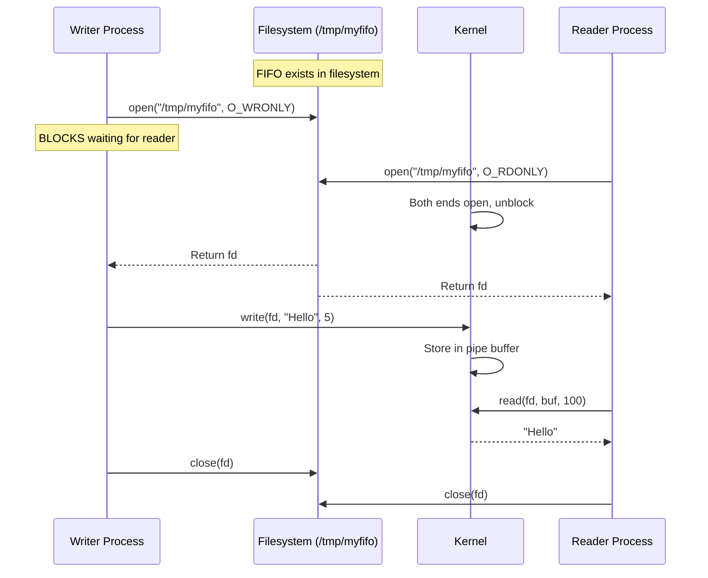

**Important:** `open()` on FIFO blocks until both reader and writer have opened it.

### Non-Blocking Named Pipes

```c
// Open for writing, don't block
int fd = open("/tmp/myfifo", O_WRONLY | O_NONBLOCK);

if (fd == -1) {
    perror("open");  // ENXIO if no reader
}
```

---

## Behind the Hood: Kernel Implementation

### Pipe Buffer Structure

In Linux kernel, pipe is implemented as a circular buffer:

```c
// Simplified kernel structure (actual is more complex)
struct pipe_inode_info {
    struct page *pages;        // Array of memory pages
    unsigned int head;         // Write position
    unsigned int tail;         // Read position
    unsigned int ring_size;    // Number of pages
    unsigned int max_usage;    // Maximum buffer size
    unsigned int readers;      // Number of reader file descriptors
    unsigned int writers;      // Number of writer file descriptors
    wait_queue_head_t rd_wait; // Reader wait queue
    wait_queue_head_t wr_wait; // Writer wait queue
};
```

### Circular Buffer Visualization

```
    head (write position)
         ↓
    ┌────┬────┬────┬────┬────┬────┬────┬────┐
    │ D  │ E  │ F  │    │    │    │ A  │ B  │
    └────┴────┴────┴────┴────┴────┴────┴────┘
                              ↑
                          tail (read position)
```

**Operations:**

1. **Write:**
   - Place data at `head` position
   - Advance `head` pointer
   - If `head == tail` after write, buffer is full

2. **Read:**
   - Read data from `tail` position
   - Advance `tail` pointer
   - If `head == tail` after read, buffer is empty

3. **Wrap-around:**
   - When pointer reaches end, wraps to beginning
   - This is why it's "circular"

### Write System Call Flow

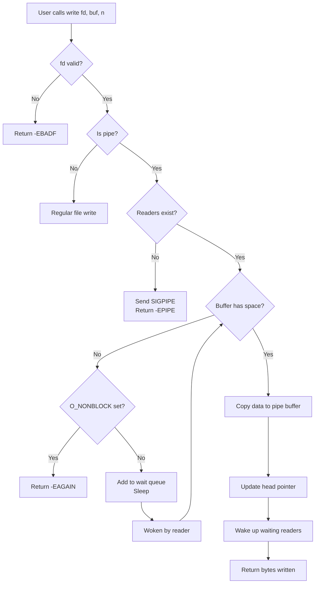

### Read System Call Flow

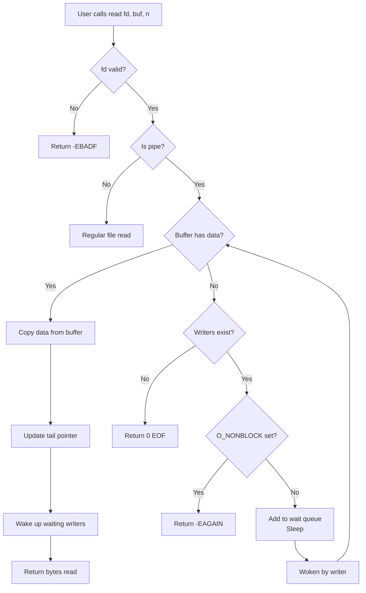

### Process Sleep and Wakeup

When a process blocks on a pipe:

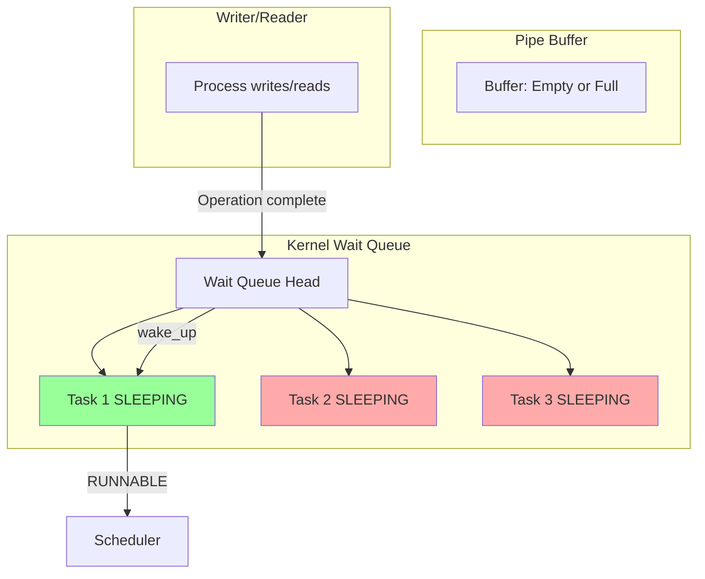

**Sleep/Wakeup Mechanism:**

1. **Sleep:**
   - Process added to wait queue
   - State changed from RUNNING to SLEEPING
   - Scheduler picks another process
   - Process doesn't consume CPU

2. **Wakeup:**
   - Writer/reader completes operation
   - Kernel calls `wake_up()` on wait queue
   - Sleeping process state → RUNNABLE
   - Scheduler eventually runs it

---

## Buffer Management

### Buffer Size

**Default size:** 64KB (65,536 bytes) on modern Linux

**Check buffer size:**

```bash
# System-wide pipe buffer size
cat /proc/sys/fs/pipe-max-size
# Usually: 1048576 (1MB maximum)

# Default pipe buffer size
cat /proc/sys/fs/pipe-user-pages-soft
# Usually: 16384 (pages)
```

**Change buffer size (requires root):**

```c
#include <fcntl.h>

int fd = /* pipe fd */;

// Set pipe buffer to 1MB
int new_size = fcntl(fd, F_SETPIPE_SZ, 1024 * 1024);

if (new_size == -1) {
    perror("fcntl F_SETPIPE_SZ");
}
```

### Atomicity Guarantees

**PIPE_BUF:** Atomic write size (4096 bytes on Linux)

```c
#include <limits.h>
printf("PIPE_BUF = %ld\n", (long)PIPE_BUF);
```

**Implications:**

- Writes ≤ PIPE_BUF bytes: **Atomic** (not interleaved)
- Writes > PIPE_BUF bytes: **May be interleaved** with other writers

**Example:**

```
Writer A writes 3000 bytes: [AAAA...]  ← Atomic
Writer B writes 3000 bytes: [BBBB...]  ← Atomic

Pipe buffer: [AAAA...][BBBB...]  ✓ Not mixed

Writer A writes 10000 bytes: [AAAA...]
Writer B writes 10000 bytes: [BBBB...]

Pipe buffer: [AAAA...BBBB...AAAA...BBBB...]  ✗ Interleaved!
```

### Buffer Overflow Handling

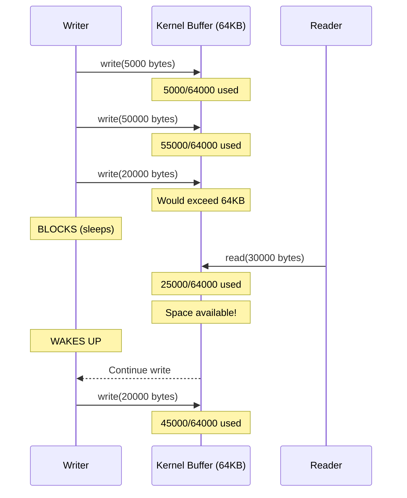

---

## Blocking vs Non-Blocking Operations

### Blocking Mode (Default)

**Characteristics:**
- Process sleeps until operation can complete
- No CPU consumption while waiting
- Automatic synchronization

**Example:**

```c
int pipefd[2];
pipe(pipefd);

// Blocking read
char buf[100];
int n = read(pipefd[0], buf, 100);  // Sleeps until data available
```

### Non-Blocking Mode

**Enable non-blocking:**

```c
#include <fcntl.h>

int flags = fcntl(pipefd[0], F_GETFL);
fcntl(pipefd[0], F_SETFL, flags | O_NONBLOCK);
```

**Behavior:**

```c
// Non-blocking read
int n = read(pipefd[0], buf, 100);

if (n == -1 && errno == EAGAIN) {
    printf("No data available right now\n");
} else if (n > 0) {
    printf("Read %d bytes\n", n);
}
```

### Comparison Table

| Aspect | Blocking | Non-Blocking |
|--------|----------|--------------|
| **Read from empty pipe** | Sleeps until data arrives | Returns -1, errno = EAGAIN |
| **Write to full pipe** | Sleeps until space available | Returns -1, errno = EAGAIN |
| **CPU usage** | None (sleeping) | Must poll, wastes CPU |
| **Complexity** | Simple | Requires error handling & polling |
| **Use case** | Linear producer-consumer | Event-driven, multiplexing |

### Using select() for Multiplexing

Instead of polling non-blocking pipes, use `select()` or `poll()`:

```c
#include <sys/select.h>

int pipefd[2];
pipe(pipefd);

fd_set readfds;
FD_ZERO(&readfds);
FD_SET(pipefd[0], &readfds);

struct timeval timeout = {5, 0};  // 5 seconds

int ready = select(pipefd[0] + 1, &readfds, NULL, NULL, &timeout);

if (ready > 0) {
    // Data available, read won't block
    read(pipefd[0], buf, sizeof(buf));
} else if (ready == 0) {
    printf("Timeout\n");
}
```

---

## Real-World Usage

This section explores how pipes are used in production systems, demonstrating practical applications in widely-used software.

### 1. Shell Command Pipelines

The most ubiquitous use of pipes. Every time you use `|` in bash, you're creating pipes.

```bash
# Classic pipeline
ps aux | grep nginx | awk '{print $2}' | xargs kill

# Data processing pipeline
cat access.log | grep "ERROR" | cut -d' ' -f1 | sort | uniq -c | sort -nr
```

**How it works:**
- Shell creates a pipe for each `|` operator
- Forks child processes for each command
- Connects stdout of one command to stdin of next via pipe
- All commands run concurrently

**Performance benefit:** Commands process data in parallel, not sequentially. While `grep` is still reading, `awk` can already be processing earlier output.

### 2. PostgreSQL System Logger

PostgreSQL uses pipes for logging redirection to separate log management from database processes.

**Source:** `src/backend/postmaster/syslogger.c`

**Implementation:**
```c
// Simplified from PostgreSQL source
static int syslogPipe[2] = {-1, -1};

void SysLoggerInit(void) {
    // Create pipe for log messages
    if (pipe(syslogPipe) < 0) {
        ereport(FATAL, "could not create pipe for syslog");
    }

    // Redirect stderr to pipe write end
    if (dup2(syslogPipe[1], fileno(stderr)) < 0) {
        ereport(FATAL, "could not redirect stderr");
    }

    // Fork syslogger process
    sysloggerPid = fork();
    if (sysloggerPid == 0) {
        // Child: close write end, read from pipe
        close(syslogPipe[1]);
        SysLoggerMain();  // Reads from pipe, writes to files
    }

    // Parent: close read end
    close(syslogPipe[0]);
}
```

**Why pipes?**
- Decouples log generation from log writing
- Non-blocking for database processes
- Kernel buffering prevents log loss
- Clean process separation

**Reference:** https://doxygen.postgresql.org/syslogger_8c_source.html

### 3. Docker Container I/O

Docker attaches container stdin/stdout/stderr to pipes for communication between host and container.

**Architecture:**
```
Host Process <--pipe--> Docker Daemon <--pipe--> Container Process
```

**How it works:**
```bash
# When you run:
echo "SELECT * FROM users;" | docker exec -i postgres_container psql

# Docker creates pipes:
# 1. Your shell stdout -> pipe -> docker CLI stdin
# 2. Docker CLI -> pipe -> Docker daemon
# 3. Docker daemon -> pipe -> container process stdin
# 4. Container stdout -> pipe -> Docker daemon -> pipe -> your terminal
```

**Implementation details:**
- Docker uses `docker exec` with `-i` flag for interactive stdin
- Pipes created using standard Unix `pipe()` system call
- Multiple layers of pipes for security and process isolation
- Performance overhead: ~2.5x slower than direct I/O for large data

**Reference:** https://github.com/moby/moby/issues/14221

**Real-world issue:** GitHub issue #21346 documents significant I/O performance degradation when piping large data through containers (6 minutes vs 2.5 seconds for 3GB file).

### 4. Nginx Master-Worker Communication

Nginx uses pipes (called "channels") for master process to communicate with worker processes.

**Architecture:**
```
Master Process --[channel[0] write]--> Worker Process
                                       [channel[1] read]
```

**Implementation details:**

From Nginx source analysis:

```c
// Simplified from Nginx source
ngx_channel_t channel[2];

// Master creates channel for each worker
socketpair(AF_UNIX, SOCK_STREAM, 0, channel);

if (fork() == 0) {
    // Worker process
    close(channel[0]);  // Close write end

    // Add channel[1] to event loop for monitoring
    ngx_add_channel_event(channel[1], NGX_READ_EVENT);

    // Worker listens for commands from master
    while (1) {
        ngx_process_events_and_timers();
        // Reads commands like: reload, reopen logs, quit gracefully
    }
} else {
    // Master process
    close(channel[1]);  // Close read end

    // Master writes commands to channel[0]
    ngx_write_channel(channel[0], &cmd, sizeof(cmd));
}
```

**Communication flow:**
1. Master creates socketpair (similar to pipe but bidirectional)
2. On fork, both processes inherit both ends
3. Master closes read end, keeps write end
4. Worker closes write end, keeps read end
5. Master sends commands (reload config, reopen logs, graceful shutdown)
6. Worker listens via epoll/kqueue event loop

**Commands sent through pipes:**
- `NGX_CMD_QUIT`: Graceful shutdown
- `NGX_CMD_TERMINATE`: Immediate shutdown
- `NGX_CMD_REOPEN`: Reopen log files
- `NGX_CMD_OPEN_CHANNEL`: Accept new worker

**Why not signals?**
- Pipes allow structured data (not just signal numbers)
- More reliable than signals
- Integrates with event loop (epoll/kqueue)
- No signal handler race conditions

**Reference:**
- https://mohitmishra786.github.io/chessman/2024/12/29/Understanding-NGINX-Worker-Architecture.html

### 5. systemd Socket Activation

systemd uses pipes for socket activation and service management.

**Use case:** Start service on-demand when first connection arrives

**Implementation:**
```c
// systemd creates listening socket
int listen_fd = socket(AF_UNIX, SOCK_STREAM, 0);
bind(listen_fd, ...);
listen(listen_fd, ...);

// Fork service process
if (fork() == 0) {
    // Child inherits listen_fd as stdin
    dup2(listen_fd, STDIN_FILENO);
    exec("my-service");
}
```

**Benefit:** Service starts lazily, systemd buffers early connections in kernel.

### 6. Build Systems (GNU Make)

Make uses pipes to capture command output and check for errors.

```bash
# Makefile rule
build:
    $(CC) -o program program.c 2>&1 | tee build.log
```

**How it works:**
- `2>&1` redirects stderr to stdout
- `|` creates pipe
- `tee` reads from pipe, writes to both stdout and file
- Make monitors pipe for error messages

### 7. Linux Kernel Internal Pipes

The kernel itself uses pipes for internal communication.

**Example: Core dump helper**

```bash
# /proc/sys/kernel/core_pattern
|/usr/lib/systemd/systemd-coredump %P %u %g %s %t %c %h
```

When program crashes:
1. Kernel creates pipe
2. Forks helper process (`systemd-coredump`)
3. Writes core dump to pipe
4. Helper reads from pipe, compresses, stores

**Benefit:** Compression happens in userspace, kernel doesn't block.

### 8. Performance Analysis: Real-World Benchmarks

**From Linux kernel development (LWN.net):**

Linus Torvalds' circular pipe implementation (2005):
- **Improvement:** 30-90% increase in pipe bandwidth
- **Mechanism:** Larger buffer size (16 pages vs 1 page)
- **Latency cost:** Minimal (~microseconds)

**Reference:** https://lwn.net/Articles/118750/

**Modern benchmarks (2025):**
- Pipe throughput: 5-15 GB/s (depending on CPU)
- Latency: 1-2 microseconds per operation
- Context switch overhead: 1-5 microseconds
- Comparison: Shared memory is ~2x faster for large data

### 9. Redis Pipelining

While Redis uses network sockets, the concept is inspired by Unix pipes.

```bash
# Pipeline multiple commands
(echo "SET key1 value1"; echo "SET key2 value2"; echo "GET key1") | redis-cli
```

**Pattern:** Batch multiple operations to reduce round-trip overhead.

### Summary of Real-World Patterns

| System | Pipe Usage | Purpose |
|--------|-----------|---------|
| **Shell** | Command pipelines | Data flow between processes |
| **PostgreSQL** | Log redirection | Separate logging from DB operations |
| **Docker** | Container I/O | Host-container communication |
| **Nginx** | Master-worker channels | Process management commands |
| **systemd** | Socket activation | On-demand service startup |
| **GNU Make** | Build output capture | Error detection and logging |
| **Kernel** | Core dump helper | Offload compression to userspace |

**Common themes:**
- Process isolation and communication
- Non-blocking asynchronous I/O
- Clean separation of concerns
- Leveraging kernel buffering
- Performance optimization through concurrency

---

## Practical Examples

### Example 1: Simple Command Pipeline

**Simulate: `ls | wc -l`**

```c
#include <stdio.h>
#include <unistd.h>
#include <sys/wait.h>

int main() {
    int pipefd[2];
    pipe(pipefd);

    if (fork() == 0) {
        // Child 1: Execute 'ls'
        close(pipefd[0]);              // Close read end
        dup2(pipefd[1], STDOUT_FILENO); // Redirect stdout to pipe
        close(pipefd[1]);
        execlp("ls", "ls", NULL);
        perror("execlp ls");
        return 1;
    }

    if (fork() == 0) {
        // Child 2: Execute 'wc -l'
        close(pipefd[1]);              // Close write end
        dup2(pipefd[0], STDIN_FILENO);  // Redirect stdin from pipe
        close(pipefd[0]);
        execlp("wc", "wc", "-l", NULL);
        perror("execlp wc");
        return 1;
    }

    // Parent
    close(pipefd[0]);
    close(pipefd[1]);
    wait(NULL);
    wait(NULL);

    return 0;
}
```

**Data Flow:**


### Example 2: Parent-Child Bidirectional Communication

```c
#include <stdio.h>
#include <unistd.h>
#include <string.h>

int main() {
    int pipe_p2c[2];  // Parent to child
    int pipe_c2p[2];  // Child to parent

    pipe(pipe_p2c);
    pipe(pipe_c2p);

    if (fork() == 0) {
        // Child
        close(pipe_p2c[1]);
        close(pipe_c2p[0]);

        char buf[100];
        read(pipe_p2c[0], buf, sizeof(buf));
        printf("Child received: %s\n", buf);

        char response[] = "ACK from child";
        write(pipe_c2p[1], response, strlen(response) + 1);

        close(pipe_p2c[0]);
        close(pipe_c2p[1]);
    } else {
        // Parent
        close(pipe_p2c[0]);
        close(pipe_c2p[1]);

        char msg[] = "Hello from parent";
        write(pipe_p2c[1], msg, strlen(msg) + 1);

        char buf[100];
        read(pipe_c2p[0], buf, sizeof(buf));
        printf("Parent received: %s\n", buf);

        close(pipe_p2c[1]);
        close(pipe_c2p[0]);
    }

    return 0;
}
```

### Example 3: Named Pipe Server-Client

**Server (writer):**

```c
#include <stdio.h>
#include <fcntl.h>
#include <unistd.h>
#include <sys/stat.h>
#include <string.h>

int main() {
    mkfifo("/tmp/service", 0666);

    printf("Server: Waiting for clients...\n");

    int fd = open("/tmp/service", O_WRONLY);
    printf("Server: Client connected\n");

    char *messages[] = {
        "Message 1",
        "Message 2",
        "Message 3",
        NULL
    };

    for (int i = 0; messages[i] != NULL; i++) {
        write(fd, messages[i], strlen(messages[i]) + 1);
        printf("Server: Sent '%s'\n", messages[i]);
        sleep(1);
    }

    close(fd);
    unlink("/tmp/service");
    return 0;
}
```

**Client (reader):**

```c
#include <stdio.h>
#include <fcntl.h>
#include <unistd.h>

int main() {
    printf("Client: Connecting to server...\n");

    int fd = open("/tmp/service", O_RDONLY);
    printf("Client: Connected\n");

    char buf[100];
    int n;

    while ((n = read(fd, buf, sizeof(buf))) > 0) {
        printf("Client: Received '%s'\n", buf);
    }

    printf("Client: Server closed connection\n");
    close(fd);
    return 0;
}
```

### Example 4: Multiple Writers (Race Condition Demo)

```c
#include <stdio.h>
#include <unistd.h>
#include <string.h>

int main() {
    int pipefd[2];
    pipe(pipefd);

    // Create 3 writer children
    for (int i = 0; i < 3; i++) {
        if (fork() == 0) {
            close(pipefd[0]);

            char msg[100];
            sprintf(msg, "Message from child %d\n", i);

            // Small messages (atomic)
            for (int j = 0; j < 5; j++) {
                write(pipefd[1], msg, strlen(msg));
                usleep(100000);
            }

            close(pipefd[1]);
            return 0;
        }
    }

    // Parent reader
    close(pipefd[1]);

    char buf[100];
    int n;

    while ((n = read(pipefd[0], buf, sizeof(buf) - 1)) > 0) {
        buf[n] = '\0';
        printf("%s", buf);
    }

    close(pipefd[0]);
    return 0;
}
```

---

## Advanced Concepts

### 1. Pipe Capacity and Flow Control

**Automatic Flow Control:**

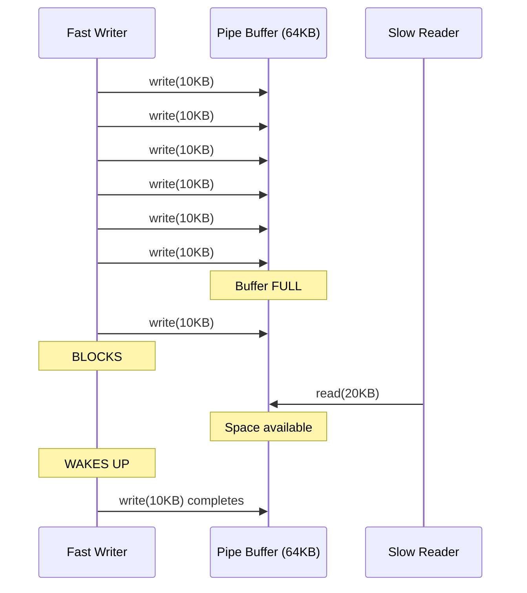

**This prevents:**
- Memory exhaustion
- Fast producer overwhelming slow consumer
- Need for explicit synchronization

### 2. Broken Pipe (SIGPIPE)

**What happens when reader closes:**

```c
int pipefd[2];
pipe(pipefd);

close(pipefd[0]);  // Close read end

// Write to pipe with no readers
int n = write(pipefd[1], "data", 4);

// Result:
// - Process receives SIGPIPE signal
// - Default action: terminate process
// - write() returns -1, errno = EPIPE
```

**Handle SIGPIPE:**

```c
#include <signal.h>

// Ignore SIGPIPE
signal(SIGPIPE, SIG_IGN);

// Now write() just returns -1 with errno = EPIPE
```

### 3. Pipe EOF Detection

**How reader detects end:**

```c
while ((n = read(pipefd[0], buf, sizeof(buf))) > 0) {
    // Process data
}

if (n == 0) {
    printf("All writers closed, EOF\n");
} else {
    perror("read error");
}
```

**EOF occurs when:**
- All write ends are closed
- No more data in buffer

### 4. Splice System Call (Zero-Copy)

Modern Linux provides `splice()` for efficient pipe operations:

```c
#include <fcntl.h>

// Move data from file to pipe without copying to user space
ssize_t splice(int fd_in, loff_t *off_in,
               int fd_out, loff_t *off_out,
               size_t len, unsigned int flags);
```

**Example: Fast file copy using pipes**

```c
int pipefd[2];
pipe(pipefd);

int input = open("input.txt", O_RDONLY);
int output = open("output.txt", O_WRONLY | O_CREAT, 0644);

// Move data: input → pipe → output
// Data never enters user space!
splice(input, NULL, pipefd[1], NULL, 65536, SPLICE_F_MOVE);
splice(pipefd[0], NULL, output, NULL, 65536, SPLICE_F_MOVE);
```

**Performance:**

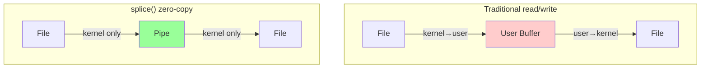

### 5. Tee System Call

`tee()` duplicates pipe data without consuming it:

```c
#include <fcntl.h>

// Copy data from input pipe to output pipe
// Data remains in input pipe
ssize_t tee(int fd_in, int fd_out, size_t len, unsigned int flags);
```

**Use case:** Duplicate stream for logging

### 6. Pipe and exec()

Pipes persist across `exec()`:

```c
int pipefd[2];
pipe(pipefd);

if (fork() == 0) {
    dup2(pipefd[1], STDOUT_FILENO);
    close(pipefd[0]);
    close(pipefd[1]);

    execlp("ls", "ls", "-l", NULL);
    // File descriptors preserved!
    // stdout now goes to pipe
}
```

---

## Best Practices

### 1. Always Close Unused Pipe Ends

❌ **Bad:**
```c
int pipefd[2];
pipe(pipefd);

if (fork() == 0) {
    // Child doesn't close write end
    read(pipefd[0], buf, size);
}
```

**Problem:** Child's open write end prevents EOF detection

✅ **Good:**
```c
if (fork() == 0) {
    close(pipefd[1]);  // Close unused write end
    read(pipefd[0], buf, size);
    close(pipefd[0]);
}
```

### 2. Check Return Values

❌ **Bad:**
```c
pipe(pipefd);
read(pipefd[0], buf, 100);
```

✅ **Good:**
```c
if (pipe(pipefd) == -1) {
    perror("pipe");
    exit(1);
}

int n = read(pipefd[0], buf, 100);
if (n == -1) {
    perror("read");
    exit(1);
}
```

### 3. Use Appropriate Buffer Sizes

```c
// Good: Less than PIPE_BUF for atomicity
char buf[4096];

// Risky: Exceeds PIPE_BUF, may interleave
char buf[1000000];
```

### 4. Handle SIGPIPE

```c
// Method 1: Ignore signal
signal(SIGPIPE, SIG_IGN);

// Method 2: Check errno
if (write(pipefd[1], buf, size) == -1) {
    if (errno == EPIPE) {
        printf("Broken pipe\n");
    }
}
```

### 5. Use Named Pipes for Persistent Communication

Anonymous pipes disappear when processes exit. Use FIFOs for:
- Unrelated processes
- Long-running services
- Multiple clients

### 6. Clean Up Named Pipes

```c
mkfifo("/tmp/myfifo", 0666);

// Use FIFO...

// Always delete when done
unlink("/tmp/myfifo");
```

### 7. Consider Alternatives for Complex IPC

Pipes are simple but limited. For complex needs, consider:
- **Message queues:** Structured messages
- **Shared memory:** High-performance, large data
- **Sockets:** Network communication
- **Signals:** Simple notifications

---

## Limitations and Considerations

### 1. Unidirectional Only

**Limitation:** Data flows one way

**Solution:** Use two pipes for bidirectional communication

### 2. No Message Boundaries

**Problem:**

```c
// Writer
write(fd, "Hello", 5);
write(fd, "World", 5);

// Reader
char buf[10];
read(fd, buf, 10);  // Might get "HelloWorld" in one read!
```

**Solution:** Add your own protocol:

```c
// Write length prefix
int len = strlen(msg);
write(fd, &len, sizeof(len));
write(fd, msg, len);

// Read length prefix
int len;
read(fd, &len, sizeof(len));
char *buf = malloc(len);
read(fd, buf, len);
```

### 3. Limited Buffer Size

**Problem:** Large data transfer blocks frequently

**Solutions:**
- Increase buffer with `F_SETPIPE_SZ`
- Use shared memory for large data
- Stream data in chunks

### 4. Anonymous Pipes Require Relationship

**Limitation:** Only work between related processes (parent-child)

**Solution:** Use named pipes for unrelated processes

### 5. No Random Access

**Problem:** Can only read sequentially

**Solution:** Use files or shared memory for random access

### 6. Performance vs Shared Memory

**Pipe:** Data copied through kernel

```
Process A → Kernel Buffer → Process B
  (copy 1)      (copy 2)
```

**Shared Memory:** No copy

```
Process A ← Shared Memory → Process B
           (zero copy)
```

For high-performance, large data transfers, shared memory is faster.

### 7. Atomicity Limits

**PIPE_BUF (4096 bytes):** Atomic write limit

**Problem:** Larger writes may interleave

**Solution:**
- Keep messages ≤ 4096 bytes
- Use locking for larger messages
- Use message queues with atomic messages

---

## Performance Considerations

### Benchmarks (Approximate)

| Operation | Latency | Throughput |
|-----------|---------|------------|
| Pipe write/read | ~1-2 μs | ~5-10 GB/s |
| Context switch | ~1-5 μs | - |
| Shared memory | ~0.1 μs | ~20+ GB/s |

### Optimization Tips

1. **Minimize System Calls:**
   ```c
   // Bad: Many small writes
   for (int i = 0; i < 1000; i++) {
       write(fd, &data[i], 1);
   }

   // Good: One large write
   write(fd, data, 1000);
   ```

2. **Use Appropriate Buffer Sizes:**
   - Too small: More system calls
   - Too large: Memory waste, cache misses
   - Sweet spot: 4KB-64KB

3. **Consider splice() for Large Files:**
   - Avoids user-space copy
   - Reduces CPU usage
   - Higher throughput

4. **Use Non-Blocking + select() for Multiple Pipes:**
   - Better than polling
   - Efficient multiplexing
   - Lower CPU usage

---

## Summary

### Key Takeaways

1. **Pipes are simple, efficient IPC mechanism**
2. **Unidirectional byte streams with kernel buffering**
3. **Automatic synchronization via blocking operations**
4. **Two types: Anonymous (related processes) and Named (any processes)**
5. **Kernel manages circular buffer with sleep/wakeup**
6. **Always close unused ends to prevent deadlocks**
7. **Limited by unidirectionality, no message boundaries, buffer size**

### When to Use Pipes

✅ **Good for:**
- Parent-child communication
- Command pipelines
- Simple producer-consumer
- Stream processing
- Text-based data

❌ **Not ideal for:**
- Large data transfers (use shared memory)
- Complex messaging (use message queues)
- Network communication (use sockets)
- Random access data (use files)
- Bidirectional streams (use sockets)

### Comparison with Other IPC

| Feature | Pipes | Sockets | Shared Mem | Msg Queue |
|---------|-------|---------|------------|-----------|
| Setup | Easy | Moderate | Complex | Easy |
| Speed | Fast | Moderate | Fastest | Fast |
| Network | No | Yes | No | No |
| Message boundaries | No | Yes | N/A | Yes |
| Bidirectional | No* | Yes | N/A | No* |
| Persistence | No | No | No | Yes |

*Can use two pipes/queues for bidirectional

---


### Kernel Documentation

**Linux Kernel Source Code:**
- `fs/pipe.c` - Main pipe implementation (2000+ lines)
- `include/linux/pipe_fs_i.h` - Pipe data structures
- `include/uapi/linux/limits.h` - PIPE_BUF and size limits

**Official Kernel Documentation:**
- **Circular Buffers:** https://docs.kernel.org/core-api/circular-buffers.html
  - Memory barriers, producer-consumer synchronization
  - Detailed implementation notes

- **Pipe Documentation:** https://www.kernel.org/doc/Documentation/circular-buffers.txt
  - Kernel's circular buffer implementation
  - Lock-free algorithms


### Real-World Source Code

**PostgreSQL:**
- `src/backend/postmaster/syslogger.c` - Logging pipe implementation
  - https://doxygen.postgresql.org/syslogger_8c_source.html
- `src/test/modules/libpq_pipeline/` - Pipeline mode examples

**Nginx:**
- `src/os/unix/ngx_process.c` - Process creation and channel setup
- `src/os/unix/ngx_channel.c` - Channel (pipe) communication
  - Analysis: https://programmer.help/blogs/how-the-nginx-master-worker-process-works.html
  - Architecture: https://mohitmishra786.github.io/chessman/2024/12/29/Understanding-NGINX-Worker-Architecture.html

**Docker/Moby:**
- Container I/O implementation
  - Issue tracker: https://github.com/moby/moby/issues/14221
  - Performance discussion: https://github.com/moby/moby/issues/21346

**systemd:**
- Socket activation and service management
- Pipe-based logging

### Man Pages (Essential Reference)

**System Calls:**
```bash
man 2 pipe       # Create pipe
man 2 pipe2      # Create pipe with flags
man 2 read       # Read from file descriptor
man 2 write      # Write to file descriptor
man 2 close      # Close file descriptor
man 2 dup        # Duplicate file descriptor
man 2 dup2       # Duplicate to specific fd
man 2 fcntl      # File control operations
man 2 splice     # Zero-copy pipe transfer
man 2 vmsplice   # Map user pages to pipe
man 2 tee        # Duplicate pipe data
```

**Library Functions:**
```bash
man 3 mkfifo     # Create named pipe
man 3 popen      # Open pipe to process
man 3 pclose     # Close pipe stream
```

**System Configuration:**
```bash
man 7 pipe       # Pipe overview
man 5 proc       # /proc filesystem (pipe limits)
```

### Online Resources

**Official Documentation:**
- **Linux Kernel Documentation:** https://www.kernel.org/doc/html/latest/
- **POSIX.1-2017 Specification:** https://pubs.opengroup.org/onlinepubs/9699919799/
  - pipe() specification
  - PIPE_BUF requirements

**Interactive Learning:**
- **OSDev Wiki - Unix Pipes:** https://wiki.osdev.org/Unix_Pipes
  - Implementation guide for OS developers

- **Pipe Internals Blog:** https://sbrksb.github.io/2021/01/05/pipes.html
  - Detailed analysis of Linux pipe implementation
  - Visual diagrams


### Community Resources

**Forums and Discussion:**
- Stack Overflow: [unix] and [ipc] tags
- Unix & Linux Stack Exchange
- Kernel Newbies mailing list

**Historical Context:**
  - "The Unix Philosophy" - Doug McIlroy
  - "Write programs that do one thing well"
  - "Write programs to work together"
  - Pipes as the connective tissue


### Research Topics for Deep Dive

1. **Zero-copy techniques:** `splice()`, `vmsplice()`, `tee()`
2. **Lock-free circular buffers** in kernel
3. **Memory barriers** and synchronization
4. **Performance comparison:** pipes vs shared memory vs sockets
5. **Named pipe security:** permissions and access control
6. **Pipe buffer management:** page allocation strategies

---

## Practice Exercises

### Exercise 1: Basic Pipe Communication
Write a program where parent sends 5 numbers to child, child computes their sum and sends back the result.

### Exercise 2: Command Pipeline
Implement: `cat file.txt | grep "pattern" | wc -l` using pipes and exec.

### Exercise 3: Named Pipe Chat
Create a simple chat program using two named pipes (one for each direction).

### Exercise 4: Multiple Readers
Create one writer and three readers. Observe how data is distributed (hint: first reader to read gets the data).

### Exercise 5: Pipe Buffer Overflow
Write a program that intentionally fills the pipe buffer. Observe blocking behavior.

---

NEXT [Message Queues](./02_message_queues.md)