# Interprocess Communication: Message Queues - Complete Guide

## Table of Contents
1. [Introduction](#introduction)
2. [What is a Message Queue?](#what-is-a-message-queue)
3. [Types of Message Queues](#types-of-message-queues)
4. [Kernel-Level Architecture](#kernel-level-architecture)
5. [Message Queue System Calls](#message-queue-system-calls)
6. [POSIX Message Queues](#posix-message-queues)
7. [System V Message Queues](#system-v-message-queues)
8. [Behind the Hood: Kernel Implementation](#behind-the-hood)
9. [Buffer Management and Limits](#buffer-management-and-limits)
10. [Blocking vs Non-Blocking Operations](#blocking-vs-non-blocking)
11. [Real-World Usage](#real-world-usage)
12. [Practical Examples](#practical-examples)
13. [Advanced Concepts](#advanced-concepts)
14. [Best Practices](#best-practices)
15. [Limitations and Considerations](#limitations)
16. [Comprehensive Resources](#comprehensive-resources)
17. [Practice Exercises](#practice-exercises)

---

## Introduction

**Message Queues** are a fundamental IPC mechanism that allows processes to exchange discrete messages rather than continuous byte streams. Unlike pipes, message queues preserve message boundaries and support priority-based delivery.

### Historical Context

The evolution of message queues in Unix systems reflects the growing need for structured communication:

**1970s - Early Unix (Pipes Only):**
- Pipes provided simple byte streams
- No message boundaries
- No priority support
- Limited to parent-child communication

**1980s - System V IPC (AT&T Unix System V):**
- Introduced the first message queue implementation
- Added semaphores and shared memory
- Became mandatory for Unix-certified systems
- **Problem:** Complex API, integer-based keys, system-wide persistence

**1990s-2000s - POSIX IPC:**
- Designed after observing System V IPC weaknesses
- Simpler, cleaner API
- File-like naming (`/queue_name`)
- Better integration with modern systems
- Added in Linux kernel 2.6.6 (2004)

**Key insight from history:** System V IPC taught us that complex APIs lead to errors. POSIX IPC simplified everything while adding powerful features like asynchronous notification.

### Why Message Queues?

Message queues solve specific problems that pipes cannot:

**Problem 1: Message Boundaries**
```c
// With pipes (boundaries lost):
write(pipe_fd, "Hello", 5);
write(pipe_fd, "World", 5);
read(pipe_fd, buf, 10);  // Gets "HelloWorld" - merged!

// With message queues (boundaries preserved):
mq_send(mq, "Hello", 5, 0);
mq_send(mq, "World", 5, 0);
mq_receive(mq, buf, 10, NULL);  // Gets "Hello" only
mq_receive(mq, buf, 10, NULL);  // Gets "World" separately
```

**Problem 2: Priority**
```c
// Urgent messages can skip ahead in queue
mq_send(mq, "Low priority task", 17, 1);
mq_send(mq, "URGENT!", 8, 20);  // This arrives first!
```

**Problem 3: Unrelated Processes**
```c
// Any process with permissions can access
// Process A:
mq = mq_open("/shared_queue", O_WRONLY);

// Completely unrelated Process B:
mq = mq_open("/shared_queue", O_RDONLY);
```

**Problem 4: Persistence**
- Messages survive sender termination
- Queue persists until explicitly deleted
- Receiver can read messages even if sender crashed

---

## What is a Message Queue?

A **message queue** is a linked list of messages stored in the kernel, allowing processes to exchange structured data units.

### Conceptual Model

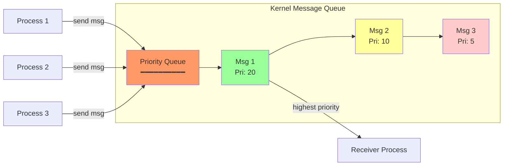
```mermaid
graph LR
    P1[Process 1] -->|send msg| MQ
    P2[Process 2] -->|send msg| MQ
    P3[Process 3] -->|send msg| MQ

    subgraph "Kernel Message Queue"
        MQ[Priority Queue<br/>━━━━━━━━━━]
        M1[Msg 1<br/>Pri: 20]
        M2[Msg 2<br/>Pri: 10]
        M3[Msg 3<br/>Pri: 5]
        MQ --> M1
        M1 --> M2
        M2 --> M3
    end

    M1 -->|highest priority| R[Receiver Process]

    style MQ fill:#f96
    style M1 fill:#9f9
    style M2 fill:#ff9
    style M3 fill:#fcc
```

### Key Characteristics

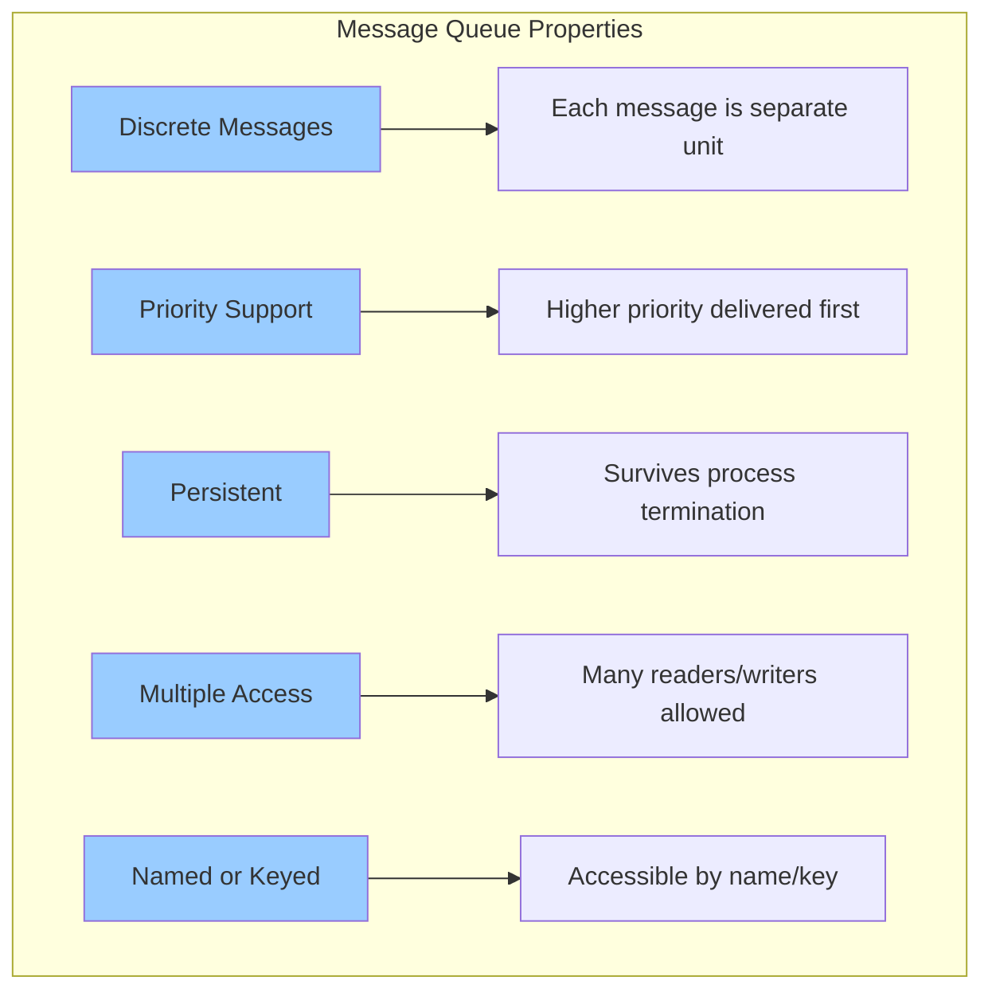
```mermaid
graph TB
    subgraph "Message Queue Properties"
        A[Discrete Messages] --> B[Each message is separate unit]
        C[Priority Support] --> D[Higher priority delivered first]
        E[Persistent] --> F[Survives process termination]
        G[Multiple Access] --> H[Many readers/writers allowed]
        I[Named or Keyed] --> J[Accessible by name/key]
    end

    style A fill:#9cf
    style C fill:#9cf
    style E fill:#9cf
    style G fill:#9cf
    style I fill:#9cf
```

**1. Message Boundaries**
- Each message is a discrete unit
- Send 3 messages → Receive 3 messages (never merged)
- Unlike pipes which are continuous byte streams

**2. Priority-Based Delivery**
- Messages have priority (0-31 for POSIX)
- Higher priority messages dequeued first
- FIFO within same priority

**3. Bidirectional (with separate queues)**
- Use two queues for request/response pattern
- Each queue is unidirectional

**4. Kernel Buffering**
- Messages stored in kernel space
- Automatic synchronization
- Bounded by system limits

**5. Persistence**
- Queue exists until explicitly deleted
- Messages survive sender crash
- Receiver can read anytime

### Mental Model

Think of a message queue like a **priority inbox**:
- Each email (message) is separate
- Urgent emails (high priority) appear first
- Emails stay in inbox until you read them
- Multiple people can send to same inbox
- Inbox persists even if sender goes offline

---

## Types of Message Queues

### 1. POSIX Message Queues (Modern)

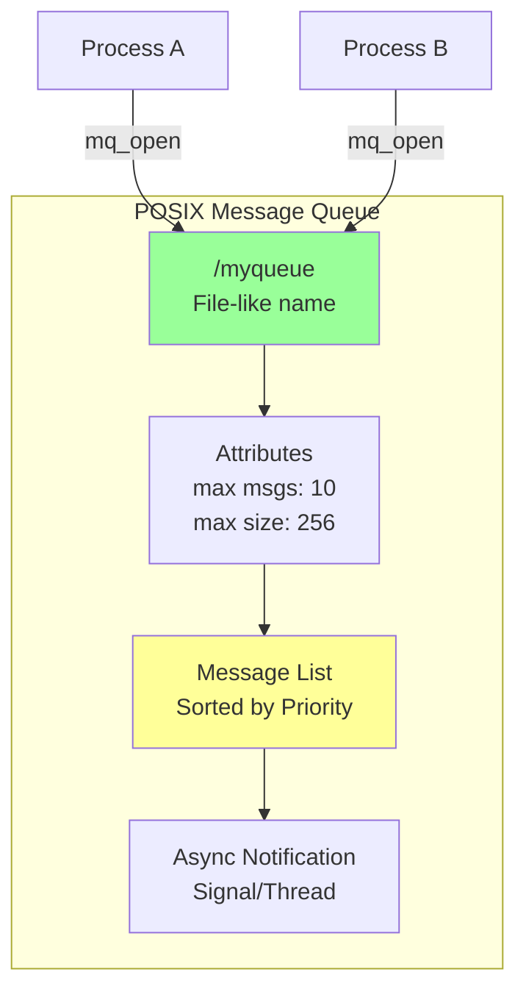
```mermaid
graph TB
    subgraph "POSIX Message Queue"
        NAME["/myqueue"<br/>File-like name]
        ATTR[Attributes<br/>max msgs: 10<br/>max size: 256]
        MSGS[Message List<br/>Sorted by Priority]
        NOTIFY[Async Notification<br/>Signal/Thread]
    end

    P1[Process A] -->|mq_open| NAME
    P2[Process B] -->|mq_open| NAME
    NAME --> ATTR
    ATTR --> MSGS
    MSGS --> NOTIFY

    style NAME fill:#9f9
    style MSGS fill:#ff9
```

**Characteristics:**
- Created with `mq_open()`
- Named like files: `/queue_name`
- Appears in `/dev/mqueue/` filesystem
- Clean, modern API
- Priority support (0-31)
- Asynchronous notification
- Integrates with `select()/poll()/epoll()`

**Use Case:** Modern applications, microservices, real-time systems

### 2. System V Message Queues (Legacy)

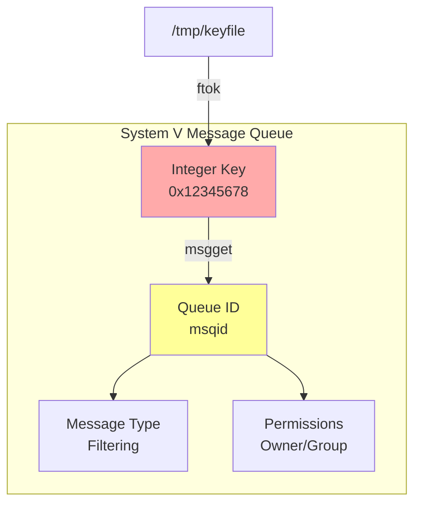
```mermaid
graph TB
    subgraph "System V Message Queue"
        KEY[Integer Key<br/>0x12345678]
        ID[Queue ID<br/>msqid]
        TYPE[Message Type<br/>Filtering]
        PERM[Permissions<br/>Owner/Group]
    end

    FILE["/tmp/keyfile"] -->|ftok| KEY
    KEY -->|msgget| ID
    ID --> TYPE
    ID --> PERM

    style KEY fill:#faa
    style ID fill:#ff9
```

**Characteristics:**
- Created with `msgget()`
- Identified by integer key (generated by `ftok()`)
- Message type field for filtering
- Complex permission model
- No priority support
- Managed with `ipcs`/`ipcrm` commands
- Widely available on old systems

**Use Case:** Legacy systems, compatibility with old Unix

### Comparison

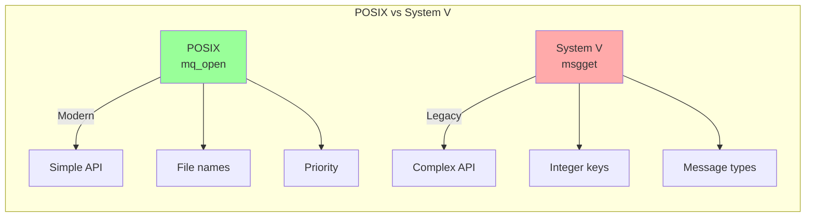
```mermaid
graph LR
    subgraph "POSIX vs System V"
        A[POSIX<br/>mq_open] -->|Modern| B[Simple API]
        C[System V<br/>msgget] -->|Legacy| D[Complex API]
        A --> E[File names]
        C --> F[Integer keys]
        A --> G[Priority]
        C --> H[Message types]
    end

    style A fill:#9f9
    style C fill:#faa
```

| Feature | POSIX | System V |
|---------|-------|----------|
| **Naming** | `/queue_name` | Integer key |
| **API** | Simple, clean | Complex |
| **Priority** | Yes (0-31) | No (type-based only) |
| **Notification** | Async (signal/thread) | Polling only |
| **Monitoring** | `select()/epoll()` | Manual polling |
| **Filesystem** | `/dev/mqueue/` | Not in filesystem |
| **Management** | Standard file tools | `ipcs`/`ipcrm` |
| **Modern** | ✅ Recommended | ❌ Legacy |

---

## Kernel-Level Architecture

### POSIX Message Queue in Kernel

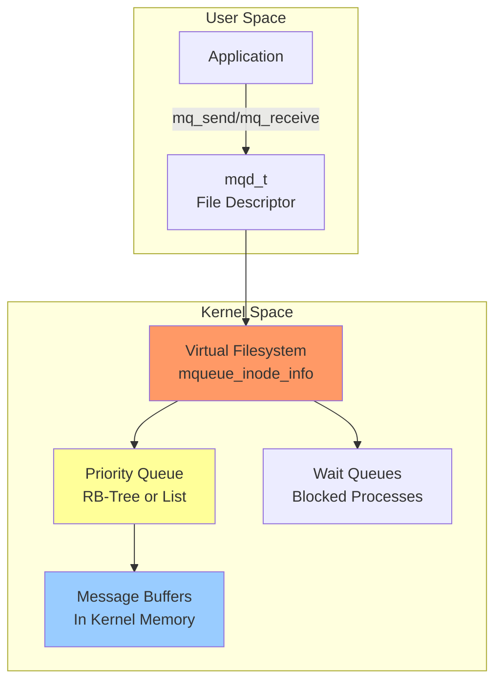
```mermaid
graph TB
    subgraph "User Space"
        APP[Application]
        MQD[mqd_t<br/>File Descriptor]
    end

    subgraph "Kernel Space"
        VFS[Virtual Filesystem<br/>mqueue_inode_info]
        PQUEUE[Priority Queue<br/>RB-Tree or List]
        MSGS[Message Buffers<br/>In Kernel Memory]
        WAIT[Wait Queues<br/>Blocked Processes]
    end

    APP -->|mq_send/mq_receive| MQD
    MQD --> VFS
    VFS --> PQUEUE
    PQUEUE --> MSGS
    VFS --> WAIT

    style VFS fill:#f96
    style PQUEUE fill:#ff9
    style MSGS fill:#9cf
```

### Data Structures Flow

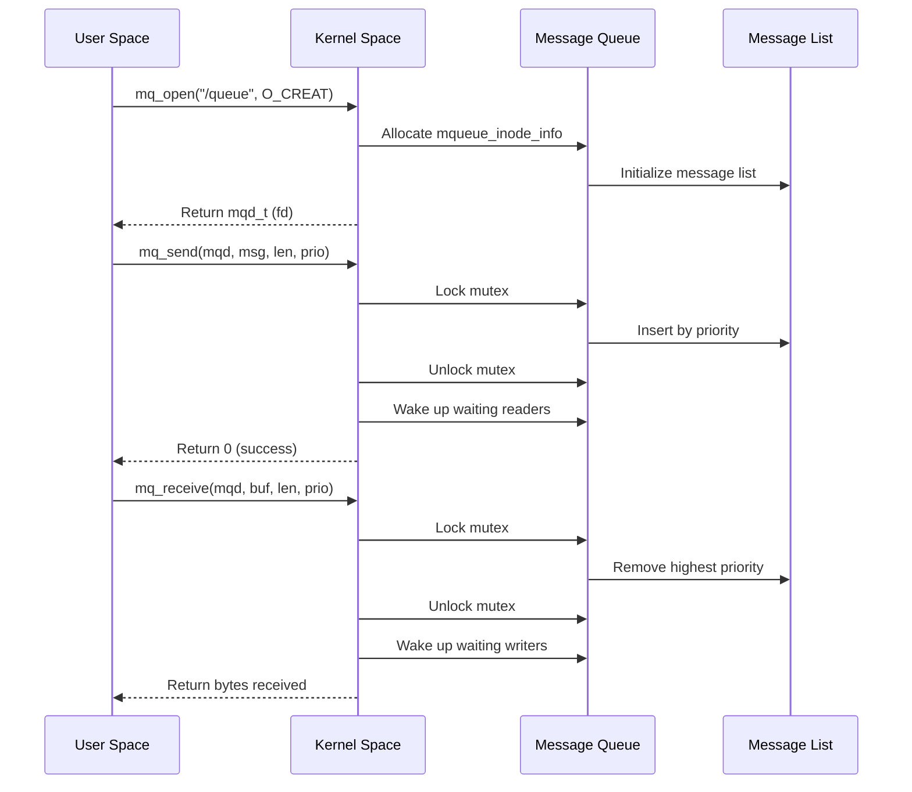
```mermaid
sequenceDiagram
    participant User as User Space
    participant Kernel as Kernel Space
    participant Queue as Message Queue
    participant Msg as Message List

    User->>Kernel: mq_open("/queue", O_CREAT)
    Kernel->>Queue: Allocate mqueue_inode_info
    Queue->>Msg: Initialize message list
    Kernel-->>User: Return mqd_t (fd)

    User->>Kernel: mq_send(mqd, msg, len, prio)
    Kernel->>Queue: Lock mutex
    Queue->>Msg: Insert by priority
    Kernel->>Queue: Unlock mutex
    Kernel->>Queue: Wake up waiting readers
    Kernel-->>User: Return 0 (success)

    User->>Kernel: mq_receive(mqd, buf, len, prio)
    Kernel->>Queue: Lock mutex
    Queue->>Msg: Remove highest priority
    Kernel->>Queue: Unlock mutex
    Kernel->>Queue: Wake up waiting writers
    Kernel-->>User: Return bytes received
```

### Memory Layout

```
┌─────────────────────────────────────────────────┐
│          User Space Application                 │
│  mqd_t mq = mq_open("/queue", ...)             │
└──────────────────┬──────────────────────────────┘
                   │ System Call
┌──────────────────▼──────────────────────────────┐
│            Kernel Space                         │
│  ┌──────────────────────────────────────────┐  │
│  │  mqueue_inode_info                       │  │
│  │  ├─ msg_list (priority queue)            │  │
│  │  ├─ mq_attr (max_msgs, msg_size)         │  │
│  │  ├─ wait_queue (blocked processes)       │  │
│  │  └─ spinlock (synchronization)           │  │
│  └──────────────────────────────────────────┘  │
│                   │                             │
│  ┌────────────────▼──────────────────────────┐ │
│  │  Message Buffers (kernel memory)         │ │
│  │  ┌──────────┬──────────┬──────────┐      │ │
│  │  │ Msg 1    │ Msg 2    │ Msg 3    │      │ │
│  │  │ Pri: 20  │ Pri: 15  │ Pri: 5   │      │ │
│  │  └──────────┴──────────┴──────────┘      │ │
│  └──────────────────────────────────────────┘ │
└─────────────────────────────────────────────────┘
```

---

## Message Queue System Calls

### POSIX API Overview

```c
#include <mqueue.h>
#include <fcntl.h>
#include <sys/stat.h>
```

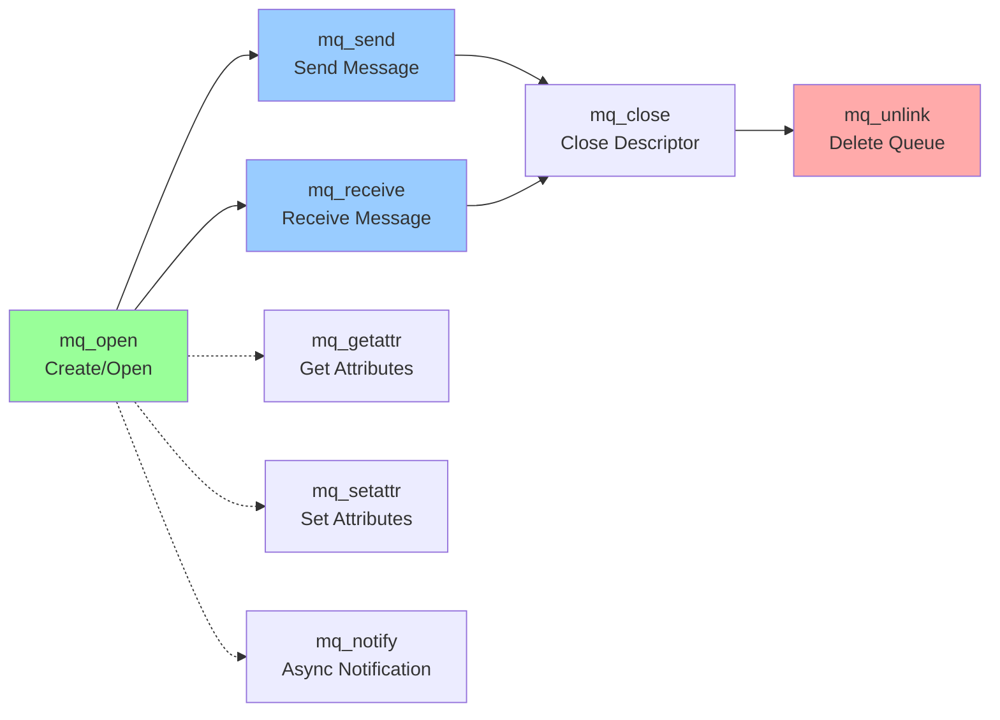
```mermaid
graph LR
    CREATE[mq_open<br/>Create/Open] --> SEND[mq_send<br/>Send Message]
    CREATE --> RECV[mq_receive<br/>Receive Message]
    SEND --> CLOSE[mq_close<br/>Close Descriptor]
    RECV --> CLOSE
    CLOSE --> UNLINK[mq_unlink<br/>Delete Queue]

    CREATE -.-> GETATTR[mq_getattr<br/>Get Attributes]
    CREATE -.-> SETATTR[mq_setattr<br/>Set Attributes]
    CREATE -.-> NOTIFY[mq_notify<br/>Async Notification]

    style CREATE fill:#9f9
    style SEND fill:#9cf
    style RECV fill:#9cf
    style UNLINK fill:#faa
```

### 1. `mq_open()` - Create/Open Queue

```c
mqd_t mq_open(const char *name, int oflag, mode_t mode, struct mq_attr *attr);
```

**Parameters:**
- `name`: Queue name starting with `/` (e.g., `/my_queue`)
- `oflag`: Open flags
  - `O_RDONLY`: Read only
  - `O_WRONLY`: Write only
  - `O_RDWR`: Read and write
  - `O_CREAT`: Create if doesn't exist
  - `O_EXCL`: Fail if exists (with `O_CREAT`)
  - `O_NONBLOCK`: Non-blocking operations
- `mode`: Permissions (e.g., `0644`)
- `attr`: Queue attributes (NULL for defaults)

**Returns:**
- Message queue descriptor on success
- `(mqd_t)-1` on error

**Example:**
```c
struct mq_attr attr;
attr.mq_flags = 0;           // Blocking mode
attr.mq_maxmsg = 10;         // Max 10 messages
attr.mq_msgsize = 256;       // Max 256 bytes per message
attr.mq_curmsgs = 0;         // Current count (ignored on create)

mqd_t mq = mq_open("/task_queue", O_CREAT | O_RDWR, 0644, &attr);
if (mq == (mqd_t)-1) {
    perror("mq_open");
    exit(1);
}
```

**Kernel Action:**
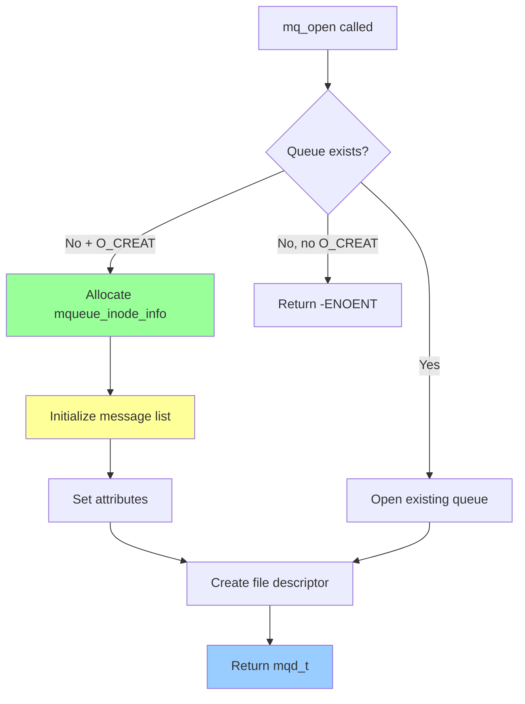
```mermaid
flowchart TD
    A[mq_open called] --> B{Queue exists?}
    B -->|No + O_CREAT| C[Allocate mqueue_inode_info]
    B -->|Yes| D[Open existing queue]
    B -->|No, no O_CREAT| E[Return -ENOENT]
    C --> F[Initialize message list]
    F --> G[Set attributes]
    G --> H[Create file descriptor]
    D --> H
    H --> I[Return mqd_t]

    style C fill:#9f9
    style F fill:#ff9
    style I fill:#9cf
```

### 2. `mq_send()` - Send Message

```c
int mq_send(mqd_t mqdes, const char *msg_ptr, size_t msg_len, unsigned int msg_prio);
```

**Parameters:**
- `mqdes`: Message queue descriptor
- `msg_ptr`: Pointer to message data
- `msg_len`: Message size (must be ≤ `mq_msgsize`)
- `msg_prio`: Priority (0-31, higher = more important)

**Returns:**
- `0` on success
- `-1` on error (sets `errno`)

**Blocking Behavior:**
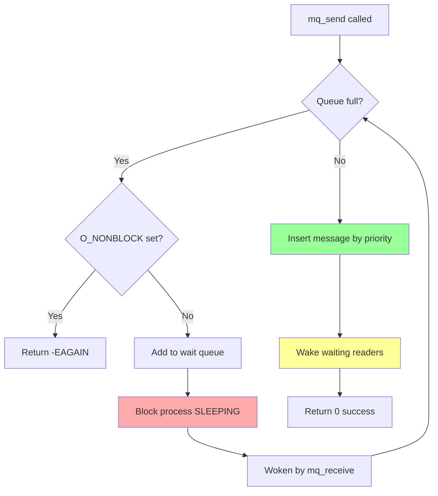
```mermaid
flowchart TD
    A[mq_send called] --> B{Queue full?}
    B -->|No| C[Insert message by priority]
    B -->|Yes| D{O_NONBLOCK set?}
    D -->|Yes| E[Return -EAGAIN]
    D -->|No| F[Add to wait queue]
    F --> G[Block process SLEEPING]
    G --> H[Woken by mq_receive]
    H --> B
    C --> I[Wake waiting readers]
    I --> J[Return 0 success]

    style C fill:#9f9
    style G fill:#faa
    style I fill:#ff9
```

**Example:**
```c
const char *msg = "Process this task";
unsigned int priority = 10;

if (mq_send(mq, msg, strlen(msg) + 1, priority) == -1) {
    perror("mq_send");
}
```

### 3. `mq_receive()` - Receive Message

```c
ssize_t mq_receive(mqd_t mqdes, char *msg_ptr, size_t msg_len, unsigned int *msg_prio);
```

**Parameters:**
- `mqdes`: Message queue descriptor
- `msg_ptr`: Buffer for received message
- `msg_len`: Buffer size (must be ≥ `mq_msgsize`)
- `msg_prio`: Pointer to store priority (NULL to ignore)

**Returns:**
- Number of bytes received on success
- `-1` on error

**Blocking Behavior:**
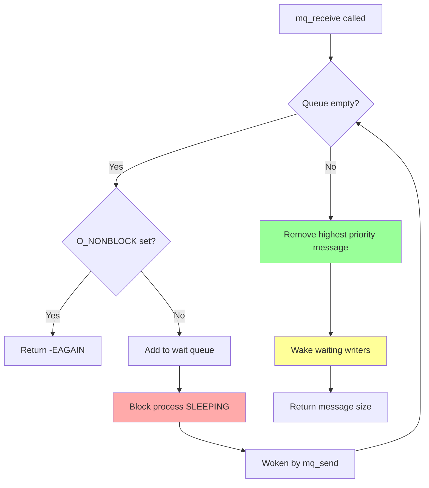
```mermaid
flowchart TD
    A[mq_receive called] --> B{Queue empty?}
    B -->|No| C[Remove highest priority message]
    B -->|Yes| D{O_NONBLOCK set?}
    D -->|Yes| E[Return -EAGAIN]
    D -->|No| F[Add to wait queue]
    F --> G[Block process SLEEPING]
    G --> H[Woken by mq_send]
    H --> B
    C --> I[Wake waiting writers]
    I --> J[Return message size]

    style C fill:#9f9
    style G fill:#faa
    style I fill:#ff9
```

**Example:**
```c
char buffer[256];
unsigned int priority;

ssize_t bytes = mq_receive(mq, buffer, 256, &priority);
if (bytes >= 0) {
    printf("Received (priority %u): %s\n", priority, buffer);
} else {
    perror("mq_receive");
}
```

### 4. `mq_close()` - Close Descriptor

```c
int mq_close(mqd_t mqdes);
```

**Note:** Closes this process's access, but queue persists.

### 5. `mq_unlink()` - Delete Queue

```c
int mq_unlink(const char *name);
```

**Example:**
```c
mq_unlink("/task_queue");  // Delete queue from system
```

### 6. `mq_getattr()` / `mq_setattr()`

```c
int mq_getattr(mqd_t mqdes, struct mq_attr *attr);
int mq_setattr(mqd_t mqdes, const struct mq_attr *newattr, struct mq_attr *oldattr);
```

**Example:**
```c
struct mq_attr attr;
mq_getattr(mq, &attr);
printf("Max messages: %ld\n", attr.mq_maxmsg);
printf("Current messages: %ld\n", attr.mq_curmsgs);
printf("Max message size: %ld\n", attr.mq_msgsize);
```

### 7. `mq_notify()` - Asynchronous Notification

```c
int mq_notify(mqd_t mqdes, const struct sigevent *notification);
```

Get notified when message arrives in empty queue.

**Example:**
```c
struct sigevent sev;
sev.sigev_notify = SIGEV_SIGNAL;
sev.sigev_signo = SIGUSR1;
mq_notify(mq, &sev);  // Receive SIGUSR1 on message arrival
```

---

## POSIX Message Queues

### Complete Workflow

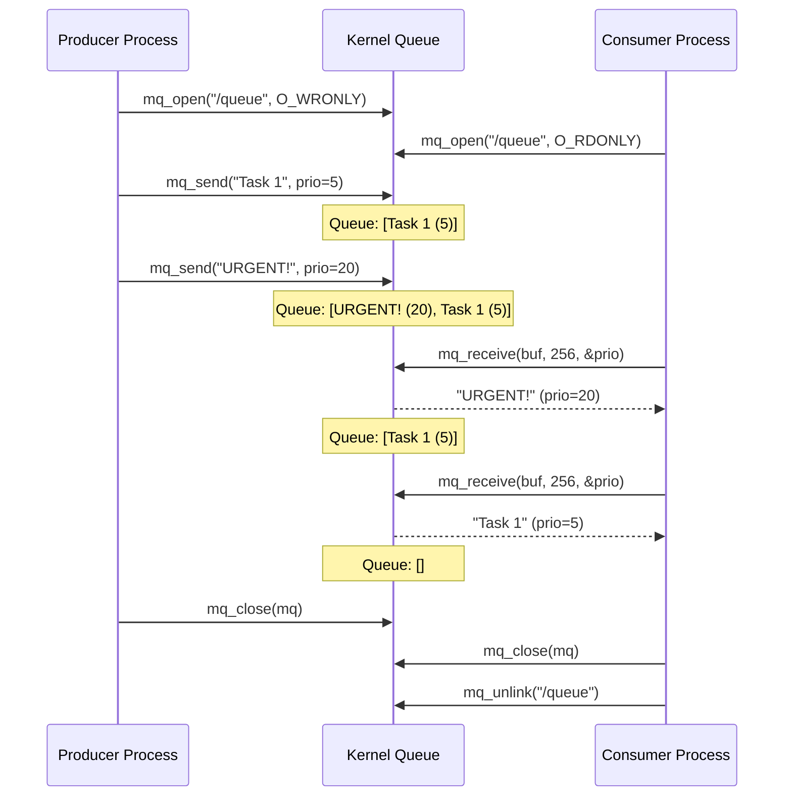
```mermaid
sequenceDiagram
    participant P1 as Producer Process
    participant K as Kernel Queue
    participant P2 as Consumer Process

    P1->>K: mq_open("/queue", O_WRONLY)
    P2->>K: mq_open("/queue", O_RDONLY)

    P1->>K: mq_send("Task 1", prio=5)
    Note over K: Queue: [Task 1 (5)]

    P1->>K: mq_send("URGENT!", prio=20)
    Note over K: Queue: [URGENT! (20), Task 1 (5)]

    P2->>K: mq_receive(buf, 256, &prio)
    K-->>P2: "URGENT!" (prio=20)
    Note over K: Queue: [Task 1 (5)]

    P2->>K: mq_receive(buf, 256, &prio)
    K-->>P2: "Task 1" (prio=5)
    Note over K: Queue: []

    P1->>K: mq_close(mq)
    P2->>K: mq_close(mq)
    P2->>K: mq_unlink("/queue")
```

### Priority Queue Visualization

```
Priority Queue (highest first):
┌──────────────────────────────────────────┐
│  Priority 20:  [URGENT!]                 │
│  Priority 15:  [Important] [High]        │
│  Priority 10:  [Medium]                  │
│  Priority 5:   [Task 1] [Task 2]         │
│  Priority 0:   [Low]                     │
└──────────────────────────────────────────┘
           ↓ mq_receive() ↓
      Dequeues [URGENT!] first
```

### Attributes Structure

```c
struct mq_attr {
    long mq_flags;      // Flags: 0 or O_NONBLOCK
    long mq_maxmsg;     // Max number of messages
    long mq_msgsize;    // Max message size (bytes)
    long mq_curmsgs;    // Current number of messages (read-only)
};
```

**Example Configuration:**
```c
struct mq_attr attr;

// Small, fast queue for notifications
attr.mq_maxmsg = 10;
attr.mq_msgsize = 64;

// Large queue for task distribution
attr.mq_maxmsg = 100;
attr.mq_msgsize = 4096;
```

---

## System V Message Queues

### Key-Based Access

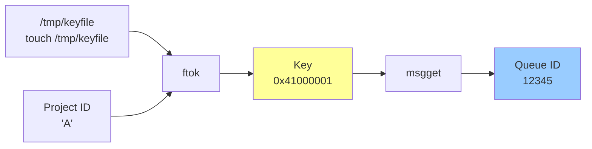
```mermaid
graph LR
    FILE["/tmp/keyfile"<br/>touch /tmp/keyfile] --> FTOK
    PROJ["Project ID<br/>'A'"] --> FTOK
    FTOK[ftok] --> KEY["Key<br/>0x41000001"]
    KEY --> MSGGET[msgget]
    MSGGET --> MSQID["Queue ID<br/>12345"]

    style KEY fill:#ff9
    style MSQID fill:#9cf
```

### Message Structure

```c
struct msgbuf {
    long mtype;       // Message type (must be > 0)
    char mtext[256];  // Message data (flexible array)
};
```

**Type-Based Filtering:**
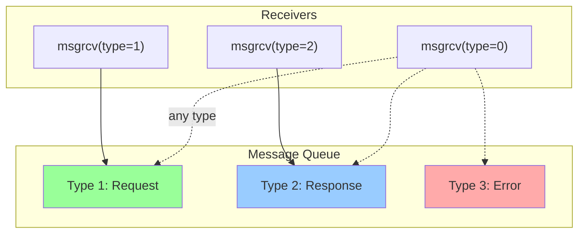
```mermaid
graph TB
    subgraph "Message Queue"
        M1["Type 1: Request"]
        M2["Type 2: Response"]
        M3["Type 3: Error"]
    end

    subgraph "Receivers"
        R1["msgrcv(type=1)"] --> M1
        R2["msgrcv(type=2)"] --> M2
        R3["msgrcv(type=0)"] -.->|any type| M1
        R3 -.-> M2
        R3 -.-> M3
    end

    style M1 fill:#9f9
    style M2 fill:#9cf
    style M3 fill:#faa
```

### System V API

```c
#include <sys/types.h>
#include <sys/ipc.h>
#include <sys/msg.h>
```

**1. Generate Key:**
```c
key_t key = ftok("/tmp/mqueue", 'A');
```

**2. Create/Access Queue:**
```c
int msgid = msgget(key, 0666 | IPC_CREAT);
```

**3. Send Message:**
```c
struct msgbuf msg;
msg.mtype = 1;
strcpy(msg.mtext, "Hello");
msgsnd(msgid, &msg, strlen(msg.mtext) + 1, 0);
```

**4. Receive Message:**
```c
struct msgbuf msg;
msgrcv(msgid, &msg, sizeof(msg.mtext), 1, 0);  // Receive type 1
```

**5. Control Operations:**
```c
msgctl(msgid, IPC_RMID, NULL);  // Delete queue
```

### Type-Based Filtering

```c
// msgtyp parameter in msgrcv():
msgrcv(msgid, &msg, size, 0, 0);     // Get first message (any type)
msgrcv(msgid, &msg, size, 5, 0);     // Get first message of type 5
msgrcv(msgid, &msg, size, -10, 0);   // Get lowest type ≤ 10
```

**Visualization:**
```
Queue: [Type 1] [Type 5] [Type 3] [Type 10] [Type 2]

msgrcv(msgid, &msg, size, 5, 0):
  → Returns [Type 5]

msgrcv(msgid, &msg, size, -10, 0):
  → Returns [Type 1] (lowest ≤ 10)

msgrcv(msgid, &msg, size, 0, 0):
  → Returns [Type 1] (first in queue)
```

---

## Behind the Hood: Kernel Implementation

### POSIX Message Queue Kernel Structure

Located in `ipc/mqueue.c`:

```c
// Simplified kernel structure
struct mqueue_inode_info {
    spinlock_t lock;              // Protects queue operations
    struct inode vfs_inode;       // VFS integration
    wait_queue_head_t wait_q;     // Waiting processes

    struct msg_msg **messages;    // Array of message pointers
    struct mq_attr attr;          // Queue attributes

    struct pid *notify_owner;     // Notification recipient
    struct sigevent notify;       // Notification details

    unsigned long qsize;          // Total message sizes
};

struct msg_msg {
    struct list_head m_list;      // Message list linkage
    long m_type;                  // Message priority
    size_t m_ts;                  // Message size
    struct msg_msgseg *next;      // Next segment (large messages)
    // Message data follows
};
```

### Priority Queue Implementation

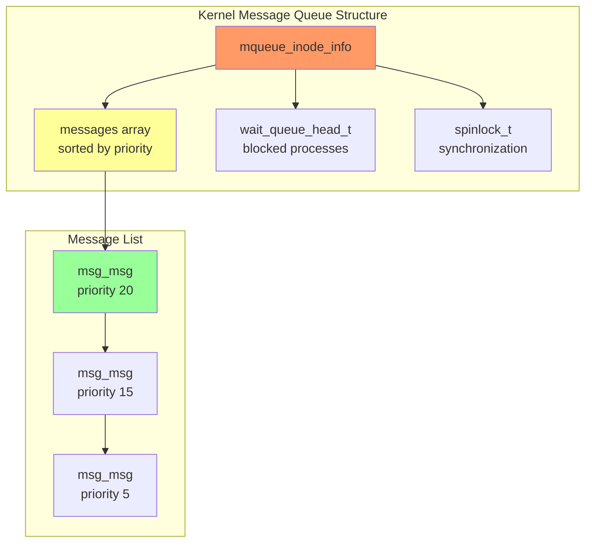
```mermaid
graph TB
    subgraph "Kernel Message Queue Structure"
        INODE[mqueue_inode_info]
        ARRAY[messages array<br/>sorted by priority]
        WAIT[wait_queue_head_t<br/>blocked processes]
        LOCK[spinlock_t<br/>synchronization]
    end

    subgraph "Message List"
        M1[msg_msg<br/>priority 20]
        M2[msg_msg<br/>priority 15]
        M3[msg_msg<br/>priority 5]
    end

    INODE --> ARRAY
    INODE --> WAIT
    INODE --> LOCK
    ARRAY --> M1
    M1 --> M2
    M2 --> M3

    style INODE fill:#f96
    style ARRAY fill:#ff9
    style M1 fill:#9f9
```

### Send Operation Internals

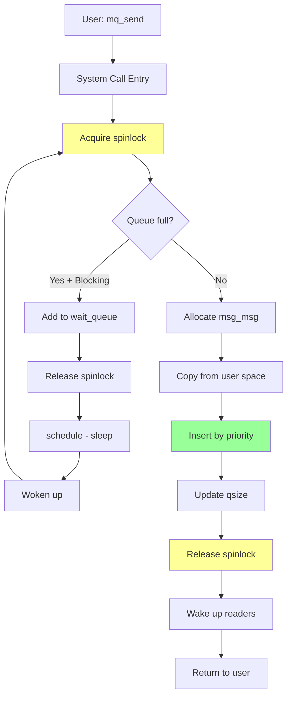
```mermaid
flowchart TD
    A[User: mq_send] --> B[System Call Entry]
    B --> C[Acquire spinlock]
    C --> D{Queue full?}
    D -->|Yes + Blocking| E[Add to wait_queue]
    E --> F[Release spinlock]
    F --> G[schedule - sleep]
    G --> H[Woken up]
    H --> C

    D -->|No| I[Allocate msg_msg]
    I --> J[Copy from user space]
    J --> K[Insert by priority]
    K --> L[Update qsize]
    L --> M[Release spinlock]
    M --> N[Wake up readers]
    N --> O[Return to user]

    style C fill:#ff9
    style K fill:#9f9
    style M fill:#ff9
```

### Receive Operation Internals

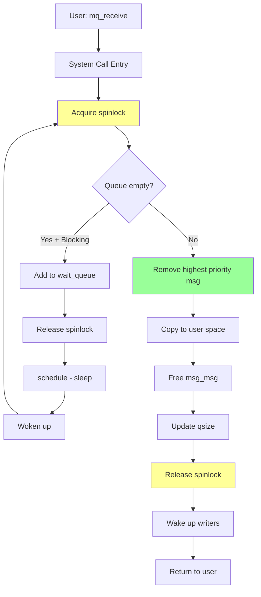
```mermaid
flowchart TD
    A[User: mq_receive] --> B[System Call Entry]
    B --> C[Acquire spinlock]
    C --> D{Queue empty?}
    D -->|Yes + Blocking| E[Add to wait_queue]
    E --> F[Release spinlock]
    F --> G[schedule - sleep]
    G --> H[Woken up]
    H --> C

    D -->|No| I[Remove highest priority msg]
    I --> J[Copy to user space]
    J --> K[Free msg_msg]
    K --> L[Update qsize]
    L --> M[Release spinlock]
    M --> N[Wake up writers]
    N --> O[Return to user]

    style C fill:#ff9
    style I fill:#9f9
    style M fill:#ff9
```

### Synchronization Mechanism

```c
// Simplified kernel code from ipc/mqueue.c

static int wq_sleep(struct mqueue_inode_info *info,
                    int sr, long timeout, struct ext_wait_queue *ewp)
{
    spin_unlock(&info->lock);

    time = schedule_timeout(timeout);  // Sleep until timeout or wakeup

    while (ewp->state == STATE_PENDING)
        cpu_relax();  // Wait for state change

    spin_lock(&info->lock);
    return time;
}
```

**Wait Queue Visualization:**
```
Process A: mq_send (queue full)
    ↓
┌─────────────────────────────────────┐
│ Kernel Wait Queue (wait_q)          │
│  ┌──────────┐  ┌──────────┐        │
│  │ Task A   │→ │ Task B   │        │
│  │ SLEEPING │  │ SLEEPING │        │
│  └──────────┘  └──────────┘        │
└─────────────────────────────────────┘
    ↑
Process B: mq_receive (dequeues message)
    → Calls wake_up(&info->wait_q)
    → Task A wakes up, retries mq_send
```

---

## Buffer Management and Limits

### System Limits

**POSIX Message Queues:**
```bash
# View limits
cat /proc/sys/fs/mqueue/msg_max           # Max messages per queue (default: 10)
cat /proc/sys/fs/mqueue/msgsize_max       # Max message size (default: 8192)
cat /proc/sys/fs/mqueue/queues_max        # Max queues system-wide (default: 256)

# View queue filesystem
ls -la /dev/mqueue/
```

**System V Message Queues:**
```bash
# View limits
ipcs -l -q

# View current queues
ipcs -q

# Example output:
# ------ Messages Limits --------
# max queues system wide = 32000
# max size of message (bytes) = 8192
# default max size of queue (bytes) = 16384
```

### Changing Limits

**POSIX (requires root):**
```bash
# Increase max messages
echo 100 > /proc/sys/fs/mqueue/msg_max

# Increase max message size
echo 16384 > /proc/sys/fs/mqueue/msgsize_max
```

**System V (requires root):**
```bash
# Using sysctl
sysctl -w kernel.msgmax=16384      # Max message size
sysctl -w kernel.msgmnb=65536      # Max queue size
sysctl -w kernel.msgmni=32000      # Max number of queues
```

### Memory Management

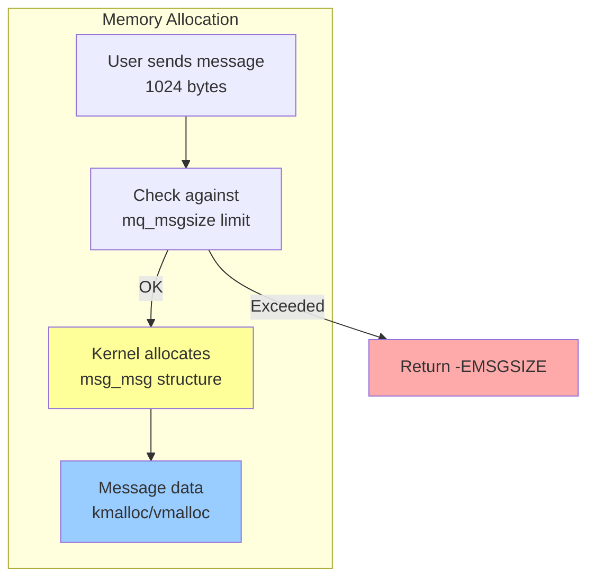
```mermaid
graph TB
    subgraph "Memory Allocation"
        USER[User sends message<br/>1024 bytes]
        KERNEL[Kernel allocates<br/>msg_msg structure]
        DATA[Message data<br/>kmalloc/vmalloc]
        LIMIT[Check against<br/>mq_msgsize limit]
    end

    USER --> LIMIT
    LIMIT -->|OK| KERNEL
    KERNEL --> DATA
    LIMIT -->|Exceeded| ERROR[Return -EMSGSIZE]

    style KERNEL fill:#ff9
    style DATA fill:#9cf
    style ERROR fill:#faa
```

**Kernel Memory Allocation:**
```c
// Simplified from kernel source
struct msg_msg *load_msg(const void __user *src, size_t len)
{
    struct msg_msg *msg;
    size_t alen;

    alen = min(len, DATALEN_MSG);  // First segment size
    msg = kmalloc(sizeof(*msg) + alen, GFP_KERNEL);

    if (copy_from_user(msg + 1, src, alen))  // Copy from user space
        goto out_err;

    // Handle large messages with multiple segments
    ...

    return msg;
}
```

---

## Blocking vs Non-Blocking Operations

### Blocking Mode (Default)

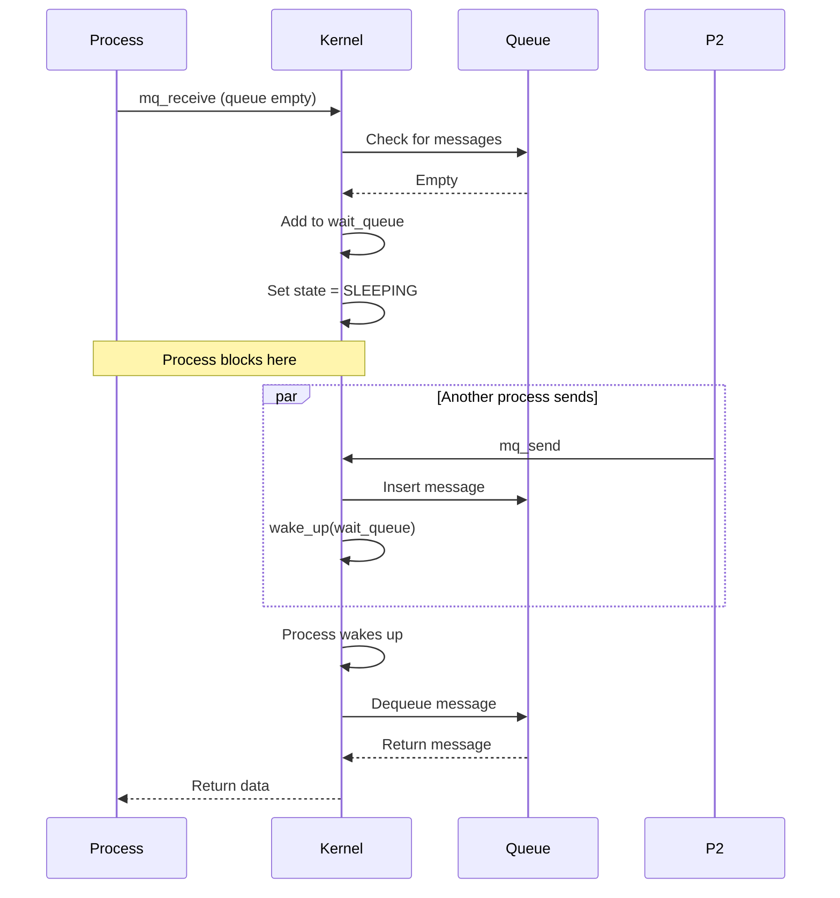
```mermaid
sequenceDiagram
    participant P as Process
    participant K as Kernel
    participant Q as Queue

    P->>K: mq_receive (queue empty)
    K->>Q: Check for messages
    Q-->>K: Empty
    K->>K: Add to wait_queue
    K->>K: Set state = SLEEPING
    Note over P,K: Process blocks here

    par Another process sends
        P2->>K: mq_send
        K->>Q: Insert message
        K->>K: wake_up(wait_queue)
    end

    K->>K: Process wakes up
    K->>Q: Dequeue message
    Q-->>K: Return message
    K-->>P: Return data
```

**Example:**
```c
// Blocking operations (default)
mqd_t mq = mq_open("/queue", O_CREAT | O_RDWR, 0644, &attr);

// Will block if queue full
mq_send(mq, msg, len, prio);

// Will block if queue empty
mq_receive(mq, buf, size, &prio);
```

### Non-Blocking Mode

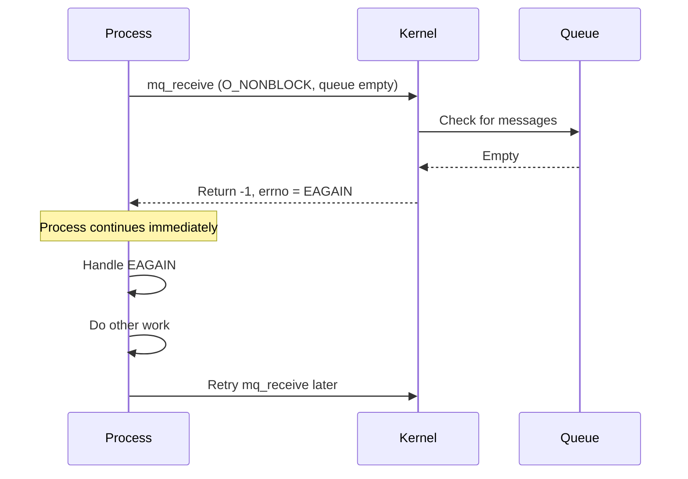
```mermaid
sequenceDiagram
    participant P as Process
    participant K as Kernel
    participant Q as Queue

    P->>K: mq_receive (O_NONBLOCK, queue empty)
    K->>Q: Check for messages
    Q-->>K: Empty
    K-->>P: Return -1, errno = EAGAIN
    Note over P: Process continues immediately

    P->>P: Handle EAGAIN
    P->>P: Do other work
    P->>K: Retry mq_receive later
```

**Enable Non-Blocking:**
```c
// Method 1: Open with O_NONBLOCK
mqd_t mq = mq_open("/queue", O_CREAT | O_RDWR | O_NONBLOCK, 0644, &attr);

// Method 2: Set flag after opening
struct mq_attr new_attr;
new_attr.mq_flags = O_NONBLOCK;
mq_setattr(mq, &new_attr, NULL);
```

**Handling EAGAIN:**
```c
char buffer[256];
ssize_t bytes = mq_receive(mq, buffer, 256, NULL);

if (bytes == -1) {
    if (errno == EAGAIN) {
        printf("Queue empty, try again later\n");
        // Do other work
    } else {
        perror("mq_receive");
    }
} else {
    printf("Received: %s\n", buffer);
}
```

### Using select() for Multiplexing

On Linux, POSIX message queues support `select()/poll()/epoll()`:

```c
#include <sys/select.h>

mqd_t mq = mq_open("/queue", O_RDONLY | O_NONBLOCK, 0644, NULL);

fd_set readfds;
FD_ZERO(&readfds);
FD_SET((int)mq, &readfds);  // mqd_t is a file descriptor on Linux

struct timeval timeout = {5, 0};  // 5 seconds

int ready = select((int)mq + 1, &readfds, NULL, NULL, &timeout);

if (ready > 0) {
    // Message available, read won't block
    char buffer[256];
    mq_receive(mq, buffer, 256, NULL);
    printf("Received: %s\n", buffer);
} else if (ready == 0) {
    printf("Timeout - no messages\n");
}
```

### Comparison Table

| Aspect | Blocking | Non-Blocking |
|--------|----------|--------------|
| **Send to full queue** | Sleep until space | Return `-EAGAIN` |
| **Receive from empty** | Sleep until message | Return `-EAGAIN` |
| **CPU usage** | None (sleeping) | Polling wastes CPU |
| **Complexity** | Simple | Needs error handling |
| **Use case** | Simple producer-consumer | Event-driven systems |
| **Multiplexing** | Not needed | Use with select/epoll |

---

## Real-World Usage

### 1. Task Distribution Systems

Message queues excel at distributing work among multiple workers.

```mermaid
graph LR
    subgraph "Producers"
        P1[Web Server 1]
        P2[Web Server 2]
        P3[API Service]
    end

    subgraph "Message Queue"
        MQ["/task_queue"<br/>POSIX MQ]
    end

    subgraph "Consumers"
        W1[Worker 1]
        W2[Worker 2]
        W3[Worker 3]
    end

    P1 -->|Send tasks| MQ
    P2 -->|Send tasks| MQ
    P3 -->|Send tasks| MQ

    MQ -->|Receive| W1
    MQ -->|Receive| W2
    MQ -->|Receive| W3

    style MQ fill:#f96
```

**Use Case:** Web application offloads image processing, email sending, report generation to worker pool.

### 2. RabbitMQ - Production Message Broker

RabbitMQ is an enterprise message queue system used by major companies.

**Real-World Deployments:**
- **Adidas:** Processes millions of activity events from wearable devices
- **Softonic:** Handles 100M+ monthly users, 2M+ daily downloads
- **Transportation:** Deployed in 180-bus fleet, one RabbitMQ instance per bus

**Architecture:**
```mermaid
graph TB
    subgraph "Producers"
        APP1[Mobile Apps]
        APP2[Web Services]
        APP3[IoT Devices]
    end

    subgraph "RabbitMQ Cluster"
        EX[Exchange<br/>Routing Logic]
        Q1[Queue 1<br/>Urgent]
        Q2[Queue 2<br/>Normal]
        Q3[Queue 3<br/>Logs]
    end

    subgraph "Consumers"
        C1[Processing Service]
        C2[Analytics Service]
        C3[Logging Service]
    end

    APP1 --> EX
    APP2 --> EX
    APP3 --> EX

    EX -->|route by priority| Q1
    EX -->|route by type| Q2
    EX -->|route by tag| Q3

    Q1 --> C1
    Q2 --> C2
    Q3 --> C3

    style EX fill:#f96
    style Q1 fill:#9f9
    style Q2 fill:#ff9
    style Q3 fill:#9cf
```

**Benefits:**
- Decouples services (producers don't know consumers)
- Asynchronous processing (fast API responses)
- Load leveling (queue buffers traffic spikes)
- Reliability (persistent messages, replication)

**Reference:** https://www.cloudamqp.com/blog/rabbitmq-use-cases-explaining-message-queues-and-when-to-use-them.html

### 3. Linux Kernel - Netlink Sockets

The Linux kernel uses message queues internally for communication between kernel and userspace.

**Example: Netlink for network configuration**
```c
// Simplified netlink usage
struct sockaddr_nl src_addr, dest_addr;
struct nlmsghdr *nlh;

// Create netlink socket
int sock_fd = socket(AF_NETLINK, SOCK_RAW, NETLINK_ROUTE);

// Send message to kernel
nlh = (struct nlmsghdr *)malloc(NLMSG_SPACE(MAX_PAYLOAD));
nlh->nlmsg_len = NLMSG_SPACE(MAX_PAYLOAD);
nlh->nlmsg_pid = getpid();
nlh->nlmsg_flags = 0;

strcpy(NLMSG_DATA(nlh), "Get routing table");
sendmsg(sock_fd, &msg, 0);

// Receive response from kernel
recvmsg(sock_fd, &msg, 0);
```

**Use Cases:**
- Network configuration (ip, ifconfig)
- Firewall rules (iptables, nftables)
- Process events (process monitoring)
- Audit system

### 4. Android - Binder IPC

Android uses message-based IPC for communication between apps and system services.

```mermaid
sequenceDiagram
    participant App as Android App
    participant Binder as Binder Kernel
    participant Service as System Service

    App->>Binder: Send transaction (message)
    Note over Binder: Queue message<br/>by priority
    Binder->>Service: Deliver transaction
    Service->>Service: Process request
    Service->>Binder: Reply transaction
    Binder->>App: Deliver reply
```

**Features:**
- Priority-based message delivery
- Synchronous and asynchronous calls
- Death notifications
- Security (UID-based permissions)

### 5. systemd - Journal Logging

systemd uses message queues for centralized logging.

```mermaid
graph LR
    subgraph "Log Sources"
        APP[Applications]
        KERNEL[Kernel]
        SYSLOG[Syslog]
    end

    subgraph "systemd-journald"
        QUEUE[Message Queue]
        JOURNAL[Journal Storage]
    end

    APP -->|sd_journal_send| QUEUE
    KERNEL -->|printk| QUEUE
    SYSLOG -->|/dev/log| QUEUE

    QUEUE --> JOURNAL

    style QUEUE fill:#f96
```

**Benefits:**
- Structured logging (key-value pairs)
- Priority levels (emergency to debug)
- Binary format (efficient storage)
- Indexing and search

### 6. PostgreSQL - Async Notifications

PostgreSQL uses message passing for `NOTIFY`/`LISTEN` feature.

```sql
-- Process A: Listen for notifications
LISTEN channel_name;

-- Process B: Send notification
NOTIFY channel_name, 'payload data';
```

**Implementation:**
```c
// Simplified PostgreSQL notification queue
typedef struct QueuePosition {
    int64 page;    // Queue file number
    int offset;    // Offset within page
} QueuePosition;

typedef struct AsyncQueueEntry {
    Oid dboid;              // Database ID
    Oid notifyOid;          // Notification channel
    char data[FLEXIBLE];    // Payload
} AsyncQueueEntry;
```

**Use Case:** Cache invalidation, real-time updates, microservice coordination.

### 7. ZeroMQ - High-Performance Messaging

ZeroMQ provides sockets that carry atomic messages.

```c
// ZeroMQ producer
void *context = zmq_ctx_new();
void *publisher = zmq_socket(context, ZMQ_PUB);
zmq_bind(publisher, "tcp://*:5555");

char msg[] = "Weather update";
zmq_send(publisher, msg, strlen(msg), 0);

// ZeroMQ consumer
void *subscriber = zmq_socket(context, ZMQ_SUB);
zmq_connect(subscriber, "tcp://localhost:5555");
zmq_setsockopt(subscriber, ZMQ_SUBSCRIBE, "", 0);  // Subscribe to all

char buffer[256];
zmq_recv(subscriber, buffer, 256, 0);
```

**Patterns:**
- Request-Reply
- Pub-Sub
- Pipeline
- Exclusive Pair

**Performance:** Millions of messages per second, microsecond latencies

**Reference:** https://zeromq.org/

### 8. Apache Kafka - Distributed Message Queue

Used by LinkedIn, Netflix, Uber for real-time data pipelines.

```mermaid
graph TB
    subgraph "Producers"
        P1[Web Logs]
        P2[User Events]
        P3[Metrics]
    end

    subgraph "Kafka Cluster"
        T1[Topic: Logs<br/>Partitions: 0,1,2]
        T2[Topic: Events<br/>Partitions: 0,1,2]
    end

    subgraph "Consumers"
        C1[Analytics]
        C2[Search Index]
        C3[Monitoring]
    end

    P1 --> T1
    P2 --> T2
    P3 --> T2

    T1 --> C1
    T1 --> C2
    T2 --> C3

    style T1 fill:#f96
    style T2 fill:#ff9
```

**Features:**
- Distributed partitioning
- Replication
- Persistence (disk-based)
- High throughput (millions msg/sec)

### Summary of Real-World Patterns

| System | Message Queue Type | Purpose |
|--------|-------------------|---------|
| **RabbitMQ** | AMQP broker | Task distribution, microservices |
| **Kafka** | Distributed log | Data pipelines, event streaming |
| **ZeroMQ** | Socket library | High-performance messaging |
| **systemd** | Unix domain sockets | System logging |
| **PostgreSQL** | Custom queue | Database notifications |
| **Android Binder** | Kernel IPC | Inter-app communication |
| **Netlink** | Kernel sockets | Kernel-user communication |

---

## Practical Examples

### Example 1: Basic Producer-Consumer

**producer.c:**
```c
#include <stdio.h>
#include <stdlib.h>
#include <string.h>
#include <mqueue.h>
#include <fcntl.h>

int main() {
    struct mq_attr attr;
    attr.mq_flags = 0;
    attr.mq_maxmsg = 10;
    attr.mq_msgsize = 256;
    attr.mq_curmsgs = 0;

    mqd_t mq = mq_open("/task_queue", O_CREAT | O_WRONLY, 0644, &attr);
    if (mq == (mqd_t)-1) {
        perror("mq_open");
        exit(1);
    }

    const char *tasks[] = {
        "Process image 1",
        "Send email notification",
        "Generate report",
        "Backup database",
        NULL
    };

    for (int i = 0; tasks[i] != NULL; i++) {
        printf("Sending: %s\n", tasks[i]);
        if (mq_send(mq, tasks[i], strlen(tasks[i]) + 1, 0) == -1) {
            perror("mq_send");
        }
    }

    mq_close(mq);
    return 0;
}
```

**consumer.c:**
```c
#include <stdio.h>
#include <stdlib.h>
#include <mqueue.h>
#include <fcntl.h>

int main() {
    mqd_t mq = mq_open("/task_queue", O_RDONLY);
    if (mq == (mqd_t)-1) {
        perror("mq_open");
        exit(1);
    }

    struct mq_attr attr;
    mq_getattr(mq, &attr);

    char buffer[256];
    while (1) {
        ssize_t bytes = mq_receive(mq, buffer, attr.mq_msgsize, NULL);
        if (bytes == -1) {
            break;  // No more messages
        }
        printf("Processing: %s\n", buffer);
        sleep(1);  // Simulate work
    }

    mq_close(mq);
    mq_unlink("/task_queue");
    return 0;
}
```

**Compile and Run:**
```bash
gcc producer.c -o producer -lrt
gcc consumer.c -o consumer -lrt

# Terminal 1
./consumer

# Terminal 2
./producer
```

### Example 2: Priority Messages

```c
#include <stdio.h>
#include <string.h>
#include <mqueue.h>
#include <fcntl.h>

#define PRIO_LOW     1
#define PRIO_NORMAL  5
#define PRIO_HIGH   10
#define PRIO_URGENT 20

int main() {
    struct mq_attr attr = {0, 10, 256, 0};
    mqd_t mq = mq_open("/priority_queue", O_CREAT | O_RDWR, 0644, &attr);

    // Send messages with different priorities
    mq_send(mq, "Low priority task", 18, PRIO_LOW);
    mq_send(mq, "Normal task", 12, PRIO_NORMAL);
    mq_send(mq, "High priority task", 19, PRIO_HIGH);
    mq_send(mq, "URGENT ALERT!", 14, PRIO_URGENT);
    mq_send(mq, "Another low task", 17, PRIO_LOW);

    printf("Messages sent with priorities\n\n");

    // Receive messages (highest priority first)
    char buffer[256];
    unsigned int prio;

    printf("Receiving in priority order:\n");
    while (1) {
        ssize_t bytes = mq_receive(mq, buffer, 256, &prio);
        if (bytes == -1) break;

        printf("Priority %2u: %s\n", prio, buffer);
    }

    mq_close(mq);
    mq_unlink("/priority_queue");
    return 0;
}
```

**Output:**
```
Messages sent with priorities

Receiving in priority order:
Priority 20: URGENT ALERT!
Priority 10: High priority task
Priority  5: Normal task
Priority  1: Low priority task
Priority  1: Another low task
```

### Example 3: Non-Blocking with Timeout

```c
#include <stdio.h>
#include <time.h>
#include <mqueue.h>
#include <fcntl.h>
#include <errno.h>

int main() {
    struct mq_attr attr = {0, 10, 256, 0};
    mqd_t mq = mq_open("/timeout_queue", O_CREAT | O_RDONLY, 0644, &attr);

    char buffer[256];
    struct timespec timeout;

    clock_gettime(CLOCK_REALTIME, &timeout);
    timeout.tv_sec += 5;  // 5 second timeout

    printf("Waiting for message (5 second timeout)...\n");

    ssize_t bytes = mq_timedreceive(mq, buffer, 256, NULL, &timeout);

    if (bytes == -1) {
        if (errno == ETIMEDOUT) {
            printf("Timeout - no message received\n");
        } else {
            perror("mq_timedreceive");
        }
    } else {
        printf("Received: %s\n", buffer);
    }

    mq_close(mq);
    mq_unlink("/timeout_queue");
    return 0;
}
```

### Example 4: Asynchronous Notification

```c
#include <stdio.h>
#include <signal.h>
#include <mqueue.h>
#include <fcntl.h>

mqd_t mq;

void message_handler(int sig, siginfo_t *info, void *context) {
    printf("Signal received! Message available.\n");

    char buffer[256];
    mq_receive(mq, buffer, 256, NULL);
    printf("Message: %s\n", buffer);

    // Re-register for next notification
    struct sigevent sev;
    sev.sigev_notify = SIGEV_SIGNAL;
    sev.sigev_signo = SIGUSR1;
    mq_notify(mq, &sev);
}

int main() {
    // Setup signal handler
    struct sigaction sa;
    sa.sa_flags = SA_SIGINFO;
    sa.sa_sigaction = message_handler;
    sigemptyset(&sa.sa_mask);
    sigaction(SIGUSR1, &sa, NULL);

    // Create queue
    struct mq_attr attr = {0, 10, 256, 0};
    mq = mq_open("/notify_queue", O_CREAT | O_RDONLY, 0644, &attr);

    // Register for notification
    struct sigevent sev;
    sev.sigev_notify = SIGEV_SIGNAL;
    sev.sigev_signo = SIGUSR1;
    mq_notify(mq, &sev);

    printf("Waiting for messages (send via: echo 'test' | ./sender)...\n");
    printf("Press Ctrl+C to exit\n");

    while (1) {
        pause();  // Wait for signals
    }

    mq_close(mq);
    mq_unlink("/notify_queue");
    return 0;
}
```

### Example 5: Request-Response Pattern

**server.c:**
```c
#include <stdio.h>
#include <string.h>
#include <mqueue.h>
#include <fcntl.h>

int main() {
    struct mq_attr attr = {0, 10, 256, 0};
    mqd_t req_mq = mq_open("/requests", O_CREAT | O_RDONLY, 0644, &attr);
    mqd_t res_mq = mq_open("/responses", O_CREAT | O_WRONLY, 0644, &attr);

    printf("Server listening for requests...\n");

    char buffer[256];
    while (1) {
        ssize_t bytes = mq_receive(req_mq, buffer, 256, NULL);
        if (bytes == -1) break;

        printf("Request: %s\n", buffer);

        // Process request
        char response[256];
        snprintf(response, sizeof(response), "Processed: %s", buffer);

        // Send response
        mq_send(res_mq, response, strlen(response) + 1, 0);
        printf("Response sent\n\n");
    }

    mq_close(req_mq);
    mq_close(res_mq);
    return 0;
}
```

**client.c:**
```c
#include <stdio.h>
#include <string.h>
#include <mqueue.h>
#include <fcntl.h>

int main() {
    mqd_t req_mq = mq_open("/requests", O_WRONLY);
    mqd_t res_mq = mq_open("/responses", O_RDONLY);

    // Send request
    const char *request = "Calculate sum of 1 to 100";
    printf("Sending request: %s\n", request);
    mq_send(req_mq, request, strlen(request) + 1, 0);

    // Wait for response
    char response[256];
    mq_receive(res_mq, response, 256, NULL);
    printf("Response: %s\n", response);

    mq_close(req_mq);
    mq_close(res_mq);
    return 0;
}
```

### Example 6: System V Message Queue

```c
#include <stdio.h>
#include <string.h>
#include <sys/ipc.h>
#include <sys/msg.h>

struct msgbuf {
    long mtype;
    char mtext[100];
};

int main() {
    key_t key = ftok("/tmp", 65);
    int msgid = msgget(key, 0666 | IPC_CREAT);

    struct msgbuf msg;

    // Send different types
    msg.mtype = 1;
    strcpy(msg.mtext, "Type 1 message");
    msgsnd(msgid, &msg, sizeof(msg.mtext), 0);

    msg.mtype = 2;
    strcpy(msg.mtext, "Type 2 message");
    msgsnd(msgid, &msg, sizeof(msg.mtext), 0);

    msg.mtype = 1;
    strcpy(msg.mtext, "Another type 1");
    msgsnd(msgid, &msg, sizeof(msg.mtext), 0);

    printf("Messages sent\n");

    // Receive only type 1
    msgrcv(msgid, &msg, sizeof(msg.mtext), 1, 0);
    printf("Type 1: %s\n", msg.mtext);

    msgrcv(msgid, &msg, sizeof(msg.mtext), 1, 0);
    printf("Type 1: %s\n", msg.mtext);

    // Receive type 2
    msgrcv(msgid, &msg, sizeof(msg.mtext), 2, 0);
    printf("Type 2: %s\n", msg.mtext);

    // Delete queue
    msgctl(msgid, IPC_RMID, NULL);
    return 0;
}
```

---

## Advanced Concepts

### 1. Message Priorities and Scheduling

```mermaid
graph TB
    subgraph "Priority Levels"
        CRITICAL[Priority 25-31<br/>Critical Alerts]
        HIGH[Priority 15-24<br/>High Priority]
        NORMAL[Priority 5-14<br/>Normal Tasks]
        LOW[Priority 0-4<br/>Background Jobs]
    end

    CRITICAL --> SCHED[Scheduler]
    HIGH --> SCHED
    NORMAL --> SCHED
    LOW --> SCHED

    SCHED -->|FIFO within priority| RECV[Receiver]

    style CRITICAL fill:#f00
    style HIGH fill:#f90
    style NORMAL fill:#9f9
    style LOW fill:#9cf
```

**Example: Priority Scheme**
```c
#define PRIO_CRITICAL   30   // System alerts
#define PRIO_HIGH       20   // User requests
#define PRIO_NORMAL     10   // Regular tasks
#define PRIO_LOW         5   // Background jobs
#define PRIO_BATCH       1   // Batch processing

// Send with appropriate priority
if (is_system_alert) {
    mq_send(mq, msg, len, PRIO_CRITICAL);
} else if (user_initiated) {
    mq_send(mq, msg, len, PRIO_HIGH);
} else {
    mq_send(mq, msg, len, PRIO_NORMAL);
}
```

### 2. Message Queue Federation

Linking multiple queues for complex workflows:

```mermaid
graph LR
    INPUT[Input Queue] --> PROC1[Process Stage 1]
    PROC1 --> STAGE1Q[Stage 1 Queue]
    STAGE1Q --> PROC2[Process Stage 2]
    PROC2 --> STAGE2Q[Stage 2 Queue]
    STAGE2Q --> PROC3[Process Stage 3]
    PROC3 --> OUTPUT[Output Queue]

    style INPUT fill:#9f9
    style STAGE1Q fill:#ff9
    style STAGE2Q fill:#ff9
    style OUTPUT fill:#9cf
```

**Example: Pipeline Processing**
```c
// Stage 1: Image validation
mqd_t input_q = mq_open("/images/input", O_RDONLY);
mqd_t valid_q = mq_open("/images/validated", O_WRONLY);

char buffer[4096];
while (mq_receive(input_q, buffer, 4096, NULL) > 0) {
    if (validate_image(buffer)) {
        mq_send(valid_q, buffer, strlen(buffer), 0);
    }
}

// Stage 2: Image processing
mqd_t process_q = mq_open("/images/processed", O_WRONLY);

while (mq_receive(valid_q, buffer, 4096, NULL) > 0) {
    process_image(buffer);
    mq_send(process_q, buffer, strlen(buffer), 0);
}
```

### 3. Message Batching

```c
// Batch sender - reduces system call overhead
void send_batch(mqd_t mq, char **messages, int count) {
    for (int i = 0; i < count; i++) {
        mq_send(mq, messages[i], strlen(messages[i]) + 1, 0);
    }
}

// Batch receiver - process multiple messages
void process_batch(mqd_t mq, int max_batch) {
    char buffer[256];
    int count = 0;

    // Set non-blocking temporarily
    struct mq_attr old_attr, new_attr;
    mq_getattr(mq, &old_attr);
    new_attr = old_attr;
    new_attr.mq_flags = O_NONBLOCK;
    mq_setattr(mq, &new_attr, NULL);

    while (count < max_batch) {
        if (mq_receive(mq, buffer, 256, NULL) == -1) {
            break;  // No more messages
        }
        process_message(buffer);
        count++;
    }

    // Restore blocking mode
    mq_setattr(mq, &old_attr, NULL);

    printf("Processed batch of %d messages\n", count);
}
```

### 4. Message Filtering Pattern

```c
// System V: Type-based filtering
struct msgbuf {
    long mtype;
    char mtext[256];
};

// Send different categories
send_message(msgid, 1, "Log message");      // Type 1: Logs
send_message(msgid, 2, "Error occurred");   // Type 2: Errors
send_message(msgid, 3, "Metric data");      // Type 3: Metrics

// Consumer 1: Only interested in errors
msgrcv(msgid, &msg, size, 2, 0);  // Receive only type 2

// Consumer 2: Any message type ≤ 2 (logs and errors)
msgrcv(msgid, &msg, size, -2, 0);
```

### 5. Dead Letter Queue

```c
// Main processing queue
mqd_t main_q = mq_open("/main_queue", O_RDONLY);
mqd_t dead_q = mq_open("/dead_letter_queue", O_WRONLY);

int max_retries = 3;
char buffer[256];

while (mq_receive(main_q, buffer, 256, NULL) > 0) {
    int retries = 0;
    bool success = false;

    while (retries < max_retries && !success) {
        if (process_message(buffer)) {
            success = true;
        } else {
            retries++;
            usleep(1000 * retries);  // Exponential backoff
        }
    }

    if (!success) {
        // Send to dead letter queue for manual inspection
        mq_send(dead_q, buffer, strlen(buffer) + 1, 0);
        printf("Message failed, sent to dead letter queue\n");
    }
}
```

### 6. Queue Monitoring and Statistics

```c
void print_queue_stats(mqd_t mq) {
    struct mq_attr attr;
    mq_getattr(mq, &attr);

    printf("Queue Statistics:\n");
    printf("  Max messages:     %ld\n", attr.mq_maxmsg);
    printf("  Max message size: %ld bytes\n", attr.mq_msgsize);
    printf("  Current messages: %ld\n", attr.mq_curmsgs);
    printf("  Flags:            %s\n",
           (attr.mq_flags & O_NONBLOCK) ? "Non-blocking" : "Blocking");

    // Calculate usage percentage
    float usage = (float)attr.mq_curmsgs / attr.mq_maxmsg * 100;
    printf("  Usage:            %.1f%%\n", usage);

    if (usage > 80) {
        printf("  WARNING: Queue nearly full!\n");
    }
}
```

---

## Best Practices

### 1. Always Check Return Values

```c
❌ // Bad
mq_send(mq, msg, len, prio);

✅ // Good
if (mq_send(mq, msg, len, prio) == -1) {
    perror("mq_send");
    // Handle error appropriately
}
```

### 2. Clean Up Resources

```c
✅ // Good cleanup pattern
mqd_t mq = mq_open("/queue", O_CREAT | O_RDWR, 0644, &attr);

// ... use queue ...

mq_close(mq);           // Close descriptor
mq_unlink("/queue");    // Delete queue

// Check for leaked queues
// ls /dev/mqueue/
```

### 3. Use Appropriate Buffer Sizes

```c
✅ // Good: Get actual message size
struct mq_attr attr;
mq_getattr(mq, &attr);
char *buffer = malloc(attr.mq_msgsize);
mq_receive(mq, buffer, attr.mq_msgsize, NULL);
free(buffer);

❌ // Bad: Hardcoded size may be too small
char buffer[100];
mq_receive(mq, buffer, 100, NULL);  // May fail if msg > 100
```

### 4. Handle EAGAIN in Non-Blocking Mode

```c
✅ // Good: Proper error handling
if (mq_receive(mq, buf, size, NULL) == -1) {
    if (errno == EAGAIN) {
        // Queue empty, not an error
        return NO_MESSAGE;
    } else {
        perror("mq_receive");
        return ERROR;
    }
}
```

### 5. Set Reasonable Queue Limits

```c
✅ // Good: Balanced limits
attr.mq_maxmsg = 50;      // Enough buffering
attr.mq_msgsize = 1024;   // Reasonable message size

❌ // Bad: Too small, frequent blocking
attr.mq_maxmsg = 2;

❌ // Bad: Excessive memory usage
attr.mq_maxmsg = 10000;
attr.mq_msgsize = 1048576;  // 1MB per message!
```

### 6. Use Priorities Wisely

```c
✅ // Good: Reserved priority bands
#define PRIO_SYSTEM     25-31  // Critical system events
#define PRIO_USER       15-24  // User-initiated actions
#define PRIO_NORMAL      5-14  // Regular tasks
#define PRIO_BACKGROUND  0-4   // Background jobs

❌ // Bad: Everything high priority
mq_send(mq, msg, len, 31);  // Defeats purpose of priorities
```

### 7. Implement Timeouts

```c
✅ // Good: Use timeouts to prevent indefinite blocking
struct timespec timeout;
clock_gettime(CLOCK_REALTIME, &timeout);
timeout.tv_sec += 30;  // 30 second timeout

ssize_t bytes = mq_timedreceive(mq, buf, size, NULL, &timeout);
if (bytes == -1 && errno == ETIMEDOUT) {
    printf("Operation timed out\n");
}
```

### 8. Monitor Queue Health

```c
✅ // Good: Periodic health checks
void monitor_queue(mqd_t mq) {
    struct mq_attr attr;
    mq_getattr(mq, &attr);

    float usage = (float)attr.mq_curmsgs / attr.mq_maxmsg;

    if (usage > 0.9) {
        log_warning("Queue 90%% full - consider scaling");
    }

    if (usage > 0.95) {
        log_critical("Queue 95%% full - imminent blocking");
    }
}
```

### 9. Document Message Formats

```c
✅ // Good: Clear message structure
typedef struct {
    uint32_t version;    // Protocol version
    uint32_t type;       // Message type
    uint32_t length;     // Payload length
    char payload[];      // Flexible array member
} Message;

// Document message types
#define MSG_REQUEST   1
#define MSG_RESPONSE  2
#define MSG_ERROR     3
```

### 10. Use Appropriate IPC Mechanism

```c
✅ // Good: Choose based on requirements

// Discrete messages with priority → Message Queue
if (need_message_boundaries && need_priorities) {
    use_message_queue();
}

// Large data transfer → Shared Memory
if (data_size > 1MB && high_frequency) {
    use_shared_memory();
}

// Streaming data → Pipe
if (continuous_stream && parent_child) {
    use_pipe();
}

// Network communication → Socket
if (network_or_complex_protocol) {
    use_socket();
}
```

---

## Limitations and Considerations

### 1. No Message Boundaries in System V (Only Type-Based)

```c
❌ // Problem: All messages of same type merged
struct msgbuf msg;
msg.mtype = 1;
strcpy(msg.mtext, "Hello");
msgsnd(msgid, &msg, 6, 0);

strcpy(msg.mtext, "World");
msgsnd(msgid, &msg, 6, 0);

// Receiver must know message sizes
// No automatic boundary preservation within same type
```

### 2. Limited Queue Size

```bash
# Default limits are often small
$ cat /proc/sys/fs/mqueue/msg_max
10  # Only 10 messages!

$ cat /proc/sys/fs/mqueue/msgsize_max
8192  # 8KB max message size
```

**Solutions:**
- Increase system limits (requires root)
- Use multiple queues for high-volume systems
- Consider shared memory for large data

### 3. Not Suitable for Large Data

```c
❌ // Bad: Sending large files through message queue
FILE *f = fopen("video.mp4", "rb");
char buffer[10000000];  // 10MB
fread(buffer, 1, 10000000, f);
mq_send(mq, buffer, 10000000, 0);  // Will likely fail!

✅ // Good: Use shared memory or file passing
shm_fd = shm_open("/video_buffer", O_CREAT | O_RDWR, 0666);
// ... map and copy file ...
// Send only metadata through message queue
mq_send(mq, "/video_buffer", 14, 0);
```

### 4. System V Persistence Issues

```bash
# Queues persist even after process exits
$ ipcs -q
------ Message Queues --------
key        msqid      owner      perms      used-bytes   messages
0x41000001 12345      user       666        0            0

# Must manually clean up
$ ipcrm -q 12345

# Leaked queues accumulate over time!
```

**Solution:**
```c
// Always clean up
int msgid = msgget(key, 0666 | IPC_CREAT);
// ... use queue ...
msgctl(msgid, IPC_RMID, NULL);  // Delete queue
```

### 5. No Network Support

```c
❌ // Can't send across network
mq_send(mq, msg, len, prio);  // Local only!

✅ // Use sockets for network communication
int sock = socket(AF_INET, SOCK_STREAM, 0);
// ... connect to remote host ...
send(sock, msg, len, 0);
```

### 6. Priority Inversion

```mermaid
graph TB
    H[High Priority Process] -->|blocked by| Q[Full Queue]
    Q -->|filled by| L[Low Priority Process]

    style H fill:#f00
    style L fill:#9cf
    style Q fill:#faa
```

**Problem:** Low-priority messages can block high-priority ones if queue is full.

**Solution:**
```c
// Reserve space for high-priority messages
if (priority > PRIO_HIGH) {
    // Use separate high-priority queue
    mq_send(urgent_mq, msg, len, priority);
} else {
    mq_send(normal_mq, msg, len, priority);
}
```

### 7. No Built-In Reliability

```c
// If process crashes after sending
mq_send(mq, msg, len, prio);
crash();  // Message may be lost if receiver hasn't read it!
```

**Solutions:**
- Implement acknowledgment protocol
- Use persistent queues (RabbitMQ, Kafka)
- Transaction-based messaging

### 8. System V vs POSIX Compatibility

```c
// Not portable between different Unix systems
// Some systems only have System V
// Some only have POSIX
// Check availability:

#ifdef _POSIX_MESSAGE_PASSING
    // POSIX available
    mq_open(...);
#elif defined(__sysv__)
    // System V available
    msgget(...);
#else
    #error "No message queue support"
#endif
```

### 9. Performance vs Other IPC

```
Throughput comparison (approximate):
- Shared Memory:   20 GB/s  (zero copy)
- Pipes:           10 GB/s  (one kernel copy)
- Message Queues:   5 GB/s  (copy + priority sorting)
- Unix Sockets:     3 GB/s  (protocol overhead)
```

**When to use message queues:**
- Message boundaries important
- Priority support needed
- Moderate throughput (< 1GB/s)

**When not to use:**
- Extremely high throughput required → Shared memory
- Simple streaming → Pipes
- Network communication → Sockets

---

## Comprehensive Resources

### Academic Papers

**Foundational Papers:**

1. **"The UNIX Time-Sharing System"** - Ritchie & Thompson (1974)
   - Original Unix IPC design
   - Communications of the ACM, Vol. 17, No. 7

2. **"Improving IPC by Kernel Design"** - Jochen Liedtke (1993)
   - Analysis of message passing performance
   - SOSP '93 Proceedings

3. **"Message Queuing and the Evolution of Enterprise Middleware"** - IBM Systems Journal (2002)
   - Historical context of message-oriented middleware
   - Enterprise messaging patterns

### Kernel Documentation

**Linux Kernel Source Code:**
- `ipc/mqueue.c` - POSIX message queue implementation
- `ipc/msg.c` - System V message queue implementation
- `include/linux/msg.h` - Message queue structures

**Official Documentation:**
- **POSIX Message Queues:** https://www.baeldung.com/linux/kernel-message-queues
  - Kernel implementation details
  - Data structures and algorithms

- **Linux Kernel Database:** https://cateee.net/lkddb/web-lkddb/POSIX_MQUEUE.html
  - CONFIG_POSIX_MQUEUE configuration
  - Kernel version history (2.6.6+)

### Books with Specific Chapters

**Essential Reading:**

1. **"The Linux Programming Interface"** by Michael Kerrisk (2010)
   - **Chapter 52:** POSIX Message Queues
   - **Chapter 46:** System V Message Queues
   - Comprehensive examples and best practices

2. **"UNIX Network Programming, Volume 2: Interprocess Communications"** by W. Richard Stevens (1999)
   - **Chapters 5-6:** System V and POSIX message queues
   - Detailed comparison and migration guide

3. **"Linux System Programming" (2nd Edition)** by Robert Love (2013)
   - **Chapter 7:** Advanced IPC mechanisms
   - Modern Linux perspective

4. **"Understanding the Linux Kernel" (3rd Edition)** by Bovet & Cesati (2005)
   - **Chapter 19:** IPC implementation
   - Kernel-level details

### Real-World Source Code

**RabbitMQ:**
- Enterprise message broker implementation
- Reference: https://www.cloudamqp.com/blog/part1-rabbitmq-for-beginners-what-is-rabbitmq.html
- Use cases: https://www.cloudamqp.com/blog/rabbitmq-use-cases-explaining-message-queues-and-when-to-use-them.html

**Apache Kafka:**
- Distributed messaging system
- High-throughput message queue

**ZeroMQ:**
- High-performance messaging library
- https://zeromq.org/

**PostgreSQL:**
- NOTIFY/LISTEN implementation
- Asynchronous notifications

### Man Pages

**POSIX Message Queues:**
```bash
man 7 mq_overview    # Overview
man 3 mq_open        # Create/open queue
man 3 mq_send        # Send message
man 3 mq_receive     # Receive message
man 3 mq_close       # Close descriptor
man 3 mq_unlink      # Delete queue
man 3 mq_getattr     # Get attributes
man 3 mq_setattr     # Set attributes
man 3 mq_notify      # Async notification
```

**System V Message Queues:**
```bash
man 2 msgget         # Create/access queue
man 2 msgsnd         # Send message
man 2 msgrcv         # Receive message
man 2 msgctl         # Control operations
man 7 sysvipc        # System V IPC overview
```

### Online Resources

**Official Documentation:**
- **POSIX.1-2017 Specification:** https://pubs.opengroup.org/onlinepubs/9699919799/
  - mq_* function specifications
  - Required behavior

- **Linux man pages:** https://man7.org/linux/man-pages/man7/mq_overview.7.html
  - Comprehensive POSIX MQ guide

**Tutorials and Guides:**
- **SoftPrayog POSIX Tutorial:** https://www.softprayog.in/programming/interprocess-communication-using-posix-message-queues-in-linux
  - Practical examples

- **SoftPrayog System V Tutorial:** https://www.softprayog.in/programming/interprocess-communication-using-system-v-message-queues-in-linux
  - System V examples

### Tools for Exploration

**Monitoring POSIX Queues:**
```bash
# List all queues
ls -la /dev/mqueue/

# View queue details
cat /dev/mqueue/my_queue

# Check system limits
cat /proc/sys/fs/mqueue/msg_max
cat /proc/sys/fs/mqueue/msgsize_max
cat /proc/sys/fs/mqueue/queues_max

# Monitor queue filesystem
watch -n 1 'ls -lh /dev/mqueue/'
```

**Monitoring System V Queues:**
```bash
# List all queues
ipcs -q

# Detailed queue info
ipcs -q -i <msqid>

# Limits
ipcs -l -q

# Remove queue
ipcrm -q <msqid>

# Remove all queues for user
ipcs -q | awk '{print $2}' | xargs -n1 ipcrm -q
```

**Performance Testing:**
```bash
# Benchmark message throughput
time ./producer  # Send 10000 messages
time ./consumer  # Receive 10000 messages

# Monitor with strace
strace -e trace=mq_send,mq_receive,mq_open ./program

# Profile with perf
perf stat -e syscalls:sys_enter_mq_send ./program
```

### Community Resources

**Stack Overflow Tags:**
- [posix-mq]
- [message-queue]
- [ipc]
- [system-v]

**Comparisons:**
- System V vs POSIX: https://stackoverflow.com/questions/4582968/system-v-ipc-vs-posix-ipc
- When to use message queues: https://stackoverflow.com/questions/21304097/what-should-be-used-systemv-message-queue-or-posix-message-queue

### Research Topics

1. **Priority Queue Algorithms** in kernel
2. **Lock-free message passing**
3. **NUMA-aware message queues**
4. **Message queue performance optimization**
5. **Distributed message queues** (Kafka, RabbitMQ internals)
6. **Message queue security** (permissions, isolation)

---

## Practice Exercises

### Beginner Exercises

**Exercise 1: Basic Communication**
Create two programs:
- Sender sends 5 messages
- Receiver receives and displays them

**Exercise 2: Priority Queue**
Send 10 messages with random priorities (0-31). Observe receive order.

**Exercise 3: Queue Attributes**
Write a program that displays all queue attributes after opening.

### Intermediate Exercises

**Exercise 4: Producer-Consumer Pool**
- 2 producers sending tasks
- 3 consumers processing tasks
- Track completion statistics

**Exercise 5: Request-Response**
Implement RPC-style communication:
- Client sends calculation request
- Server computes and responds
- Use two queues for bidirectional communication

**Exercise 6: Non-Blocking with select()**
Monitor multiple message queues using `select()`.

### Advanced Exercises

**Exercise 7: Message Queue Benchmark**
Compare performance:
- POSIX vs System V
- Different message sizes
- Different priorities
- Plot throughput graph

**Exercise 8: Dead Letter Queue**
Implement error handling:
- Main queue for processing
- Dead letter queue for failed messages
- Retry mechanism with exponential backoff

**Exercise 9: Pipeline Architecture**
Create 4-stage processing pipeline:
- Stage 1: Input validation
- Stage 2: Data transformation
- Stage 3: Business logic
- Stage 4: Output formatting

**Exercise 10: Message Queue Library**
Implement wrapper library with:
- Connection pooling
- Automatic retry
- Message serialization (JSON/Protocol Buffers)
- Logging and monitoring

---

NEXT: [Mailboxes](./03_mailboxes.md)
