# Interprocess Communication: Mailboxes - Complete Guide

## Table of Contents
1. [Introduction](#introduction)
2. [What is a Mailbox?](#what-is-a-mailbox)
3. [Types of Mailbox Systems](#types-of-mailbox-systems)
4. [Kernel-Level Architecture](#kernel-level-architecture)
5. [Mailbox System Calls](#mailbox-system-calls)
6. [Mach Ports (macOS/Darwin)](#mach-ports-macos-darwin)
7. [QNX Message Passing](#qnx-message-passing)
8. [Behind the Hood: Kernel Implementation](#behind-the-hood)
9. [Port Rights and Capabilities](#port-rights-and-capabilities)
10. [Blocking vs Non-Blocking Operations](#blocking-vs-non-blocking)
11. [Real-World Usage](#real-world-usage)
12. [Practical Examples](#practical-examples)
13. [Advanced Concepts](#advanced-concepts)
14. [Best Practices](#best-practices)
15. [Limitations and Considerations](#limitations)
16. [Comprehensive Resources](#comprehensive-resources)
17. [Practice Exercises](#practice-exercises)

---

## Introduction

**Mailboxes** are a port-based IPC abstraction that combines message queues with location transparency and capability-based security. Unlike traditional message queues identified by names or keys, mailboxes use **port identifiers** and enforce strict access control through **port rights**.

### Historical Context

The evolution of mailbox-based IPC reflects the shift toward microkernel architectures and capability-based systems:

**1970s-1980s - Early Message Passing:**
- Traditional message queues (System V)
- Global namespace (ftok keys)
- No built-in access control
- **Problem:** Security vulnerabilities, namespace pollution

**1985 - Mach Microkernel (Carnegie Mellon):**
- Introduced port-based messaging
- Capability-based security (port rights)
- Location transparency
- Foundation for NeXTSTEP/macOS

**1980s-1990s - QNX Neutrino:**
- Microkernel with message passing as fundamental IPC
- Channel/connection model
- Synchronous message passing with reply
- Real-time operating system (RTOS)

**1980s-Present - Actor Model (Erlang):**
- Process mailboxes
- Asynchronous message passing
- Pattern matching on messages
- Fault-tolerant distributed systems

**Key insight from history:** Mailboxes solved the security problem by making communication capabilities (port rights) explicit and transferable, enabling the principle of least privilege.

### Why Mailboxes?

Mailboxes solve problems that traditional IPC mechanisms cannot:

**Problem 1: Location Transparency**
```c
// Traditional: Must know exact queue name
mq = mq_open("/specific/queue/path", O_RDWR);

// Mailbox: Just need port right (can be anywhere)
mach_msg(msg, MACH_SEND_MSG, size, 0, port, timeout, MACH_PORT_NULL);
```

**Problem 2: Capability-Based Security**
```c
// Traditional: Anyone with name can access
// /dev/mqueue/myqueue with 0666 permissions

// Mailbox: Must have port right to send
mach_port_t port = receive_port_from_trusted_source();
// Only processes with this port right can send
```

**Problem 3: Request-Response Pattern**
```c
// Traditional: Need two separate queues
send_request(request_queue, msg);
receive_response(response_queue, reply);

// Mailbox: Built-in reply port
msg.header.msgh_local_port = reply_port;  // Automatic reply path
```

**Problem 4: Service Discovery**
```c
// Traditional: Hardcoded queue names
mq_open("/app/service/v1/api", ...);

// Mailbox: Dynamic service lookup
port = bootstrap_look_up(service_name);
```

---

## What is a Mailbox?

A **mailbox** is a kernel-managed queue associated with a **port** (communication endpoint), where processes send messages to ports rather than directly to other processes.

### Conceptual Model

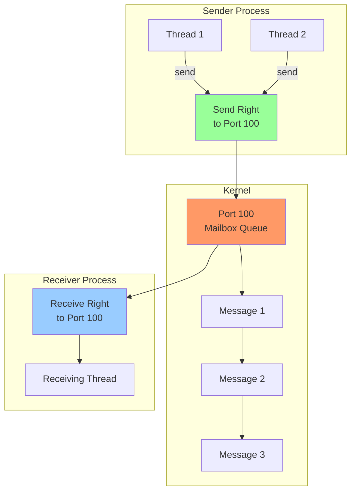
```mermaid
graph TB
    subgraph "Sender Process"
        S1[Thread 1]
        S2[Thread 2]
        SPORT[Send Right<br/>to Port 100]
    end

    subgraph "Kernel"
        PORT[Port 100<br/>Mailbox Queue]
        MSG1[Message 1]
        MSG2[Message 2]
        MSG3[Message 3]
    end

    subgraph "Receiver Process"
        RPORT[Receive Right<br/>to Port 100]
        R1[Receiving Thread]
    end

    S1 -->|send| SPORT
    S2 -->|send| SPORT
    SPORT --> PORT
    PORT --> MSG1
    MSG1 --> MSG2
    MSG2 --> MSG3
    PORT --> RPORT
    RPORT --> R1

    style PORT fill:#f96
    style SPORT fill:#9f9
    style RPORT fill:#9cf
```

### Key Characteristics

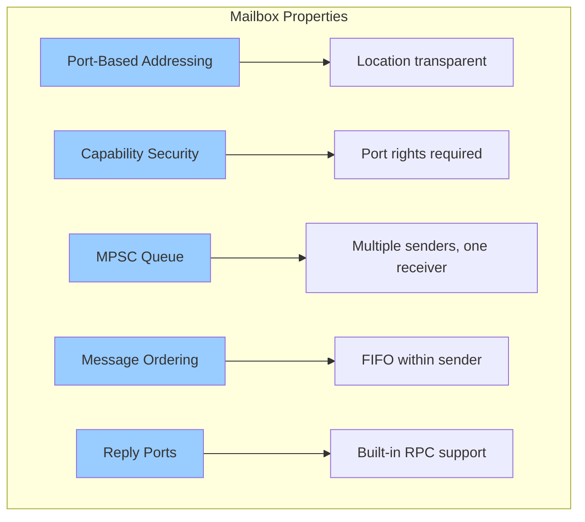
```mermaid
graph TB
    subgraph "Mailbox Properties"
        A[Port-Based Addressing] --> B[Location transparent]
        C[Capability Security] --> D[Port rights required]
        E[MPSC Queue] --> F[Multiple senders, one receiver]
        G[Message Ordering] --> H[FIFO within sender]
        I[Reply Ports] --> J[Built-in RPC support]
    end

    style A fill:#9cf
    style C fill:#9cf
    style E fill:#9cf
    style G fill:#9cf
    style I fill:#9cf
```

**1. Port-Based Addressing**
- Messages sent to ports (integer identifiers)
- No need to know receiver's identity
- Location transparency (local or remote)

**2. Capability-Based Security**
- Must possess port right to communicate
- Send rights vs receive rights
- Rights can be transferred in messages

**3. MPSC (Multiple Producer, Single Consumer)**
- Many senders can send to one port
- Only one receiver per port
- Receiver has exclusive receive right

**4. Message Ordering**
- FIFO within each sender
- No global ordering across senders
- Deterministic delivery per sender

**5. Built-in Reply Mechanism**
- Messages can include reply port
- Enables synchronous RPC pattern
- Automatic cleanup on completion

### Mental Model

Think of a mailbox like a **post office box**:
- Box number (port ID) is public
- Only box owner (receive right holder) can retrieve mail
- Anyone with permission (send right) can send to box
- Return address (reply port) enables responses
- Multiple people can send, but one owner retrieves

---

## Types of Mailbox Systems

### 1. Mach Ports (macOS, iOS, Darwin)

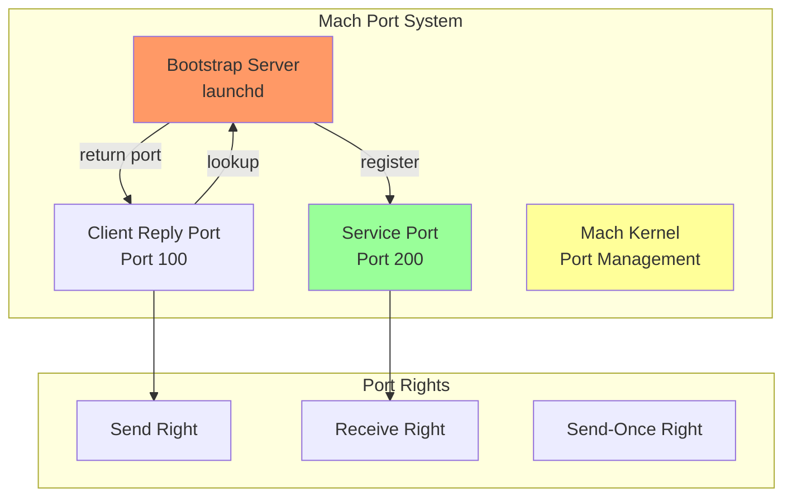
```mermaid
graph TB
    subgraph "Mach Port System"
        BOOTSTRAP[Bootstrap Server<br/>launchd]
        SERVICE[Service Port<br/>Port 200]
        CLIENT[Client Reply Port<br/>Port 100]
        KERNEL[Mach Kernel<br/>Port Management]
    end

    subgraph "Port Rights"
        SEND[Send Right]
        RECV[Receive Right]
        SENDONCE[Send-Once Right]
    end

    BOOTSTRAP -->|register| SERVICE
    CLIENT -->|lookup| BOOTSTRAP
    BOOTSTRAP -->|return port| CLIENT
    CLIENT --> SEND
    SERVICE --> RECV

    style BOOTSTRAP fill:#f96
    style SERVICE fill:#9f9
    style KERNEL fill:#ff9
```

**Characteristics:**
- Foundation of macOS/iOS IPC
- XPC services use Mach ports
- Integrates with Grand Central Dispatch (GCD)
- Supports complex messages with port rights
- Capability-based security model

**Use Case:** System services, framework communication, XPC

### 2. QNX Message Passing

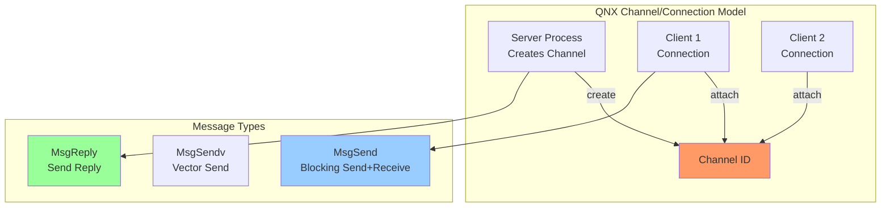
```mermaid
graph TB
    subgraph "QNX Channel/Connection Model"
        SERVER[Server Process<br/>Creates Channel]
        CHANNEL[Channel ID]
        CLIENT1[Client 1<br/>Connection]
        CLIENT2[Client 2<br/>Connection]
    end

    subgraph "Message Types"
        SEND[MsgSend<br/>Blocking Send+Receive]
        SENDV[MsgSendv<br/>Vector Send]
        REPLY[MsgReply<br/>Send Reply]
    end

    SERVER -->|create| CHANNEL
    CLIENT1 -->|attach| CHANNEL
    CLIENT2 -->|attach| CHANNEL
    CLIENT1 --> SEND
    SERVER --> REPLY

    style CHANNEL fill:#f96
    style SEND fill:#9cf
    style REPLY fill:#9f9
```

**Characteristics:**
- Synchronous message passing by default
- Channel/connection model
- Copy-free message transfer
- Real-time priority inheritance
- Microkernel architecture

**Use Case:** Real-time embedded systems, automotive, industrial control

### 3. Erlang Actor Mailboxes

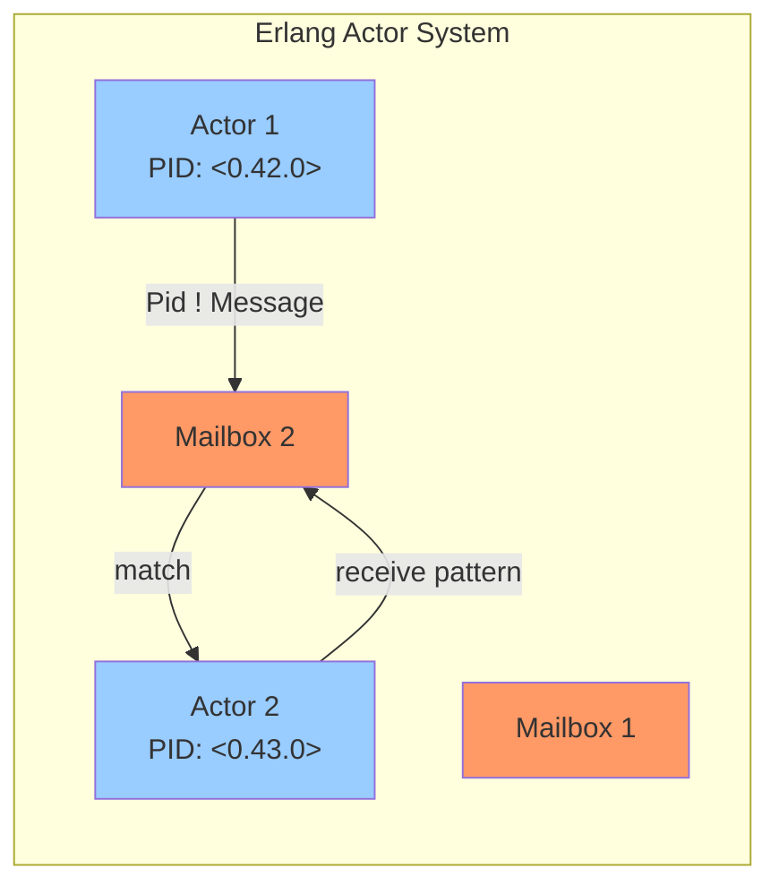
```mermaid
graph LR
    subgraph "Erlang Actor System"
        A1[Actor 1<br/>PID: <0.42.0>]
        MB1[Mailbox 1]
        A2[Actor 2<br/>PID: <0.43.0>]
        MB2[Mailbox 2]
    end

    A1 -->|Pid ! Message| MB2
    A2 -->|receive pattern| MB2
    MB2 -->|match| A2

    style MB1 fill:#f96
    style MB2 fill:#f96
    style A1 fill:#9cf
    style A2 fill:#9cf
```

**Characteristics:**
- Asynchronous message passing
- Pattern matching on receive
- Selective receive (out-of-order)
- Process isolation (shared nothing)
- Distributed by default

**Use Case:** Distributed systems, telecom, messaging platforms

### Comparison

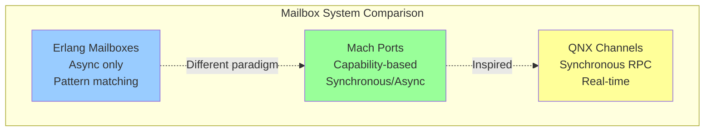
```mermaid
graph TB
    subgraph "Mailbox System Comparison"
        MACH[Mach Ports<br/>Capability-based<br/>Synchronous/Async]
        QNX[QNX Channels<br/>Synchronous RPC<br/>Real-time]
        ERLANG[Erlang Mailboxes<br/>Async only<br/>Pattern matching]
    end

    MACH -.->|Inspired| QNX
    ERLANG -.->|Different paradigm| MACH

    style MACH fill:#9f9
    style QNX fill:#ff9
    style ERLANG fill:#9cf
```

| Feature | Mach Ports | QNX Channels | Erlang Mailboxes |
|---------|-----------|--------------|------------------|
| **Synchronization** | Sync & Async | Primarily Sync | Async only |
| **Security** | Capability-based | Process-based | Process isolation |
| **Ordering** | FIFO per sender | FIFO | Arrival order |
| **Reply** | Reply port | MsgReply() | Manual send back |
| **Pattern Matching** | No | No | Yes |
| **Distributed** | Local only | Network transparent | Built-in distributed |
| **Primary Use** | OS services | Real-time systems | Distributed apps |

---

## Kernel-Level Architecture

### Mach Port Architecture

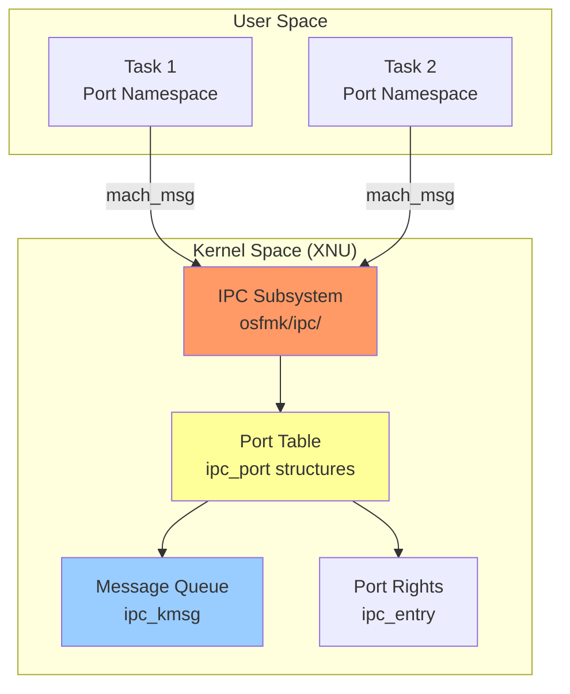
```mermaid
graph TB
    subgraph "User Space"
        TASK1[Task 1<br/>Port Namespace]
        TASK2[Task 2<br/>Port Namespace]
    end

    subgraph "Kernel Space (XNU)"
        IPC[IPC Subsystem<br/>osfmk/ipc/]
        PORTS[Port Table<br/>ipc_port structures]
        QUEUE[Message Queue<br/>ipc_kmsg]
        RIGHTS[Port Rights<br/>ipc_entry]
    end

    TASK1 -->|mach_msg| IPC
    TASK2 -->|mach_msg| IPC
    IPC --> PORTS
    PORTS --> QUEUE
    PORTS --> RIGHTS

    style IPC fill:#f96
    style PORTS fill:#ff9
    style QUEUE fill:#9cf
```

### Data Structures

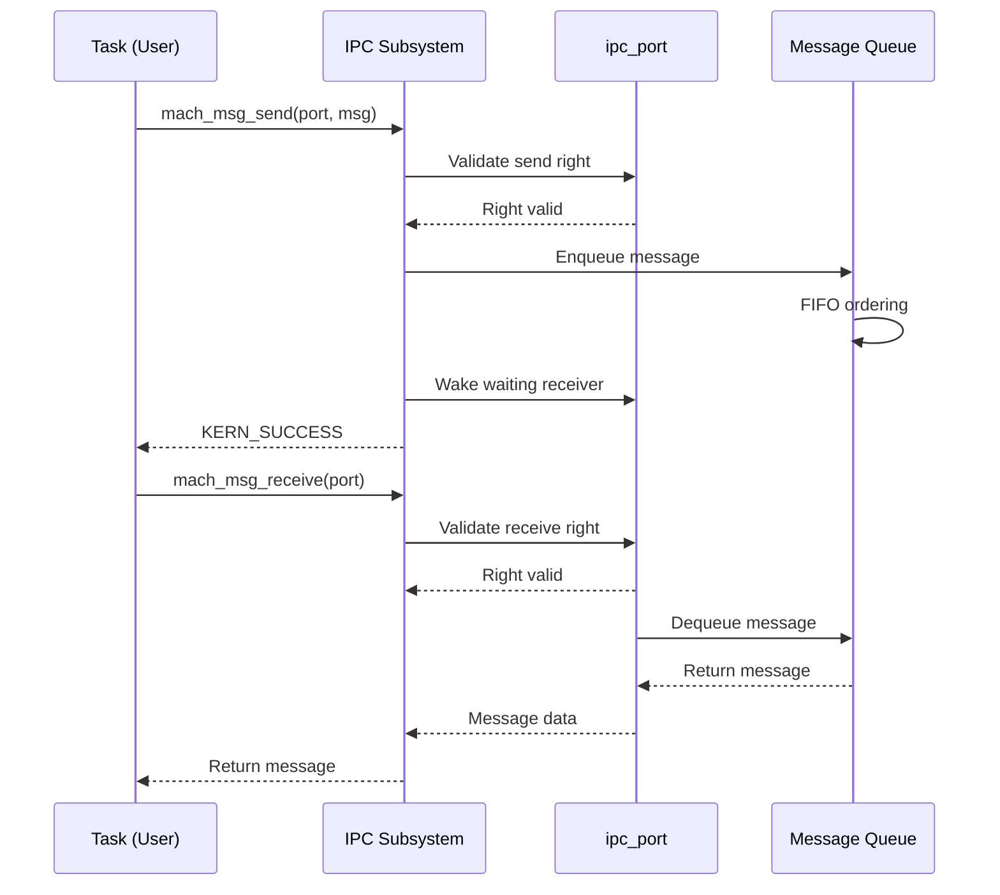
```mermaid
sequenceDiagram
    participant Task as Task (User)
    participant IPC as IPC Subsystem
    participant Port as ipc_port
    participant Queue as Message Queue

    Task->>IPC: mach_msg_send(port, msg)
    IPC->>Port: Validate send right
    Port-->>IPC: Right valid
    IPC->>Queue: Enqueue message
    Queue->>Queue: FIFO ordering
    IPC->>Port: Wake waiting receiver
    IPC-->>Task: KERN_SUCCESS

    Task->>IPC: mach_msg_receive(port)
    IPC->>Port: Validate receive right
    Port-->>IPC: Right valid
    Port->>Queue: Dequeue message
    Queue-->>Port: Return message
    Port-->>IPC: Message data
    IPC-->>Task: Return message
```

### Memory Layout

```
┌─────────────────────────────────────────────────┐
│          User Space (Task)                      │
│  mach_port_t port = 100;  // Port name          │
│  mach_msg(...);                                 │
└──────────────────┬──────────────────────────────┘
                   │ Trap to Kernel
┌──────────────────▼──────────────────────────────┐
│            Kernel Space (XNU)                   │
│  ┌──────────────────────────────────────────┐  │
│  │  struct ipc_port (Port 100)              │  │
│  │  ├─ ip_receiver (Task owning receive)    │  │
│  │  ├─ ip_messages (Message queue)          │  │
│  │  ├─ ip_seqno (Sequence number)           │  │
│  │  ├─ ip_sorights (Send-once rights count) │  │
│  │  └─ ip_lock (Synchronization)            │  │
│  └──────────────────────────────────────────┘  │
│                   │                             │
│  ┌────────────────▼──────────────────────────┐ │
│  │  Message Queue (ipc_kmsg list)           │ │
│  │  ┌──────────┬──────────┬──────────┐      │ │
│  │  │ Msg 1    │ Msg 2    │ Msg 3    │      │ │
│  │  │ Header   │ Header   │ Header   │      │ │
│  │  │ + Data   │ + Data   │ + Data   │      │ │
│  │  └──────────┴──────────┴──────────┘      │ │
│  └──────────────────────────────────────────┘ │
└─────────────────────────────────────────────────┘
```

---

## Mailbox System Calls

### Mach Message API

```c
#include <mach/mach.h>
#include <mach/message.h>
```

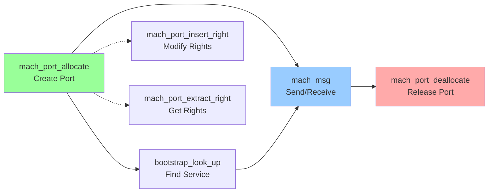
```mermaid
graph LR
    CREATE[mach_port_allocate<br/>Create Port] --> SEND[mach_msg<br/>Send/Receive]
    CREATE --> LOOKUP[bootstrap_look_up<br/>Find Service]
    SEND --> DESTROY[mach_port_deallocate<br/>Release Port]
    LOOKUP --> SEND

    CREATE -.-> RIGHTS[mach_port_insert_right<br/>Modify Rights]
    CREATE -.-> EXTRACT[mach_port_extract_right<br/>Get Rights]

    style CREATE fill:#9f9
    style SEND fill:#9cf
    style DESTROY fill:#faa
```

### 1. `mach_port_allocate()` - Create Port

```c
kern_return_t mach_port_allocate(
    ipc_space_t task,
    mach_port_right_t right,
    mach_port_name_t *name
);
```

**Parameters:**
- `task`: Target task (usually `mach_task_self()`)
- `right`: Type of right to create
  - `MACH_PORT_RIGHT_RECEIVE`: Create receive right
  - `MACH_PORT_RIGHT_PORT_SET`: Create port set
- `name`: Returns port name (identifier)

**Returns:**
- `KERN_SUCCESS` on success
- Error code on failure

**Example:**
```c
mach_port_t port;
kern_return_t kr;

kr = mach_port_allocate(mach_task_self(), MACH_PORT_RIGHT_RECEIVE, &port);
if (kr != KERN_SUCCESS) {
    fprintf(stderr, "Failed to allocate port: %s\n", mach_error_string(kr));
    exit(1);
}

printf("Created port: %d\n", port);
```

### 2. `mach_msg()` - Send and Receive Messages

```c
mach_msg_return_t mach_msg(
    mach_msg_header_t *msg,
    mach_msg_option_t option,
    mach_msg_size_t send_size,
    mach_msg_size_t rcv_size,
    mach_port_name_t rcv_name,
    mach_msg_timeout_t timeout,
    mach_port_name_t notify
);
```

**Options:**
- `MACH_SEND_MSG`: Send message
- `MACH_RCV_MSG`: Receive message
- `MACH_SEND_MSG | MACH_RCV_MSG`: Send then receive (RPC)
- `MACH_SEND_TIMEOUT`: Enable send timeout
- `MACH_RCV_TIMEOUT`: Enable receive timeout

**Message Structure:**
```c
typedef struct {
    mach_msg_bits_t        msgh_bits;        // Flags
    mach_msg_size_t        msgh_size;        // Message size
    mach_port_t            msgh_remote_port; // Destination port
    mach_port_t            msgh_local_port;  // Reply port
    mach_port_name_t       msgh_voucher_port;// Voucher
    mach_msg_id_t          msgh_id;          // Message ID
} mach_msg_header_t;
```

**Blocking Behavior:**
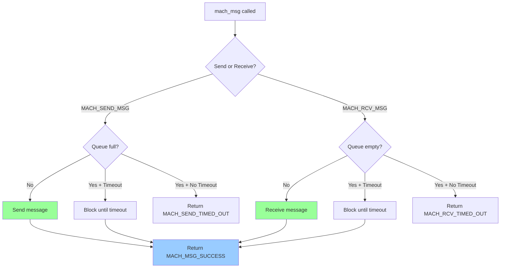
```mermaid
flowchart TD
    A[mach_msg called] --> B{Send or Receive?}
    B -->|MACH_SEND_MSG| C{Queue full?}
    B -->|MACH_RCV_MSG| D{Queue empty?}

    C -->|No| E[Send message]
    C -->|Yes + Timeout| F[Block until timeout]
    C -->|Yes + No Timeout| G[Return MACH_SEND_TIMED_OUT]

    D -->|No| H[Receive message]
    D -->|Yes + Timeout| I[Block until timeout]
    D -->|Yes + No Timeout| J[Return MACH_RCV_TIMED_OUT]

    E --> K[Return MACH_MSG_SUCCESS]
    F --> K
    H --> K
    I --> K

    style E fill:#9f9
    style H fill:#9f9
    style K fill:#9cf
```

**Example - Simple Send:**
```c
typedef struct {
    mach_msg_header_t header;
    char data[256];
} simple_message_t;

simple_message_t msg;
msg.header.msgh_bits = MACH_MSGH_BITS(MACH_MSG_TYPE_COPY_SEND, 0);
msg.header.msgh_size = sizeof(msg);
msg.header.msgh_remote_port = dest_port;
msg.header.msgh_local_port = MACH_PORT_NULL;
msg.header.msgh_id = 1234;

strcpy(msg.data, "Hello from sender");

kern_return_t kr = mach_msg(
    &msg.header,
    MACH_SEND_MSG,
    msg.header.msgh_size,
    0,
    MACH_PORT_NULL,
    MACH_MSG_TIMEOUT_NONE,
    MACH_PORT_NULL
);
```

**Example - Simple Receive:**
```c
simple_message_t msg;

kern_return_t kr = mach_msg(
    &msg.header,
    MACH_RCV_MSG,
    0,
    sizeof(msg),
    receive_port,
    MACH_MSG_TIMEOUT_NONE,
    MACH_PORT_NULL
);

if (kr == MACH_MSG_SUCCESS) {
    printf("Received: %s\n", msg.data);
}
```

### 3. `bootstrap_look_up()` - Service Discovery

```c
kern_return_t bootstrap_look_up(
    mach_port_t bp,
    const char *service_name,
    mach_port_t *sp
);
```

**Example:**
```c
mach_port_t service_port;
kern_return_t kr;

kr = bootstrap_look_up(bootstrap_port, "com.example.myservice", &service_port);
if (kr != KERN_SUCCESS) {
    fprintf(stderr, "Service not found\n");
    exit(1);
}

// Now can send messages to service_port
```

### 4. QNX Message Passing API

```c
#include <sys/neutrino.h>
```

**Create Channel:**
```c
int chid = ChannelCreate(0);  // Create channel
```

**Client Connect:**
```c
int coid = ConnectAttach(0, 0, chid, _NTO_SIDE_CHANNEL, 0);  // Connect to channel
```

**Send and Receive:**
```c
// Client sends message and waits for reply
MsgSend(coid, &send_msg, send_size, &reply_msg, reply_size);

// Server receives message
int rcvid = MsgReceive(chid, &msg, msg_size, NULL);

// Server replies
MsgReply(rcvid, status, &reply, reply_size);
```

---

## Mach Ports (macOS/Darwin)

### Complete Workflow

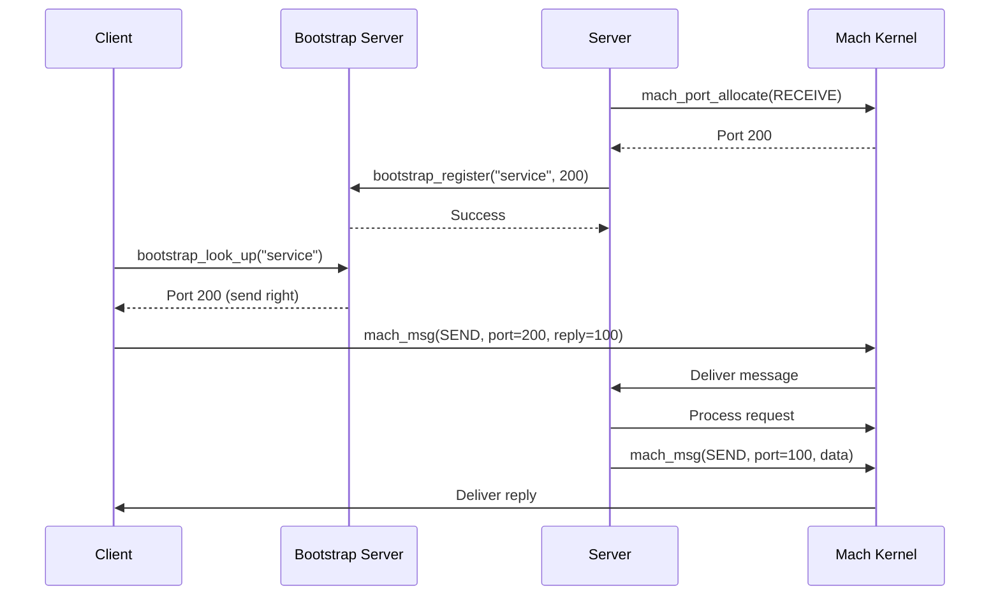
```mermaid
sequenceDiagram
    participant C as Client
    participant B as Bootstrap Server
    participant S as Server
    participant K as Mach Kernel

    S->>K: mach_port_allocate(RECEIVE)
    K-->>S: Port 200
    S->>B: bootstrap_register("service", 200)
    B-->>S: Success

    C->>B: bootstrap_look_up("service")
    B-->>C: Port 200 (send right)

    C->>K: mach_msg(SEND, port=200, reply=100)
    K->>S: Deliver message
    S->>K: Process request
    S->>K: mach_msg(SEND, port=100, data)
    K->>C: Deliver reply
```

### Port Rights Visualization

```
Port 100 State:
┌────────────────────────────────────────────┐
│  Receive Right:  Task A (exclusive)        │
│  Send Rights:    Task B, Task C, Task D    │
│  Send-Once:      Task E                    │
│  Message Queue:  [Msg1] [Msg2] [Msg3]      │
│  Wait Queue:     [Task F blocked]          │
└────────────────────────────────────────────┘

Access Control:
  Task A: Can receive, destroy port
  Task B,C,D: Can send messages
  Task E: Can send one message (right consumed)
  Task F: Waiting to receive
```

### Port Types

**1. Receive Right:**
- Only one per port
- Allows receiving messages
- Exclusive ownership

**2. Send Right:**
- Multiple tasks can have
- Allows sending messages
- Reference counted

**3. Send-Once Right:**
- Single-use send right
- Consumed after one send
- Used for replies

**4. Port Set:**
- Collection of ports
- Receive from multiple ports
- Single receive operation

---

## QNX Message Passing

### Channel/Connection Model

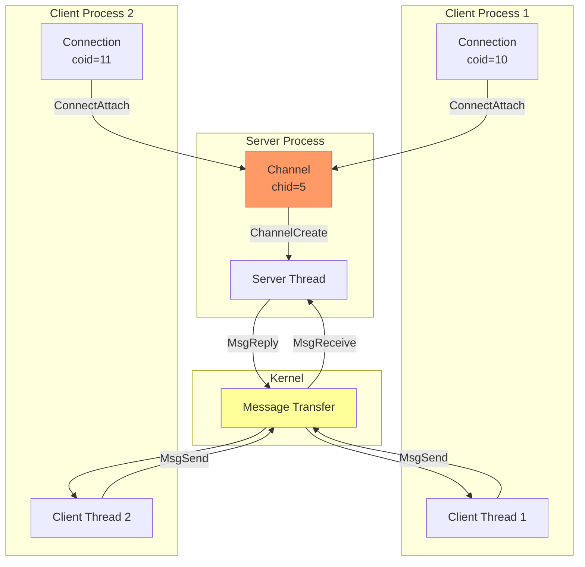
```mermaid
graph TB
    subgraph "Server Process"
        SERVER[Server Thread]
        CHANNEL[Channel<br/>chid=5]
    end

    subgraph "Client Process 1"
        CLIENT1[Client Thread 1]
        CONN1[Connection<br/>coid=10]
    end

    subgraph "Client Process 2"
        CLIENT2[Client Thread 2]
        CONN2[Connection<br/>coid=11]
    end

    subgraph "Kernel"
        MSG_QUEUE[Message Transfer]
    end

    CHANNEL -->|ChannelCreate| SERVER
    CONN1 -->|ConnectAttach| CHANNEL
    CONN2 -->|ConnectAttach| CHANNEL
    CLIENT1 -->|MsgSend| MSG_QUEUE
    CLIENT2 -->|MsgSend| MSG_QUEUE
    MSG_QUEUE -->|MsgReceive| SERVER
    SERVER -->|MsgReply| MSG_QUEUE
    MSG_QUEUE --> CLIENT1
    MSG_QUEUE --> CLIENT2

    style CHANNEL fill:#f96
    style MSG_QUEUE fill:#ff9
```

### Synchronous RPC Pattern

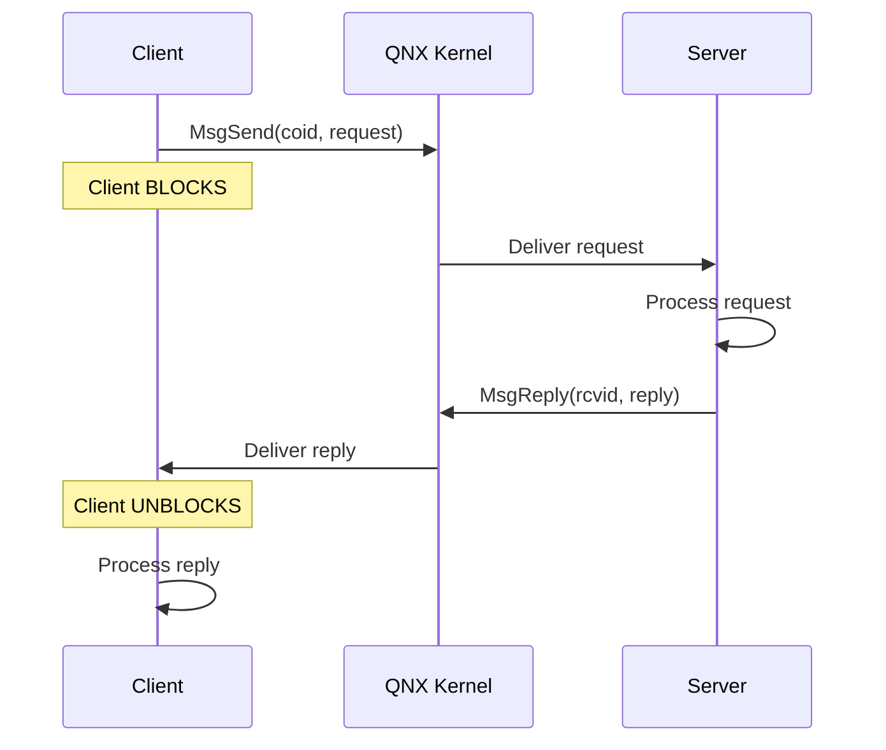
```mermaid
sequenceDiagram
    participant C as Client
    participant K as QNX Kernel
    participant S as Server

    C->>K: MsgSend(coid, request)
    Note over C: Client BLOCKS
    K->>S: Deliver request
    S->>S: Process request
    S->>K: MsgReply(rcvid, reply)
    K->>C: Deliver reply
    Note over C: Client UNBLOCKS
    C->>C: Process reply
```

### Message Structure

```c
typedef struct {
    uint16_t type;
    uint16_t subtype;
} msg_header_t;

// Request message
typedef struct {
    msg_header_t header;
    int operation;
    char data[256];
} request_t;

// Reply message
typedef struct {
    int status;
    char result[256];
} reply_t;

// Client code
request_t req;
reply_t rep;

req.header.type = 0x100;
req.operation = OP_PROCESS;
strcpy(req.data, "Input data");

// Blocking send+receive
if (MsgSend(coid, &req, sizeof(req), &rep, sizeof(rep)) == -1) {
    perror("MsgSend");
}

printf("Status: %d, Result: %s\n", rep.status, rep.result);
```

---

## Behind the Hood: Kernel Implementation

### Mach Port Kernel Structure (XNU)

Located in `osfmk/ipc/ipc_port.c`:

```c
// Simplified kernel structure
struct ipc_port {
    struct ipc_object ip_object;      // Base object

    ipc_mqueue_t ip_messages;         // Message queue

    struct ipc_space *ip_receiver;    // Receive right holder
    struct ipc_port *ip_destination;  // For port sets

    natural_t ip_sorights;            // Send-once rights count
    natural_t ip_srights;             // Send rights count

    mach_port_seqno_t ip_seqno;       // Sequence number

    mach_port_mscount_t ip_mscount;   // Make-send count
    mach_port_rights_t ip_notify;     // Notification port

    decl_lck_spin_data(, ip_lock);    // Port lock
};

// Message queue structure
typedef struct ipc_mqueue {
    union {
        struct {
            struct waitq waitq;
            struct ipc_kmsg_queue messages;
        } port;
        struct {
            struct waitq_set set_queue;
        } pset;
    } data;

    uint16_t imq_limit;               // Queue limit
    uint16_t imq_msgcount;            // Current count
} *ipc_mqueue_t;

// Kernel message
struct ipc_kmsg {
    mach_msg_size_t ikm_size;         // Message size
    struct ipc_kmsg *ikm_next;        // Next in queue
    struct ipc_kmsg *ikm_prev;        // Previous in queue
    mach_msg_header_t *ikm_header;    // Message header
    ipc_port_t ikm_prealloc;          // Preallocated port
    mach_msg_qos_t ikm_qos;           // QoS override
};
```

### Send Operation Internals

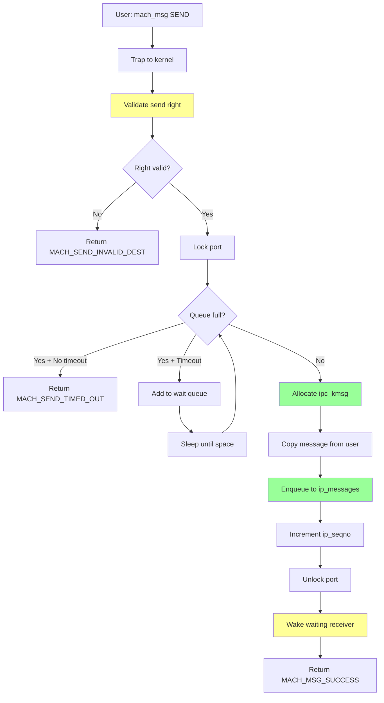
```mermaid
flowchart TD
    A[User: mach_msg SEND] --> B[Trap to kernel]
    B --> C[Validate send right]
    C --> D{Right valid?}
    D -->|No| E[Return MACH_SEND_INVALID_DEST]
    D -->|Yes| F[Lock port]
    F --> G{Queue full?}
    G -->|Yes + No timeout| H[Return MACH_SEND_TIMED_OUT]
    G -->|Yes + Timeout| I[Add to wait queue]
    I --> J[Sleep until space]
    J --> G
    G -->|No| K[Allocate ipc_kmsg]
    K --> L[Copy message from user]
    L --> M[Enqueue to ip_messages]
    M --> N[Increment ip_seqno]
    N --> O[Unlock port]
    O --> P[Wake waiting receiver]
    P --> Q[Return MACH_MSG_SUCCESS]

    style C fill:#ff9
    style K fill:#9f9
    style M fill:#9f9
    style P fill:#ff9
```

### Receive Operation Internals

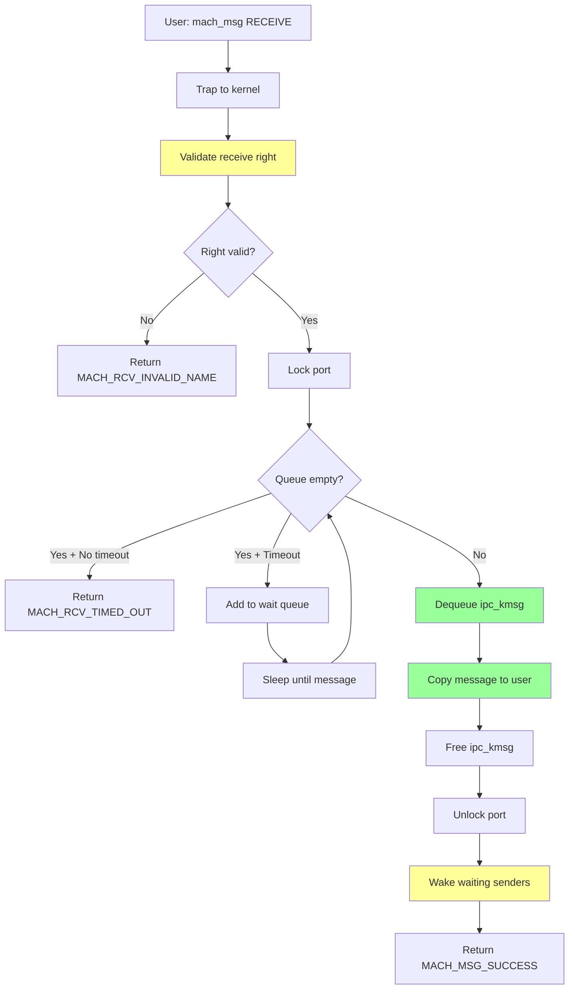
```mermaid
flowchart TD
    A[User: mach_msg RECEIVE] --> B[Trap to kernel]
    B --> C[Validate receive right]
    C --> D{Right valid?}
    D -->|No| E[Return MACH_RCV_INVALID_NAME]
    D -->|Yes| F[Lock port]
    F --> G{Queue empty?}
    G -->|Yes + No timeout| H[Return MACH_RCV_TIMED_OUT]
    G -->|Yes + Timeout| I[Add to wait queue]
    I --> J[Sleep until message]
    J --> G
    G -->|No| K[Dequeue ipc_kmsg]
    K --> L[Copy message to user]
    L --> M[Free ipc_kmsg]
    M --> N[Unlock port]
    N --> O[Wake waiting senders]
    O --> P[Return MACH_MSG_SUCCESS]

    style C fill:#ff9
    style K fill:#9f9
    style L fill:#9f9
    style O fill:#ff9
```

### QNX Kernel Implementation

```c
// Simplified QNX kernel structures

// Channel
typedef struct channel {
    int chid;                         // Channel ID
    struct thread *receive_queue;     // Waiting receivers
    struct thread *send_queue;        // Waiting senders
    unsigned flags;                   // Channel flags
} channel_t;

// Connection
typedef struct connection {
    int coid;                         // Connection ID
    channel_t *channel;               // Target channel
    struct process *client;           // Client process
    unsigned flags;                   // Connection flags
} connection_t;

// Message transfer (zero-copy)
int kernel_msg_send(connection_t *conn, void *smsg, size_t ssize,
                    void *rmsg, size_t rsize) {
    channel_t *ch = conn->channel;
    thread_t *server;

    // Block until server receives
    while (!(server = ch->receive_queue)) {
        thread_block(current_thread, &ch->send_queue);
        schedule();
    }

    // Direct copy: client -> server
    memcpy_user(server->rcv_buf, smsg, ssize);

    // Wake server
    thread_wakeup(server);

    // Block until server replies
    thread_block(current_thread, &conn->reply_queue);
    schedule();

    // Direct copy: server -> client
    memcpy_user(rmsg, current_thread->reply_buf, rsize);

    return 0;
}
```

---

## Port Rights and Capabilities

### Port Rights Model

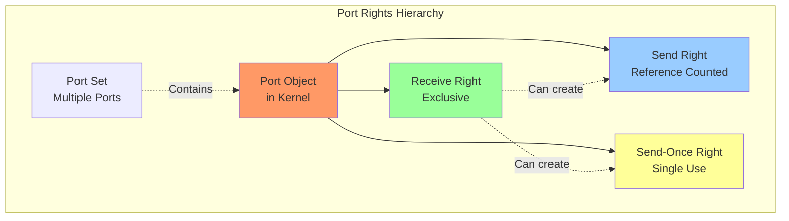
```mermaid
graph TB
    subgraph "Port Rights Hierarchy"
        PORT[Port Object<br/>in Kernel]
        RECEIVE[Receive Right<br/>Exclusive]
        SEND[Send Right<br/>Reference Counted]
        SENDONCE[Send-Once Right<br/>Single Use]
        PORTSET[Port Set<br/>Multiple Ports]
    end

    PORT --> RECEIVE
    PORT --> SEND
    PORT --> SENDONCE
    RECEIVE -.->|Can create| SEND
    RECEIVE -.->|Can create| SENDONCE
    PORTSET -.->|Contains| PORT

    style PORT fill:#f96
    style RECEIVE fill:#9f9
    style SEND fill:#9cf
    style SENDONCE fill:#ff9
```

### Rights Transfer

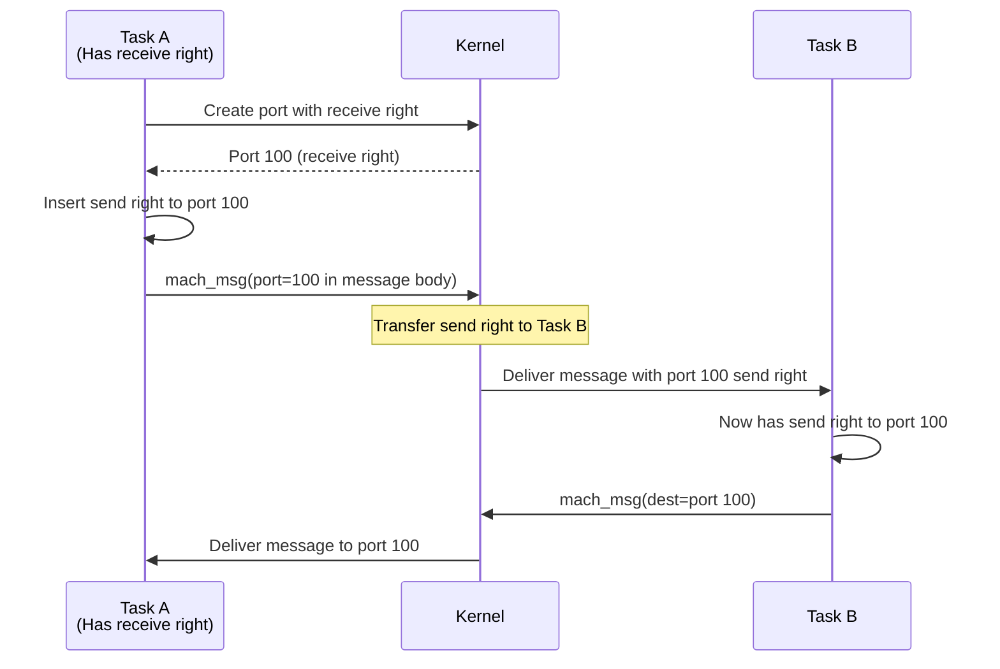
```mermaid
sequenceDiagram
    participant A as Task A<br/>(Has receive right)
    participant K as Kernel
    participant B as Task B

    A->>K: Create port with receive right
    K-->>A: Port 100 (receive right)

    A->>A: Insert send right to port 100
    A->>K: mach_msg(port=100 in message body)
    Note over K: Transfer send right to Task B
    K->>B: Deliver message with port 100 send right
    B->>B: Now has send right to port 100

    B->>K: mach_msg(dest=port 100)
    K->>A: Deliver message to port 100
```

**Rights Transfer Example:**
```c
// Task A: Create port and send right to Task B
mach_port_t port;
mach_port_allocate(mach_task_self(), MACH_PORT_RIGHT_RECEIVE, &port);

// Insert send right into message
typedef struct {
    mach_msg_header_t header;
    mach_msg_body_t body;
    mach_msg_port_descriptor_t port_descriptor;
} port_transfer_msg_t;

port_transfer_msg_t msg;
msg.header.msgh_bits = MACH_MSGH_BITS_COMPLEX |
                       MACH_MSGH_BITS(MACH_MSG_TYPE_COPY_SEND, 0);
msg.header.msgh_remote_port = task_b_port;
msg.body.msgh_descriptor_count = 1;
msg.port_descriptor.name = port;
msg.port_descriptor.disposition = MACH_MSG_TYPE_COPY_SEND;
msg.port_descriptor.type = MACH_MSG_PORT_DESCRIPTOR;

mach_msg(&msg.header, MACH_SEND_MSG, ...);

// Task B receives message and now has send right to port
```

### Capability-Based Security

```
Traditional Access Control:
  check_permission(user_id, resource_id, operation)
  → Global namespace, ACLs, ambient authority

Capability-Based (Mach Ports):
  Has port right? → Can perform operation
  → No ambient authority, unforgeable
```

**Example Security Model:**
```c
// Traditional: Vulnerable to confused deputy
mach_port_t sensitive_service = lookup_global_service("crypto");
// Any code can find and use this service!

// Capability-based: Secure
mach_port_t crypto_port = receive_port_from_trusted_source();
// Only code with this specific port right can use the service
// Rights can't be guessed or forged
```

---

## Blocking vs Non-Blocking Operations

### Mach: Timeout-Based Control

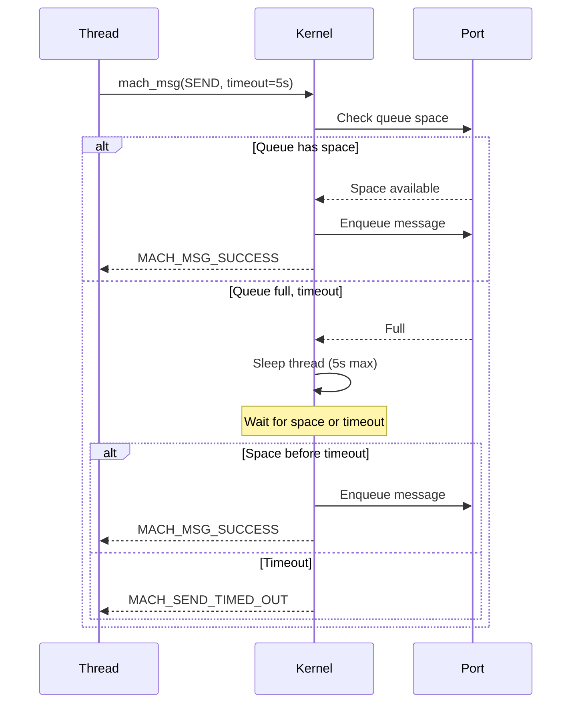
```mermaid
sequenceDiagram
    participant T as Thread
    participant K as Kernel
    participant P as Port

    T->>K: mach_msg(SEND, timeout=5s)
    K->>P: Check queue space

    alt Queue has space
        P-->>K: Space available
        K->>P: Enqueue message
        K-->>T: MACH_MSG_SUCCESS
    else Queue full, timeout
        P-->>K: Full
        K->>K: Sleep thread (5s max)
        Note over K: Wait for space or timeout
        alt Space before timeout
            K->>P: Enqueue message
            K-->>T: MACH_MSG_SUCCESS
        else Timeout
            K-->>T: MACH_SEND_TIMED_OUT
        end
    end
```

**Timeout Options:**
```c
// Immediate (non-blocking)
mach_msg(..., MACH_MSG_TIMEOUT_NONE, MACH_SEND_TIMEOUT);
// Returns immediately if queue full

// Infinite wait (blocking)
mach_msg(..., MACH_MSG_TIMEOUT_NONE, 0);
// Waits forever

// Timed wait
mach_msg(..., 5000, MACH_SEND_TIMEOUT);
// Waits up to 5 seconds
```

### QNX: Synchronous by Default

```c
// QNX MsgSend is always blocking (synchronous RPC)
MsgSend(coid, &send_msg, send_size, &reply_msg, reply_size);
// Blocks until server replies

// For async, use MsgSendv with pulse
MsgSendPulse(coid, priority, code, value);
// Sends pulse (non-blocking, no reply)

// For non-blocking receive with timeout
TimerTimeout(CLOCK_REALTIME, _NTO_TIMEOUT_RECEIVE, NULL, &timeout, NULL);
MsgReceive(chid, &msg, msg_size, NULL);
// Returns after timeout if no message
```

### Comparison Table

| Aspect | Mach Ports | QNX Channels | Erlang Mailboxes |
|--------|-----------|--------------|------------------|
| **Send** | Timeout-based | Blocking (RPC) | Always async |
| **Receive** | Timeout-based | Blocking | Blocking with timeout |
| **Default** | Blocking | Blocking | Async send, blocking receive |
| **Timeout** | Per-operation | Global timer | `after` clause |
| **Non-blocking** | TIMEOUT_NONE | Pulse messages | Check mailbox |

---

## Real-World Usage

### 1. macOS/iOS System Services (XPC)

XPC (Cross-Process Communication) uses Mach ports for all system services.

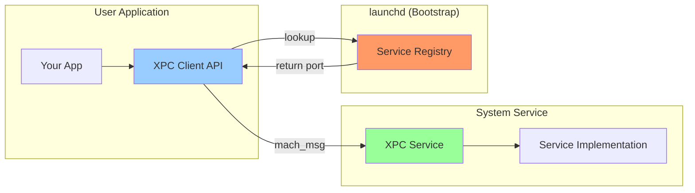
```mermaid
graph LR
    subgraph "User Application"
        APP[Your App]
        XPC_CLIENT[XPC Client API]
    end

    subgraph "System Service"
        XPC_SERVICE[XPC Service]
        SERVICE_IMPL[Service Implementation]
    end

    subgraph "launchd (Bootstrap)"
        BOOTSTRAP[Service Registry]
    end

    APP --> XPC_CLIENT
    XPC_CLIENT -->|lookup| BOOTSTRAP
    BOOTSTRAP -->|return port| XPC_CLIENT
    XPC_CLIENT -->|mach_msg| XPC_SERVICE
    XPC_SERVICE --> SERVICE_IMPL

    style BOOTSTRAP fill:#f96
    style XPC_CLIENT fill:#9cf
    style XPC_SERVICE fill:#9f9
```

**Real-World Example: Location Services**
```objc
// Objective-C code using XPC for location services
CLLocationManager *manager = [[CLLocationManager alloc] init];
[manager requestLocation];

// Internally uses XPC over Mach ports:
// 1. App looks up "com.apple.locationd" service
// 2. Gets Mach port to location daemon
// 3. Sends request via mach_msg
// 4. Location daemon replies with coordinates
```

**Reference:** https://developer.apple.com/library/archive/documentation/Darwin/Conceptual/KernelProgramming/Mach/Mach.html

### 2. Grand Central Dispatch (GCD)

GCD uses Mach ports for work queue management.

```c
// GCD internally uses Mach ports
dispatch_queue_t queue = dispatch_queue_create("com.example.queue", NULL);

dispatch_async(queue, ^{
    // Work is distributed via Mach ports
    // to worker threads
});

// Mach ports enable:
// - Thread pool management
// - Work distribution
// - Priority inheritance
```

### 3. QNX Automotive Systems

QNX is used in over 225 million vehicles worldwide.

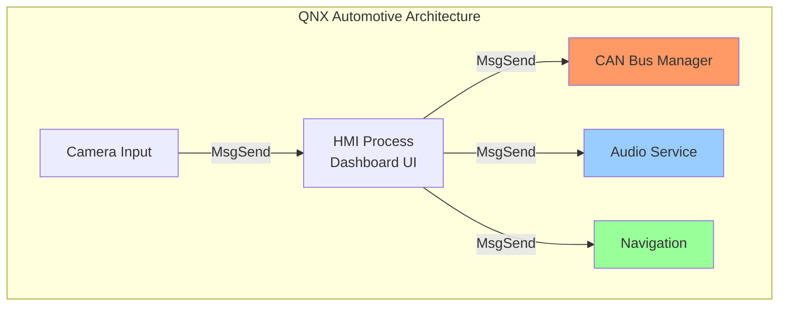
```mermaid
graph TB
    subgraph "QNX Automotive Architecture"
        HMI[HMI Process<br/>Dashboard UI]
        CAN[CAN Bus Manager]
        AUDIO[Audio Service]
        NAV[Navigation]
        CAMERA[Camera Input]
    end

    HMI -->|MsgSend| CAN
    HMI -->|MsgSend| AUDIO
    HMI -->|MsgSend| NAV
    CAMERA -->|MsgSend| HMI

    style CAN fill:#f96
    style AUDIO fill:#9cf
    style NAV fill:#9f9
```

**Benefits:**
- Real-time priority inheritance
- Deterministic message passing
- Fault isolation (process crashes don't affect others)
- Certified for safety-critical systems

**Reference:** https://www.qnx.com/developers/docs/8.0/com.qnx.doc.neutrino.sys_arch/topic/ipc_Message_passing_OS.html

### 4. BlackBerry 10 OS

Built on QNX, used message passing for all UI and services.

```c
// BlackBerry UI Navigator communicates with apps via QNX messages
int coid = ConnectAttach(0, 0, navigator_chid, 0, 0);

navigator_event_t event;
event.type = NAVIGATOR_INVOKE;
event.data = "open://maps?dest=home";

MsgSend(coid, &event, sizeof(event), &reply, sizeof(reply));
```

### 5. Erlang Distributed Systems (WhatsApp)

WhatsApp handles 3+ billion messages per day using Erlang mailboxes.

```erlang
%% Actor-based message routing
-module(message_router).

route_message(From, To, Message) ->
    %% Find recipient's mailbox (process)
    ToPid = lookup_user(To),

    %% Send to mailbox asynchronously
    ToPid ! {message, From, Message},

    %% Check for delivery receipt
    receive
        {delivered, ToPid} ->
            notify_sender(From, delivered)
    after 5000 ->
        retry_delivery(To, Message)
    end.

%% Recipient's mailbox handler
recipient_loop() ->
    receive
        {message, From, Content} ->
            display_message(From, Content),
            From ! {delivered, self()},
            recipient_loop();

        {system, shutdown} ->
            cleanup()
    end.
```

**Architecture:**
```mermaid
graph TB
    subgraph "WhatsApp Erlang Cluster"
        CLIENT1[User 1<br/>Process/Mailbox]
        CLIENT2[User 2<br/>Process/Mailbox]
        ROUTER[Message Router<br/>Process]
        PRESENCE[Presence Service<br/>Process]
        PUSH[Push Notification<br/>Process]
    end

    CLIENT1 -->|Pid ! Msg| ROUTER
    ROUTER -->|Pattern match| CLIENT2
    ROUTER -->|Update| PRESENCE
    ROUTER -->|Offline?| PUSH

    style ROUTER fill:#f96
    style CLIENT1 fill:#9cf
    style CLIENT2 fill:#9cf
```

**Benefits:**
- Process isolation (crash doesn't affect others)
- Pattern matching for message routing
- Built-in distributed messaging
- Hot code reloading

**Reference:** https://www.infoworld.com/article/2178134/understanding-actor-concurrency-part-1-actors-in-erlang.html

### 6. Plan 9 Operating System

Plan 9 uses file-like message passing for everything.

```c
// Plan 9: Everything is a file server
int fd = open("/mnt/term/dev/mouse", OREAD);
// Open creates connection to mouse server mailbox

Event e;
read(fd, &e, sizeof(e));
// Read receives message from server's mailbox

// File servers communicate via 9P protocol over mailboxes
```

### 7. iOS Core Services

```mermaid
graph TB
    subgraph "iOS Service Architecture"
        APP[App Process]
        SPRINGBOARD[SpringBoard<br/>Home Screen]
        NOTIFYD[notifyd<br/>Notification Daemon]
        LOCATIOND[locationd<br/>Location Service]
        SECURITYD[securityd<br/>Keychain Access]
    end

    APP -->|Mach port| NOTIFYD
    APP -->|Mach port| LOCATIOND
    APP -->|Mach port| SECURITYD
    SPRINGBOARD -->|Mach port| NOTIFYD

    style NOTIFYD fill:#f96
    style LOCATIOND fill:#9cf
    style SECURITYD fill:#ff9
```

**Security Benefits:**
- Apps can't access services without port rights
- Port rights granted by launchd based on entitlements
- Capability-based security prevents privilege escalation

### Summary of Real-World Patterns

| System | Mailbox Type | Purpose |
|--------|-------------|---------|
| **macOS/iOS XPC** | Mach ports | System services, IPC |
| **GCD** | Mach ports | Work queue distribution |
| **QNX Automotive** | Channels | Real-time vehicle systems |
| **BlackBerry 10** | Channels | Mobile OS services |
| **WhatsApp** | Erlang mailboxes | Distributed messaging |
| **Plan 9** | 9P mailboxes | Distributed file servers |
| **iOS Core Services** | Mach ports | Security-critical services |

---

## Practical Examples

### Example 1: Basic Mach Port Communication

**server.c:**
```c
#include <mach/mach.h>
#include <stdio.h>
#include <string.h>

typedef struct {
    mach_msg_header_t header;
    char data[256];
} message_t;

int main() {
    mach_port_t port;
    kern_return_t kr;

    // Create receive port
    kr = mach_port_allocate(mach_task_self(), MACH_PORT_RIGHT_RECEIVE, &port);
    if (kr != KERN_SUCCESS) {
        fprintf(stderr, "Failed to allocate port\n");
        return 1;
    }

    printf("Server listening on port: %d\n", port);
    printf("Send messages using: ./client %d\n", port);

    // Receive loop
    while (1) {
        message_t msg;

        kr = mach_msg(
            &msg.header,
            MACH_RCV_MSG,
            0,
            sizeof(msg),
            port,
            MACH_MSG_TIMEOUT_NONE,
            MACH_PORT_NULL
        );

        if (kr == MACH_MSG_SUCCESS) {
            printf("Received: %s\n", msg.data);
        } else {
            fprintf(stderr, "Receive failed: %x\n", kr);
            break;
        }
    }

    mach_port_deallocate(mach_task_self(), port);
    return 0;
}
```

**client.c:**
```c
#include <mach/mach.h>
#include <stdio.h>
#include <stdlib.h>
#include <string.h>

typedef struct {
    mach_msg_header_t header;
    char data[256];
} message_t;

int main(int argc, char *argv[]) {
    if (argc != 2) {
        fprintf(stderr, "Usage: %s <port>\n", argv[0]);
        return 1;
    }

    mach_port_t server_port = atoi(argv[1]);
    message_t msg;

    // Prepare message
    msg.header.msgh_bits = MACH_MSGH_BITS(MACH_MSG_TYPE_COPY_SEND, 0);
    msg.header.msgh_size = sizeof(msg);
    msg.header.msgh_remote_port = server_port;
    msg.header.msgh_local_port = MACH_PORT_NULL;
    msg.header.msgh_id = 1234;

    strcpy(msg.data, "Hello from client");

    // Send message
    kern_return_t kr = mach_msg(
        &msg.header,
        MACH_SEND_MSG,
        msg.header.msgh_size,
        0,
        MACH_PORT_NULL,
        MACH_MSG_TIMEOUT_NONE,
        MACH_PORT_NULL
    );

    if (kr == MACH_MSG_SUCCESS) {
        printf("Message sent successfully\n");
    } else {
        fprintf(stderr, "Send failed: %x\n", kr);
    }

    return 0;
}
```

**Compile and Run (macOS only):**
```bash
gcc server.c -o server
gcc client.c -o client

# Terminal 1
./server

# Terminal 2 (use port number from server output)
./client 1234
```

### Example 2: Mach RPC Pattern

```c
#include <mach/mach.h>
#include <stdio.h>
#include <string.h>

typedef struct {
    mach_msg_header_t header;
    int operation;
    int operand1;
    int operand2;
} request_t;

typedef struct {
    mach_msg_header_t header;
    int result;
} reply_t;

// Server
void server() {
    mach_port_t server_port;
    mach_port_allocate(mach_task_self(), MACH_PORT_RIGHT_RECEIVE, &server_port);

    printf("Calculator service on port %d\n", server_port);

    while (1) {
        request_t req;

        kern_return_t kr = mach_msg(
            &req.header,
            MACH_RCV_MSG,
            0,
            sizeof(req),
            server_port,
            MACH_MSG_TIMEOUT_NONE,
            MACH_PORT_NULL
        );

        if (kr != MACH_MSG_SUCCESS) continue;

        // Process request
        reply_t rep;
        rep.header.msgh_bits = MACH_MSGH_BITS(MACH_MSG_TYPE_COPY_SEND, 0);
        rep.header.msgh_size = sizeof(rep);
        rep.header.msgh_remote_port = req.header.msgh_remote_port;
        rep.header.msgh_local_port = MACH_PORT_NULL;

        switch (req.operation) {
            case '+': rep.result = req.operand1 + req.operand2; break;
            case '-': rep.result = req.operand1 - req.operand2; break;
            case '*': rep.result = req.operand1 * req.operand2; break;
            case '/': rep.result = req.operand1 / req.operand2; break;
        }

        // Send reply
        mach_msg(&rep.header, MACH_SEND_MSG, rep.header.msgh_size,
                 0, MACH_PORT_NULL, MACH_MSG_TIMEOUT_NONE, MACH_PORT_NULL);
    }
}

// Client
int rpc_calculate(mach_port_t server, char op, int a, int b) {
    mach_port_t reply_port;
    mach_port_allocate(mach_task_self(), MACH_PORT_RIGHT_RECEIVE, &reply_port);

    // Send request
    request_t req;
    req.header.msgh_bits = MACH_MSGH_BITS(MACH_MSG_TYPE_COPY_SEND,
                                          MACH_MSG_TYPE_MAKE_SEND);
    req.header.msgh_size = sizeof(req);
    req.header.msgh_remote_port = server;
    req.header.msgh_local_port = reply_port;
    req.operation = op;
    req.operand1 = a;
    req.operand2 = b;

    mach_msg(&req.header, MACH_SEND_MSG, sizeof(req),
             0, MACH_PORT_NULL, MACH_MSG_TIMEOUT_NONE, MACH_PORT_NULL);

    // Receive reply
    reply_t rep;
    mach_msg(&rep.header, MACH_RCV_MSG, 0, sizeof(rep),
             reply_port, MACH_MSG_TIMEOUT_NONE, MACH_PORT_NULL);

    mach_port_deallocate(mach_task_self(), reply_port);
    return rep.result;
}
```

### Example 3: QNX Message Passing

```c
#include <sys/neutrino.h>
#include <stdio.h>
#include <string.h>

typedef struct {
    uint16_t type;
    char data[256];
} message_t;

// Server
int server_main() {
    int chid = ChannelCreate(0);
    if (chid == -1) {
        perror("ChannelCreate");
        return 1;
    }

    printf("Server channel: %d\n", chid);

    while (1) {
        message_t msg;
        int rcvid = MsgReceive(chid, &msg, sizeof(msg), NULL);

        if (rcvid == -1) {
            perror("MsgReceive");
            continue;
        }

        printf("Received: %s\n", msg.data);

        // Send reply
        message_t reply;
        strcpy(reply.data, "ACK");
        MsgReply(rcvid, 0, &reply, sizeof(reply));
    }

    ChannelDestroy(chid);
    return 0;
}

// Client
int client_main(int chid) {
    int coid = ConnectAttach(0, 0, chid, _NTO_SIDE_CHANNEL, 0);
    if (coid == -1) {
        perror("ConnectAttach");
        return 1;
    }

    message_t send_msg, reply_msg;
    send_msg.type = 1;
    strcpy(send_msg.data, "Hello from client");

    // Blocking send+receive
    if (MsgSend(coid, &send_msg, sizeof(send_msg),
                &reply_msg, sizeof(reply_msg)) == -1) {
        perror("MsgSend");
        return 1;
    }

    printf("Reply: %s\n", reply_msg.data);

    ConnectDetach(coid);
    return 0;
}
```

### Example 4: Erlang Actor Mailbox

```erlang
%% Simple echo server using mailboxes
-module(mailbox_example).
-export([start_server/0, send_message/2]).

%% Start server process
start_server() ->
    spawn(fun server_loop/0).

%% Server mailbox loop
server_loop() ->
    receive
        {From, Message} ->
            io:format("Received: ~p~n", [Message]),
            %% Send reply to sender's mailbox
            From ! {reply, "ACK: " ++ Message},
            server_loop();

        stop ->
            io:format("Server stopping~n"),
            ok
    end.

%% Client sends message and waits for reply
send_message(ServerPid, Message) ->
    %% Send to server's mailbox with our PID
    ServerPid ! {self(), Message},

    %% Wait for reply in our mailbox
    receive
        {reply, Response} ->
            io:format("Got reply: ~p~n", [Response]),
            Response
    after 5000 ->
        timeout
    end.

%% Usage:
%% Server = mailbox_example:start_server().
%% mailbox_example:send_message(Server, "Hello").
```

### Example 5: Simulating Mailboxes with POSIX MQ

```c
#include <stdio.h>
#include <mqueue.h>
#include <fcntl.h>
#include <string.h>
#include <stdlib.h>

typedef struct {
    long reply_port;  // Port ID for reply
    int operation;
    char data[200];
} mailbox_msg_t;

// Create mailbox (port)
mqd_t create_mailbox(int port_id) {
    char name[32];
    snprintf(name, sizeof(name), "/mailbox_%d", port_id);

    struct mq_attr attr = {0, 10, sizeof(mailbox_msg_t), 0};
    mqd_t mq = mq_open(name, O_CREAT | O_RDWR, 0644, &attr);

    if (mq == (mqd_t)-1) {
        perror("mq_open");
        exit(1);
    }

    return mq;
}

// Server
void server(int server_port) {
    mqd_t server_mq = create_mailbox(server_port);
    printf("Server listening on port %d\n", server_port);

    while (1) {
        mailbox_msg_t msg;

        if (mq_receive(server_mq, (char*)&msg, sizeof(msg), NULL) == -1) {
            perror("mq_receive");
            break;
        }

        printf("Received: %s (reply port: %ld)\n", msg.data, msg.reply_port);

        // Send reply to client's mailbox
        char reply_name[32];
        snprintf(reply_name, sizeof(reply_name), "/mailbox_%ld", msg.reply_port);
        mqd_t reply_mq = mq_open(reply_name, O_WRONLY);

        if (reply_mq != (mqd_t)-1) {
            mailbox_msg_t reply;
            strcpy(reply.data, "ACK");
            mq_send(reply_mq, (char*)&reply, sizeof(reply), 0);
            mq_close(reply_mq);
        }
    }

    mq_close(server_mq);
}

// Client
void client(int client_port, int server_port, const char *message) {
    mqd_t client_mq = create_mailbox(client_port);

    // Send to server
    char server_name[32];
    snprintf(server_name, sizeof(server_name), "/mailbox_%d", server_port);
    mqd_t server_mq = mq_open(server_name, O_WRONLY);

    mailbox_msg_t msg;
    msg.reply_port = client_port;
    strcpy(msg.data, message);

    mq_send(server_mq, (char*)&msg, sizeof(msg), 0);
    mq_close(server_mq);

    // Wait for reply
    mailbox_msg_t reply;
    mq_receive(client_mq, (char*)&reply, sizeof(reply), NULL);
    printf("Reply: %s\n", reply.data);

    mq_close(client_mq);
}
```

---

## Advanced Concepts

### 1. Port Sets (Mach)

```c
// Create port set for multiplexing
mach_port_t port_set;
mach_port_allocate(mach_task_self(), MACH_PORT_RIGHT_PORT_SET, &port_set);

// Add multiple ports to set
mach_port_t port1, port2, port3;
mach_port_allocate(mach_task_self(), MACH_PORT_RIGHT_RECEIVE, &port1);
mach_port_allocate(mach_task_self(), MACH_PORT_RIGHT_RECEIVE, &port2);
mach_port_allocate(mach_task_self(), MACH_PORT_RIGHT_RECEIVE, &port3);

mach_port_move_member(mach_task_self(), port1, port_set);
mach_port_move_member(mach_task_self(), port2, port_set);
mach_port_move_member(mach_task_self(), port3, port_set);

// Receive from any port in set
message_t msg;
mach_msg(&msg.header, MACH_RCV_MSG, 0, sizeof(msg),
         port_set, MACH_MSG_TIMEOUT_NONE, MACH_PORT_NULL);

printf("Received on port: %d\n", msg.header.msgh_local_port);
```

### 2. Priority Inheritance (QNX)

```mermaid
graph TB
    HIGH[High Priority Client<br/>Priority 100]
    LOW[Low Priority Server<br/>Priority 10]
    RESOURCE[Shared Resource]

    HIGH -->|MsgSend blocks| LOW
    Note1[Server inherits priority 100]
    LOW -.->|Temporary boost| Note1
    LOW -->|Processes request| RESOURCE
    LOW -->|MsgReply| HIGH
    Note2[Server returns to priority 10]
    LOW -.-> Note2

    style HIGH fill:#f00
    style LOW fill:#9cf
    style Note1 fill:#f90
```

**Prevents priority inversion:**
```c
// High-priority thread sends to low-priority server
// QNX kernel temporarily boosts server's priority
// Server inherits client's priority while processing
// Prevents priority inversion deadlock
```

### 3. Selective Receive (Erlang)

```erlang
%% Pattern matching allows selective receive
handle_messages() ->
    receive
        {urgent, Msg} ->
            %% Process urgent messages first
            handle_urgent(Msg),
            handle_messages();

        {normal, Msg} when length(Msg) < 100 ->
            %% Only accept short normal messages
            handle_normal(Msg),
            handle_messages();

        _Other ->
            %% Skip and keep in mailbox
            handle_messages()
    after 1000 ->
        timeout
    end.
```

### 4. Distributed Mailboxes (Erlang)

```erlang
%% Transparent distribution
{server, 'node@remote'} ! {request, Data}.

%% Mailbox works across nodes
receive
    {reply, Result} ->
        Result
end.

%% Node connectivity handles networking
net_kernel:connect_node('node@remote').
```

### 5. Port Death Notification (Mach)

```c
// Request notification when port is destroyed
mach_port_t notify_port;
mach_port_allocate(mach_task_self(), MACH_PORT_RIGHT_RECEIVE, &notify_port);

mach_port_request_notification(
    mach_task_self(),
    remote_port,
    MACH_NOTIFY_DEAD_NAME,
    0,
    notify_port,
    MACH_MSG_TYPE_MAKE_SEND_ONCE,
    &previous
);

// Receive notification when remote_port dies
mach_dead_name_notification_t notification;
mach_msg(&notification.not_header, MACH_RCV_MSG, ...);
printf("Port %d died\n", notification.not_port);
```

---

## Best Practices

### 1. Always Validate Port Rights

```c
✅ // Good: Check return values
kern_return_t kr = mach_msg(...);
if (kr != MACH_MSG_SUCCESS) {
    switch (kr) {
        case MACH_SEND_INVALID_DEST:
            fprintf(stderr, "Invalid destination port\n");
            break;
        case MACH_SEND_TIMED_OUT:
            fprintf(stderr, "Send timed out\n");
            break;
        default:
            fprintf(stderr, "mach_msg error: %x\n", kr);
    }
    return ERROR;
}

❌ // Bad: Ignore errors
mach_msg(...);  // What if it failed?
```

### 2. Clean Up Port Rights

```c
✅ // Good: Deallocate ports
mach_port_t port;
mach_port_allocate(mach_task_self(), MACH_PORT_RIGHT_RECEIVE, &port);
// ... use port ...
mach_port_deallocate(mach_task_self(), port);

// Check for leaked ports
mach_port_names_t names;
mach_port_type_t *types;
mach_msg_type_number_t count;
mach_port_names(mach_task_self(), &names, &count, &types, &count);
printf("Task has %d ports\n", count);
```

### 3. Use Timeouts

```c
✅ // Good: Prevent indefinite blocking
mach_msg(..., 5000, MACH_SEND_TIMEOUT | MACH_RCV_TIMEOUT);

❌ // Bad: Can block forever
mach_msg(..., MACH_MSG_TIMEOUT_NONE, 0);
```

### 4. Document Message Protocols

```c
✅ // Good: Clear message structure
typedef struct {
    mach_msg_header_t header;
    uint32_t version;      // Protocol version
    uint32_t msg_type;     // Message type
    union {
        struct { int x, y; } point;
        struct { char text[256]; } string;
    } payload;
} protocol_msg_t;

// Document message types
#define MSG_TYPE_POINT   1
#define MSG_TYPE_STRING  2
```

### 5. Handle Port Death

```c
✅ // Good: Detect when remote port dies
mach_port_request_notification(..., MACH_NOTIFY_DEAD_NAME, ...);

// In receive loop:
if (msg.header.msgh_id == MACH_NOTIFY_DEAD_NAME) {
    handle_port_death();
}
```

### 6. QNX: Use Appropriate Message Type

```c
✅ // Good: Choose correct primitive

// For synchronous RPC
MsgSend(coid, &req, req_size, &rep, rep_size);

// For async notification (no reply needed)
MsgSendPulse(coid, priority, code, value);

// For large data transfer
MsgSendv(coid, iov, parts, &rep, rep_size);
```

### 7. Erlang: Use Timeouts

```erlang
%% Good: Always use timeout
receive
    {reply, Data} ->
        process(Data)
after 5000 ->
    handle_timeout()
end.

%% Bad: Can wait forever
receive
    {reply, Data} ->
        process(Data)
end.
```

### 8. Minimize Message Copying

```c
✅ // QNX: Zero-copy with IOVs
struct iovec iov[3];
iov[0].iov_base = &header;
iov[0].iov_len = sizeof(header);
iov[1].iov_base = large_buffer;
iov[1].iov_len = large_size;
MsgSendv(coid, iov, 2, &reply, reply_size);

❌ // Bad: Copy into single buffer
char *combined = malloc(header_size + large_size);
memcpy(combined, &header, header_size);
memcpy(combined + header_size, large_buffer, large_size);
MsgSend(coid, combined, total_size, &reply, reply_size);
```

---

## Limitations and Considerations

### 1. Platform-Specific

```c
❌ // Not portable
// Mach ports only on macOS/iOS
// QNX channels only on QNX Neutrino
// No standard POSIX equivalent

✅ // Portable alternative
// Use POSIX message queues
// Or sockets for cross-platform
```

### 2. Learning Curve

**Complexity comparison:**
```
POSIX MQ:     mq_open, mq_send, mq_receive
Pipes:        pipe, read, write
Mach Ports:   20+ functions, port rights, complex message structure
```

### 3. No Network Transparency (Mach)

```c
❌ // Mach ports are local only
// Can't send across network

✅ // QNX: Network transparent
// Same API works locally and remotely
qnx_connect(..., remote_node, ...);
```

### 4. Message Size Limits

```c
// Mach: Limited by vm_map_size (typically 4-8KB inline)
// Larger messages use out-of-line memory

// QNX: No hard limit, but large messages expensive
// Use memory mapping for large data

// Erlang: Messages copied, large messages slow
// Use ETS tables or mnesia for shared data
```

### 5. QNX: Synchronous Overhead

```c
// Every MsgSend blocks until reply
// Can't pipeline requests
// Need separate thread for concurrent requests

// Workaround: Use pulses for async
MsgSendPulse(coid, prio, code, value);
```

### 6. Erlang: Unbounded Mailboxes

```erlang
%% Problem: Mailbox can grow indefinitely
%% If sender faster than receiver
spawn(fun() ->
    lists:foreach(fun(_) ->
        Pid ! {data, random_data()}
    end, lists:seq(1, 1000000))
end).

%% Solution: Backpressure
send_with_backpressure(Pid, Data) ->
    Pid ! {self(), Data},
    receive
        {ack, Pid} -> ok
    after 1000 -> timeout
    end.
```

### 7. Security Considerations

```c
// Mach: Port rights are capabilities
// Leaked send right = leaked access
// Must carefully manage port right lifecycle

// Solution: Use send-once rights for replies
msg.header.msgh_bits = MACH_MSGH_BITS(
    MACH_MSG_TYPE_COPY_SEND,
    MACH_MSG_TYPE_MAKE_SEND_ONCE  // Auto-consumed after one use
);
```

---

## Comprehensive Resources

### Academic Papers

**Foundational Papers:**

1. **"The Mach System"** - Richard Rashid and George Robertson (1987)
   - Original Mach microkernel design
   - Port-based IPC and capability security
   - ACM SIGPLAN Notices

2. **"The QNX Real-Time Operating System"** - Dan Hildebrand (1992)
   - Microkernel message passing
   - Real-time scheduling with message priority
   - Operating Systems Review

3. **"Communicating Sequential Processes"** - C.A.R. Hoare (1978)
   - Theoretical foundation for message passing
   - Inspired Erlang and Go
   - Communications of the ACM

4. **"Erlang"** - Joe Armstrong (1996)
   - Actor model implementation
   - Fault-tolerant distributed systems
   - Journal of Functional Programming

### Kernel Documentation

**Mach Kernel (XNU):**
- Source: `osfmk/ipc/` - IPC implementation
  - `ipc_port.c` - Port management
  - `ipc_kmsg.c` - Kernel message handling
  - `mach_msg.c` - Main messaging interface

**Official Documentation:**
- **Apple Developer:** https://developer.apple.com/library/archive/documentation/Darwin/Conceptual/KernelProgramming/Mach/Mach.html
  - Mach overview and IPC
  - Port rights and capabilities

- **Mach Interface Reference:** https://web.mit.edu/darwin/src/modules/xnu/osfmk/man/
  - Complete Mach API documentation

- **Darling Docs:** https://docs.darlinghq.org/internals/macos-specifics/mach-ports.html
  - Mach ports internals

**QNX Documentation:**
- **Message Passing:** https://www.qnx.com/developers/docs/8.0/com.qnx.doc.neutrino.getting_started/topic/s1_msg_Microkernel_and_messages.html
  - Channel/connection model
  - Synchronous message passing

- **System Architecture:** http://www.qnx.com/developers/docs/6.5.0/topic/com.qnx.doc.neutrino_sys_arch/ipc.html
  - IPC overview

### Books with Specific Chapters

**Essential Reading:**

1. **"Mac OS X and iOS Internals: To the Apple's Core"** by Jonathan Levin (2012)
   - **Chapter 7:** Mach IPC
   - XPC and launchd
   - Port rights and security

2. **"The Design and Implementation of the 4.4BSD Operating System"** by McKusick et al.
   - **Chapter 11:** IPC mechanisms (Mach heritage)

3. **"QNX Neutrino RTOS: System Architecture"** - QNX Software Systems
   - Available online
   - Complete message passing guide

4. **"Programming Erlang" (2nd Edition)** by Joe Armstrong (2013)
   - **Chapter 8:** Concurrent Programming
   - **Chapter 12:** Distributed Programming
   - Actor model and mailboxes

**Advanced Reading:**

5. **"The Erlang Runtime System"** by Erik Stenman
   - BEAM VM internals
   - Mailbox implementation
   - Process scheduling

### Real-World Source Code

**XNU (macOS/iOS Kernel):**
- https://github.com/apple/darwin-xnu
- `osfmk/ipc/` - Mach IPC implementation

**QNX:**
- Available under commercial license
- Community edition for non-commercial use

**Erlang/OTP:**
- https://github.com/erlang/otp
- `erts/emulator/beam/` - BEAM VM
- Mailbox implementation in process.c

### Man Pages

**Mach (macOS):**
```bash
man mach_msg
man mach_port_allocate
man bootstrap_register
man xpc  # XPC framework
```

**QNX:**
```bash
man ChannelCreate
man MsgSend
man MsgReceive
man ConnectAttach
```

### Online Resources

**Official Documentation:**
- **XPC Services:** https://developer.apple.com/documentation/xpc
  - Modern macOS/iOS IPC

- **Darling Project:** https://www.darlinghq.org/
  - Open-source macOS compatibility

**Tutorials and Guides:**
- **Notes on Mach IPC:** https://ulexec.github.io/post/2022-12-01-xnu_ipc/
  - Detailed Mach port internals

- **Mach Messages Example:** https://dennisbabkin.com/blog/?t=interprocess-communication-using-mach-messages-for-macos
  - Complete C++ example

**Community Resources:**
- Erlang Forums: https://erlangforums.com/
- QNX Community: https://community.qnx.com/

### Research Topics

1. **Capability-based security** in OS design
2. **Microkernel architecture** vs monolithic
3. **Actor model** distributed systems
4. **Real-time message passing** scheduling
5. **Zero-copy** message transfer techniques
6. **Port right management** and lifecycle

---

## Practice Exercises

### Beginner Exercises

**Exercise 1: Basic Echo Server (Mach)**
Create echo server using Mach ports:
- Server receives messages
- Echoes back to reply port

**Exercise 2: POSIX MQ Mailbox Simulation**
Implement mailbox pattern using POSIX message queues:
- Port = queue name
- Reply port in message payload

**Exercise 3: Erlang Calculator**
Create calculator server with Erlang mailboxes:
- Pattern match different operations
- Send results back to client mailbox

### Intermediate Exercises

**Exercise 4: Service Registry**
Implement simple name service:
- Services register with port names
- Clients look up services by name
- Return send rights to clients

**Exercise 5: Priority Mailbox**
Create priority-based message handling:
- Multiple message types with priorities
- Process high-priority messages first

**Exercise 6: Distributed Chat (Erlang)**
Build chat system with Erlang:
- Each user = actor with mailbox
- Broadcast messages to all users
- Handle user join/leave

### Advanced Exercises

**Exercise 7: Zero-Copy Transfer**
Implement large data transfer:
- Use out-of-line memory (Mach)
- Or IOVs (QNX)
- Measure performance vs copying

**Exercise 8: Fault-Tolerant Service**
Create resilient service:
- Detect client/server death
- Automatic reconnection
- Message replay

**Exercise 9: Port Set Multiplexer**
Build event loop with port sets:
- Multiple service ports in one set
- Single receive loop
- Dispatch based on port

**Exercise 10: Actor System**
Implement mini actor framework:
- Process pool with mailboxes
- Supervisor for fault tolerance
- Message routing

---

NEXT: [Shared Memory](./04_shared_memory.md)
