# Shared Memory - Complete Guide

## Table of Contents
1. [Introduction](#introduction)
2. [What is Shared Memory?](#what-is-shared-memory)
3. [Types of Shared Memory](#types-of-shared-memory)
4. [Kernel-Level Architecture](#kernel-level-architecture)
5. [System Calls](#system-calls)
6. [POSIX Shared Memory](#posix-shared-memory)
7. [System V Shared Memory](#system-v-shared-memory)
8. [Behind the Hood: Kernel Implementation](#behind-the-hood-kernel-implementation)
9. [Buffer Management](#buffer-management)
10. [Blocking vs Non-Blocking Operations](#blocking-vs-non-blocking-operations)
11. [Real-World Usage](#real-world-usage)
12. [Practical Examples](#practical-examples)
13. [Advanced Concepts](#advanced-concepts)
14. [Best Practices](#best-practices)
15. [Limitations and Considerations](#limitations-and-considerations)
16. [Comprehensive Resources](#comprehensive-resources)
17. [Practice Exercises](#practice-exercises)

---

## Introduction

### Historical Context

Shared memory has evolved significantly throughout Unix history, solving critical performance bottlenecks in inter-process communication:

**1970s - Early Unix (Bell Labs):**
- Initial IPC limited to pipes and files
- Data copying between processes created performance bottlenecks
- Large data transfers consumed CPU cycles and memory bandwidth
- No efficient way for processes to share large datasets

**1983 - Unix System V (AT&T):**
- Introduced System V IPC suite (shared memory, message queues, semaphores)
- `shmget()`, `shmat()`, `shmdt()`, `shmctl()` API
- Integer-based keys for identifying shared segments
- First standardized shared memory implementation
- Solved: Zero-copy data sharing between unrelated processes

**1990s - POSIX.1b (IEEE):**
- POSIX real-time extensions introduced cleaner API
- `shm_open()`, `shm_unlink()` with file-like semantics
- String-based naming (e.g., "/myshm") instead of integer keys
- Integration with `mmap()` for flexible memory mapping
- Simplified interface, better portability
- Solved: Complex System V API, better integration with file I/O

**2000s-Present - Modern Linux:**
- Both System V and POSIX implementations coexist
- Backed by tmpfs/shmem filesystem in kernel
- Huge pages support for performance (THP - Transparent Huge Pages)
- NUMA-aware memory allocation
- Used extensively in databases, HPC, real-time systems

**Problem Solved:**
Shared memory eliminates data copying overhead, enabling:
- **High-performance IPC**: Zero-copy data sharing (10-100x faster than pipes for large data)
- **Large dataset sharing**: Databases share buffer pools across processes
- **Real-time systems**: Deterministic, low-latency communication
- **Memory-efficient**: Single copy in RAM accessed by multiple processes

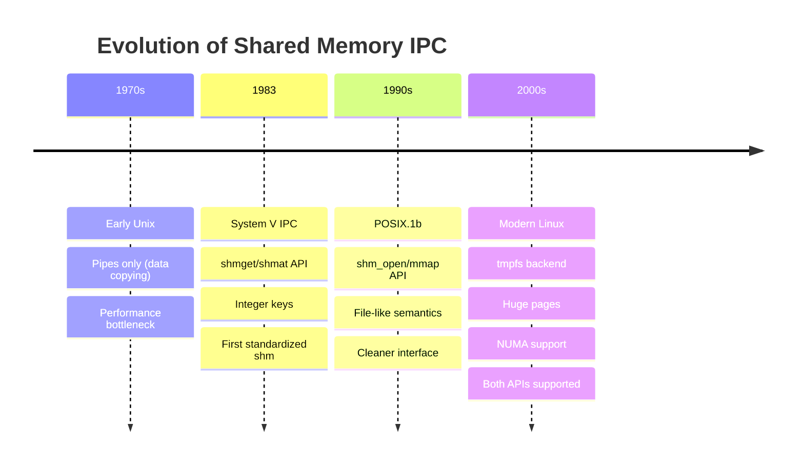

---

## What is Shared Memory?

**Shared Memory** is the fastest IPC mechanism that allows multiple processes to access the same physical memory region, eliminating the need for data copying.

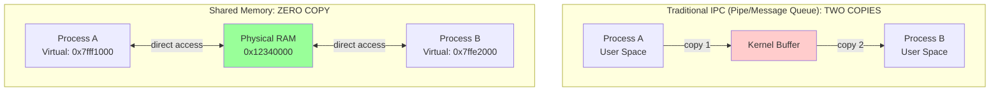

### Key Characteristics

**Speed:**
- **Fastest IPC mechanism** (~20 GB/s vs ~10 GB/s for pipes)
- Zero-copy data sharing
- Direct memory access from user space

**Memory Mapping:**
- Each process sees shared memory at different virtual addresses
- All map to same physical memory location
- Hardware MMU (Memory Management Unit) handles translation

**No Automatic Synchronization:**
- Kernel provides no built-in locking
- **Must use semaphores or mutexes** to prevent race conditions
- Programmer responsible for data consistency

### Performance Comparison


---

## Types of Shared Memory

### 1. POSIX Shared Memory

Modern, file-based API with cleaner semantics.

```c
#include <sys/mman.h>
#include <fcntl.h>

// Create/open shared memory object
int fd = shm_open("/myshm", O_CREAT | O_RDWR, 0666);

// Set size
ftruncate(fd, 4096);

// Map to process memory
void *ptr = mmap(NULL, 4096, PROT_READ | PROT_WRITE, MAP_SHARED, fd, 0);
```

**Features:**
- File-like naming: `/myshm`
- Integrates with `mmap()`
- Lives in `/dev/shm` (tmpfs)
- Cleaner, more portable API

### 2. System V Shared Memory

Traditional Unix API with integer-based keys.

```c
#include <sys/shm.h>

// Create/get shared memory segment
key_t key = ftok("/tmp/myfile", 'A');
int shmid = shmget(key, 4096, IPC_CREAT | 0666);

// Attach to process memory
void *ptr = shmat(shmid, NULL, 0);

// Detach
shmdt(ptr);

// Delete
shmctl(shmid, IPC_RMID, NULL);
```

**Features:**
- Integer key identification
- Older, more widely supported
- Requires explicit cleanup

### 3. Memory-Mapped Files (mmap)

File-backed shared memory.

```c
int fd = open("file.dat", O_RDWR);
void *ptr = mmap(NULL, size, PROT_READ | PROT_WRITE, MAP_SHARED, fd, 0);
```

**Features:**
- Backed by real file on disk
- Changes persist to file
- Can share existing files

### Comparison Table

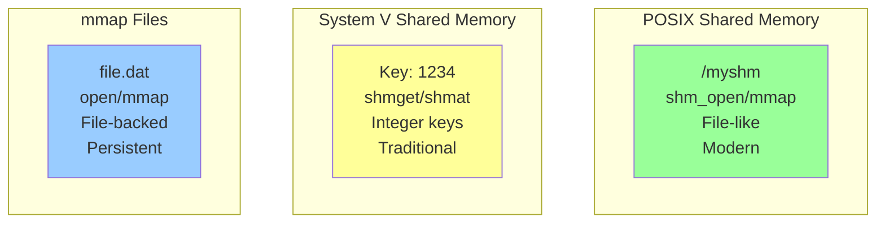

| Feature | POSIX | System V | mmap |
|---------|-------|----------|------|
| **API** | shm_open/mmap | shmget/shmat | open/mmap |
| **Naming** | String ("/name") | Integer key | File path |
| **Cleanup** | shm_unlink | shmctl IPC_RMID | unlink file |
| **Persistence** | Until unlink | Until reboot | File persists |
| **Portability** | Modern Unix | All Unix | All Unix |
| **Ease of Use** | ✅ Easy | ⚠️ Complex | ✅ Easy |

---

## Kernel-Level Architecture

### Virtual Memory to Physical Memory Mapping

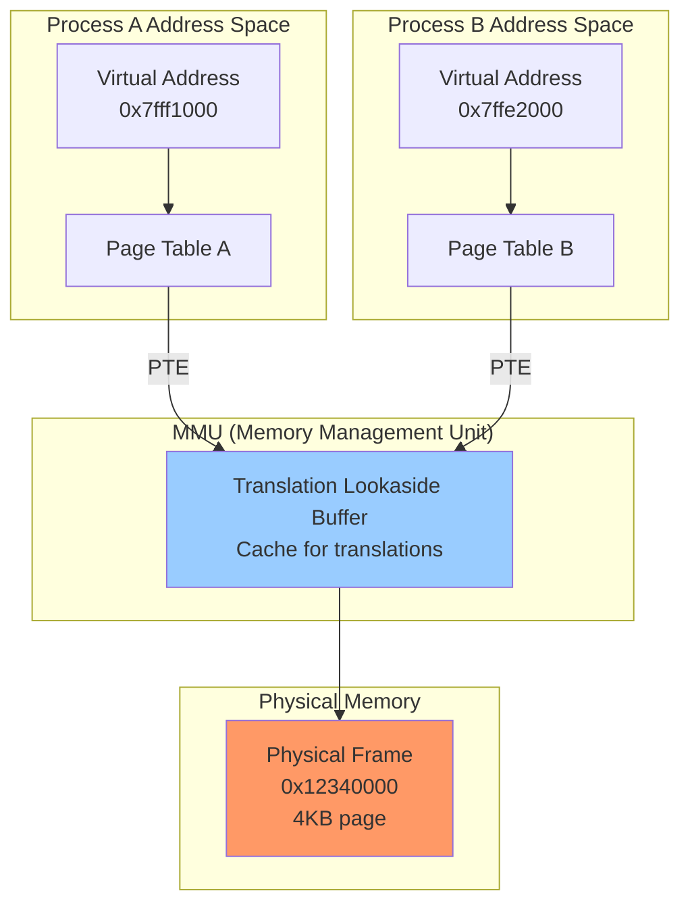

### Memory Hierarchy

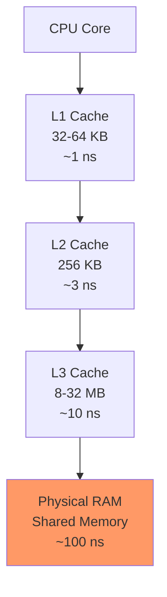

### Page Table Structure

```c
// Simplified Linux page table entry
struct page {
    unsigned long flags;           // Page status flags
    atomic_t _refcount;           // Reference count
    struct address_space *mapping; // Owner (file/shmem)
    void *virtual;                // Virtual address
    struct list_head lru;         // LRU list for eviction
};

// Page Table Entry (x86-64)
typedef struct {
    unsigned long present    : 1;  // Page in memory
    unsigned long rw         : 1;  // Read/Write permission
    unsigned long user       : 1;  // User/Kernel mode
    unsigned long accessed   : 1;  // Accessed flag
    unsigned long dirty      : 1;  // Modified flag
    unsigned long pfn        : 40; // Physical Frame Number
} pte_t;
```

### TLB (Translation Lookaside Buffer)

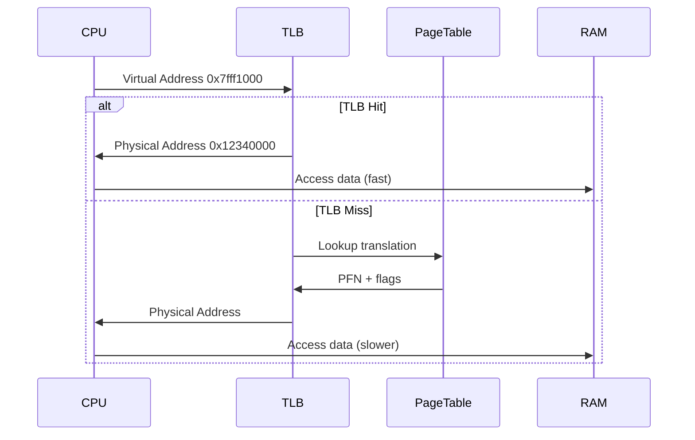

---

## System Calls

### POSIX Shared Memory API

#### 1. `shm_open()` - Create/Open Shared Memory Object

```c
#include <sys/mman.h>
#include <fcntl.h>

int shm_open(const char *name, int oflag, mode_t mode);
```

**Parameters:**
- `name`: Shared memory object name (must start with `/`)
- `oflag`: `O_CREAT`, `O_RDWR`, `O_RDONLY`, `O_EXCL`, `O_TRUNC`
- `mode`: Permissions (e.g., `0666`)

**Returns:** File descriptor on success, -1 on error

**Example:**
```c
int fd = shm_open("/myshm", O_CREAT | O_RDWR, 0666);
if (fd == -1) {
    perror("shm_open");
    exit(1);
}
```

#### 2. `ftruncate()` - Set Size

```c
#include <unistd.h>

int ftruncate(int fd, off_t length);
```

**Must be called after `shm_open()` to allocate memory.**

```c
if (ftruncate(fd, 4096) == -1) {
    perror("ftruncate");
    exit(1);
}
```

#### 3. `mmap()` - Map Memory

```c
void *mmap(void *addr, size_t length, int prot, int flags, int fd, off_t offset);
```

**Parameters:**
- `addr`: `NULL` (let kernel choose)
- `length`: Size to map
- `prot`: `PROT_READ | PROT_WRITE`
- `flags`: `MAP_SHARED` (shared) or `MAP_PRIVATE` (copy-on-write)
- `fd`: File descriptor from `shm_open()`
- `offset`: 0

**Returns:** Pointer to mapped memory, or `MAP_FAILED`

```c
void *ptr = mmap(NULL, 4096, PROT_READ | PROT_WRITE, MAP_SHARED, fd, 0);
if (ptr == MAP_FAILED) {
    perror("mmap");
    exit(1);
}
```

#### 4. `munmap()` - Unmap Memory

```c
int munmap(void *addr, size_t length);
```

```c
munmap(ptr, 4096);
```

#### 5. `shm_unlink()` - Delete Object

```c
int shm_unlink(const char *name);
```

```c
shm_unlink("/myshm");
```

### System V Shared Memory API

#### 1. `ftok()` - Generate Key

```c
#include <sys/ipc.h>

key_t ftok(const char *pathname, int proj_id);
```

```c
key_t key = ftok("/tmp/myfile", 'A');
```

#### 2. `shmget()` - Create/Get Segment

```c
#include <sys/shm.h>

int shmget(key_t key, size_t size, int shmflg);
```

```c
int shmid = shmget(key, 4096, IPC_CREAT | 0666);
```

#### 3. `shmat()` - Attach Segment

```c
void *shmat(int shmid, const void *shmaddr, int shmflg);
```

```c
void *ptr = shmat(shmid, NULL, 0);
```

#### 4. `shmdt()` - Detach Segment

```c
int shmdt(const void *shmaddr);
```

```c
shmdt(ptr);
```

#### 5. `shmctl()` - Control Operations

```c
int shmctl(int shmid, int cmd, struct shmid_ds *buf);
```

```c
shmctl(shmid, IPC_RMID, NULL);  // Delete
```

### System Call Flow

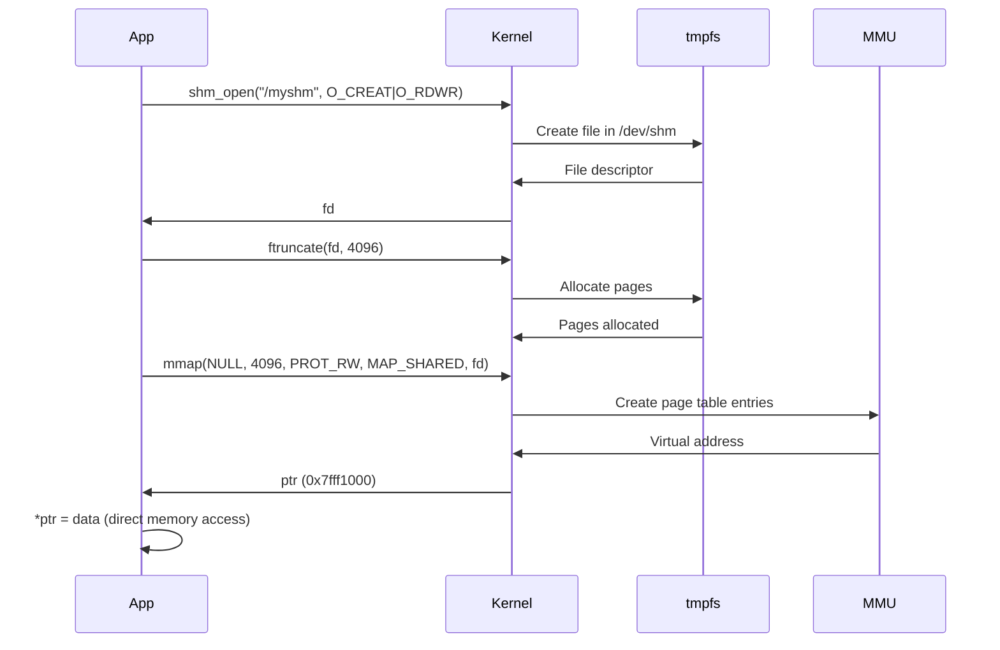

---

## POSIX Shared Memory

### Complete Example: Producer-Consumer

**producer.c:**
```c
#include <stdio.h>
#include <stdlib.h>
#include <string.h>
#include <fcntl.h>
#include <sys/mman.h>
#include <unistd.h>
#include <semaphore.h>

#define SHM_NAME "/demo_shm"
#define SEM_NAME "/demo_sem"
#define SHM_SIZE 4096

int main() {
    // Create shared memory
    int fd = shm_open(SHM_NAME, O_CREAT | O_RDWR, 0666);
    if (fd == -1) {
        perror("shm_open");
        exit(1);
    }

    // Set size
    if (ftruncate(fd, SHM_SIZE) == -1) {
        perror("ftruncate");
        exit(1);
    }

    // Map to memory
    char *ptr = mmap(NULL, SHM_SIZE, PROT_READ | PROT_WRITE, MAP_SHARED, fd, 0);
    if (ptr == MAP_FAILED) {
        perror("mmap");
        exit(1);
    }

    // Create semaphore for synchronization
    sem_t *sem = sem_open(SEM_NAME, O_CREAT, 0666, 1);
    if (sem == SEM_FAILED) {
        perror("sem_open");
        exit(1);
    }

    // Write data with synchronization
    for (int i = 0; i < 10; i++) {
        sem_wait(sem);  // Lock

        sprintf(ptr, "Message %d from PID %d", i, getpid());
        printf("Producer wrote: %s\n", ptr);

        sem_post(sem);  // Unlock
        sleep(1);
    }

    // Cleanup
    sem_close(sem);
    munmap(ptr, SHM_SIZE);
    close(fd);

    printf("Producer done. Press Enter to cleanup...\n");
    getchar();

    sem_unlink(SEM_NAME);
    shm_unlink(SHM_NAME);

    return 0;
}
```

**consumer.c:**
```c
#include <stdio.h>
#include <stdlib.h>
#include <fcntl.h>
#include <sys/mman.h>
#include <unistd.h>
#include <semaphore.h>

#define SHM_NAME "/demo_shm"
#define SEM_NAME "/demo_sem"
#define SHM_SIZE 4096

int main() {
    // Open existing shared memory
    int fd = shm_open(SHM_NAME, O_RDWR, 0666);
    if (fd == -1) {
        perror("shm_open");
        exit(1);
    }

    // Map to memory
    char *ptr = mmap(NULL, SHM_SIZE, PROT_READ | PROT_WRITE, MAP_SHARED, fd, 0);
    if (ptr == MAP_FAILED) {
        perror("mmap");
        exit(1);
    }

    // Open semaphore
    sem_t *sem = sem_open(SEM_NAME, 0);
    if (sem == SEM_FAILED) {
        perror("sem_open");
        exit(1);
    }

    // Read data with synchronization
    for (int i = 0; i < 10; i++) {
        sem_wait(sem);  // Lock

        printf("Consumer read: %s\n", ptr);

        sem_post(sem);  // Unlock
        sleep(1);
    }

    // Cleanup
    sem_close(sem);
    munmap(ptr, SHM_SIZE);
    close(fd);

    return 0;
}
```

**Compile and Run:**
```bash
gcc producer.c -o producer -lrt -lpthread
gcc consumer.c -o consumer -lrt -lpthread

# Terminal 1
./producer

# Terminal 2
./consumer
```

### Shared Structure Example

```c
#include <stdio.h>
#include <sys/mman.h>
#include <fcntl.h>
#include <unistd.h>
#include <string.h>
#include <time.h>

// Shared data structure
struct sensor_data {
    int temperature;
    int humidity;
    double pressure;
    time_t timestamp;
    char location[64];
};

int main() {
    const char *name = "/sensor_shm";

    // Create shared memory
    int fd = shm_open(name, O_CREAT | O_RDWR, 0666);
    ftruncate(fd, sizeof(struct sensor_data));

    // Map structure
    struct sensor_data *data = mmap(NULL, sizeof(struct sensor_data),
                                     PROT_READ | PROT_WRITE, MAP_SHARED, fd, 0);

    // Write sensor data
    data->temperature = 25;
    data->humidity = 60;
    data->pressure = 1013.25;
    data->timestamp = time(NULL);
    strcpy(data->location, "Room 101");

    printf("Sensor data written to shared memory:\n");
    printf("  Temperature: %d°C\n", data->temperature);
    printf("  Humidity: %d%%\n", data->humidity);
    printf("  Pressure: %.2f hPa\n", data->pressure);
    printf("  Location: %s\n", data->location);

    printf("\nPress Enter to exit...\n");
    getchar();

    // Cleanup
    munmap(data, sizeof(struct sensor_data));
    close(fd);
    shm_unlink(name);

    return 0;
}
```

---

## System V Shared Memory

### Complete Example

**sysv_writer.c:**
```c
#include <stdio.h>
#include <stdlib.h>
#include <string.h>
#include <sys/ipc.h>
#include <sys/shm.h>
#include <unistd.h>

#define SHM_SIZE 4096

int main() {
    // Generate key
    key_t key = ftok("/tmp", 'A');
    if (key == -1) {
        perror("ftok");
        exit(1);
    }

    // Create shared memory segment
    int shmid = shmget(key, SHM_SIZE, IPC_CREAT | 0666);
    if (shmid == -1) {
        perror("shmget");
        exit(1);
    }

    printf("Shared memory ID: %d\n", shmid);

    // Attach segment
    char *ptr = (char *)shmat(shmid, NULL, 0);
    if (ptr == (char *)-1) {
        perror("shmat");
        exit(1);
    }

    // Write data
    sprintf(ptr, "Hello from System V shared memory! PID: %d", getpid());
    printf("Written: %s\n", ptr);

    printf("Press Enter to detach and delete...\n");
    getchar();

    // Detach
    shmdt(ptr);

    // Delete segment
    shmctl(shmid, IPC_RMID, NULL);

    return 0;
}
```

**sysv_reader.c:**
```c
#include <stdio.h>
#include <stdlib.h>
#include <sys/ipc.h>
#include <sys/shm.h>

#define SHM_SIZE 4096

int main() {
    // Generate same key
    key_t key = ftok("/tmp", 'A');
    if (key == -1) {
        perror("ftok");
        exit(1);
    }

    // Get existing segment
    int shmid = shmget(key, SHM_SIZE, 0666);
    if (shmid == -1) {
        perror("shmget");
        exit(1);
    }

    // Attach segment
    char *ptr = (char *)shmat(shmid, NULL, 0);
    if (ptr == (char *)-1) {
        perror("shmat");
        exit(1);
    }

    // Read data
    printf("Read: %s\n", ptr);

    // Detach
    shmdt(ptr);

    return 0;
}
```

### Inspecting System V Shared Memory

```bash
# List all shared memory segments
ipcs -m

# Output:
# ------ Shared Memory Segments --------
# key        shmid      owner      perms      bytes      nattch     status
# 0x41000000 12345      user       666        4096       1

# Remove specific segment
ipcrm -m 12345

# Remove all segments owned by user
ipcrm -a
```

---

## Behind the Hood: Kernel Implementation

### Linux Kernel: mm/shmem.c and ipc/shm.c

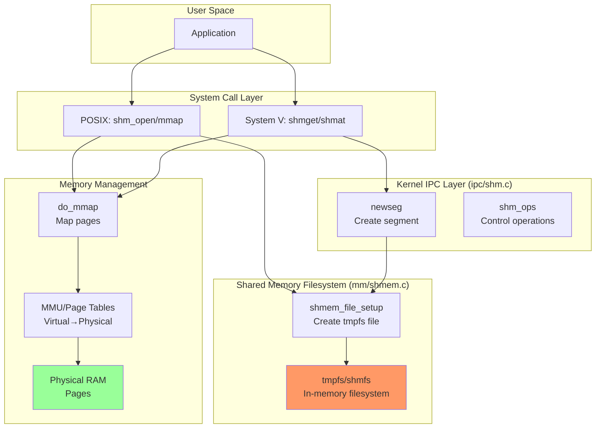

### Kernel Data Structures

**POSIX Shared Memory (tmpfs):**
```c
// mm/shmem.c - tmpfs inode information
struct shmem_inode_info {
    spinlock_t          lock;
    unsigned int        seals;          // F_SEAL_* flags
    unsigned long       flags;
    unsigned long       alloced;        // Pages allocated
    unsigned long       swapped;        // Pages swapped
    struct shared_policy policy;        // NUMA policy
    struct list_head    shrinklist;     // For memory reclaim
    struct list_head    swaplist;
    struct simple_xattrs xattrs;        // Extended attributes
    struct inode        vfs_inode;
};

// File operations for shmem
static const struct file_operations shmem_file_operations = {
    .mmap           = shmem_mmap,
    .get_unmapped_area = shmem_get_unmapped_area,
    .llseek         = shmem_file_llseek,
    .read_iter      = shmem_file_read_iter,
    .write_iter     = generic_file_write_iter,
    .fsync          = noop_fsync,
    .splice_read    = generic_file_splice_read,
    .splice_write   = iter_file_splice_write,
    .fallocate      = shmem_fallocate,
};
```

**System V Shared Memory:**
```c
// ipc/shm.c - System V shared memory segment
struct shmid_kernel {
    struct kern_ipc_perm    shm_perm;   // Permissions
    struct file            *shm_file;    // Backing tmpfs file
    unsigned long           shm_nattch;  // # attached processes
    unsigned long           shm_segsz;   // Segment size
    time64_t                shm_atim;    // Last attach time
    time64_t                shm_dtim;    // Last detach time
    time64_t                shm_ctim;    // Last change time
    struct pid             *shm_cprid;   // Creator PID
    struct pid             *shm_lprid;   // Last attach/detach PID
    struct ucounts         *mlock_ucounts;
};

// System V operations
static const struct vm_operations_struct shm_vm_ops = {
    .open   = shm_open,     // Called when process attaches
    .close  = shm_close,    // Called when process detaches
    .fault  = shm_fault,    // Handle page faults
};
```

### Kernel Implementation Flow

#### POSIX shm_open() Flow

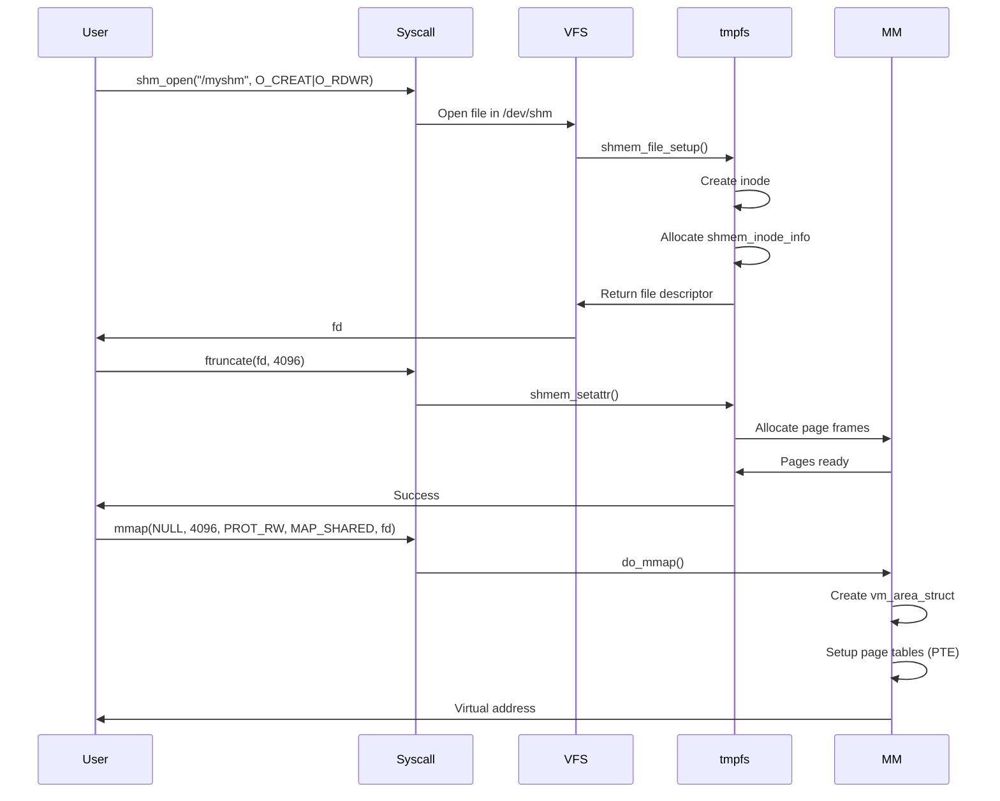

#### System V shmget() Flow

```c
// ipc/shm.c - Create new segment
static int newseg(struct ipc_namespace *ns, struct ipc_params *params)
{
    key_t key = params->key;
    int shmflg = params->flg;
    size_t size = params->u.size;
    int error;
    struct shmid_kernel *shp;
    size_t numpages = (size + PAGE_SIZE - 1) >> PAGE_SHIFT;
    struct file *file;
    char name[13];

    // Allocate segment structure
    shp = kmalloc(sizeof(*shp), GFP_KERNEL);
    if (!shp)
        return -ENOMEM;

    // Create backing file in tmpfs
    sprintf(name, "SYSV%08x", key);
    file = shmem_kernel_file_setup(name, size, VM_NORESERVE);
    if (IS_ERR(file)) {
        kfree(shp);
        return PTR_ERR(file);
    }

    // Initialize segment
    shp->shm_perm.key = key;
    shp->shm_perm.mode = (shmflg & S_IRWXUGO);
    shp->shm_file = file;
    shp->shm_segsz = size;
    shp->shm_nattch = 0;
    shp->shm_atim = shp->shm_dtim = 0;
    shp->shm_ctim = ktime_get_real_seconds();

    // Add to IPC namespace
    error = ipc_addid(&shm_ids(ns), &shp->shm_perm, ns->shm_ctlmni);

    return error < 0 ? error : shp->shm_perm.id;
}
```

### Page Fault Handling

When a process first accesses shared memory, a page fault occurs:

```c
// mm/memory.c - Simplified page fault handler
static vm_fault_t do_fault(struct vm_fault *vmf)
{
    struct vm_area_struct *vma = vmf->vma;
    vm_fault_t ret;

    // Check if page is already in memory
    if (pte_present(*vmf->pte))
        return 0;  // Already mapped

    // Call filesystem-specific fault handler
    ret = vma->vm_ops->fault(vmf);

    // Map page into process page table
    if (!(ret & VM_FAULT_ERROR)) {
        struct page *page = vmf->page;
        pte_t entry = mk_pte(page, vma->vm_page_prot);
        set_pte_at(vma->vm_mm, vmf->address, vmf->pte, entry);
    }

    return ret;
}
```

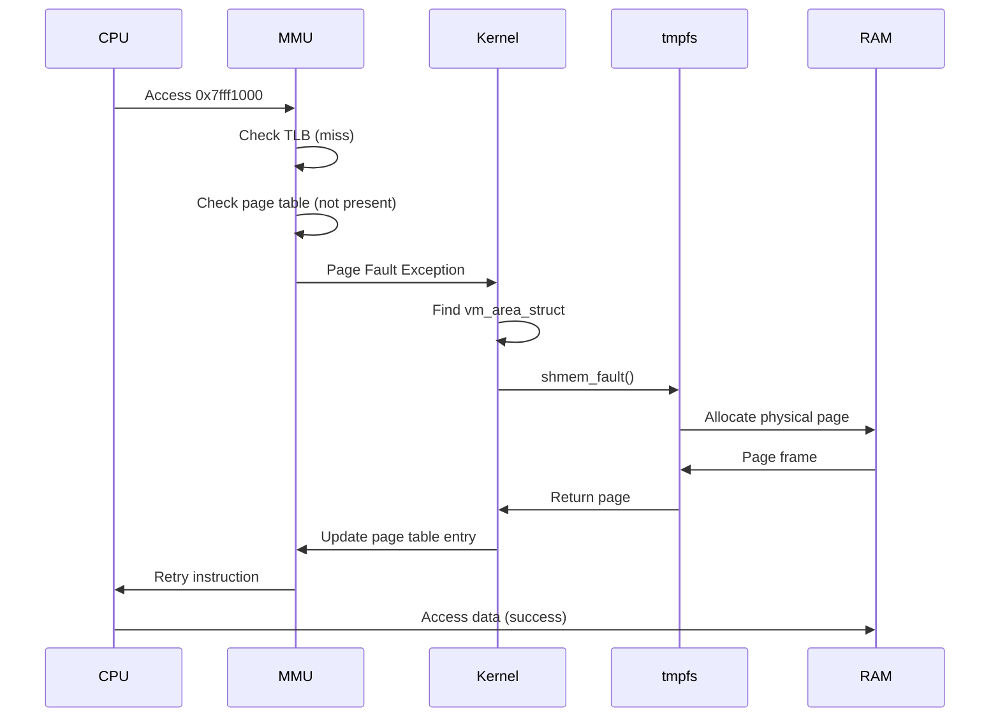

---

## Buffer Management

### Page Allocation and Management

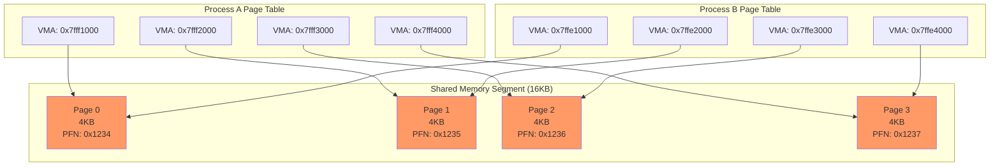

### Memory Allocation Strategies

**Demand Paging:**
```c
// Pages allocated only when accessed (lazy allocation)
int fd = shm_open("/myshm", O_CREAT | O_RDWR, 0666);
ftruncate(fd, 1024 * 1024);  // Reserve 1MB
void *ptr = mmap(NULL, 1024 * 1024, PROT_READ | PROT_WRITE, MAP_SHARED, fd, 0);

// No physical memory allocated yet!
// Pages allocated on first access (page fault)
ptr[0] = 'A';  // Triggers page fault, allocates first 4KB page
ptr[4096] = 'B';  // Triggers page fault, allocates second page
```

**Pre-allocation:**
```c
// Force immediate allocation with MAP_POPULATE
void *ptr = mmap(NULL, size, PROT_READ | PROT_WRITE,
                 MAP_SHARED | MAP_POPULATE, fd, 0);
// All pages allocated immediately
```

### Huge Pages Support

**Transparent Huge Pages (THP):**
```c
// Use 2MB huge pages instead of 4KB pages
// Reduces TLB misses, improves performance

// Enable via kernel parameter or runtime
// /sys/kernel/mm/transparent_hugepage/enabled = always

// Huge page aligned allocation
size_t size = 2 * 1024 * 1024;  // 2MB
void *ptr = mmap(NULL, size, PROT_READ | PROT_WRITE,
                 MAP_SHARED | MAP_HUGETLB, fd, 0);
```

**Performance Impact:**

| Page Size | TLB Entries | Memory Coverage | TLB Misses |
|-----------|-------------|-----------------|------------|
| 4KB | 512 | 2MB | High |
| 2MB (Huge) | 512 | 1GB | Low |

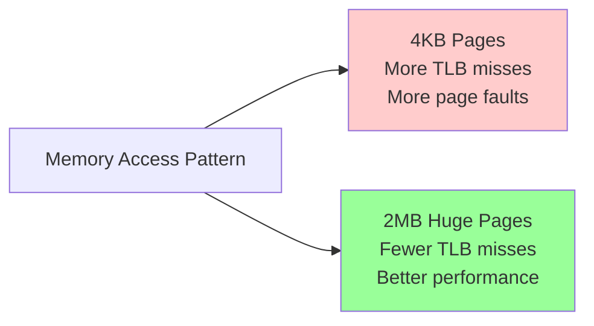

### Cache Coherency

Modern CPUs maintain cache coherency automatically using MESI protocol:

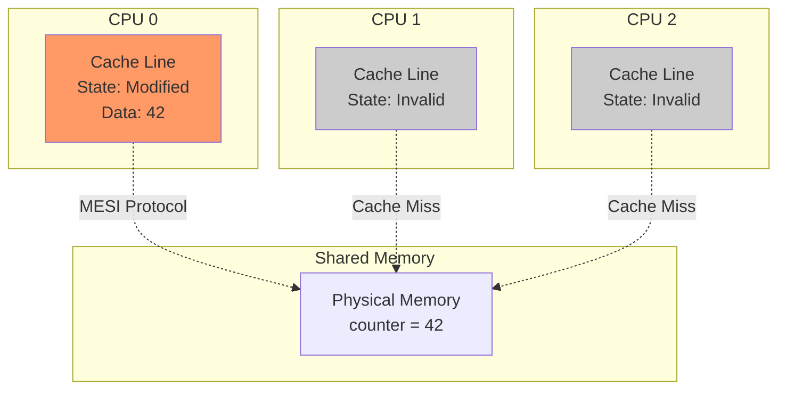

---

## Blocking vs Non-Blocking Operations

### Shared Memory is Always Non-Blocking

Unlike pipes or message queues, **shared memory access never blocks** - it's just memory access.

```c
// This NEVER blocks - it's a direct memory write
*shared_ptr = 42;

// This NEVER blocks - it's a direct memory read
int value = *shared_ptr;
```

### Synchronization for Blocking Behavior

To implement blocking/waiting, use semaphores:

```c
sem_t *sem = sem_open("/mysem", O_CREAT, 0666, 0);

// Writer: signal when data ready
*shared_ptr = 42;
sem_post(sem);  // Wake up reader

// Reader: block until data ready
sem_wait(sem);  // BLOCKS here until writer signals
int value = *shared_ptr;
```

### Lock-Free Programming

Advanced technique using atomic operations:

```c
#include <stdatomic.h>

typedef struct {
    atomic_int counter;
    atomic_flag lock;
} shared_data_t;

// Atomic increment (no lock needed)
void increment(shared_data_t *data) {
    atomic_fetch_add(&data->counter, 1);
}

// Spinlock (busy-wait, non-blocking)
void acquire_lock(shared_data_t *data) {
    while (atomic_flag_test_and_set(&data->lock)) {
        // Spin (busy-wait)
    }
}

void release_lock(shared_data_t *data) {
    atomic_flag_clear(&data->lock);
}
```

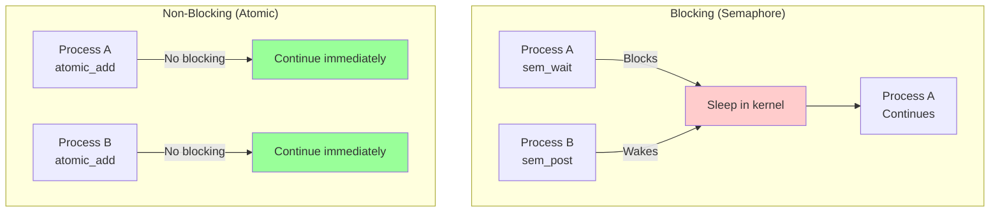

---

## Real-World Usage

### 1. PostgreSQL Shared Buffer Pool

PostgreSQL uses System V shared memory for its buffer pool, caching frequently accessed database pages.

**Architecture:**

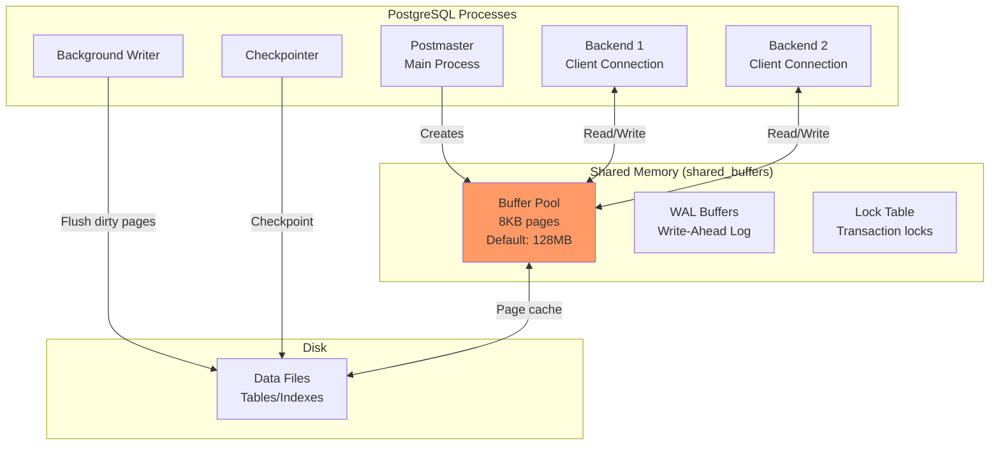

**Implementation Details:**

Source: `src/backend/storage/buffer/buf_init.c`

```c
// PostgreSQL buffer descriptor (simplified)
typedef struct BufferDesc {
    BufferTag   tag;            // Which page (relation, block#)
    int         buf_id;         // Buffer pool index
    pg_atomic_uint32 state;     // Flags and refcount
    int         wait_backend_pid;
    slock_t     buf_hdr_lock;   // Spinlock
    uint32      usage_count;    // For eviction policy
    uint32      flags;
} BufferDesc;

// Buffer pool initialization
void InitBufferPool(void)
{
    bool foundBufs, foundDescs, foundIOCV;

    // Allocate buffer descriptors in shared memory
    BufferDescriptors = (BufferDescPadded *)
        ShmemInitStruct("Buffer Descriptors",
                        NBuffers * sizeof(BufferDescPadded),
                        &foundDescs);

    // Allocate buffer blocks (actual data pages)
    BufferBlocks = (char *)
        ShmemInitStruct("Buffer Blocks",
                        NBuffers * (Size) BLCKSZ,
                        &foundBufs);

    // Initialize each buffer descriptor
    for (int i = 0; i < NBuffers; i++) {
        BufferDesc *buf = GetBufferDescriptor(i);
        CLEAR_BUFFERTAG(buf->tag);
        pg_atomic_init_u32(&buf->state, 0);
        buf->wait_backend_pid = 0;
        SpinLockInit(&buf->buf_hdr_lock);
    }
}
```

**Configuration:**

```sql
-- Show shared_buffers setting
SHOW shared_buffers;
-- Default: 128MB (for small installations)
-- Recommended: 25% of system RAM

-- postgresql.conf
shared_buffers = 4GB
```

**Performance Impact:**

| shared_buffers | Cache Hit Ratio | Query Performance |
|----------------|-----------------|-------------------|
| 128MB | ~85% | Baseline |
| 1GB | ~95% | 2-3x faster |
| 4GB | ~98% | 5-10x faster |

**References:**
- PostgreSQL Buffer Management: https://www.interdb.jp/pg/pgsql08.html
- Source Code: https://doxygen.postgresql.org/buf__init_8c_source.html
- Shared Buffers Guide: https://minervadb.xyz/understanding-shared-buffers-implementation-in-postgresql/

### 2. Redis Persistence (RDB)

Redis uses `fork()` with copy-on-write shared memory for efficient snapshots.

**Architecture:**

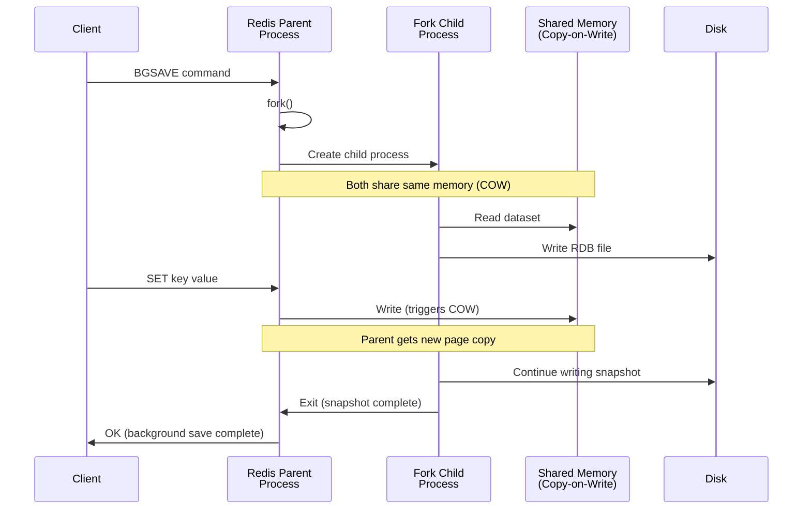

**Implementation:**

```c
// Redis RDB save (simplified)
int rdbSaveBackground(char *filename) {
    pid_t childpid;

    // Fork child process
    if ((childpid = fork()) == 0) {
        // Child process: save dataset to disk
        closeListeningSockets(0);
        redisSetProcTitle("redis-rdb-bgsave");

        // Read from shared memory, write to RDB file
        retval = rdbSave(filename);

        exitFromChild((retval == C_OK) ? 0 : 1);
    } else {
        // Parent process: continue serving clients
        server.rdb_save_time_start = time(NULL);
        server.rdb_child_pid = childpid;
        server.rdb_child_type = RDB_CHILD_TYPE_DISK;
        return C_OK;
    }
}
```

**Copy-on-Write Benefits:**

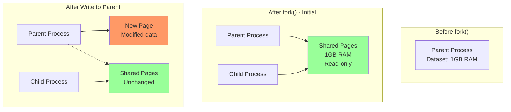

**Memory Efficiency:**

Without COW:
- Parent: 1GB
- Child copy: 1GB
- **Total: 2GB**

With COW:
- Shared: 1GB
- Modified pages: ~50MB (typical)
- **Total: 1.05GB** (20x more efficient!)

**References:**
- Redis Persistence: https://redis.io/docs/latest/operate/oss_and_stack/management/persistence/
- RDB Implementation: https://leapcell.medium.com/redis-persistence-explained-aof-rdb-f2c37a7b197b

### 3. NGINX Worker Processes

NGINX uses shared memory for SSL session cache, connection limiting, and zone statistics.

**Architecture:**

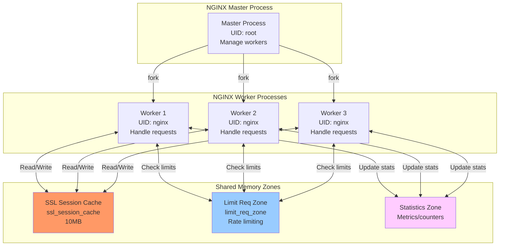

**Configuration:**

```nginx
http {
    # SSL session cache in shared memory
    ssl_session_cache shared:SSL:10m;
    ssl_session_timeout 10m;

    # Rate limiting zone
    limit_req_zone $binary_remote_addr zone=one:10m rate=1r/s;

    # Statistics zone
    proxy_cache_path /var/cache/nginx levels=1:2
                     keys_zone=my_cache:10m max_size=1g;

    server {
        listen 443 ssl;

        # Use shared SSL cache
        ssl_certificate /etc/nginx/cert.pem;
        ssl_certificate_key /etc/nginx/key.pem;

        location / {
            # Apply rate limit
            limit_req zone=one burst=5;
            proxy_pass http://backend;
        }
    }
}
```

**Implementation (simplified):**

```c
// nginx/src/core/ngx_shmtx.c - Shared memory mutex
typedef struct {
    ngx_atomic_t   lock;
    ngx_atomic_t   wait;
} ngx_shmtx_t;

// nginx/src/event/ngx_event.c - SSL session cache
typedef struct {
    ngx_rbtree_t       rbtree;      // Red-black tree for sessions
    ngx_rbtree_node_t  sentinel;
    ngx_queue_t        expire_queue; // LRU queue
} ngx_ssl_session_cache_t;

// Allocate shared memory zone
ngx_shm_zone_t *
ngx_shared_memory_add(ngx_conf_t *cf, ngx_str_t *name, size_t size, void *tag)
{
    ngx_shm_zone_t  *shm_zone;

    // Create shared memory segment
    shm_zone = ngx_list_push(&cf->cycle->shared_memory);
    shm_zone->shm.size = size;
    shm_zone->shm.name = *name;

    return shm_zone;
}
```

**References:**
- NGINX Shared Memory: https://nginx.org/en/docs/ngx_core_module.html#shared_memory
- SSL Session Cache: https://nginx.org/en/docs/http/ngx_http_ssl_module.html#ssl_session_cache

### 4. X Window System (X11)

X11 uses MIT-SHM extension for fast image transfer between client and X server.

**Architecture:**

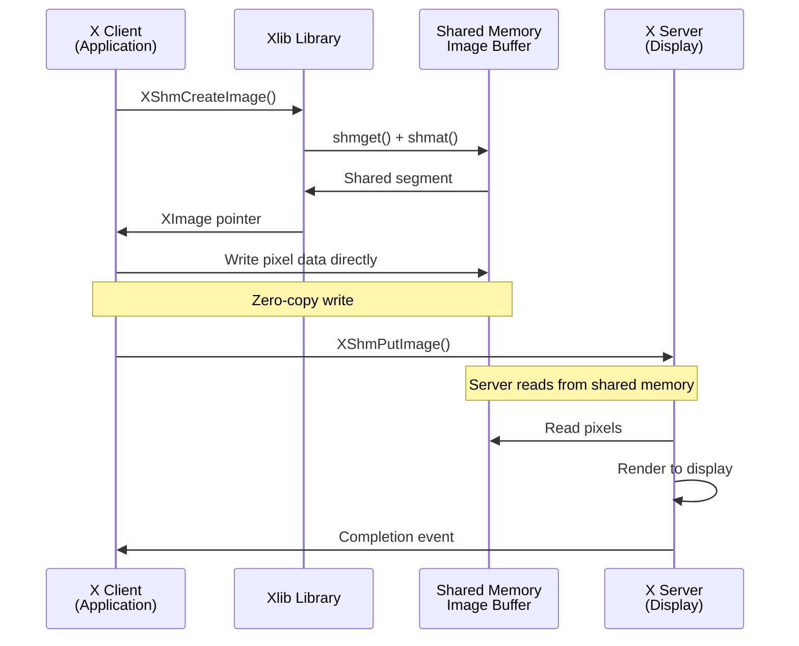

**Traditional vs MIT-SHM:**

```c
// Traditional (SLOW - data copied twice)
XImage *img = XCreateImage(display, visual, depth, format, ...);
// Copy 1: App memory -> XImage
memcpy(img->data, pixels, size);
// Copy 2: XImage -> X Server (via socket)
XPutImage(display, window, gc, img, 0, 0, x, y, width, height);

// MIT-SHM (FAST - zero copy)
XShmSegmentInfo shminfo;
XImage *img = XShmCreateImage(display, visual, depth, format, NULL, &shminfo, width, height);
shminfo.shmid = shmget(IPC_PRIVATE, img->bytes_per_line * height, IPC_CREAT | 0777);
shminfo.shmaddr = img->data = shmat(shminfo.shmid, 0, 0);
shminfo.readOnly = False;

// Attach to X server
XShmAttach(display, &shminfo);

// Write directly to shared memory (zero copy)
memcpy(img->data, pixels, size);

// Server reads from shared memory (zero copy)
XShmPutImage(display, window, gc, img, 0, 0, x, y, width, height, False);
```

**Performance:**

| Method | Data Copies | 1920x1080 Frame Time | FPS |
|--------|-------------|----------------------|-----|
| XPutImage | 2 copies | ~16ms | ~60 FPS |
| XShmPutImage | 0 copies | ~2ms | ~500 FPS |

### 5. Database Systems (General)

Most database systems use shared memory extensively:

**MySQL/InnoDB Buffer Pool:**
```
[mysqld]
innodb_buffer_pool_size = 8G  # Shared buffer cache
innodb_buffer_pool_instances = 8  # Parallel regions
```

**Oracle SGA (System Global Area):**
- Buffer Cache: Data blocks
- Shared Pool: SQL statements, PL/SQL
- Redo Log Buffer: Transaction logs
- Large Pool: Backup, parallel execution

```mermaid
graph TB
    subgraph "Oracle Instance"
        PROC1[Process 1]
        PROC2[Process 2]
        PROC3[Process 3]
    end

    subgraph "SGA (Shared Memory)"
        BC[Buffer Cache<br/>Data blocks]
        SP[Shared Pool<br/>SQL/PL SQL]
        REDO[Redo Log Buffer<br/>Transactions]
    end

    subgraph "Disk"
        DATAFILES[Data Files]
        LOGFILES[Redo Logs]
    end

    PROC1 <--> BC
    PROC2 <--> BC
    PROC3 <--> BC

    PROC1 <--> SP
    PROC2 <--> SP

    BC <--> DATAFILES
    REDO <--> LOGFILES

    style BC fill:#f96
    style SP fill:#9cf
    style REDO fill:#fcf
```

### 6. High-Performance Computing (HPC)

MPI (Message Passing Interface) uses shared memory for intra-node communication:

```c
// MPI with shared memory window
#include <mpi.h>

int main(int argc, char **argv) {
    MPI_Win win;
    int *shared_array;
    int rank, size;

    MPI_Init(&argc, &argv);
    MPI_Comm_rank(MPI_COMM_WORLD, &rank);
    MPI_Comm_size(MPI_COMM_WORLD, &size);

    // Create shared memory window
    MPI_Win_allocate_shared(1024 * sizeof(int), sizeof(int),
                            MPI_INFO_NULL, MPI_COMM_WORLD,
                            &shared_array, &win);

    // All processes can access shared_array directly
    if (rank == 0) {
        shared_array[0] = 42;
    }

    MPI_Win_fence(0, win);  // Synchronize

    printf("Rank %d: shared_array[0] = %d\n", rank, shared_array[0]);

    MPI_Win_free(&win);
    MPI_Finalize();
    return 0;
}
```

---

## Practical Examples

### Example 1: Race Condition Demonstration

**race_demo.c:**
```c
#include <stdio.h>
#include <stdlib.h>
#include <sys/mman.h>
#include <fcntl.h>
#include <unistd.h>
#include <sys/wait.h>

int main() {
    const char *name = "/race_shm";

    // Create shared memory
    int fd = shm_open(name, O_CREAT | O_RDWR, 0666);
    ftruncate(fd, sizeof(int));

    int *counter = mmap(NULL, sizeof(int), PROT_READ | PROT_WRITE, MAP_SHARED, fd, 0);
    *counter = 0;

    printf("Starting race condition demo...\n");
    printf("Expected final value: 2000\n\n");

    // Create 2 child processes
    for (int i = 0; i < 2; i++) {
        if (fork() == 0) {
            // Child: increment counter 1000 times
            for (int j = 0; j < 1000; j++) {
                (*counter)++;  // RACE CONDITION!
            }
            printf("Child %d finished\n", i);
            exit(0);
        }
    }

    // Wait for children
    wait(NULL);
    wait(NULL);

    printf("\nFinal counter value: %d\n", *counter);
    printf("Lost updates: %d\n", 2000 - *counter);

    // Cleanup
    munmap(counter, sizeof(int));
    close(fd);
    shm_unlink(name);

    return 0;
}
```

**Output:**
```
Starting race condition demo...
Expected final value: 2000

Child 0 finished
Child 1 finished

Final counter value: 1523
Lost updates: 477
```

### Example 2: Fixed with Semaphore

**race_fixed.c:**
```c
#include <stdio.h>
#include <stdlib.h>
#include <sys/mman.h>
#include <fcntl.h>
#include <semaphore.h>
#include <unistd.h>
#include <sys/wait.h>

int main() {
    const char *shm_name = "/sync_shm";
    const char *sem_name = "/sync_sem";

    // Create shared memory
    int fd = shm_open(shm_name, O_CREAT | O_RDWR, 0666);
    ftruncate(fd, sizeof(int));
    int *counter = mmap(NULL, sizeof(int), PROT_READ | PROT_WRITE, MAP_SHARED, fd, 0);
    *counter = 0;

    // Create semaphore (initial value = 1, acts as mutex)
    sem_t *sem = sem_open(sem_name, O_CREAT, 0666, 1);

    printf("Starting synchronized demo...\n");
    printf("Expected final value: 2000\n\n");

    // Create 2 child processes
    for (int i = 0; i < 2; i++) {
        if (fork() == 0) {
            // Child: increment counter 1000 times with protection
            for (int j = 0; j < 1000; j++) {
                sem_wait(sem);      // Lock (P operation)
                (*counter)++;       // Critical section
                sem_post(sem);      // Unlock (V operation)
            }
            printf("Child %d finished\n", i);
            exit(0);
        }
    }

    // Wait for children
    wait(NULL);
    wait(NULL);

    printf("\nFinal counter value: %d\n", *counter);
    printf("Lost updates: %d\n", 2000 - *counter);

    // Cleanup
    sem_close(sem);
    sem_unlink(sem_name);
    munmap(counter, sizeof(int));
    close(fd);
    shm_unlink(shm_name);

    return 0;
}
```

**Output:**
```
Starting synchronized demo...
Expected final value: 2000

Child 0 finished
Child 1 finished

Final counter value: 2000
Lost updates: 0
```

### Example 3: Producer-Consumer with Circular Buffer

**circular_buffer.h:**
```c
#ifndef CIRCULAR_BUFFER_H
#define CIRCULAR_BUFFER_H

#include <semaphore.h>

#define BUFFER_SIZE 10

typedef struct {
    int buffer[BUFFER_SIZE];
    int head;  // Write position
    int tail;  // Read position
    sem_t mutex;      // Protects buffer
    sem_t empty;      // Counts empty slots
    sem_t full;       // Counts full slots
} circular_buffer_t;

void buffer_init(circular_buffer_t *cb);
void buffer_produce(circular_buffer_t *cb, int item);
int buffer_consume(circular_buffer_t *cb);

#endif
```

**circular_buffer.c:**
```c
#include "circular_buffer.h"
#include <stdio.h>

void buffer_init(circular_buffer_t *cb) {
    cb->head = 0;
    cb->tail = 0;
    sem_init(&cb->mutex, 1, 1);         // Binary semaphore (mutex)
    sem_init(&cb->empty, 1, BUFFER_SIZE); // Initially all empty
    sem_init(&cb->full, 1, 0);           // Initially none full
}

void buffer_produce(circular_buffer_t *cb, int item) {
    sem_wait(&cb->empty);  // Wait for empty slot
    sem_wait(&cb->mutex);  // Lock buffer

    cb->buffer[cb->head] = item;
    cb->head = (cb->head + 1) % BUFFER_SIZE;
    printf("Produced: %d\n", item);

    sem_post(&cb->mutex);  // Unlock buffer
    sem_post(&cb->full);   // Signal item available
}

int buffer_consume(circular_buffer_t *cb) {
    sem_wait(&cb->full);   // Wait for full slot
    sem_wait(&cb->mutex);  // Lock buffer

    int item = cb->buffer[cb->tail];
    cb->tail = (cb->tail + 1) % BUFFER_SIZE;
    printf("Consumed: %d\n", item);

    sem_post(&cb->mutex);  // Unlock buffer
    sem_post(&cb->empty);  // Signal slot available

    return item;
}
```

**main.c:**
```c
#include <stdio.h>
#include <stdlib.h>
#include <sys/mman.h>
#include <fcntl.h>
#include <unistd.h>
#include <sys/wait.h>
#include "circular_buffer.h"

int main() {
    // Create shared memory for buffer
    int fd = shm_open("/circ_buf", O_CREAT | O_RDWR, 0666);
    ftruncate(fd, sizeof(circular_buffer_t));

    circular_buffer_t *cb = mmap(NULL, sizeof(circular_buffer_t),
                                  PROT_READ | PROT_WRITE, MAP_SHARED, fd, 0);

    buffer_init(cb);

    // Fork producer
    if (fork() == 0) {
        for (int i = 0; i < 20; i++) {
            buffer_produce(cb, i);
            usleep(100000);  // 100ms
        }
        exit(0);
    }

    // Fork consumer
    if (fork() == 0) {
        for (int i = 0; i < 20; i++) {
            buffer_consume(cb);
            usleep(150000);  // 150ms (slower than producer)
        }
        exit(0);
    }

    // Wait for both
    wait(NULL);
    wait(NULL);

    // Cleanup
    munmap(cb, sizeof(circular_buffer_t));
    close(fd);
    shm_unlink("/circ_buf");

    return 0;
}
```

### Example 4: Matrix Multiplication (Parallel)

**parallel_matrix.c:**
```c
#include <stdio.h>
#include <stdlib.h>
#include <sys/mman.h>
#include <fcntl.h>
#include <unistd.h>
#include <sys/wait.h>
#include <time.h>

#define N 100  // Matrix size

typedef struct {
    int A[N][N];
    int B[N][N];
    int C[N][N];
} matrices_t;

void compute_row(matrices_t *m, int row) {
    for (int j = 0; j < N; j++) {
        m->C[row][j] = 0;
        for (int k = 0; k < N; k++) {
            m->C[row][j] += m->A[row][k] * m->B[k][j];
        }
    }
}

int main() {
    // Create shared memory
    int fd = shm_open("/matrix_shm", O_CREAT | O_RDWR, 0666);
    ftruncate(fd, sizeof(matrices_t));

    matrices_t *m = mmap(NULL, sizeof(matrices_t),
                         PROT_READ | PROT_WRITE, MAP_SHARED, fd, 0);

    // Initialize matrices A and B
    srand(time(NULL));
    for (int i = 0; i < N; i++) {
        for (int j = 0; j < N; j++) {
            m->A[i][j] = rand() % 10;
            m->B[i][j] = rand() % 10;
        }
    }

    printf("Computing %dx%d matrix multiplication with %d processes...\n", N, N, 4);

    clock_t start = clock();

    // Create 4 worker processes
    int rows_per_process = N / 4;
    for (int p = 0; p < 4; p++) {
        if (fork() == 0) {
            // Child: compute assigned rows
            int start_row = p * rows_per_process;
            int end_row = (p == 3) ? N : (p + 1) * rows_per_process;

            for (int i = start_row; i < end_row; i++) {
                compute_row(m, i);
            }

            printf("Process %d: rows %d-%d done\n", p, start_row, end_row - 1);
            exit(0);
        }
    }

    // Wait for all workers
    for (int i = 0; i < 4; i++) {
        wait(NULL);
    }

    clock_t end = clock();
    double cpu_time = ((double)(end - start)) / CLOCKS_PER_SEC;

    printf("Computation complete in %.3f seconds\n", cpu_time);

    // Verify a sample result
    printf("Sample: C[0][0] = %d\n", m->C[0][0]);

    // Cleanup
    munmap(m, sizeof(matrices_t));
    close(fd);
    shm_unlink("/matrix_shm");

    return 0;
}
```

---

## Advanced Concepts

### 1. Memory-Mapped Files for IPC

Combine shared memory with persistent storage:

```c
#include <stdio.h>
#include <stdlib.h>
#include <sys/mman.h>
#include <fcntl.h>
#include <unistd.h>
#include <string.h>

typedef struct {
    int version;
    char data[1024];
} persistent_data_t;

int main() {
    const char *filename = "shared_data.bin";

    // Create or open file
    int fd = open(filename, O_CREAT | O_RDWR, 0666);

    // Set file size
    ftruncate(fd, sizeof(persistent_data_t));

    // Map file to memory
    persistent_data_t *data = mmap(NULL, sizeof(persistent_data_t),
                                   PROT_READ | PROT_WRITE, MAP_SHARED, fd, 0);

    // Update data (changes persist to file!)
    data->version++;
    snprintf(data->data, sizeof(data->data), "Updated at %ld", time(NULL));

    // Force write to disk
    msync(data, sizeof(persistent_data_t), MS_SYNC);

    printf("Version: %d\n", data->version);
    printf("Data: %s\n", data->data);

    munmap(data, sizeof(persistent_data_t));
    close(fd);

    return 0;
}
```

### 2. NUMA-Aware Allocation

On multi-socket systems, allocate shared memory on specific NUMA nodes:

```c
#include <numaif.h>
#include <numa.h>

void *allocate_numa_shm(size_t size, int node) {
    // Allocate on specific NUMA node
    void *ptr = mmap(NULL, size, PROT_READ | PROT_WRITE,
                     MAP_SHARED | MAP_ANONYMOUS, -1, 0);

    // Bind to NUMA node
    unsigned long nodemask = 1UL << node;
    mbind(ptr, size, MPOL_BIND, &nodemask, sizeof(nodemask) * 8, MPOL_MF_MOVE);

    return ptr;
}
```

### 3. Copy-on-Write (COW) Semantics

Use MAP_PRIVATE for copy-on-write sharing:

```c
// Shared read, private writes
void *ptr = mmap(NULL, size, PROT_READ | PROT_WRITE, MAP_PRIVATE, fd, 0);

// Read: shared (efficient)
int value = *(int *)ptr;

// Write: triggers COW, creates private copy
*(int *)ptr = 42;  // Only this process sees the change
```

### 4. Huge Pages for Performance

```c
#include <sys/mman.h>

#define HUGE_PAGE_SIZE (2 * 1024 * 1024)  // 2MB

void *allocate_huge_pages(size_t size) {
    // Align size to huge page boundary
    size = ((size + HUGE_PAGE_SIZE - 1) / HUGE_PAGE_SIZE) * HUGE_PAGE_SIZE;

    // Allocate with huge pages
    void *ptr = mmap(NULL, size, PROT_READ | PROT_WRITE,
                     MAP_SHARED | MAP_ANONYMOUS | MAP_HUGETLB, -1, 0);

    if (ptr == MAP_FAILED) {
        perror("mmap with MAP_HUGETLB");
        return NULL;
    }

    return ptr;
}
```

**Performance Comparison:**

```c
#include <time.h>

void benchmark_page_size() {
    const size_t SIZE = 1024 * 1024 * 1024;  // 1GB

    // 4KB pages
    clock_t start = clock();
    void *small = mmap(NULL, SIZE, PROT_READ | PROT_WRITE,
                       MAP_SHARED | MAP_ANONYMOUS, -1, 0);
    for (size_t i = 0; i < SIZE; i += 4096) {
        ((char *)small)[i] = 1;  // Touch each page
    }
    clock_t end = clock();
    printf("4KB pages: %.3f seconds\n", (double)(end - start) / CLOCKS_PER_SEC);

    // 2MB huge pages
    start = clock();
    void *huge = mmap(NULL, SIZE, PROT_READ | PROT_WRITE,
                      MAP_SHARED | MAP_ANONYMOUS | MAP_HUGETLB, -1, 0);
    for (size_t i = 0; i < SIZE; i += 4096) {
        ((char *)huge)[i] = 1;
    }
    end = clock();
    printf("2MB pages: %.3f seconds\n", (double)(end - start) / CLOCKS_PER_SEC);

    munmap(small, SIZE);
    munmap(huge, SIZE);
}
```

### 5. Lock-Free Ring Buffer

High-performance single-producer, single-consumer ring buffer:

```c
#include <stdatomic.h>

typedef struct {
    atomic_size_t head;
    atomic_size_t tail;
    size_t capacity;
    char data[];
} lockfree_ring_t;

lockfree_ring_t *ring_create(size_t capacity) {
    int fd = shm_open("/lockfree_ring", O_CREAT | O_RDWR, 0666);
    size_t size = sizeof(lockfree_ring_t) + capacity;
    ftruncate(fd, size);

    lockfree_ring_t *ring = mmap(NULL, size, PROT_READ | PROT_WRITE, MAP_SHARED, fd, 0);
    atomic_store(&ring->head, 0);
    atomic_store(&ring->tail, 0);
    ring->capacity = capacity;

    return ring;
}

bool ring_enqueue(lockfree_ring_t *ring, char item) {
    size_t head = atomic_load(&ring->head);
    size_t next_head = (head + 1) % ring->capacity;
    size_t tail = atomic_load(&ring->tail);

    if (next_head == tail) {
        return false;  // Full
    }

    ring->data[head] = item;
    atomic_store(&ring->head, next_head);
    return true;
}

bool ring_dequeue(lockfree_ring_t *ring, char *item) {
    size_t tail = atomic_load(&ring->tail);
    size_t head = atomic_load(&ring->head);

    if (tail == head) {
        return false;  // Empty
    }

    *item = ring->data[tail];
    atomic_store(&ring->tail, (tail + 1) % ring->capacity);
    return true;
}
```

---

## Best Practices

### 1. Always Use Synchronization

**Wrong:**
```c
// NO SYNCHRONIZATION - RACE CONDITION!
*shared_counter++;
```

**Correct:**
```c
// With semaphore
sem_wait(sem);
*shared_counter++;
sem_post(sem);

// Or with atomic operations
atomic_fetch_add(&shared_counter, 1);
```

### 2. Check All Return Values

```c
int fd = shm_open(name, flags, mode);
if (fd == -1) {
    perror("shm_open");
    exit(EXIT_FAILURE);
}

void *ptr = mmap(NULL, size, prot, flags, fd, 0);
if (ptr == MAP_FAILED) {
    perror("mmap");
    close(fd);
    exit(EXIT_FAILURE);
}
```

### 3. Clean Up Resources Properly

```c
// Proper cleanup order
munmap(ptr, size);      // 1. Unmap memory
close(fd);              // 2. Close file descriptor
shm_unlink(name);       // 3. Delete shared memory object
sem_close(sem);         // 4. Close semaphore
sem_unlink(sem_name);   // 5. Delete semaphore
```

### 4. Use Appropriate Page Size Alignment

```c
// Get system page size
long page_size = sysconf(_SC_PAGESIZE);  // Usually 4096

// Align size to page boundary
size_t aligned_size = ((size + page_size - 1) / page_size) * page_size;

ftruncate(fd, aligned_size);
```

### 5. Handle Partial Writes/Reads

Shared memory doesn't have partial write issues like pipes, but be aware of atomic write sizes:

```c
// Safe: single word write is atomic on most architectures
int *shared_int = (int *)ptr;
*shared_int = 42;  // Atomic on x86/ARM

// Unsafe: struct write is NOT atomic
struct large_data *shared_struct = (struct large_data *)ptr;
sem_wait(sem);
*shared_struct = new_data;  // Need synchronization!
sem_post(sem);
```

### 6. Use Memory Barriers for Visibility

On weakly-ordered CPUs, use memory barriers:

```c
#include <stdatomic.h>

// Ensure writes are visible to other processes
atomic_thread_fence(memory_order_release);
*shared_data = value;
atomic_thread_fence(memory_order_acquire);
```

### 7. Name Shared Memory Objects Carefully

```c
// Good: unique, descriptive names
"/myapp_config_v1"
"/sensor_data_12345"

// Bad: generic, might conflict
"/shm"
"/data"
```

### 8. Set Appropriate Permissions

```c
// Read-write for owner, read-only for others
shm_open(name, O_CREAT | O_RDWR, 0644);

// Read-write for owner and group
shm_open(name, O_CREAT | O_RDWR, 0660);

// Read-write for all (careful!)
shm_open(name, O_CREAT | O_RDWR, 0666);
```

### 9. Consider Security Implications

```c
// Validate shared memory contents
struct shared_data *data = (struct shared_data *)ptr;

// Don't trust data from other processes!
if (data->size > MAX_SIZE) {
    fprintf(stderr, "Invalid size in shared memory!\n");
    return;
}

// Use checksums for integrity
data->checksum = calculate_checksum(data);
```

### 10. Profile Before Optimizing

```c
#include <time.h>

clock_t start = clock();
// ... operation ...
clock_t end = clock();
printf("Time: %.3f ms\n", (double)(end - start) * 1000.0 / CLOCKS_PER_SEC);
```

---

## Limitations and Considerations

### 1. Size Limitations

**POSIX Shared Memory:**
- Limited by `/dev/shm` size (typically 50% of RAM)
- Check with: `df -h /dev/shm`
- Increase: Edit `/etc/fstab` and remount

```bash
# Check /dev/shm size
df -h /dev/shm
# Output: /dev/shm   8.0G  1.2G  6.8G  15% /dev/shm

# Increase size (add to /etc/fstab)
tmpfs /dev/shm tmpfs defaults,size=16G 0 0
```

**System V Shared Memory:**
```bash
# View limits
ipcs -l

# Adjust limits (add to /etc/sysctl.conf)
kernel.shmmax = 68719476736  # Max segment size (64GB)
kernel.shmall = 4294967296   # Max total shared memory (pages)
```

### 2. No Automatic Synchronization

```c
// Problem: No built-in locking
*shared_counter++;  // Race condition!

// Solution: Use semaphores or mutexes
sem_wait(sem);
*shared_counter++;
sem_post(sem);
```

### 3. Memory Leaks

Shared memory persists until explicitly deleted:

```bash
# List shared memory
ls /dev/shm

# Manually remove leaked objects
rm /dev/shm/myshm

# For System V
ipcs -m
ipcrm -m <shmid>
```

**Prevention:**
```c
// Use atexit() to ensure cleanup
void cleanup(void) {
    shm_unlink("/myshm");
    sem_unlink("/mysem");
}

int main() {
    atexit(cleanup);
    // ... rest of program ...
}
```

### 4. Portability Issues

| Feature | Linux | macOS | FreeBSD | Windows |
|---------|-------|-------|---------|---------|
| POSIX shm | ✅ | ✅ | ✅ | ❌ |
| System V shm | ✅ | ✅ | ✅ | ❌ |
| MAP_HUGETLB | ✅ | ❌ | ⚠️ | ❌ |
| /dev/shm | ✅ | ❌ | ❌ | ❌ |

**Windows Alternative:**
```c
// Windows: CreateFileMapping / MapViewOfFile
HANDLE hMapFile = CreateFileMapping(
    INVALID_HANDLE_VALUE, NULL, PAGE_READWRITE, 0, SIZE, "MySharedMemory");
void *ptr = MapViewOfFile(hMapFile, FILE_MAP_ALL_ACCESS, 0, 0, SIZE);
```

### 5. Performance Considerations

**Cache False Sharing:**
```c
// Bad: Both variables on same cache line
struct {
    int counter1;  // Modified by Process A
    int counter2;  // Modified by Process B
} *shared;  // Cache thrashing!

// Good: Pad to separate cache lines
struct {
    int counter1;
    char pad1[60];  // Padding to 64 bytes (cache line size)
    int counter2;
    char pad2[60];
} *shared;
```

**NUMA Performance:**
```mermaid
graph TB
    subgraph "NUMA Node 0"
        CPU0[CPU 0-15]
        MEM0[RAM 0-32GB<br/>Local access: 100ns]
    end

    subgraph "NUMA Node 1"
        CPU1[CPU 16-31]
        MEM1[RAM 32-64GB<br/>Local access: 100ns]
    end

    CPU0 -->|Fast| MEM0
    CPU0 -.->|Slow<br/>200ns| MEM1
    CPU1 -.->|Slow<br/>200ns| MEM0
    CPU1 -->|Fast| MEM1
```

### 6. Debugging Challenges

**Tools:**
```bash
# List shared memory objects
ls -lh /dev/shm

# Monitor shared memory usage
watch -n 1 "ipcs -m"

# Attach debugger to multiple processes
gdb -p <pid1>
gdb -p <pid2>

# View memory mappings
cat /proc/<pid>/maps | grep shm
```

**Valgrind Issues:**
```bash
# Valgrind may report false positives for shared memory
valgrind --tool=helgrind ./myprogram
```

### 7. Security Risks

**Unauthorized Access:**
```c
// Insecure: world-readable/writable
shm_open("/myshm", O_CREAT | O_RDWR, 0777);  // Bad!

// Secure: owner-only
shm_open("/myshm", O_CREAT | O_RDWR, 0600);  // Good
```

**Data Tampering:**
```c
// Validate all data from shared memory
if (shared_data->magic != EXPECTED_MAGIC) {
    fprintf(stderr, "Shared memory corrupted!\n");
    exit(1);
}
```

### 8. Cleanup After Crashes

```c
// Check if shared memory already exists
int fd = shm_open(name, O_CREAT | O_EXCL | O_RDWR, 0666);
if (fd == -1 && errno == EEXIST) {
    // Already exists, clean up old instance
    fprintf(stderr, "Cleaning up old shared memory...\n");
    shm_unlink(name);
    fd = shm_open(name, O_CREAT | O_RDWR, 0666);
}
```

### 9. Endianness Issues

When sharing between different architectures:

```c
#include <endian.h>

// Write
uint32_t value = htole32(data);  // Host to little-endian
memcpy(shared_ptr, &value, sizeof(value));

// Read
memcpy(&value, shared_ptr, sizeof(value));
data = le32toh(value);  // Little-endian to host
```

### 10. Resource Exhaustion

```c
// Check available space before creating
struct statvfs stat;
if (statvfs("/dev/shm", &stat) == 0) {
    size_t available = stat.f_bavail * stat.f_frsize;
    if (requested_size > available) {
        fprintf(stderr, "Not enough space in /dev/shm\n");
        return -1;
    }
}
```

---

## Comprehensive Resources

### Official Documentation

1. **POSIX Shared Memory**
   - Man pages: `man shm_overview`, `man shm_open`, `man mmap`
   - Linux man7: https://man7.org/linux/man-pages/man7/shm_overview.7.html
   - POSIX.1-2017 specification: https://pubs.opengroup.org/onlinepubs/9699919799/

2. **System V Shared Memory**
   - Man pages: `man shmget`, `man shmat`, `man shmctl`
   - System V IPC: https://man7.org/linux/man-pages/man7/sysvipc.7.html

3. **Memory Management**
   - `mmap()`: https://man7.org/linux/man-pages/man2/mmap.2.html
   - Page tables: https://www.kernel.org/doc/gorman/html/understand/

### Kernel Source Code

4. **Linux Kernel Implementation**
   - Shared memory filesystem: https://github.com/torvalds/linux/blob/master/mm/shmem.c
   - System V IPC: https://github.com/torvalds/linux/blob/master/ipc/shm.c
   - tmpfs: https://www.kernel.org/doc/gorman/html/understand/understand015.html
   - Technical overview: https://www.technovelty.org/linux/shared-memory-on-linux.html

5. **Memory Management**
   - Linux VM: https://www.kernel.org/doc/html/latest/admin-guide/mm/index.html
   - Understanding the Linux Virtual Memory Manager: https://www.kernel.org/doc/gorman/

### Real-World Implementations

6. **PostgreSQL**
   - Buffer pool implementation: https://doxygen.postgresql.org/buf__init_8c_source.html
   - Buffer manager: https://www.interdb.jp/pg/pgsql08.html
   - Shared memory internals: https://momjian.us/main/writings/pgsql/inside_shmem.pdf
   - GitHub source: https://github.com/postgres/postgres/blob/master/src/backend/storage/buffer/

7. **Redis**
   - Persistence guide: https://redis.io/docs/latest/operate/oss_and_stack/management/persistence/
   - RDB implementation: https://leapcell.medium.com/redis-persistence-explained-aof-rdb-f2c37a7b197b
   - Copy-on-write: https://redis.io/docs/latest/operate/oss_and_stack/management/persistence/

8. **NGINX**
   - Shared memory zones: https://nginx.org/en/docs/ngx_core_module.html#shared_memory
   - SSL session cache: https://nginx.org/en/docs/http/ngx_http_ssl_module.html#ssl_session_cache


### Tutorials and Articles

12. **IBM Developer**
    - POSIX IPC: https://developer.ibm.com/tutorials/l-ipc2/
    - Shared memory programming: https://www.ibm.com/docs/en/aix/7.2?topic=techniques-shared-memory

13. **Linux Journal**
    - Shared Memory Tutorial: https://www.linuxjournal.com/article/4440

14. **Beej's Guide to Unix IPC**
    - Shared Memory Segments: https://beej.us/guide/bgipc/html/multi/shm.html
    - Practical examples and explanations

### Security

18. **Security Considerations**
    - OWASP Secure Coding: https://owasp.org/www-community/vulnerabilities/
    - Secure IPC: https://www.sans.org/reading-room/whitepapers/securecode/


### Academic Papers

21. **Research Papers**
    - "The Design and Implementation of a Log-Structured File System" (includes shared buffer cache design)
    - "Virtual Memory Management in the VAX/VMS Operating System"

### Community Resources

22. **Stack Overflow**
    - [linux] [shared-memory] tag: https://stackoverflow.com/questions/tagged/shared-memory+linux
    - [ipc] tag: https://stackoverflow.com/questions/tagged/ipc


---

## Practice Exercises

### Exercise 1: Basic Shared Counter (Easy)

**Task:** Create two processes that increment a shared counter 1000 times each. Use a semaphore to prevent race conditions.

**Expected Output:**
```
Final counter: 2000
```

**Hints:**
- Use `shm_open()` and `mmap()` for shared memory
- Use `sem_open()` with initial value 1 for mutex
- Use `fork()` to create child processes

**Skeleton Code:**
```c
// TODO: Create shared memory for int counter
// TODO: Create semaphore for synchronization
// TODO: Fork two child processes
// TODO: Each child increments counter 1000 times with semaphore protection
// TODO: Parent waits and prints final value
```

### Exercise 2: Producer-Consumer Queue (Medium)

**Task:** Implement a bounded buffer (size 10) shared between producer and consumer processes. Producer creates items 0-49, consumer consumes them.

**Expected Output:**
```
Produced: 0
Consumed: 0
Produced: 1
Consumed: 1
...
```

**Requirements:**
- Use three semaphores: mutex, empty, full
- Handle buffer wrap-around correctly
- Producer should block when buffer is full
- Consumer should block when buffer is empty

### Exercise 3: Matrix Multiplication (Medium)

**Task:** Multiply two 200x200 matrices using 4 worker processes, each computing 50 rows of the result matrix.

**Requirements:**
- Store all three matrices (A, B, C) in shared memory
- Initialize A and B with random values
- Split work evenly among 4 processes
- Measure and print execution time
- Verify result correctness (check one row manually)

**Expected Output:**
```
Computing 200x200 matrix multiplication with 4 processes...
Process 0: rows 0-49 done
Process 1: rows 50-99 done
Process 2: rows 100-149 done
Process 3: rows 150-199 done
Computation complete in 0.234 seconds
```

---

**Summary:**

✅ **Shared Memory is best for:**
- Large data transfers (>1MB)
- High-frequency access (>10K ops/sec)
- Low-latency requirements (<1µs)
- Multiple readers

❌ **Not suitable for:**
- Small messages (<1KB) - use message queues
- Network communication - use sockets
- Simple parent-child - use pipes
- When automatic synchronization is needed

**Key Takeaways:**
- Fastest IPC (zero-copy)
- Requires manual synchronization
- Two APIs: POSIX (modern) and System V (traditional)
- Backed by tmpfs in Linux kernel
- Used in databases, game engines, HPC, web servers
