# Semaphores 

## Table of Contents
1. [Introduction](#introduction)
2. [What is a Semaphore?](#what-is-a-semaphore)
3. [Types of Semaphores](#types-of-semaphores)
4. [Kernel-Level Architecture](#kernel-level-architecture)
5. [System Calls](#system-calls)
6. [POSIX Semaphores](#posix-semaphores)
7. [System V Semaphores](#system-v-semaphores)
8. [Behind the Hood: Kernel Implementation](#behind-the-hood-kernel-implementation)
9. [Synchronization Mechanisms Comparison](#synchronization-mechanisms-comparison)
10. [Blocking vs Non-Blocking Operations](#blocking-vs-non-blocking-operations)
11. [Real-World Usage](#real-world-usage)
12. [Classical Synchronization Problems](#classical-synchronization-problems)
13. [Advanced Theoretical Concepts](#advanced-theoretical-concepts)
14. [Best Practices](#best-practices)
15. [Limitations and Considerations](#limitations-and-considerations)
16. [Comprehensive Resources](#comprehensive-resources)

---

## Introduction

### Historical Context

Semaphores have a rich history in operating systems, solving fundamental problems in concurrent programming:

**1963 - Edsger W. Dijkstra (THE Multiprogramming System):**
- First introduction of semaphores as a synchronization primitive
- Developed for THE multiprogramming system at Eindhoven University
- Introduced P (proberen = "to try/test") and V (verhogen = "to increment") operations
- Solved the critical section problem and mutual exclusion
- Foundation for all modern synchronization mechanisms

**1965-1968 - THE System Paper:**
- Published "The Structure of the THE Multiprogramming System" (CACM, 1968)
- Described layered operating system design
- Semaphores enabled multiprogramming on a uniprocessor
- Introduced the concept of cooperating sequential processes

**1970s - System V Unix (AT&T):**
- System V IPC included semaphore sets
- `semget()`, `semop()`, `semctl()` API
- Integer keys for identification
- Support for atomic operations on semaphore arrays
- SEM_UNDO flag for automatic cleanup

**1990s - POSIX.1b Real-Time Extensions:**
- POSIX semaphores: `sem_open()`, `sem_wait()`, `sem_post()`
- Simpler interface than System V
- Named and unnamed semaphores
- Better integration with threads
- File-like naming ("/mysem")

**2002 - Futex Introduction (Linux 2.5.7):**
- Rusty Russell, Hubertus Franke, Mathew Kirkwood
- Fast User-space Mutexes (futex)
- Hybrid user-space/kernel-space approach
- POSIX semaphores now implemented using futexes
- Massive performance improvement

**Problem Solved:**
Semaphores solve fundamental synchronization problems:
- **Mutual Exclusion**: Only one process in critical section
- **Resource Management**: Limit concurrent access to N resources
- **Synchronization**: Order execution of concurrent processes
- **Producer-Consumer**: Coordinate data flow between processes
- **Deadlock Prevention**: Proper resource ordering

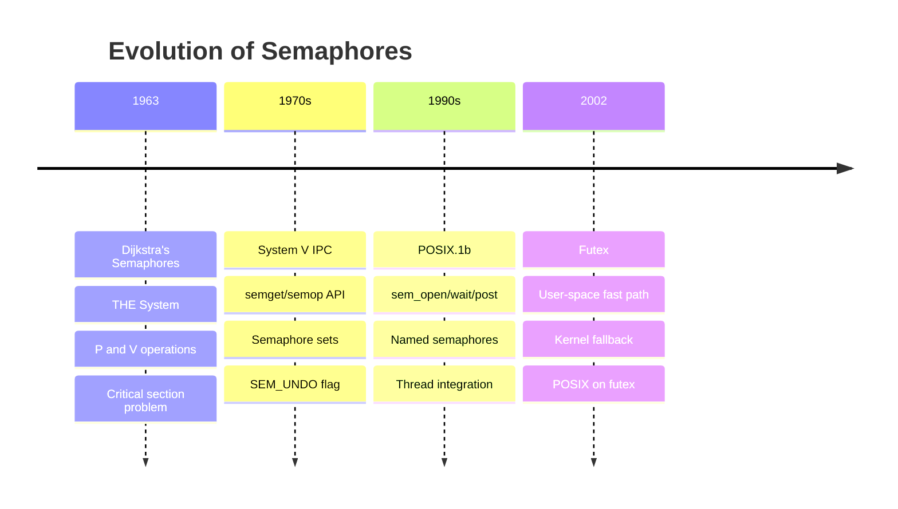
```mermaid
timeline
    title Evolution of Semaphores
    1963 : Dijkstra's Semaphores
         : THE System
         : P and V operations
         : Critical section problem
    1970s : System V IPC
          : semget/semop API
          : Semaphore sets
          : SEM_UNDO flag
    1990s : POSIX.1b
          : sem_open/wait/post
          : Named semaphores
          : Thread integration
    2002 : Futex
         : User-space fast path
         : Kernel fallback
         : POSIX on futex
```

---

## What is a Semaphore?

**Semaphore:** An integer variable accessed through two atomic operations (wait and post), used for process synchronization and mutual exclusion.

### Fundamental Definition

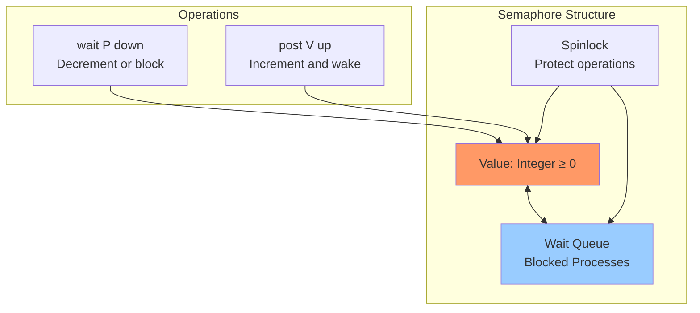
```mermaid
graph TB
    subgraph "Semaphore Structure"
        VAL[Value: Integer ≥ 0]
        QUEUE[Wait Queue<br/>Blocked Processes]
        LOCK[Spinlock<br/>Protect operations]
    end

    subgraph "Operations"
        WAIT[wait P down<br/>Decrement or block]
        POST[post V up<br/>Increment and wake]
    end

    WAIT --> VAL
    POST --> VAL
    VAL <--> QUEUE
    LOCK --> VAL
    LOCK --> QUEUE

    style VAL fill:#f96
    style QUEUE fill:#9cf
```

### Abstract Data Type

**Semaphore ADT:**
```c
typedef struct {
    int value;              // Non-negative integer
    process_queue *queue;   // Waiting processes
    spinlock_t lock;       // Atomic operation protection
} semaphore_t;
```

**Operations:**

1. **wait(S)** - P operation - Proberen (try):
```
wait(S):
    atomic {
        while S.value == 0:
            add current_process to S.queue
            sleep current_process
        S.value = S.value - 1
    }
```

2. **post(S)** - V operation - Verhogen (increment):
```
post(S):
    atomic {
        S.value = S.value + 1
        if S.queue is not empty:
            wake one process from S.queue
    }
```

### Dijkstra's Original Definition

From Dijkstra's 1965 paper:

**P(S):** (Passeren = pass, or Proberen = try)
```
P(S): if S > 0 then S := S - 1
      else <wait until S > 0, then decrement>
```

**V(S):** (Verhogen = raise/increment)
```
V(S): S := S + 1; <wake one waiting process if any>
```

### Semantic Variations

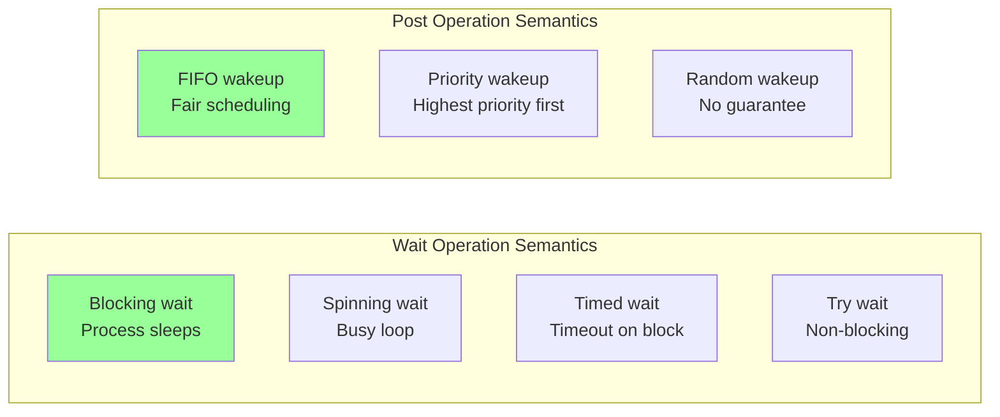
```mermaid
graph LR
    subgraph "Wait Operation Semantics"
        W1[Blocking wait<br/>Process sleeps]
        W2[Spinning wait<br/>Busy loop]
        W3[Timed wait<br/>Timeout on block]
        W4[Try wait<br/>Non-blocking]
    end

    subgraph "Post Operation Semantics"
        P1[FIFO wakeup<br/>Fair scheduling]
        P2[Priority wakeup<br/>Highest priority first]
        P3[Random wakeup<br/>No guarantee]
    end

    style W1 fill:#9f9
    style P1 fill:#9f9
```

---

## Types of Semaphores

### 1. Binary Semaphore (Mutex)

**Definition:** Semaphore with value restricted to 0 or 1.

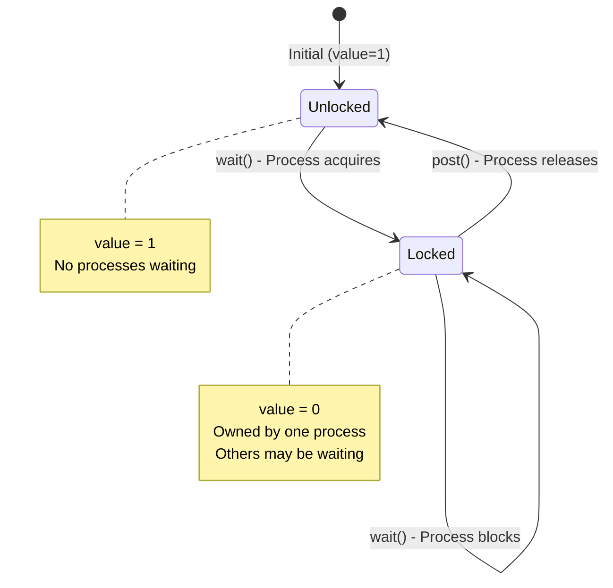
```mermaid
stateDiagram-v2
    [*] --> Unlocked: Initial (value=1)
    Unlocked --> Locked: wait() - Process acquires
    Locked --> Unlocked: post() - Process releases
    Locked --> Locked: wait() - Process blocks

    note right of Unlocked
        value = 1
        No processes waiting
    end note

    note right of Locked
        value = 0
        Owned by one process
        Others may be waiting
    end note
```

**Use Cases:**
- Mutual exclusion (mutex)
- Critical section protection
- Resource ownership

**Properties:**
- At most one process in critical section
- Acts like a lock/unlock mechanism
- Simple two-state: locked or unlocked

**Example:**
```c
sem_t mutex;
sem_init(&mutex, 0, 1);  // Binary: initial value 1

sem_wait(&mutex);    // Lock: 1 → 0
// Critical section
sem_post(&mutex);    // Unlock: 0 → 1
```

### 2. Counting Semaphore

**Definition:** Semaphore with value representing available resource count.

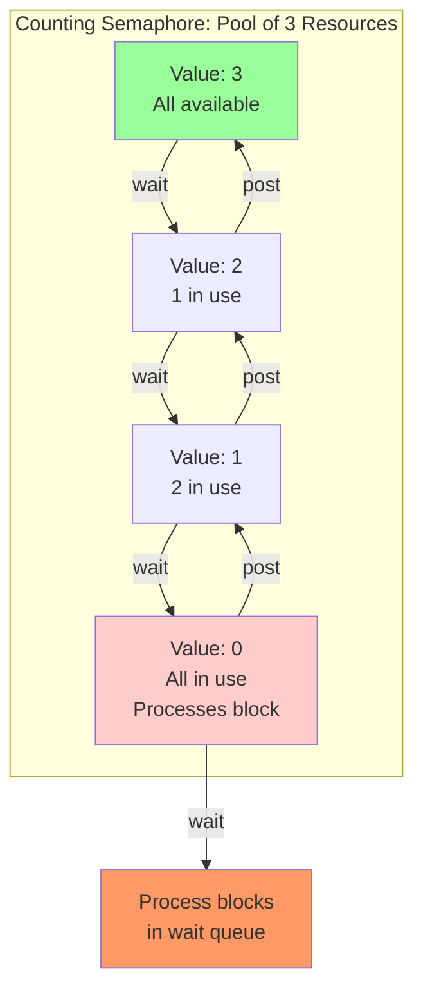
```mermaid
graph TB
    subgraph "Counting Semaphore: Pool of 3 Resources"
        S3[Value: 3<br/>All available]
        S2[Value: 2<br/>1 in use]
        S1[Value: 1<br/>2 in use]
        S0[Value: 0<br/>All in use<br/>Processes block]
    end

    S3 -->|wait| S2
    S2 -->|wait| S1
    S1 -->|wait| S0
    S0 -->|wait| BLOCK[Process blocks<br/>in wait queue]

    S0 -->|post| S1
    S1 -->|post| S2
    S2 -->|post| S3

    style S3 fill:#9f9
    style S0 fill:#fcc
    style BLOCK fill:#f96
```

**Use Cases:**
- Resource pool management (N available connections)
- Bounded buffer slots
- Thread pool synchronization
- Rate limiting

**Properties:**
- Value represents available resources
- Allows N concurrent accessors
- Blocks when resources exhausted

**Example:**
```c
#define RESOURCES 5
sem_t pool;
sem_init(&pool, 0, RESOURCES);  // Counting: initial value 5

sem_wait(&pool);    // Acquire resource: 5 → 4 → 3 → ...
// Use resource
sem_post(&pool);    // Release resource: ... → 3 → 4 → 5
```

### 3. Named Semaphores (POSIX)

**Definition:** System-wide semaphores with string names, persistent across processes.

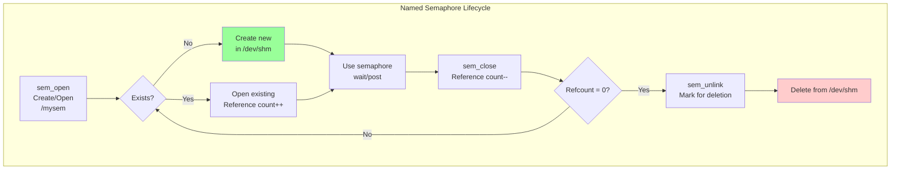
```mermaid
graph TB
    subgraph "Named Semaphore Lifecycle"
        CREATE[sem_open<br/>Create/Open<br/>/mysem]
        EXISTS{Exists?}
        NEW[Create new<br/>in /dev/shm]
        OPEN[Open existing<br/>Reference count++]
        USE[Use semaphore<br/>wait/post]
        CLOSE[sem_close<br/>Reference count--]
        CHECK{Refcount = 0?}
        UNLINK[sem_unlink<br/>Mark for deletion]
        DELETE[Delete from /dev/shm]
    end

    CREATE --> EXISTS
    EXISTS -->|No| NEW
    EXISTS -->|Yes| OPEN
    NEW --> USE
    OPEN --> USE
    USE --> CLOSE
    CLOSE --> CHECK
    CHECK -->|No| EXISTS
    CHECK -->|Yes| UNLINK
    UNLINK --> DELETE

    style NEW fill:#9f9
    style DELETE fill:#fcc
```

**Properties:**
- Persist until `sem_unlink()` or system reboot
- Stored in `/dev/shm` on Linux
- Accessible by unrelated processes
- Name must start with `/`
- Reference counted

### 4. Unnamed Semaphores (POSIX)

**Definition:** Process-local or thread-local semaphores in allocated memory.

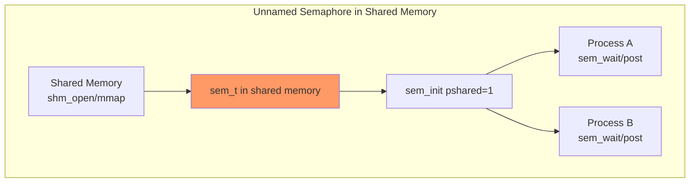
```mermaid
graph TB
    subgraph "Unnamed Semaphore in Shared Memory"
        SHM[Shared Memory<br/>shm_open/mmap]
        SEM[sem_t in shared memory]
        INIT[sem_init pshared=1]
        P1[Process A<br/>sem_wait/post]
        P2[Process B<br/>sem_wait/post]
    end

    SHM --> SEM
    SEM --> INIT
    INIT --> P1
    INIT --> P2

    style SEM fill:#f96
```

**Properties:**
- Must reside in shared memory for IPC
- `pshared=0`: threads only
- `pshared=1`: processes
- No name, no persistence
- Destroyed with `sem_destroy()`

---

## Kernel-Level Architecture

### Semaphore Kernel Structures

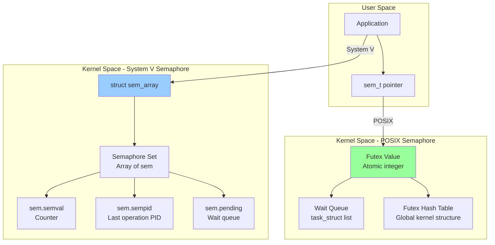
```mermaid
graph TB
    subgraph "User Space"
        APP[Application]
        SEMPTR[sem_t pointer]
    end

    subgraph "Kernel Space - POSIX Semaphore"
        FUTEX[Futex Value<br/>Atomic integer]
        WQUEUE[Wait Queue<br/>task_struct list]
        HASH[Futex Hash Table<br/>Global kernel structure]
    end

    subgraph "Kernel Space - System V Semaphore"
        SEMID[struct sem_array]
        SEMSET[Semaphore Set<br/>Array of sem]
        SEMVAL[sem.semval<br/>Counter]
        SEMPID[sem.sempid<br/>Last operation PID]
        QUEUE2[sem.pending<br/>Wait queue]
    end

    APP --> SEMPTR
    SEMPTR -->|POSIX| FUTEX
    FUTEX --> WQUEUE
    FUTEX --> HASH

    APP -->|System V| SEMID
    SEMID --> SEMSET
    SEMSET --> SEMVAL
    SEMSET --> SEMPID
    SEMSET --> QUEUE2

    style FUTEX fill:#9f9
    style SEMID fill:#9cf
```

### Memory Layout

**POSIX Semaphore (Futex-based):**
```c
// User-space structure (simplified)
typedef struct {
    unsigned int __align;
    union {
        unsigned int __futex;  // Atomic counter for fast path
    } __data;
} sem_t;

// Kernel futex wait queue
struct futex_q {
    struct plist_node list;
    task_struct *task;        // Waiting process
    union futex_key key;      // Hash key
    struct futex_hash_bucket *bucket;
};

// Futex hash table (global kernel)
static struct futex_hash_bucket futex_queues[256];

struct futex_hash_bucket {
    atomic_t waiters;
    spinlock_t lock;
    struct plist_head chain;
};
```

**System V Semaphore:**
```c
// Kernel structure (ipc/sem.c)
struct sem_array {
    struct kern_ipc_perm sem_perm;  // Permissions
    time64_t sem_ctime;              // Last change time
    struct list_head pending_alter;  // Pending alter operations
    struct list_head pending_const;  // Pending read operations
    struct list_head list_id;        // Global list
    int sem_nsems;                   // Number in array
    int complex_count;               // Pending complex operations
    unsigned int use_global_lock;    // Optimization flag
    struct sem sems[];               // Semaphore array
};

// Individual semaphore
struct sem {
    int semval;          // Current value
    int sempid;          // PID of last operation
    spinlock_t lock;     // Protects this semaphore
    struct list_head pending_alter;
    struct list_head pending_const;
} ____cacheline_aligned_in_smp;
```

### Virtual Memory Mapping

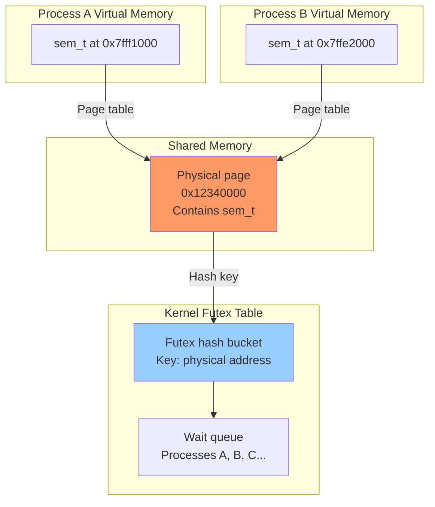
```mermaid
graph TB
    subgraph "Process A Virtual Memory"
        VA1[sem_t at 0x7fff1000]
    end

    subgraph "Process B Virtual Memory"
        VA2[sem_t at 0x7ffe2000]
    end

    subgraph "Shared Memory"
        PHY[Physical page<br/>0x12340000<br/>Contains sem_t]
    end

    subgraph "Kernel Futex Table"
        FTABLE[Futex hash bucket<br/>Key: physical address]
        WLIST[Wait queue<br/>Processes A, B, C...]
    end

    VA1 -->|Page table| PHY
    VA2 -->|Page table| PHY
    PHY -->|Hash key| FTABLE
    FTABLE --> WLIST

    style PHY fill:#f96
    style FTABLE fill:#9cf
```

### Wait Queue Architecture

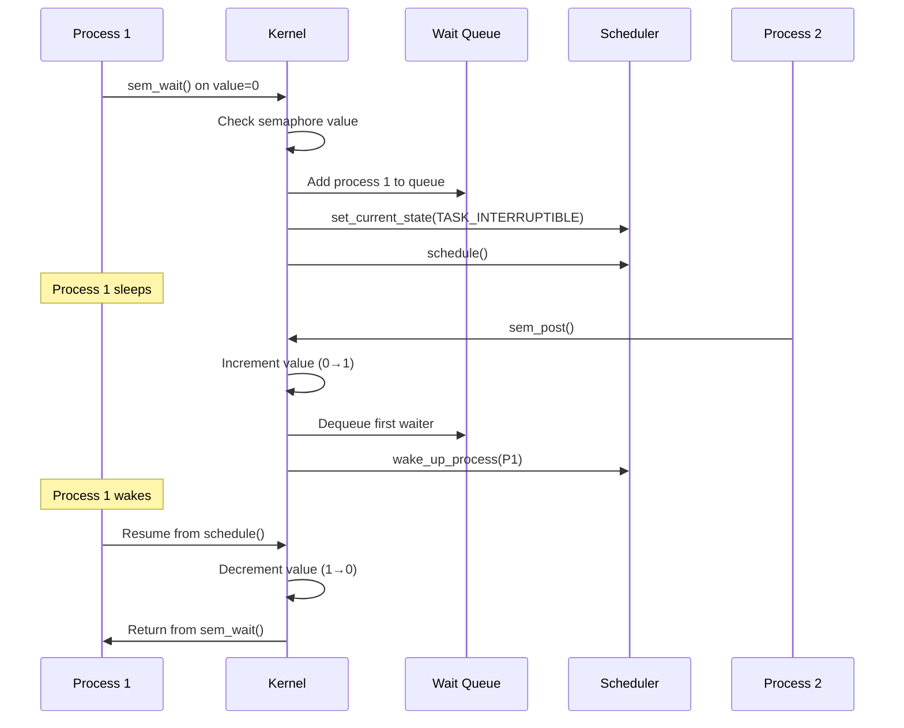
```mermaid
sequenceDiagram
    participant P1 as Process 1
    participant Kernel
    participant WQ as Wait Queue
    participant Sched as Scheduler
    participant P2 as Process 2

    P1->>Kernel: sem_wait() on value=0
    Kernel->>Kernel: Check semaphore value
    Kernel->>WQ: Add process 1 to queue
    Kernel->>Sched: set_current_state(TASK_INTERRUPTIBLE)
    Kernel->>Sched: schedule()
    Note over P1: Process 1 sleeps

    P2->>Kernel: sem_post()
    Kernel->>Kernel: Increment value (0→1)
    Kernel->>WQ: Dequeue first waiter
    Kernel->>Sched: wake_up_process(P1)
    Note over P1: Process 1 wakes

    P1->>Kernel: Resume from schedule()
    Kernel->>Kernel: Decrement value (1→0)
    Kernel->>P1: Return from sem_wait()
```

---

## System Calls

### POSIX Semaphore API

#### 1. `sem_open()` - Create/Open Named Semaphore

```c
#include <semaphore.h>
#include <fcntl.h>

sem_t *sem_open(const char *name, int oflag, mode_t mode, unsigned int value);
```

**Parameters:**
- `name`: Must start with `/`, e.g., `/mysem`
- `oflag`: `O_CREAT`, `O_EXCL`
- `mode`: Permissions (e.g., `0666`)
- `value`: Initial semaphore value

**Returns:** Pointer to semaphore, or `SEM_FAILED`

**Kernel Flow:**
```c
// glibc/nptl/sem_open.c (simplified)
sem_t *sem_open(const char *name, int oflag, ...) {
    // Create/open file in /dev/shm
    int fd = open("/dev/shm/sem.XXXXXX", oflag, mode);

    // Map to memory
    sem_t *sem = mmap(NULL, sizeof(sem_t), PROT_READ | PROT_WRITE,
                      MAP_SHARED, fd, 0);

    // Initialize if new
    if (oflag & O_CREAT) {
        sem->__data.__futex = value;
    }

    return sem;
}
```

#### 2. `sem_wait()` - Decrement (Block if Zero)

```c
int sem_wait(sem_t *sem);
```

**Returns:** 0 on success, -1 on error

**Kernel Flow:**
```c
// glibc/nptl/sem_wait.c (simplified)
int sem_wait(sem_t *sem) {
    unsigned int val;

    // Fast path: atomic decrement if > 0
    do {
        val = atomic_load(&sem->__data.__futex);
        if (val == 0) {
            // Slow path: kernel futex wait
            return futex_wait(&sem->__data.__futex, 0);
        }
    } while (!atomic_compare_exchange_weak(&sem->__data.__futex, &val, val - 1));

    return 0;
}
```

**Futex Wait (Kernel):**
```c
// kernel/futex.c (simplified)
static int futex_wait(u32 __user *uaddr, u32 val) {
    struct futex_hash_bucket *hb;
    struct futex_q q;

    // Add to wait queue
    hb = queue_lock(&q, uaddr);

    // Check value hasn't changed
    if (get_futex_value(&val, uaddr) || val != expected_val) {
        queue_unlock(hb);
        return -EAGAIN;
    }

    // Sleep
    queue_me(&q, hb);
    schedule();  // Context switch

    return 0;
}
```

#### 3. `sem_trywait()` - Non-Blocking Decrement

```c
int sem_trywait(sem_t *sem);
```

**Returns:** 0 if acquired, -1 with `errno=EAGAIN` if would block

```c
int sem_trywait(sem_t *sem) {
    unsigned int val;

    do {
        val = atomic_load(&sem->__data.__futex);
        if (val == 0) {
            errno = EAGAIN;
            return -1;
        }
    } while (!atomic_compare_exchange_weak(&sem->__data.__futex, &val, val - 1));

    return 0;
}
```

#### 4. `sem_timedwait()` - Timed Wait

```c
int sem_timedwait(sem_t *sem, const struct timespec *abs_timeout);
```

**Returns:** 0 on success, -1 with `errno=ETIMEDOUT` on timeout

```c
int sem_timedwait(sem_t *sem, const struct timespec *timeout) {
    // Try fast path first
    if (sem_trywait(sem) == 0)
        return 0;

    // Slow path with timeout
    return futex_timedwait(&sem->__data.__futex, 0, timeout);
}
```

#### 5. `sem_post()` - Increment (Wake Waiter)

```c
int sem_post(sem_t *sem);
```

**Returns:** 0 on success, -1 on error

**Kernel Flow:**
```c
// glibc/nptl/sem_post.c (simplified)
int sem_post(sem_t *sem) {
    unsigned int val;

    // Atomic increment
    val = atomic_fetch_add(&sem->__data.__futex, 1);

    // Wake one waiter if there were any (val was 0)
    if (val == 0) {
        futex_wake(&sem->__data.__futex, 1);
    }

    return 0;
}
```

**Futex Wake (Kernel):**
```c
// kernel/futex.c (simplified)
static int futex_wake(u32 __user *uaddr, int nr_wake) {
    struct futex_hash_bucket *hb;
    struct futex_q *this, *next;
    int ret = 0;

    hb = hash_futex(uaddr);
    spin_lock(&hb->lock);

    // Wake up to nr_wake waiters
    plist_for_each_entry_safe(this, next, &hb->chain, list) {
        if (match_futex(&this->key, uaddr)) {
            wake_futex(this);  // wake_up_process()
            if (++ret >= nr_wake)
                break;
        }
    }

    spin_unlock(&hb->lock);
    return ret;
}
```

#### 6. `sem_getvalue()` - Get Current Value

```c
int sem_getvalue(sem_t *sem, int *sval);
```

```c
int sem_getvalue(sem_t *sem, int *sval) {
    *sval = atomic_load(&sem->__data.__futex);
    return 0;
}
```

#### 7. `sem_close()` and `sem_unlink()`

```c
int sem_close(sem_t *sem);
int sem_unlink(const char *name);
```

```c
int sem_close(sem_t *sem) {
    return munmap(sem, sizeof(sem_t));
}

int sem_unlink(const char *name) {
    char path[PATH_MAX];
    snprintf(path, sizeof(path), "/dev/shm/sem.%s", name);
    return unlink(path);
}
```

### System V Semaphore API

#### 1. `semget()` - Create/Get Semaphore Set

```c
#include <sys/sem.h>

int semget(key_t key, int nsems, int semflg);
```

**Parameters:**
- `key`: Integer key (from `ftok()` or `IPC_PRIVATE`)
- `nsems`: Number of semaphores in set
- `semflg`: `IPC_CREAT`, `IPC_EXCL`, permissions

**Returns:** Semaphore set ID, or -1

**Kernel Implementation:**
```c
// ipc/sem.c (simplified)
SYSCALL_DEFINE3(semget, key_t, key, int, nsems, int, semflg) {
    struct ipc_namespace *ns = current->nsproxy->ipc_ns;
    struct ipc_params sem_params;

    sem_params.key = key;
    sem_params.flg = semflg;
    sem_params.u.nsems = nsems;

    return ipcget(ns, &sem_ids(ns), &sem_ops, &sem_params);
}

// Create new semaphore set
static int newary(struct ipc_namespace *ns, struct ipc_params *params) {
    struct sem_array *sma;
    int size = sizeof(*sma) + params->u.nsems * sizeof(struct sem);

    sma = ipc_rcu_alloc(size);
    sma->sem_nsems = params->u.nsems;

    // Initialize each semaphore
    for (int i = 0; i < sma->sem_nsems; i++) {
        INIT_LIST_HEAD(&sma->sems[i].pending_alter);
        INIT_LIST_HEAD(&sma->sems[i].pending_const);
        spin_lock_init(&sma->sems[i].lock);
    }

    return ipc_addid(&sem_ids(ns), &sma->sem_perm, ns->sc_semmni);
}
```

#### 2. `semop()` - Atomic Operations

```c
int semop(int semid, struct sembuf *sops, size_t nsops);

struct sembuf {
    unsigned short sem_num;  // Semaphore index
    short sem_op;            // Operation: >0: add, 0: wait for zero, <0: subtract
    short sem_flg;           // IPC_NOWAIT, SEM_UNDO
};
```

**Kernel Implementation:**
```c
// ipc/sem.c
SYSCALL_DEFINE3(semop, int, semid, struct sembuf __user *, tsops, unsigned, nsops) {
    struct sem_array *sma;
    struct sembuf ops[nsops];

    copy_from_user(ops, tsops, nsops * sizeof(*ops));

    sma = sem_obtain_object_check(ns, semid);

    return perform_atomic_semop(sma, ops, nsops);
}

static int perform_atomic_semop(struct sem_array *sma, struct sembuf *sops, int nsops) {
    int error = 0;

    // Check if all operations can complete
    for (int i = 0; i < nsops; i++) {
        struct sem *curr = &sma->sems[sops[i].sem_num];

        if (sops[i].sem_op < 0) {
            // Decrement
            if (curr->semval < -sops[i].sem_op) {
                if (sops[i].sem_flg & IPC_NOWAIT)
                    return -EAGAIN;
                // Block: add to wait queue
                return add_to_queue(sma, sops, nsops);
            }
        } else if (sops[i].sem_op == 0) {
            // Wait for zero
            if (curr->semval != 0) {
                if (sops[i].sem_flg & IPC_NOWAIT)
                    return -EAGAIN;
                return add_to_queue(sma, sops, nsops);
            }
        }
    }

    // All checks passed: apply operations atomically
    for (int i = 0; i < nsops; i++) {
        struct sem *curr = &sma->sems[sops[i].sem_num];
        curr->semval += sops[i].sem_op;
        curr->sempid = task_tgid_vnr(current);
    }

    // Wake up waiting processes
    wake_up_sem_queue_do(sma);

    return 0;
}
```

#### 3. `semctl()` - Control Operations

```c
int semctl(int semid, int semnum, int cmd, ...);
```

**Commands:**
- `SETVAL`: Set value
- `GETVAL`: Get value
- `IPC_RMID`: Remove set
- `IPC_STAT`: Get status
- `GETALL`: Get all values
- `SETALL`: Set all values

---

## POSIX Semaphores

### Named Semaphores

**Architecture:**

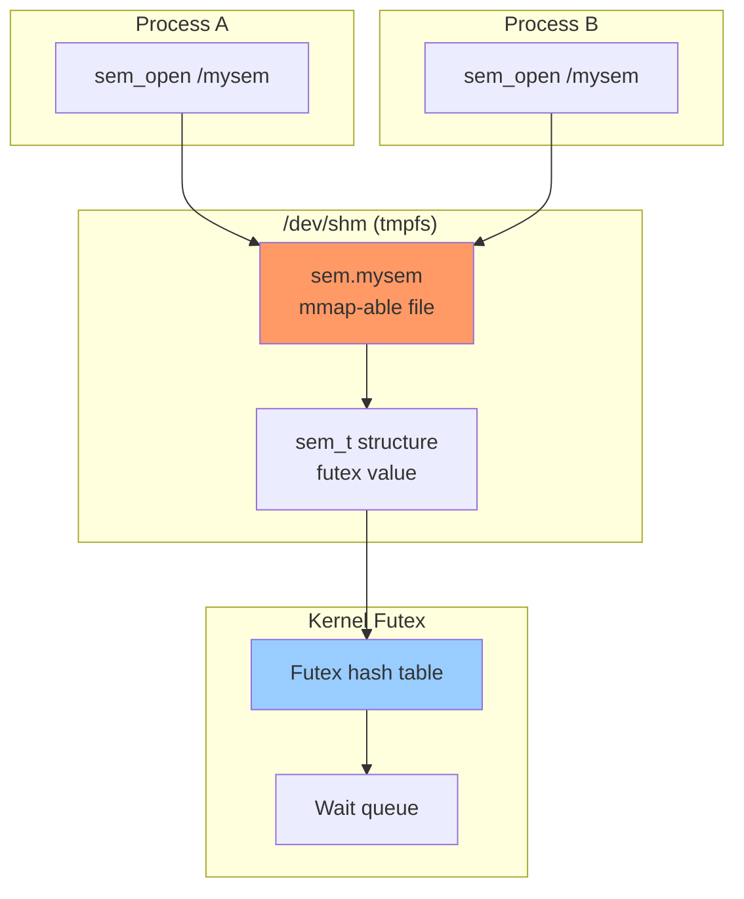
```mermaid
graph TB
    subgraph "Process A"
        PA[sem_open /mysem]
    end

    subgraph "Process B"
        PB[sem_open /mysem]
    end

    subgraph "/dev/shm (tmpfs)"
        FILE[sem.mysem<br/>mmap-able file]
        SEMDATA[sem_t structure<br/>futex value]
    end

    subgraph "Kernel Futex"
        HASH[Futex hash table]
        QUEUE[Wait queue]
    end

    PA --> FILE
    PB --> FILE
    FILE --> SEMDATA
    SEMDATA --> HASH
    HASH --> QUEUE

    style FILE fill:#f96
    style HASH fill:#9cf
```

**Complete Example:**

```c
#include <stdio.h>
#include <stdlib.h>
#include <semaphore.h>
#include <fcntl.h>
#include <unistd.h>
#include <sys/wait.h>

int main() {
    const char *sem_name = "/demo_sem";

    // Create named semaphore (initial value = 1 for mutex)
    sem_t *sem = sem_open(sem_name, O_CREAT, 0666, 1);
    if (sem == SEM_FAILED) {
        perror("sem_open");
        exit(1);
    }

    printf("Semaphore created at /dev/shm/sem.%s\n", sem_name + 1);

    // Fork 3 processes
    for (int i = 0; i < 3; i++) {
        if (fork() == 0) {
            // Child process
            sem_t *child_sem = sem_open(sem_name, 0);  // Open existing

            printf("Process %d: Waiting for semaphore...\n", i);
            sem_wait(child_sem);

            printf("Process %d: Acquired semaphore (critical section)\n", i);
            sleep(2);  // Simulate work

            printf("Process %d: Releasing semaphore\n", i);
            sem_post(child_sem);

            sem_close(child_sem);
            exit(0);
        }
    }

    // Parent waits for all children
    for (int i = 0; i < 3; i++) {
        wait(NULL);
    }

    // Cleanup
    sem_close(sem);
    sem_unlink(sem_name);

    printf("All processes completed\n");
    return 0;
}
```

### Unnamed Semaphores in Shared Memory

**Architecture:**

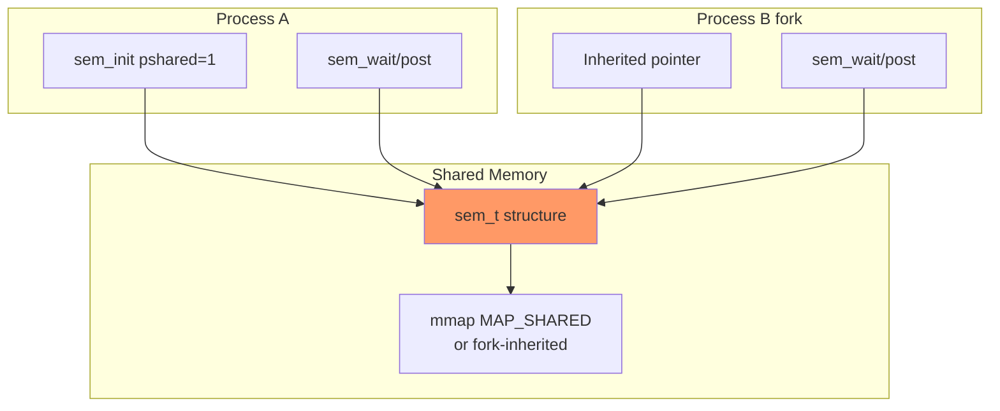
```mermaid
graph TB
    subgraph "Process A"
        PA[sem_init pshared=1]
        PWA[sem_wait/post]
    end

    subgraph "Process B fork"
        PB[Inherited pointer]
        PWB[sem_wait/post]
    end

    subgraph "Shared Memory"
        SHM[mmap MAP_SHARED<br/>or fork-inherited]
        SEMSTRUCT[sem_t structure]
    end

    PA --> SEMSTRUCT
    PB --> SEMSTRUCT
    SEMSTRUCT --> SHM
    PWA --> SEMSTRUCT
    PWB --> SEMSTRUCT

    style SEMSTRUCT fill:#f96
```

**Complete Example:**

```c
#include <stdio.h>
#include <stdlib.h>
#include <semaphore.h>
#include <sys/mman.h>
#include <fcntl.h>
#include <unistd.h>
#include <sys/wait.h>

struct shared_data {
    sem_t sem;
    int counter;
};

int main() {
    // Create shared memory
    int fd = shm_open("/unnamed_sem_demo", O_CREAT | O_RDWR, 0666);
    ftruncate(fd, sizeof(struct shared_data));

    struct shared_data *data = mmap(NULL, sizeof(struct shared_data),
                                     PROT_READ | PROT_WRITE, MAP_SHARED, fd, 0);

    // Initialize unnamed semaphore (pshared=1 for processes)
    sem_init(&data->sem, 1, 1);  // Binary semaphore
    data->counter = 0;

    // Fork 5 processes
    for (int i = 0; i < 5; i++) {
        if (fork() == 0) {
            // Child: increment counter 100 times
            for (int j = 0; j < 100; j++) {
                sem_wait(&data->sem);
                data->counter++;
                sem_post(&data->sem);
            }
            exit(0);
        }
    }

    // Wait for all children
    for (int i = 0; i < 5; i++) {
        wait(NULL);
    }

    printf("Final counter: %d (expected 500)\n", data->counter);

    // Cleanup
    sem_destroy(&data->sem);
    munmap(data, sizeof(struct shared_data));
    shm_unlink("/unnamed_sem_demo");

    return 0;
}
```

---

## System V Semaphores

### Semaphore Sets

**Architecture:**

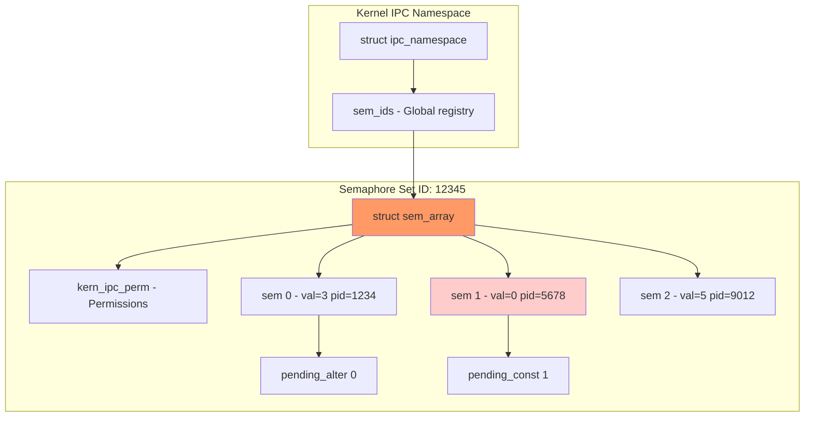
```mermaid
graph TB
    subgraph "Kernel IPC Namespace"
        NAMESPACE["struct ipc_namespace"]
        SEMIDS["sem_ids - Global registry"]
    end

    subgraph "Semaphore Set ID: 12345"
        SEMARRAY["struct sem_array"]
        PERM["kern_ipc_perm - Permissions"]
        SEM0["sem 0 - val=3 pid=1234"]
        SEM1["sem 1 - val=0 pid=5678"]
        SEM2["sem 2 - val=5 pid=9012"]
        QUEUE0["pending_alter 0"]
        QUEUE1["pending_const 1"]
    end

    NAMESPACE --> SEMIDS
    SEMIDS --> SEMARRAY
    SEMARRAY --> PERM
    SEMARRAY --> SEM0
    SEMARRAY --> SEM1
    SEMARRAY --> SEM2
    SEM0 --> QUEUE0
    SEM1 --> QUEUE1

    style SEMARRAY fill:#f96
    style SEM1 fill:#fcc
```

### Atomic Operations on Sets

**Multiple Operations Example:**

```c
#include <stdio.h>
#include <stdlib.h>
#include <sys/sem.h>
#include <sys/ipc.h>
#include <unistd.h>

union semun {
    int val;
    struct semid_ds *buf;
    unsigned short *array;
};

int main() {
    key_t key = ftok("/tmp", 'S');

    // Create semaphore set with 3 semaphores
    int semid = semget(key, 3, IPC_CREAT | 0666);
    if (semid == -1) {
        perror("semget");
        exit(1);
    }

    // Initialize semaphores
    union semun arg;
    arg.val = 5;
    semctl(semid, 0, SETVAL, arg);  // sem[0] = 5 (resources)
    arg.val = 1;
    semctl(semid, 1, SETVAL, arg);  // sem[1] = 1 (mutex)
    arg.val = 0;
    semctl(semid, 2, SETVAL, arg);  // sem[2] = 0 (event flag)

    // Atomic operation: acquire resource AND lock
    struct sembuf ops[2];
    ops[0].sem_num = 0;  // Resource semaphore
    ops[0].sem_op = -1;  // Decrement
    ops[0].sem_flg = 0;

    ops[1].sem_num = 1;  // Mutex semaphore
    ops[1].sem_op = -1;  // Decrement
    ops[1].sem_flg = 0;

    printf("Acquiring resource and lock atomically...\n");
    if (semop(semid, ops, 2) == -1) {
        perror("semop");
        exit(1);
    }

    printf("Acquired! sem[0]=%d, sem[1]=%d\n",
           semctl(semid, 0, GETVAL),
           semctl(semid, 1, GETVAL));

    // Release both
    ops[0].sem_op = 1;
    ops[1].sem_op = 1;
    semop(semid, ops, 2);

    // Cleanup
    semctl(semid, 0, IPC_RMID);

    return 0;
}
```

### SEM_UNDO Flag

**Automatic Cleanup on Process Exit:**

```c
struct sembuf ops;
ops.sem_num = 0;
ops.sem_op = -1;
ops.sem_flg = SEM_UNDO;  // Kernel tracks and reverses on exit

semop(semid, &ops, 1);

// If process crashes here, kernel automatically does:
// ops.sem_op = 1;  // Reverse the operation
// semop(semid, &ops, 1);
```

**Kernel Implementation:**

```c
// ipc/sem.c
struct sem_undo {
    struct list_head list_proc;  // Per-process undo list
    struct rcu_head rcu;
    struct sem_undo_list *ulp;
    struct list_head list_id;    // Per-semaphore-set undo list
    int semid;
    short *semadj;               // Adjustment values
};

// On process exit
void exit_sem(struct task_struct *tsk) {
    struct sem_undo_list *ulp = tsk->sysvsem.undo_list;

    if (!ulp)
        return;

    // Apply all undo operations
    list_for_each_entry(un, &ulp->list_proc, list_proc) {
        struct sem_array *sma = sem_obtain_object(un->semid);

        for (int i = 0; i < sma->sem_nsems; i++) {
            if (un->semadj[i]) {
                sma->sems[i].semval += un->semadj[i];
                wake_up_sem_queue_do(sma);
            }
        }
    }
}
```

---

## Behind the Hood: Kernel Implementation

### Futex (Fast User-Space Mutex)

**Architecture:**

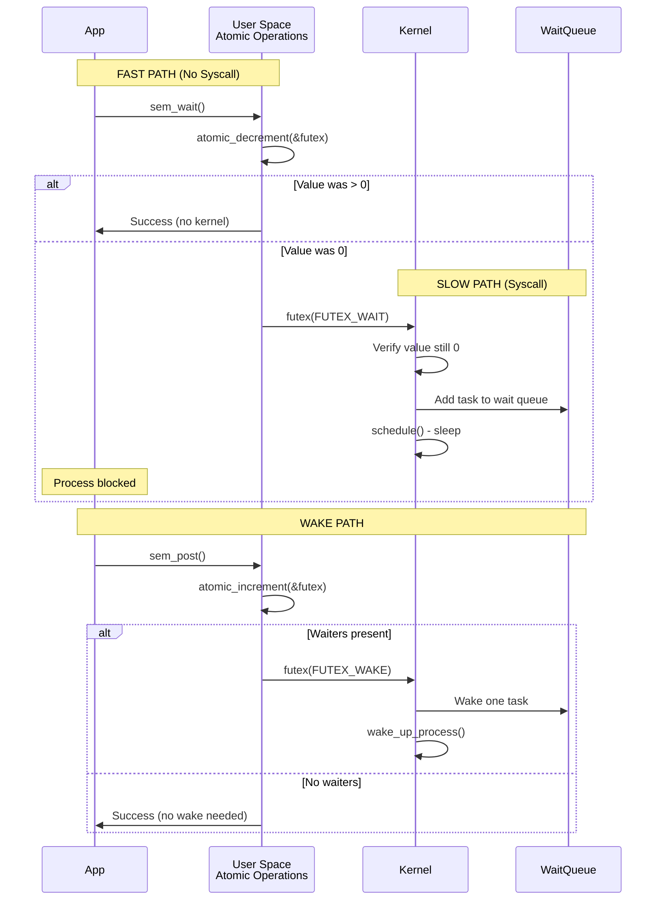
```mermaid
sequenceDiagram
    participant App
    participant Userspace as User Space<br/>Atomic Operations
    participant Kernel
    participant WaitQueue

    Note over App,Userspace: FAST PATH (No Syscall)
    App->>Userspace: sem_wait()
    Userspace->>Userspace: atomic_decrement(&futex)
    alt Value was > 0
        Userspace->>App: Success (no kernel)
    else Value was 0
        Note over Kernel,WaitQueue: SLOW PATH (Syscall)
        Userspace->>Kernel: futex(FUTEX_WAIT)
        Kernel->>Kernel: Verify value still 0
        Kernel->>WaitQueue: Add task to wait queue
        Kernel->>Kernel: schedule() - sleep
        Note over App: Process blocked
    end

    Note over App,WaitQueue: WAKE PATH
    App->>Userspace: sem_post()
    Userspace->>Userspace: atomic_increment(&futex)
    alt Waiters present
        Userspace->>Kernel: futex(FUTEX_WAKE)
        Kernel->>WaitQueue: Wake one task
        Kernel->>Kernel: wake_up_process()
    else No waiters
        Userspace->>App: Success (no wake needed)
    end
```

**Futex Hash Table:**

```c
// kernel/futex.c
#define FUTEX_HASHBITS 8
#define FUTEX_HASHSIZE (1 << FUTEX_HASHBITS)

static struct futex_hash_bucket {
    atomic_t waiters;
    spinlock_t lock;
    struct plist_head chain;
} futex_queues[FUTEX_HASHSIZE];

// Hash function
static struct futex_hash_bucket *hash_futex(union futex_key *key) {
    u32 hash = jhash2((u32 *)key, offsetof(typeof(*key), both.offset) / 4,
                      key->both.offset);
    return &futex_queues[hash & (FUTEX_HASHSIZE - 1)];
}
```

**Fast Path (No Kernel):**

```c
// glibc/nptl/lowlevellock.c
#define atomic_decrement_if_positive(mem) \
({ \
    int val; \
    do { \
        val = atomic_load_relaxed(mem); \
        if (val <= 0) \
            break; \
    } while (!atomic_compare_exchange_weak_acquire(mem, &val, val - 1)); \
    val; \
})

int lll_lock(int *futex) {
    // Fast path: atomic decrement
    if (atomic_compare_exchange_strong_acquire(futex, 0, 1))
        return 0;  // Success without syscall!

    // Slow path: contention
    return lll_lock_wait(futex);
}
```

**Slow Path (Kernel Syscall):**

```c
// kernel/futex.c (simplified)
SYSCALL_DEFINE6(futex, u32 __user *, uaddr, int, op, u32, val,
                struct timespec __user *, utime, u32 __user *, uaddr2, u32, val3)
{
    switch (op & FUTEX_CMD_MASK) {
    case FUTEX_WAIT:
        return futex_wait(uaddr, FLAGS_SHARED, val, utime);
    case FUTEX_WAKE:
        return futex_wake(uaddr, FLAGS_SHARED, val);
    case FUTEX_REQUEUE:
        return futex_requeue(uaddr, FLAGS_SHARED, uaddr2, val, val2, &val3);
    // ... other operations
    }
}

static int futex_wait(u32 __user *uaddr, unsigned int flags, u32 val,
                      ktime_t *abs_time)
{
    struct futex_hash_bucket *hb;
    struct futex_q q = futex_q_init;
    u32 uval;
    int ret;

    // Get hash bucket
    ret = futex_setup_queue(&q, uaddr, &hb);

    // Verify value hasn't changed
    if (get_user(uval, uaddr) || uval != val) {
        queue_unlock(hb);
        return -EWOULDBLOCK;
    }

    // Add to wait queue
    queue_me(&q, hb);

    // Sleep
    if (!abs_time)
        freezable_schedule();
    else
        freezable_schedule_timeout(abs_time);

    // Woken up
    unqueue_me(&q);
    return ret;
}

static int futex_wake(u32 __user *uaddr, unsigned int flags, int nr_wake)
{
    struct futex_hash_bucket *hb;
    struct futex_q *this, *next;
    union futex_key key = FUTEX_KEY_INIT;
    int ret = 0;

    ret = get_futex_key(uaddr, flags, &key);
    hb = hash_futex(&key);

    spin_lock(&hb->lock);
    plist_for_each_entry_safe(this, next, &hb->chain, list) {
        if (match_futex(&this->key, &key)) {
            wake_futex(this);
            if (++ret >= nr_wake)
                break;
        }
    }
    spin_unlock(&hb->lock);

    return ret;
}
```

### Process Sleep and Wake

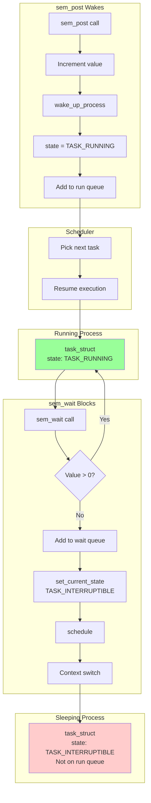
```mermaid
graph TB
    subgraph "Running Process"
        RUNNING[task_struct<br/>state: TASK_RUNNING]
    end

    subgraph "sem_wait Blocks"
        WAIT[sem_wait call]
        CHECK{Value > 0?}
        ADDQ[Add to wait queue]
        SETSTATE[set_current_state<br/>TASK_INTERRUPTIBLE]
        SCHED[schedule]
        CTXSWITCH[Context switch]
    end

    subgraph "Sleeping Process"
        SLEEP[task_struct<br/>state: TASK_INTERRUPTIBLE<br/>Not on run queue]
    end

    subgraph "sem_post Wakes"
        POST[sem_post call]
        INCR[Increment value]
        WAKE[wake_up_process]
        SETRUN[state = TASK_RUNNING]
        ENQUEUE[Add to run queue]
    end

    subgraph "Scheduler"
        PICKN[Pick next task]
        RESUME[Resume execution]
    end

    RUNNING --> WAIT
    WAIT --> CHECK
    CHECK -->|No| ADDQ
    CHECK -->|Yes| RUNNING
    ADDQ --> SETSTATE
    SETSTATE --> SCHED
    SCHED --> CTXSWITCH
    CTXSWITCH --> SLEEP

    POST --> INCR
    INCR --> WAKE
    WAKE --> SETRUN
    SETRUN --> ENQUEUE
    ENQUEUE --> PICKN
    PICKN --> RESUME
    RESUME --> RUNNING

    style SLEEP fill:#fcc
    style RUNNING fill:#9f9
```

**Kernel Code:**

```c
// kernel/sched/core.c
void __sched schedule(void) {
    struct task_struct *prev, *next;
    struct rq *rq;

    prev = current;
    rq = this_rq();

    // Deactivate current task if not runnable
    if (prev->state) {
        deactivate_task(rq, prev, DEQUEUE_SLEEP);
    }

    // Pick next task to run
    next = pick_next_task(rq, prev);

    // Context switch
    if (prev != next) {
        context_switch(rq, prev, next);
    }
}

// Wake up a sleeping process
int wake_up_process(struct task_struct *p) {
    return try_to_wake_up(p, TASK_NORMAL, 0);
}

static int try_to_wake_up(struct task_struct *p, unsigned int state, int wake_flags) {
    // Set task state to TASK_RUNNING
    p->state = TASK_RUNNING;

    // Add to run queue
    activate_task(rq, p, ENQUEUE_WAKEUP);

    // Check if preemption needed
    check_preempt_curr(rq, p, wake_flags);

    return success;
}
```

---

## Synchronization Mechanisms Comparison

### Semaphore vs Mutex vs Spinlock

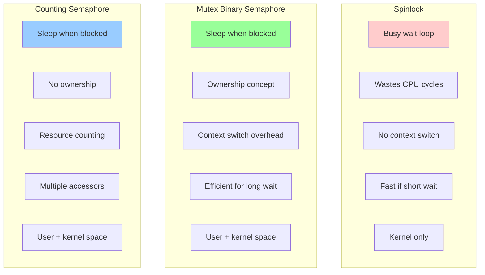
```mermaid
graph TB
    subgraph "Spinlock"
        SP1[Busy wait loop]
        SP2[Wastes CPU cycles]
        SP3[No context switch]
        SP4[Fast if short wait]
        SP5[Kernel only]
    end

    subgraph "Mutex Binary Semaphore"
        MU1[Sleep when blocked]
        MU2[Ownership concept]
        MU3[Context switch overhead]
        MU4[Efficient for long wait]
        MU5[User + kernel space]
    end

    subgraph "Counting Semaphore"
        SE1[Sleep when blocked]
        SE2[No ownership]
        SE3[Resource counting]
        SE4[Multiple accessors]
        SE5[User + kernel space]
    end

    style SP1 fill:#fcc
    style MU1 fill:#9f9
    style SE1 fill:#9cf
```

| Feature | Spinlock | Mutex (Binary Sem) | Counting Semaphore |
|---------|----------|-------------------|-------------------|
| **Waiting** | Busy-wait (spin) | Sleep (block) | Sleep (block) |
| **CPU Usage** | Wastes cycles | Efficient | Efficient |
| **Context Switch** | No | Yes | Yes |
| **Ownership** | No | Yes (owner unlocks) | No (any can post) |
| **Use Case** | Short critical section | Mutual exclusion | Resource pool |
| **Typical Time** | <100 µs | >100 µs | Any |
| **Space** | Kernel only | User+kernel | User+kernel |
| **Interruptible** | No | Yes | Yes |

### Performance Comparison

```c
// Benchmark: 10 million increment operations

// Spinlock (kernel module only)
for (int i = 0; i < 10000000; i++) {
    spin_lock(&lock);
    counter++;
    spin_unlock(&lock);
}
// Time: ~50ms (on idle system)

// Mutex/Binary Semaphore
for (int i = 0; i < 10000000; i++) {
    sem_wait(&sem);
    counter++;
    sem_post(&sem);
}
// Time: ~200ms (context switch overhead)

// Atomic (no lock)
for (int i = 0; i < 10000000; i++) {
    atomic_fetch_add(&atomic_counter, 1);
}
// Time: ~15ms (fastest, lock-free)
```

### Spinlock vs Semaphore Decision Tree

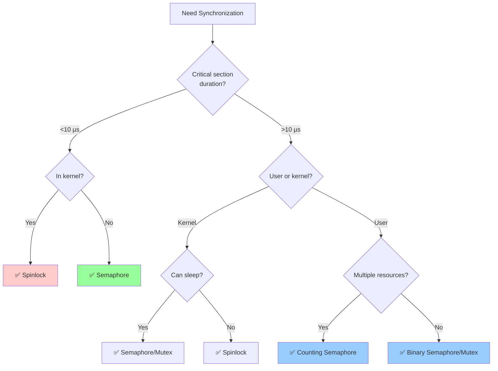
```mermaid
flowchart TD
    START[Need Synchronization]

    START --> Q1{Critical section<br/>duration?}

    Q1 -->|<10 µs| Q2{In kernel?}
    Q1 -->|>10 µs| Q3{User or kernel?}

    Q2 -->|Yes| SPIN[✅ Spinlock]
    Q2 -->|No| SEM[✅ Semaphore]

    Q3 -->|Kernel| Q4{Can sleep?}
    Q3 -->|User| Q5{Multiple resources?}

    Q4 -->|Yes| SEM2[✅ Semaphore/Mutex]
    Q4 -->|No| SPIN2[✅ Spinlock]

    Q5 -->|Yes| COUNT[✅ Counting Semaphore]
    Q5 -->|No| MUTEX[✅ Binary Semaphore/Mutex]

    style SPIN fill:#fcc
    style SEM fill:#9f9
    style COUNT fill:#9cf
    style MUTEX fill:#9cf
```

---

## Blocking vs Non-Blocking Operations

### Blocking Behavior

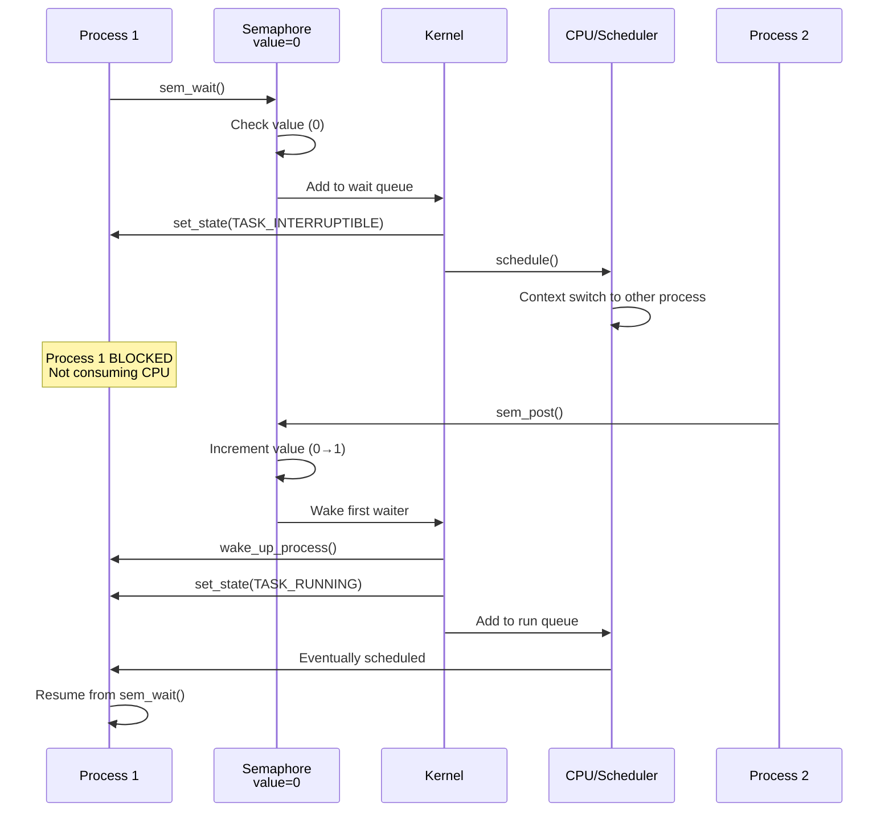
```mermaid
sequenceDiagram
    participant P1 as Process 1
    participant Sem as Semaphore<br/>value=0
    participant Kernel
    participant CPU as CPU/Scheduler

    P1->>Sem: sem_wait()
    Sem->>Sem: Check value (0)
    Sem->>Kernel: Add to wait queue
    Kernel->>P1: set_state(TASK_INTERRUPTIBLE)
    Kernel->>CPU: schedule()
    CPU->>CPU: Context switch to other process
    Note over P1: Process 1 BLOCKED<br/>Not consuming CPU

    participant P2 as Process 2
    P2->>Sem: sem_post()
    Sem->>Sem: Increment value (0→1)
    Sem->>Kernel: Wake first waiter
    Kernel->>P1: wake_up_process()
    Kernel->>P1: set_state(TASK_RUNNING)
    Kernel->>CPU: Add to run queue
    CPU->>P1: Eventually scheduled
    P1->>P1: Resume from sem_wait()
```

### Non-Blocking Behavior

```c
// sem_trywait: immediate return
int try_acquire() {
    if (sem_trywait(&sem) == 0) {
        // Got it!
        return 1;
    } else {
        // Would block, errno == EAGAIN
        return 0;
    }
}

// Polling pattern
while (!sem_trywait(&sem)) {
    // Do other work while waiting
    process_other_tasks();
}
// Got semaphore
```

### Timed Waiting

```c
#include <time.h>

struct timespec ts;
clock_gettime(CLOCK_REALTIME, &ts);
ts.tv_sec += 5;  // 5 second timeout

if (sem_timedwait(&sem, &ts) == -1) {
    if (errno == ETIMEDOUT) {
        printf("Timeout after 5 seconds\n");
    } else {
        perror("sem_timedwait");
    }
} else {
    printf("Acquired within timeout\n");
    // Critical section
    sem_post(&sem);
}
```

### Interruptible vs Uninterruptible

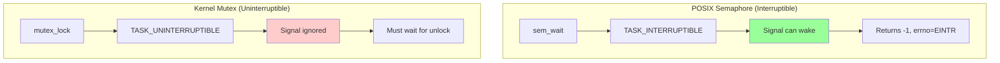
```mermaid
graph TB
    subgraph "POSIX Semaphore (Interruptible)"
        POSIX1[sem_wait]
        POSIX2[TASK_INTERRUPTIBLE]
        POSIX3[Signal can wake]
        POSIX4[Returns -1, errno=EINTR]
    end

    subgraph "Kernel Mutex (Uninterruptible)"
        KERN1[mutex_lock]
        KERN2[TASK_UNINTERRUPTIBLE]
        KERN3[Signal ignored]
        KERN4[Must wait for unlock]
    end

    POSIX1 --> POSIX2
    POSIX2 --> POSIX3
    POSIX3 --> POSIX4

    KERN1 --> KERN2
    KERN2 --> KERN3
    KERN3 --> KERN4

    style POSIX3 fill:#9f9
    style KERN3 fill:#fcc
```

---

## Real-World Usage

### 1. PostgreSQL Connection Pool

PostgreSQL uses System V semaphores for its connection limit semaphore array.

**Architecture:**

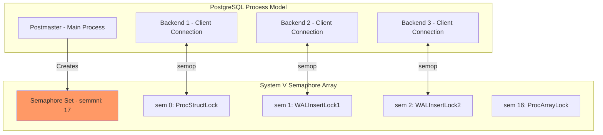
```mermaid
graph TB
    subgraph "PostgreSQL Process Model"
        POSTMASTER["Postmaster - Main Process"]
        BACKEND1["Backend 1 - Client Connection"]
        BACKEND2["Backend 2 - Client Connection"]
        BACKEND3["Backend 3 - Client Connection"]
    end

    subgraph "System V Semaphore Array"
        SEMSET["Semaphore Set - semmni: 17"]
        SEM0["sem 0: ProcStructLock"]
        SEM1["sem 1: WALInsertLock1"]
        SEM2["sem 2: WALInsertLock2"]
        SEM16["sem 16: ProcArrayLock"]
    end

    POSTMASTER -->|Creates| SEMSET
    BACKEND1 <-->|semop| SEM0
    BACKEND2 <-->|semop| SEM1
    BACKEND3 <-->|semop| SEM2

    style SEMSET fill:#f96
```

**Implementation:**

```c
// src/backend/storage/ipc/ipc.c
void CreateSharedMemoryAndSemaphores(void) {
    PGSemaphoreData semaphores[NumSemas];

    // Create System V semaphore set
    semId = semget(IPC_PRIVATE, NumSemas, IPC_CREAT | IPC_EXCL | 0600);

    // Initialize each semaphore
    for (int i = 0; i < NumSemas; i++) {
        semctl(semId, i, SETVAL, 1);
    }
}

// src/backend/storage/lmgr/proc.c
void ProcSleep(LOCALLOCK *locallock) {
    // Wait on semaphore for lock
    PGSemaphoreLock(MyProc->sem);

    // Woken up - we got the lock
    MyProc->waitStatus = STATUS_OK;
}

void ProcWakeup(PGPROC *proc) {
    // Wake waiting process
    PGSemaphoreUnlock(proc->sem);
}
```

**References:**
- PostgreSQL IPC: https://www.postgresql.org/docs/current/kernel-resources.html
- Source: https://github.com/postgres/postgres/blob/master/src/backend/storage/ipc/

### 2. Apache HTTP Server (MPM Worker)

Apache uses POSIX semaphores for thread pool synchronization in the worker MPM (Multi-Processing Module).

**Architecture:**

```mermaid
graph TB
    subgraph "Apache Worker MPM"
        PARENT["Parent Process"]
        CHILD1["Child 1 - Thread Pool"]
        CHILD2["Child 2 - Thread Pool"]
    end

    subgraph "Thread Pool per Child"
        T1["Worker Thread 1"]
        T2["Worker Thread 2"]
        T3["Worker Thread 3"]
        T4["Worker Thread 4"]
    end

    subgraph "Synchronization"
        ACCEPT_SEM["Accept Semaphore - One thread accepts"]
        QUEUE_SEM["Queue Semaphore - Task queue access"]
    end

    PARENT --> CHILD1
    PARENT --> CHILD2
    CHILD1 --> T1
    CHILD1 --> T2
    CHILD2 --> T3
    CHILD2 --> T4

    T1 <-->|sem_wait| ACCEPT_SEM
    T2 <-->|sem_wait| ACCEPT_SEM
    T1 <-->|sem_wait| QUEUE_SEM
    T2 <-->|sem_wait| QUEUE_SEM

    style ACCEPT_SEM fill:#f96
    style QUEUE_SEM fill:#9cf
```

**Configuration:**

```apache
<IfModule mpm_worker_module>
    StartServers             3
    MinSpareThreads         75
    MaxSpareThreads        250
    ThreadsPerChild         25
    MaxRequestWorkers      400
    MaxConnectionsPerChild   0
</IfModule>
```

**Semaphore Usage:**

```c
// Apache uses APR (Apache Portable Runtime) semaphores
apr_proc_mutex_t *accept_mutex;

// Create semaphore
apr_proc_mutex_create(&accept_mutex, NULL, APR_LOCK_DEFAULT, pconf);

// Worker thread
while (1) {
    // Wait for accept permission
    apr_proc_mutex_lock(accept_mutex);

    // Accept connection
    client_socket = accept(server_socket, ...);

    // Release lock
    apr_proc_mutex_unlock(accept_mutex);

    // Handle request
    handle_connection(client_socket);
}
```

### 3. Chromium Multiprocess Architecture

Chromium uses unnamed POSIX semaphores in shared memory for renderer process synchronization.

**Architecture:**

```mermaid
graph TB
    subgraph "Browser Process"
        BROWSER["Main Browser Process"]
        UI["UI Thread"]
        IO["I/O Thread"]
    end

    subgraph "Renderer Processes"
        RENDER1["Renderer 1 - Tab 1"]
        RENDER2["Renderer 2 - Tab 2"]
        GPU["GPU Process"]
    end

    subgraph "Shared Memory Regions"
        SHM1["SharedMemoryRegion 1 - Bitmap + Semaphore"]
        SHM2["SharedMemoryRegion 2 - Video Frame + Semaphore"]
    end

    BROWSER <--> RENDER1
    BROWSER <--> RENDER2
    BROWSER <--> GPU

    RENDER1 <--> SHM1
    BROWSER <--> SHM1
    GPU <--> SHM2
    RENDER1 <--> SHM2

    style SHM1 fill:#f96
    style SHM2 fill:#9cf
```

**Implementation:**

```cpp
// base/sync_socket_posix.cc
class CancelableSyncSocket {
    sem_t shutdown_sem_;

    bool Shutdown() {
        return sem_post(&shutdown_sem_) == 0;
    }

    bool ReceiveWithTimeout(void* buffer, size_t length, TimeDelta timeout) {
        struct timespec ts = timeout.ToTimeSpec();
        if (sem_timedwait(&shutdown_sem_, &ts) == 0)
            return false;  // Shutdown signal

        // Read data
        return ReadOrSendData(buffer, length, true);
    }
};
```

### 4. NVIDIA Driver Synchronization

NVIDIA's proprietary driver uses semaphores for GPU-CPU synchronization.

**Architecture:**

```mermaid
sequenceDiagram
    participant App
    participant Driver
    participant GPU
    participant Sem as Semaphore

    App->>Driver: Submit GPU command
    Driver->>GPU: Queue command
    Driver->>Sem: sem_init (value=0)
    Driver->>App: Return fence ID

    App->>Sem: sem_wait (blocks)
    Note over App: CPU waits for GPU

    GPU->>GPU: Execute command
    GPU->>Driver: Interrupt (command complete)
    Driver->>Sem: sem_post (wake CPU)

    Sem->>App: Unblocked
    App->>App: Use GPU result
```

### 5. Real-Time Audio (JACK Audio Connection Kit)

JACK uses POSIX semaphores for real-time thread synchronization with low latency.

**Architecture:**

```mermaid
graph TB
    subgraph "JACK Server"
        DRIVER["Audio Driver Thread - SCHED_FIFO priority 70"]
        CLIENT1["Client Thread 1 - Audio Generator"]
        CLIENT2["Client Thread 2 - Audio Effects"]
        CLIENT3["Client Thread 3 - Audio Sink"]
    end

    subgraph "Synchronization Semaphores"
        SEM_START["frame_start_sem - Driver to Clients"]
        SEM_DONE["frame_done_sem - Clients to Driver"]
    end

    DRIVER -->|sem_post| SEM_START
    SEM_START -->|sem_wait| CLIENT1
    SEM_START -->|sem_wait| CLIENT2
    SEM_START -->|sem_wait| CLIENT3

    CLIENT1 -->|sem_post| SEM_DONE
    CLIENT2 -->|sem_post| SEM_DONE
    CLIENT3 -->|sem_post| SEM_DONE
    SEM_DONE -->|sem_wait| DRIVER

    style DRIVER fill:#f96
    style SEM_START fill:#9f9
```

**Code:**

```c
// jackd/engine.c
void jack_driver_cycle() {
    // Signal clients: new frame ready
    for (int i = 0; i < nclients; i++) {
        sem_post(&clients[i]->frame_start_sem);
    }

    // Wait for all clients to finish processing
    for (int i = 0; i < nclients; i++) {
        sem_wait(&clients[i]->frame_done_sem);
    }

    // Mix outputs and send to audio hardware
    write_to_audio_device(output_buffer);
}

// Client thread
void process_audio_callback() {
    while (running) {
        // Wait for next frame
        sem_wait(&frame_start_sem);

        // Process audio (must be fast, real-time!)
        process_audio_buffer(input, output);

        // Signal completion
        sem_post(&frame_done_sem);
    }
}
```

**Latency Analysis:**
- Target: <10ms end-to-end latency
- sem_wait/sem_post: <1µs (futex fast path)
- Buffer size: 256 samples @ 48kHz = 5.3ms
- Total system latency: ~6-7ms

---

## Classical Synchronization Problems

### 1. Producer-Consumer (Bounded Buffer)

**Problem:** Coordinate access to a fixed-size buffer between producers and consumers.

```mermaid
graph TB
    subgraph "Shared Buffer (Size=5)"
        B0[Slot 0]
        B1[Slot 1]
        B2[Slot 2]
        B3[Slot 3]
        B4[Slot 4]
    end

    subgraph "Semaphores"
        EMPTY[empty=5<br/>Available slots]
        FULL[full=0<br/>Filled slots]
        MUTEX[mutex=1<br/>Buffer access]
    end

    subgraph "Processes"
        PROD[Producer]
        CONS[Consumer]
    end

    PROD -->|sem_wait empty| EMPTY
    PROD -->|sem_wait mutex| MUTEX
    PROD -->|Write| B0
    PROD -->|sem_post mutex| MUTEX
    PROD -->|sem_post full| FULL

    CONS -->|sem_wait full| FULL
    CONS -->|sem_wait mutex| MUTEX
    CONS -->|Read| B0
    CONS -->|sem_post mutex| MUTEX
    CONS -->|sem_post empty| EMPTY

    style B0 fill:#9f9
    style EMPTY fill:#9cf
    style FULL fill:#f96
```

**Solution:**

```c
sem_t empty;   // Counts empty slots
sem_t full;    // Counts full slots
sem_t mutex;   // Protects buffer access

void producer() {
    while (1) {
        item = produce_item();

        sem_wait(&empty);   // Wait for empty slot
        sem_wait(&mutex);   // Lock buffer

        buffer[in] = item;
        in = (in + 1) % BUFFER_SIZE;

        sem_post(&mutex);   // Unlock buffer
        sem_post(&full);    // Signal item available
    }
}

void consumer() {
    while (1) {
        sem_wait(&full);    // Wait for full slot
        sem_wait(&mutex);   // Lock buffer

        item = buffer[out];
        out = (out + 1) % BUFFER_SIZE;

        sem_post(&mutex);   // Unlock buffer
        sem_post(&empty);   // Signal slot free

        consume_item(item);
    }
}
```

### 2. Readers-Writers Problem

**Problem:** Multiple readers allowed simultaneously, but writers need exclusive access.

```mermaid
stateDiagram-v2
    [*] --> NoReaders: No active readers/writers
    NoReaders --> Reading: First reader arrives
    Reading --> Reading: More readers arrive
    Reading --> NoReaders: Last reader leaves
    NoReaders --> Writing: Writer arrives
    Writing --> NoReaders: Writer leaves

    Reading --> Waiting: Writer waiting
    Waiting --> Reading: Writer still waiting
    Waiting --> Writing: All readers left

    note right of NoReaders
        write_lock = 1
        read_count = 0
    end note

    note right of Reading
        write_lock = 0 (locked)
        read_count > 0
    end note

    note right of Writing
        write_lock = 0 (locked)
        read_count = 0
    end note
```

**Solution (Readers Priority):**

```c
sem_t mutex;       // Protects read_count
sem_t write_lock;  // Writers exclusive access
int read_count = 0;

void reader() {
    while (1) {
        sem_wait(&mutex);
        read_count++;
        if (read_count == 1) {
            sem_wait(&write_lock);  // First reader locks writers
        }
        sem_post(&mutex);

        // READ DATA

        sem_wait(&mutex);
        read_count--;
        if (read_count == 0) {
            sem_post(&write_lock);  // Last reader unlocks writers
        }
        sem_post(&mutex);
    }
}

void writer() {
    while (1) {
        sem_wait(&write_lock);

        // WRITE DATA

        sem_post(&write_lock);
    }
}
```

**Problem with Readers Priority:** Writers can starve

**Writers Priority Solution:**

```c
sem_t mutex;         // Protects counters
sem_t write_lock;    // Writers exclusive
sem_t read_lock;     // Blocks new readers when writer waiting
int read_count = 0;
int write_count = 0;

void writer() {
    sem_wait(&mutex);
    write_count++;
    if (write_count == 1) {
        sem_wait(&read_lock);  // Block new readers
    }
    sem_post(&mutex);

    sem_wait(&write_lock);

    // WRITE DATA

    sem_post(&write_lock);

    sem_wait(&mutex);
    write_count--;
    if (write_count == 0) {
        sem_post(&read_lock);  // Allow readers
    }
    sem_post(&mutex);
}

void reader() {
    sem_wait(&read_lock);  // Blocked if writer waiting
    sem_wait(&mutex);
    read_count++;
    if (read_count == 1) {
        sem_wait(&write_lock);
    }
    sem_post(&mutex);
    sem_post(&read_lock);

    // READ DATA

    sem_wait(&mutex);
    read_count--;
    if (read_count == 0) {
        sem_post(&write_lock);
    }
    sem_post(&mutex);
}
```

### 3. Dining Philosophers

**Problem:** 5 philosophers, 5 forks (chopsticks). Need 2 forks to eat. Avoid deadlock.

```mermaid
graph TB
    subgraph "Dining Table (Circular)"
        P0[Philosopher 0]
        P1[Philosopher 1]
        P2[Philosopher 2]
        P3[Philosopher 3]
        P4[Philosopher 4]

        F0[Fork 0]
        F1[Fork 1]
        F2[Fork 2]
        F3[Fork 3]
        F4[Fork 4]
    end

    P0 ---|left| F0
    P0 ---|right| F4
    P1 ---|left| F1
    P1 ---|right| F0
    P2 ---|left| F2
    P2 ---|right| F1
    P3 ---|left| F3
    P3 ---|right| F2
    P4 ---|left| F4
    P4 ---|right| F3

    style F0 fill:#9f9
    style F1 fill:#9f9
    style F2 fill:#9f9
    style F3 fill:#9f9
    style F4 fill:#9f9
```

**Naive Solution (DEADLOCKS):**

```c
sem_t fork[5];  // One semaphore per fork

void philosopher(int i) {
    while (1) {
        think();

        sem_wait(&fork[i]);           // Pick up left fork
        sem_wait(&fork[(i+1) % 5]);   // Pick up right fork

        // DEADLOCK if all pick up left fork simultaneously!

        eat();

        sem_post(&fork[i]);           // Put down left
        sem_post(&fork[(i+1) % 5]);   // Put down right
    }
}
```

**Solution 1: Asymmetric (Odd/Even):**

```c
void philosopher(int i) {
    while (1) {
        think();

        if (i % 2 == 0) {
            // Even: left first
            sem_wait(&fork[i]);
            sem_wait(&fork[(i+1) % 5]);
        } else {
            // Odd: right first
            sem_wait(&fork[(i+1) % 5]);
            sem_wait(&fork[i]);
        }

        eat();

        sem_post(&fork[i]);
        sem_post(&fork[(i+1) % 5]);
    }
}
```

**Solution 2: At Most 4 Eating:**

```c
sem_t room;  // At most 4 can try to eat
sem_init(&room, 0, 4);

void philosopher(int i) {
    while (1) {
        think();

        sem_wait(&room);              // Enter room (limit 4)
        sem_wait(&fork[i]);
        sem_wait(&fork[(i+1) % 5]);

        eat();

        sem_post(&fork[i]);
        sem_post(&fork[(i+1) % 5]);
        sem_post(&room);              // Leave room
    }
}
```

### 4. Sleeping Barber

**Problem:** Barber shop with N chairs. Barber sleeps when no customers. Customers leave if all chairs full.

```mermaid
stateDiagram-v2
    [*] --> Sleeping: Barber waiting
    Sleeping --> Cutting: Customer arrives
    Cutting --> Sleeping: Done, no waiting
    Cutting --> Cutting: More waiting customers

    note right of Sleeping
        customers = 0
        barber waits on customer_sem
    end note

    note right of Cutting
        customers > 0
        customer waits on barber_sem
    end note
```

**Solution:**

```c
#define CHAIRS 5

sem_t customers;     // Counting semaphore: # waiting
sem_t barber;        // Binary: barber ready
sem_t mutex;         // Protect waiting counter
int waiting = 0;

void barber_thread() {
    while (1) {
        sem_wait(&customers);  // Sleep if no customers

        sem_wait(&mutex);
        waiting--;
        sem_post(&mutex);

        sem_post(&barber);     // Signal ready
        cut_hair();
    }
}

void customer_thread() {
    sem_wait(&mutex);

    if (waiting < CHAIRS) {
        waiting++;
        sem_post(&customers);  // Wake barber
        sem_post(&mutex);

        sem_wait(&barber);     // Wait for barber
        get_haircut();
    } else {
        // Shop full, leave
        sem_post(&mutex);
    }
}
```

---

## Advanced Theoretical Concepts

### Atomic Operations

**Definition:** An atomic operation is an indivisible operation that executes as a single, uninterruptible unit. Either the entire operation completes successfully, or it has no effect at all.

#### Why Atomic Operations Are Critical

Without atomicity, concurrent operations can produce incorrect results:

```mermaid
sequenceDiagram
    participant CPU1 as CPU 1
    participant Mem as Memory (counter=5)
    participant CPU2 as CPU 2

    Note over CPU1,CPU2: NON-ATOMIC INCREMENT (RACE CONDITION)

    CPU1->>Mem: Read counter (5)
    CPU2->>Mem: Read counter (5)
    CPU1->>CPU1: Add 1 (5+1=6)
    CPU2->>CPU2: Add 1 (5+1=6)
    CPU1->>Mem: Write 6
    CPU2->>Mem: Write 6

    Note over Mem: Final value: 6 (WRONG! Should be 7)<br/>One increment was lost!
```

**Race Condition Example:**

```c
// Non-atomic increment
int counter = 0;

// Thread 1             // Thread 2
counter++;              counter++;

// Assembly (x86):
// mov eax, [counter]   mov eax, [counter]   # Both read 0
// inc eax              inc eax              # Both compute 1
// mov [counter], eax   mov [counter], eax   # Both write 1

// Result: counter = 1 (should be 2!)
```

#### Atomic Operations in Hardware

Modern CPUs provide atomic instructions:

**x86/x64:**
```assembly
; Atomic increment
lock inc dword [counter]

; Atomic compare-and-swap (CAS)
lock cmpxchg [location], new_value

; Atomic exchange
lock xchg [location], new_value
```

**ARM:**
```assembly
; Load-Exclusive / Store-Exclusive
LDREX r1, [r0]      ; Load exclusive
ADD r1, r1, #1      ; Increment
STREX r2, r1, [r0]  ; Store exclusive (fails if interrupted)
CMP r2, #0          ; Check if succeeded
BNE retry           ; Retry if failed
```

#### C11/C++ Atomic Operations

```c
#include <stdatomic.h>

atomic_int counter = 0;

// Atomic increment
atomic_fetch_add(&counter, 1);

// Atomic compare-and-swap
int expected = 5;
int desired = 10;
atomic_compare_exchange_strong(&counter, &expected, desired);

// Memory ordering options:
// - memory_order_relaxed: No synchronization
// - memory_order_acquire: Acquire barrier
// - memory_order_release: Release barrier
// - memory_order_seq_cst: Sequential consistency (default)
```

#### How Semaphores Use Atomic Operations

```mermaid
flowchart TB
    START[sem_wait called]

    START --> ATOMIC1{Atomic: Load counter}
    ATOMIC1 --> CHECK{Value > 0?}

    CHECK -->|No| SYSCALL[Syscall: futex WAIT<br/>Sleep in kernel]
    CHECK -->|Yes| ATOMIC2{Atomic: CAS<br/>counter-1}

    ATOMIC2 -->|Success| SUCCESS[Return: acquired]
    ATOMIC2 -->|Failed<br/>Another thread changed it| START

    SYSCALL --> WAKEUP[Woken by sem_post]
    WAKEUP --> START

    style ATOMIC1 fill:#f96
    style ATOMIC2 fill:#f96
    style SUCCESS fill:#9f9
```

**Futex Implementation Using Atomics:**

```c
// Simplified futex-based semaphore
typedef struct {
    atomic_uint value;  // Atomic counter
} sem_t;

int sem_wait(sem_t *sem) {
    unsigned int old_val, new_val;

    // Fast path: atomic decrement if > 0
    do {
        old_val = atomic_load_explicit(&sem->value, memory_order_acquire);

        if (old_val == 0) {
            // Slow path: syscall to kernel
            return futex_wait(&sem->value, 0);
        }

        new_val = old_val - 1;

        // Atomic compare-and-swap
        // If sem->value still equals old_val, set it to new_val
    } while (!atomic_compare_exchange_weak(&sem->value, &old_val, new_val));

    return 0;  // Success
}

int sem_post(sem_t *sem) {
    unsigned int old_val;

    // Atomic increment
    old_val = atomic_fetch_add_explicit(&sem->value, 1, memory_order_release);

    // If old value was 0, wake a waiter
    if (old_val == 0) {
        futex_wake(&sem->value, 1);
    }

    return 0;
}
```

#### Compare-And-Swap (CAS) Explained

**CAS Pseudocode:**
```
CAS(location, expected, desired):
    atomic {
        current = *location
        if current == expected:
            *location = desired
            return true  // Success
        else:
            expected = current  // Update expected
            return false  // Retry needed
    }
```

**Visualization:**

```mermaid
sequenceDiagram
    participant T1 as Thread 1
    participant Mem as Memory
    participant T2 as Thread 2

    Note over Mem: Initial value = 5

    T1->>Mem: CAS(location, expect=5, new=6)
    Mem->>Mem: Compare: value==5? YES
    Mem->>Mem: Atomically set to 6
    Mem->>T1: Success (true)

    Note over Mem: Value now = 6

    T2->>Mem: CAS(location, expect=5, new=7)
    Mem->>Mem: Compare: value==5? NO (it's 6)
    Mem->>T2: Failure (false), actual value = 6

    Note over T2: Thread 2 must retry with expect=6
```

#### ABA Problem with CAS

**Problem:** CAS checks if value equals expected, but can't detect if value changed from A → B → A.

```mermaid
sequenceDiagram
    participant T1 as Thread 1 (slow)
    participant Stack as Stack Top
    participant T2 as Thread 2 (fast)
    participant T3 as Thread 3 (fast)

    Note over Stack: Top = Node A

    T1->>Stack: Read top (A)
    Note over T1: Preempted...

    T2->>Stack: Pop A
    Note over Stack: Top = Node B

    T3->>Stack: Pop B
    Note over Stack: Top = NULL

    T3->>Stack: Push A (reusing memory)
    Note over Stack: Top = Node A (same address!)

    T1->>T1: Resume
    T1->>Stack: CAS(expect=A, new=A.next)
    Note over Stack: CAS succeeds! (A==A)
    Note over T1: But A.next is STALE!<br/>MEMORY CORRUPTION
```

**Solution: Tagged Pointers or Version Numbers:**

```c
typedef struct {
    void *ptr;
    uintptr_t version;  // Incremented on each modification
} tagged_ptr_t;

atomic_tagged_ptr_t stack_top;

void push(void *item) {
    tagged_ptr_t old_top, new_top;
    do {
        old_top = atomic_load(&stack_top);
        new_top.ptr = item;
        new_top.version = old_top.version + 1;
        item->next = old_top.ptr;
    } while (!atomic_compare_exchange_weak(&stack_top, &old_top, new_top));
}
```

#### Memory Ordering and Barriers

**Problem:** Modern CPUs reorder instructions for performance.

```c
// Thread 1
data = 42;           // Write data
atomic_store(&ready, 1);  // Signal ready

// Thread 2
while (!atomic_load(&ready));  // Wait for ready
print(data);         // Read data
```

Without proper ordering, Thread 2 might see `ready=1` but `data=0`!

**Memory Barriers:**

```c
// Acquire barrier: Prevents later loads/stores from moving before
atomic_load_explicit(&ready, memory_order_acquire);

// Release barrier: Prevents earlier loads/stores from moving after
atomic_store_explicit(&ready, 1, memory_order_release);

// Full barrier: Both acquire and release
atomic_thread_fence(memory_order_seq_cst);
```

```mermaid
graph TB
    subgraph "Without Barriers (WRONG)"
        W1[Write data=42]
        W2[Write ready=1]
        R1[Read ready]
        R2[Read data]

        W2 -.->|Reordered!| W1
        R1 -.->|Reordered!| R2
    end

    subgraph "With Barriers (CORRECT)"
        W3[Write data=42]
        W4[RELEASE barrier]
        W5[Write ready=1]
        R3[Read ready]
        R4[ACQUIRE barrier]
        R5[Read data]

        W3 --> W4
        W4 --> W5
        R3 --> R4
        R4 --> R5
    end

    style W1 fill:#fcc
    style W2 fill:#fcc
    style W3 fill:#9f9
    style W5 fill:#9f9
```

#### Lock-Free vs Wait-Free

**Lock-Free:** At least one thread makes progress (but individual threads may starve).

```c
// Lock-free stack
void push(int value) {
    node_t *new_node = malloc(sizeof(node_t));
    new_node->value = value;

    do {
        new_node->next = atomic_load(&stack_top);
    } while (!atomic_compare_exchange_weak(&stack_top, &new_node->next, new_node));
    // Retries on contention, but system makes progress
}
```

**Wait-Free:** Every thread is guaranteed to complete in a bounded number of steps.

```c
// Wait-free read (always completes in one step)
int read_counter() {
    return atomic_load(&counter);  // Never retries
}
```

#### Performance Comparison

```c
// Benchmark: 10 million increments with 4 threads

// 1. Mutex/Semaphore (slowest)
for (int i = 0; i < 10000000; i++) {
    sem_wait(&sem);
    counter++;
    sem_post(&sem);
}
// Time: ~800ms (context switches)

// 2. Spinlock (fast for short critical sections)
for (int i = 0; i < 10000000; i++) {
    while (atomic_flag_test_and_set(&lock));  // Busy-wait
    counter++;
    atomic_flag_clear(&lock);
}
// Time: ~200ms (no context switch, but wastes CPU)

// 3. Atomic operations (fastest)
for (int i = 0; i < 10000000; i++) {
    atomic_fetch_add(&counter, 1);  // Lock-free
}
// Time: ~50ms (no locks, no context switches)
```

#### Atomic Operations in Kernel

**Spinlock Implementation:**

```c
// kernel/locking/spinlock.c
typedef struct {
    atomic_int lock;
} spinlock_t;

void spin_lock(spinlock_t *lock) {
    while (atomic_exchange(&lock->lock, 1) != 0) {
        // Busy-wait (spin)
        while (atomic_load(&lock->lock) != 0) {
            cpu_relax();  // Hint to CPU (pause instruction on x86)
        }
    }
}

void spin_unlock(spinlock_t *lock) {
    atomic_store(&lock->lock, 0);
}
```

**Futex Kernel Implementation:**

```c
// kernel/futex.c
static int futex_wait(u32 __user *uaddr, u32 val) {
    u32 current_val;

    // Atomic check: has value changed?
    if (get_user(current_val, uaddr))
        return -EFAULT;

    if (current_val != val)
        return -EWOULDBLOCK;  // Value changed, don't sleep

    // Value still matches, sleep
    queue_me(...);
    schedule();

    return 0;
}
```

#### Summary: Why Atomicity Matters

✅ **Prevents race conditions** - Operations complete without interruption
✅ **Enables lock-free programming** - Higher performance than locks
✅ **Foundation for synchronization** - Semaphores, mutexes, spinlocks all use atomics
✅ **Hardware support** - Modern CPUs provide efficient atomic instructions

⚠️ **Challenges:**
- ABA problem
- Memory ordering complexity
- Architecture-specific behavior
- Difficult to debug

**Key Takeaway:** Atomic operations are the building blocks of all synchronization primitives, including semaphores. Understanding atomics is essential for understanding how semaphores achieve thread-safe operations without race conditions.

---

### Semaphore Invariants

**Mathematical Properties:**

1. **Non-negativity:** `S ≥ 0` at all times
2. **Conservation:** `S + blocked_count = initial_value + post_count - wait_count`
3. **Progress:** At least one process can proceed if `S > 0`
4. **Fairness:** FIFO ordering (implementation-dependent)

### Deadlock with Semaphores

**Necessary Conditions for Deadlock (Coffman Conditions):**

1. **Mutual Exclusion:** Resources held exclusively
2. **Hold and Wait:** Process holds resource while waiting for another
3. **No Preemption:** Resources cannot be forcibly taken
4. **Circular Wait:** Circular chain of processes waiting

**Example Deadlock:**

```c
// Process A
sem_wait(&sem1);
sem_wait(&sem2);  // BLOCKS if B holds sem2
// ...

// Process B
sem_wait(&sem2);
sem_wait(&sem1);  // BLOCKS if A holds sem1
// DEADLOCK!
```

**Deadlock Prevention:**

```c
// Solution: Resource ordering
// Always acquire in same order: sem1 then sem2

// Process A
sem_wait(&sem1);
sem_wait(&sem2);

// Process B
sem_wait(&sem1);  // Same order!
sem_wait(&sem2);
```

### Priority Inversion

**Problem:** High-priority task blocked by low-priority task holding semaphore, while medium-priority task runs.

```mermaid
sequenceDiagram
    participant L as Low Priority Task
    participant M as Medium Priority Task
    participant H as High Priority Task
    participant Sem as Semaphore

    L->>Sem: Lock (acquired)
    Note over L: Critical section

    H->>Sem: Lock (BLOCKS)
    Note over H: High priority WAITING

    M->>M: Preempts low priority
    Note over M: Medium runs<br/>High is blocked!

    M->>M: Finishes
    L->>L: Resumes
    L->>Sem: Unlock
    Sem->>H: Wake high priority
```

**Solution: Priority Inheritance Protocol**

When a high-priority task blocks on a semaphore:
1. Temporarily raise priority of semaphore holder to highest waiting task
2. Prevents medium-priority tasks from preempting
3. Return to original priority after semaphore released

```c
// Kernel implementation (simplified)
void sem_wait_priority_inherit(sem_t *sem) {
    if (sem->value == 0) {
        // Boost holder's priority
        if (sem->holder->priority < current->priority) {
            sem->holder->boosted_priority = current->priority;
            resched_task(sem->holder);
        }

        // Block
        block_on_semaphore(sem);
    }

    sem->value--;
    sem->holder = current;
}

void sem_post_priority_inherit(sem_t *sem) {
    // Restore original priority
    if (current->boosted_priority != 0) {
        current->priority = current->original_priority;
        current->boosted_priority = 0;
    }

    sem->value++;
    wake_next_waiter(sem);
    sem->holder = NULL;
}
```

### Semaphore Algebra

**Weak Semaphores:**
- No guarantee about ordering of wakeup

**Strong Semaphores:**
- FIFO ordering guaranteed

**Binary vs Counting Equivalence:**

A counting semaphore with initial value N can be implemented with:
- N binary semaphores
- Array and atomic counter

```c
// Counting semaphore from binary semaphores
#define N 5
sem_t binary_sems[N];
atomic_int next_sem = 0;

void counting_wait() {
    int i = atomic_fetch_add(&next_sem, 1) % N;
    sem_wait(&binary_sems[i]);
}

void counting_post() {
    int i = atomic_fetch_sub(&next_sem, 1) % N;
    sem_post(&binary_sems[i]);
}
```

### Monitor Equivalence

**Monitor = Mutex + Condition Variables**

Semaphores can implement monitors:

```c
// Monitor components
sem_t mutex;            // Mutual exclusion
sem_t condition_queue;  // Waiting on condition
int condition_count = 0;

// Monitor entry
void monitor_enter() {
    sem_wait(&mutex);
}

// Monitor exit
void monitor_exit() {
    sem_post(&mutex);
}

// Condition wait
void monitor_wait() {
    condition_count++;
    sem_post(&mutex);      // Release monitor lock
    sem_wait(&condition_queue);  // Wait
    sem_wait(&mutex);      // Reacquire lock
}

// Condition signal
void monitor_signal() {
    if (condition_count > 0) {
        condition_count--;
        sem_post(&condition_queue);
    }
}
```

---

## Best Practices

### 1. Always Pair Operations

**Correct:**
```c
sem_wait(&sem);
// Critical section
sem_post(&sem);  // Always execute!
```

**Wrong:**
```c
sem_wait(&sem);
if (error) {
    return;  // DEADLOCK: forgot sem_post!
}
sem_post(&sem);
```

**Better (with cleanup):**
```c
sem_wait(&sem);
int result = critical_section();
sem_post(&sem);

if (result < 0) {
    return result;
}
```

### 2. Avoid Nested Locks (Deadlock Risk)

**Dangerous:**
```c
sem_wait(&sem1);
sem_wait(&sem2);  // Can deadlock with reverse order
```

**Safe (consistent ordering):**
```c
// Always acquire in same global order
sem_wait(&sem1);  // Lower ID first
sem_wait(&sem2);
```

### 3. Use Timeouts for Robustness

```c
struct timespec ts;
clock_gettime(CLOCK_REALTIME, &ts);
ts.tv_sec += 10;  // 10 second timeout

if (sem_timedwait(&sem, &ts) == -1) {
    if (errno == ETIMEDOUT) {
        // Timeout: possible deadlock, abort
        handle_timeout();
    }
}
```

### 4. Clean Up on Exit

```c
void cleanup(void) {
    sem_close(sem);
    sem_unlink("/mysem");
}

int main() {
    atexit(cleanup);

    sem = sem_open("/mysem", O_CREAT, 0666, 1);
    // ... use semaphore ...

    return 0;
}
```

### 5. Signal Handling with Semaphores

```c
#include <signal.h>

volatile sig_atomic_t shutdown_flag = 0;

void signal_handler(int sig) {
    shutdown_flag = 1;
    sem_post(&sem);  // Wake blocked threads
}

void worker() {
    while (!shutdown_flag) {
        if (sem_wait(&sem) == -1 && errno == EINTR) {
            continue;  // Interrupted by signal
        }

        if (shutdown_flag) break;

        // Do work
        sem_post(&sem);
    }
}
```

### 6. Debugging Semaphore Issues

**Check semaphore value:**
```c
int value;
sem_getvalue(&sem, &value);
printf("Semaphore value: %d\n", value);

// If value is negative: abs(value) = # waiters (implementation-specific)
// If value is 0: unavailable
// If value > 0: available count
```

**List all semaphores:**
```bash
# POSIX named semaphores
ls -l /dev/shm/sem.*

# System V semaphores
ipcs -s

# Clean up leaked semaphores
rm /dev/shm/sem.mysem
ipcrm -s <semid>
```

---

## Limitations and Considerations

### 1. No Ownership Tracking

Unlike mutexes, semaphores don't track which process/thread owns them:

```c
// Any process can sem_post, even if it never called sem_wait
sem_post(&sem);  // Increments value regardless
```

**Problem:** Can lead to accidental over-posting.

### 2. No Recursive Locking

```c
sem_wait(&sem);
sem_wait(&sem);  // DEADLOCK! Blocked on itself
```

**Solution:** Use recursive mutex or counting logic:

```c
thread_local int recursive_count = 0;

void recursive_lock() {
    if (recursive_count == 0) {
        sem_wait(&sem);
    }
    recursive_count++;
}

void recursive_unlock() {
    recursive_count--;
    if (recursive_count == 0) {
        sem_post(&sem);
    }
}
```

### 3. Priority Inversion

High-priority task blocked by low-priority:

**Mitigation:**
- Use priority inheritance mutexes (pthread_mutex with PRIO_INHERIT)
- Limit critical section duration
- Use lock-free algorithms where possible

### 4. Spurious Wakeups

Although rare with semaphores, always recheck conditions:

```c
while (condition_not_met) {
    sem_wait(&sem);
    // Recheck condition
}
```

### 5. Performance Overhead

**Futex Performance:**
- Fast path (no contention): ~10-20 ns
- Slow path (contention): ~1-2 µs (context switch)

**System V Semaphores:**
- Always syscall: ~500 ns minimum
- No fast path optimization

### 6. Portability Issues

| Feature | Linux | macOS | FreeBSD | Windows |
|---------|-------|-------|---------|---------|
| POSIX named | ✅ | ✅ | ✅ | ❌ |
| POSIX unnamed | ✅ | ✅ | ✅ | ❌ |
| System V | ✅ | ✅ | ✅ | ❌ |
| sem_timedwait | ✅ | ❌ | ✅ | ❌ |

**Windows Alternative:** Use `CreateSemaphore()` and `WaitForSingleObject()`

---

## Comprehensive Resources

### Historical Papers

1. **Dijkstra's Original Work**
   - "Cooperating Sequential Processes" (1965): https://www.cs.utexas.edu/~EWD/transcriptions/EWD01xx/EWD123.html
   - "The Structure of the THE Multiprogramming System" (1968): https://www.eecs.ucf.edu/~eurip/papers/dijkstra-the68.pdf
   - Origin of P and V: https://cs.nyu.edu/~yap/classes/os/resources/origin_of_PV.html

2. **Semaphore Theory**
   - Operating System Concepts (Silberschatz): Chapter on Synchronization
   - "Little Book of Semaphores" by Allen Downey: https://greenteapress.com/wp/semaphores/

### Kernel Documentation

3. **Linux Kernel**
   - Semaphore implementation: https://github.com/torvalds/linux/blob/master/kernel/locking/semaphore.c
   - Futex documentation: https://man7.org/linux/man-pages/man7/futex.7.html
   - Futex overview: https://lwn.net/Articles/360699/
   - Futex internals: http://www.rkoucha.fr/tech_corner/the_futex.html

4. **POSIX Specification**
   - sem_overview: https://man7.org/linux/man-pages/man7/sem_overview.7.html
   - POSIX.1-2017: https://pubs.opengroup.org/onlinepubs/9699919799/

5. **System V IPC**
   - sysvipc: https://man7.org/linux/man-pages/man7/sysvipc.7.html
   - System V semaphores: https://www.softprayog.in/programming/system-v-semaphores

### Books

6. **"The Art of Multiprocessor Programming"** by Maurice Herlihy & Nir Shavit
   - Chapter 8: Monitors and Blocking Synchronization
   - Comprehensive theory and practice

7. **"The Linux Programming Interface"** by Michael Kerrisk
   - Chapter 53: POSIX Semaphores
   - Chapter 47: System V Semaphores
   - Excellent practical examples

8. **"Operating System Concepts"** by Silberschatz, Galvin, Gagne
   - Chapter 6: Synchronization Tools
   - Classical problems detailed

### Real-World Implementations

9. **PostgreSQL**
   - IPC documentation: https://www.postgresql.org/docs/current/kernel-resources.html
   - Source code: https://github.com/postgres/postgres/tree/master/src/backend/storage/ipc

10. **Apache HTTP Server**
    - APR semaphores: https://apr.apache.org/docs/apr/trunk/group__apr__thread__proc.html

11. **Chromium**
    - Sync primitives: https://chromium.googlesource.com/chromium/src/+/HEAD/base/synchronization/

### Performance Analysis

12. **Benchmarks**
    - Futex vs System V: https://lwn.net/Articles/360699/
    - Synchronization primitive comparison: https://www.1024cores.net/home/lock-free-algorithms

### Debugging Tools

13. **Tools**
    - `ipcs` man page: https://man7.org/linux/man-pages/man1/ipcs.1.html
    - `strace` for semaphore calls: https://man7.org/linux/man-pages/man1/strace.1.html
    - Helgrind (Valgrind): https://valgrind.org/docs/manual/hg-manual.html

### Academic Resources

14. **Research Papers**
    - "Futexes Are Tricky" by Ulrich Drepper
    - "The Little Book of Semaphores" problems: https://greenteapress.com/wp/semaphores/

15. **Courses**
    - MIT 6.828 Operating System Engineering
    - Stanford CS140 Operating Systems

---

**Summary:**

✅ **Semaphores are best for:**
- Process/thread synchronization
- Mutual exclusion (binary semaphore)
- Resource counting (counting semaphore)
- Classical synchronization problems
- Real-time systems (predictable behavior)

❌ **Not suitable for:**
- Complex ownership tracking (use mutex)
- Recursive locking (use recursive mutex)
- Distributed systems (use distributed locks)

**Key Takeaways:**
- Invented by Dijkstra in 1963 for THE system
- Two types: binary (mutex) and counting (resource pool)
- POSIX (futex-based, fast) vs System V (always syscall)
- Critical for concurrent programming
- Requires careful design to avoid deadlock and starvation
