# Sockets 

## Table of Contents
1. [Introduction](#introduction)
2. [What is a Socket?](#what-is-a-socket)
3. [Types of Sockets](#types-of-sockets)
4. [Kernel-Level Architecture](#kernel-level-architecture)
5. [System Calls](#system-calls)
6. [Unix Domain Sockets (AF_UNIX)](#unix-domain-sockets-af_unix)
7. [Network Sockets (AF_INET/AF_INET6)](#network-sockets-af_inetaf_inet6)
8. [Behind the Hood: Kernel Implementation](#behind-the-hood-kernel-implementation)
9. [Socket Buffer Management](#socket-buffer-management)
10. [Blocking vs Non-Blocking Operations](#blocking-vs-non-blocking-operations)
11. [Real-World Usage](#real-world-usage)
12. [TCP vs UDP Theory](#tcp-vs-udp-theory)
13. [Advanced Concepts](#advanced-concepts)
14. [Best Practices](#best-practices)
15. [Limitations and Considerations](#limitations-and-considerations)
16. [Comprehensive Resources](#comprehensive-resources)

---

## Introduction

### Historical Context

Sockets have evolved to become the fundamental abstraction for network communication:

**1971 - ARPANET (Early Networking):**
- First packet-switched network
- Point-to-point connections
- No standard API
- Each protocol had custom implementation

**1983 - BSD 4.2 Unix (Berkeley Sockets):**
- Bill Joy and team at UC Berkeley
- First standard socket API
- `socket()`, `bind()`, `connect()`, `listen()`, `accept()`
- File descriptor-based interface
- Revolutionized network programming
- Became de facto standard

**1983 - TCP/IP Standardization:**
- TCP/IP replaces NCP on ARPANET
- IP address + Port number addressing
- Reliable (TCP) and unreliable (UDP) protocols
- End-to-end principle

**1986 - Unix Domain Sockets:**
- AF_UNIX address family
- Local IPC without network overhead
- Filesystem-based addressing
- Permission-based security

**1990s - POSIX Standardization:**
- POSIX.1g (networking)
- Portable socket API
- IPv6 support (AF_INET6)
- Advanced features (non-blocking, multiplexing)

**2000s-Present - Modern Enhancements:**
- epoll (Linux), kqueue (BSD) for high-performance
- SO_REUSEPORT for load balancing
- TCP Fast Open
- QUIC protocol (UDP-based)
- io_uring for async I/O

**Problem Solved:**
Sockets provide a unified interface for:
- **Network Communication**: TCP/IP, UDP across machines
- **Local IPC**: Unix domain sockets (faster than TCP loopback)
- **Abstraction**: Same API for different protocols
- **Bidirectional**: Full-duplex communication
- **Stream and Datagram**: TCP (stream) and UDP (datagram) support

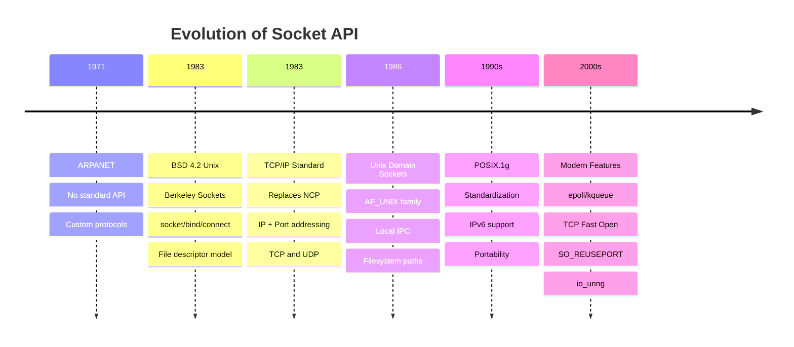

---

## What is a Socket?

**Socket:** A bidirectional communication endpoint that abstracts network or local inter-process communication.

### Fundamental Concept

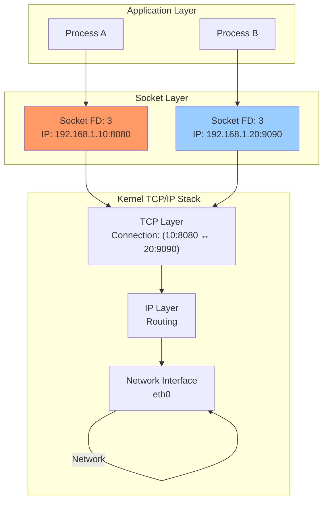

### Socket as File Descriptor

In Unix, **"everything is a file"** - including sockets:

```c
int sockfd = socket(AF_INET, SOCK_STREAM, 0);  // Returns file descriptor

// Use standard file operations
write(sockfd, "Hello", 5);   // Send data
read(sockfd, buffer, 256);   // Receive data
close(sockfd);               // Close socket
```

**Advantages:**
- Unified I/O interface (`read/write/close`)
- Works with `select()`, `poll()`, `epoll()`
- File descriptor passing between processes
- Resource limits apply (ulimit)

### Socket Tuple (5-tuple)

A TCP connection is uniquely identified by:

```
(Protocol, Source IP, Source Port, Dest IP, Dest Port)
```

**Example:**
```
(TCP, 192.168.1.10, 45678, 93.184.216.34, 80)
```

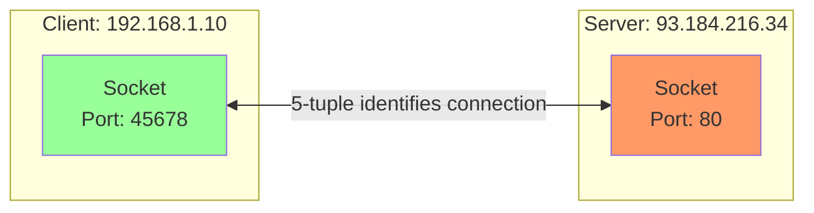

---

## Types of Sockets

### 1. Stream Sockets (SOCK_STREAM)

**Protocol:** TCP
**Characteristics:**
- **Connection-oriented**: Must establish connection first
- **Reliable**: Guaranteed delivery, in-order
- **Byte stream**: No message boundaries
- **Flow control**: Prevents sender from overwhelming receiver
- **Congestion control**: Adapts to network conditions

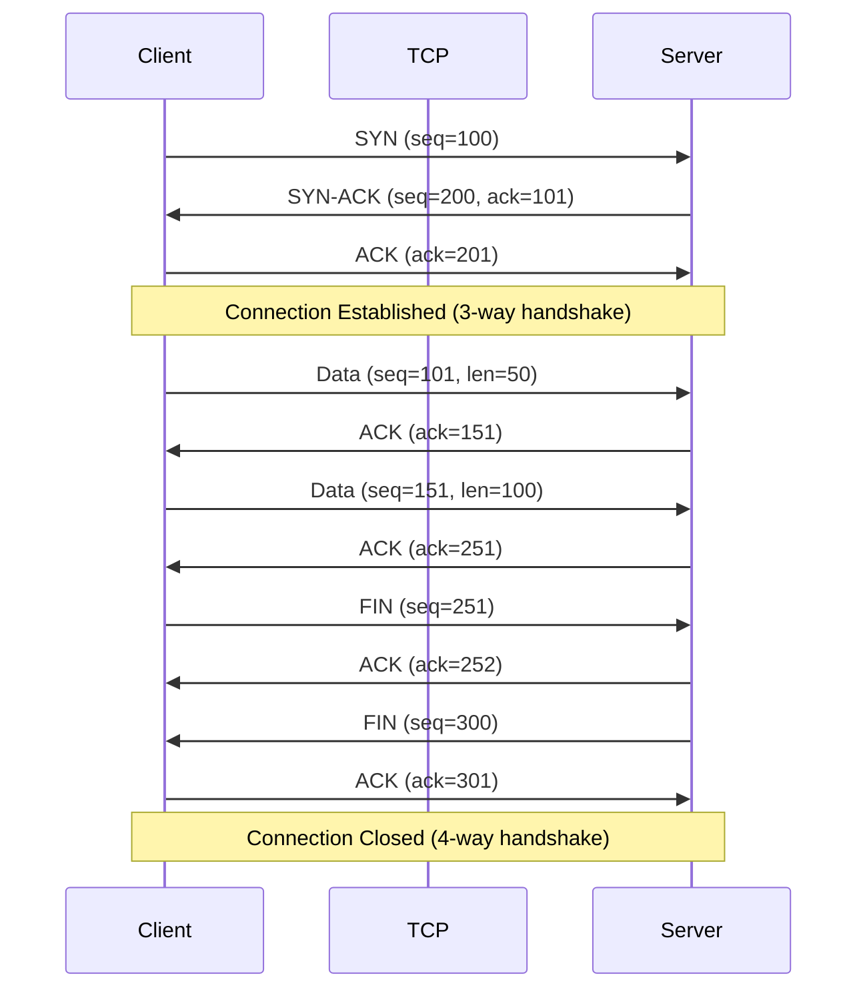

**Use Cases:**
- HTTP/HTTPS (web)
- SSH (secure shell)
- FTP (file transfer)
- SMTP (email)
- Any application needing reliability

### 2. Datagram Sockets (SOCK_DGRAM)

**Protocol:** UDP
**Characteristics:**
- **Connectionless**: No connection setup
- **Unreliable**: No delivery guarantee
- **Message boundaries**: Preserved
- **Low overhead**: No connection state
- **Fast**: Minimal protocol overhead

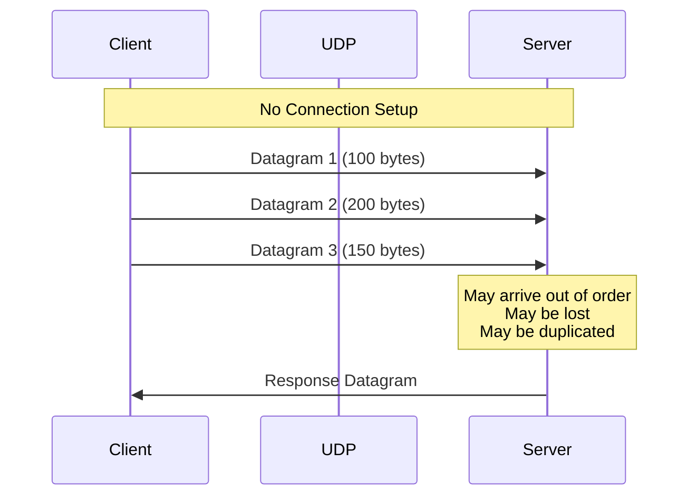

**Use Cases:**
- DNS queries
- DHCP
- Streaming media (video/audio)
- Online gaming
- VoIP
- IoT sensor data

### 3. Raw Sockets (SOCK_RAW)

**Characteristics:**
- **Direct IP access**: Bypass transport layer
- **Requires root**: Privileged operation
- **Custom protocols**: Implement your own
- **Network tools**: ping, traceroute

```c
// Requires root privileges
int sockfd = socket(AF_INET, SOCK_RAW, IPPROTO_ICMP);
```

**Use Cases:**
- `ping` (ICMP Echo)
- `traceroute`
- Network scanners (nmap)
- Custom protocols

### 4. Unix Domain Sockets (SOCK_STREAM/SOCK_DGRAM)

**Address Family:** AF_UNIX (or AF_LOCAL)
**Characteristics:**
- **Local only**: Same machine IPC
- **Filesystem-based**: Uses file paths
- **Fast**: No network stack overhead
- **Secure**: File permissions apply
- **Supports SOCK_STREAM and SOCK_DGRAM**

```c
struct sockaddr_un addr;
addr.sun_family = AF_UNIX;
strcpy(addr.sun_path, "/tmp/mysocket");
```

**Performance:**
- **~2-3x faster than TCP loopback**
- **No TCP overhead** (congestion control, flow control)
- **Zero-copy** in kernel

### Socket Type Comparison

| Feature | SOCK_STREAM | SOCK_DGRAM | SOCK_RAW | AF_UNIX |
|---------|-------------|------------|----------|---------|
| **Protocol** | TCP | UDP | Custom | N/A |
| **Connection** | Yes | No | No | Optional |
| **Reliable** | Yes | No | No | Yes (STREAM) |
| **Ordered** | Yes | No | No | Yes (STREAM) |
| **Boundaries** | No | Yes | Yes | No (STREAM) |
| **Overhead** | High | Low | Lowest | Very Low |
| **Typical Use** | Web, SSH | DNS, Streaming | ping | Local IPC |

---

## Kernel-Level Architecture

### Socket Layers in Linux Kernel

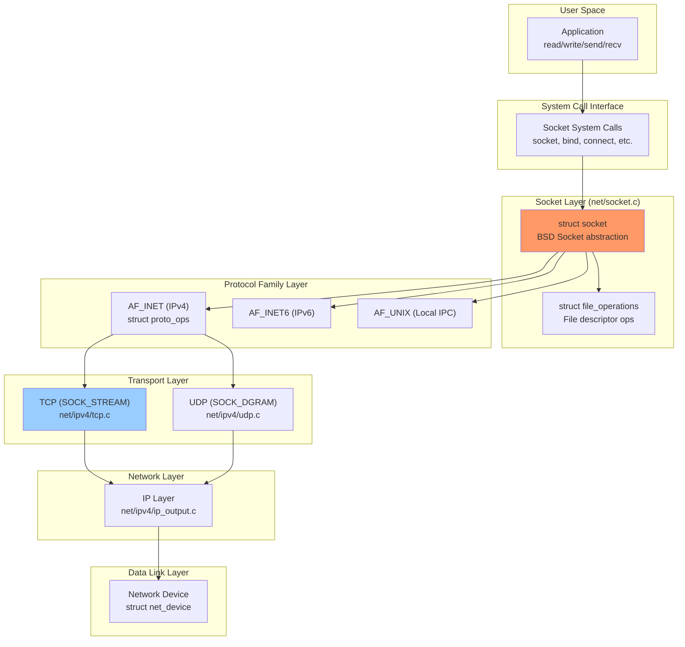

### Key Kernel Data Structures

**struct socket (net/sock.h):**
```c
struct socket {
    socket_state state;           // SS_CONNECTED, SS_UNCONNECTED, etc.
    short type;                   // SOCK_STREAM, SOCK_DGRAM, etc.
    unsigned long flags;
    struct file *file;            // Associated file descriptor
    struct sock *sk;              // Protocol-specific socket (struct sock)
    const struct proto_ops *ops;  // Protocol operations
    struct socket_wq wq;          // Wait queue
};
```

**struct sock (include/net/sock.h):**
```c
struct sock {
    // Socket state
    int sk_state;                 // TCP_ESTABLISHED, TCP_LISTEN, etc.
    unsigned short sk_type;       // SOCK_STREAM, SOCK_DGRAM

    // Socket buffers
    struct sk_buff_head sk_receive_queue;  // Received data
    struct sk_buff_head sk_write_queue;    // Data to send

    // Buffer limits
    int sk_rcvbuf;               // Receive buffer size (default: ~200KB)
    int sk_sndbuf;               // Send buffer size

    // Connection info
    __be32 sk_daddr;             // Destination IP
    __be16 sk_dport;             // Destination port
    unsigned short sk_num;       // Local port

    // Protocol-specific data
    union {
        struct tcp_sock tcp;
        struct udp_sock udp;
        struct raw_sock raw;
    } sk_protinfo;

    // Callbacks
    void (*sk_data_ready)(struct sock *sk);
    void (*sk_write_space)(struct sock *sk);
    void (*sk_error_report)(struct sock *sk);
};
```

**struct sk_buff (include/linux/skbuff.h):**
```c
// Socket buffer - represents a packet
struct sk_buff {
    struct sk_buff *next;
    struct sk_buff *prev;

    struct sock *sk;             // Owning socket
    ktime_t tstamp;              // Timestamp
    struct net_device *dev;      // Device

    unsigned int len;            // Data length
    unsigned int data_len;       // Data in fragments
    __u16 mac_len;
    __u16 hdr_len;

    // Pointers to headers
    unsigned char *head;         // Buffer start
    unsigned char *data;         // Data start
    unsigned char *tail;         // Data end
    unsigned char *end;          // Buffer end

    // Protocol headers
    __u16 transport_header;      // TCP/UDP header offset
    __u16 network_header;        // IP header offset
    __u16 mac_header;            // Ethernet header offset
};
```

### Memory Layout

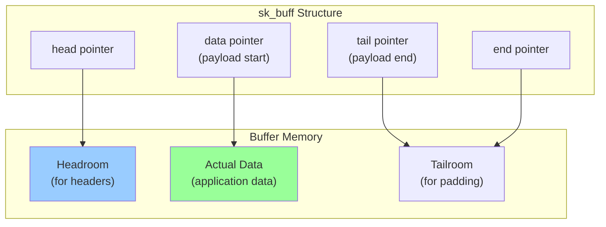

---

## System Calls

### Socket Creation and Setup

#### 1. `socket()` - Create Socket

```c
#include <sys/socket.h>

int socket(int domain, int type, int protocol);
```

**Parameters:**
- `domain`: Address family
  - `AF_INET`: IPv4
  - `AF_INET6`: IPv6
  - `AF_UNIX`: Local IPC
- `type`: Socket type
  - `SOCK_STREAM`: TCP
  - `SOCK_DGRAM`: UDP
  - `SOCK_RAW`: Raw IP
- `protocol`: Usually 0 (auto-select)

**Returns:** File descriptor or -1 on error

**Example:**
```c
int sockfd = socket(AF_INET, SOCK_STREAM, 0);
if (sockfd < 0) {
    perror("socket");
    exit(1);
}
```

**Kernel Flow:**
```c
// net/socket.c
SYSCALL_DEFINE3(socket, int, family, int, type, int, protocol) {
    // Allocate struct socket
    struct socket *sock;
    sock = sock_alloc();

    // Initialize with protocol operations
    sock->type = type;
    sock->ops = inet_stream_ops;  // For TCP

    // Allocate struct sock (protocol-specific)
    sk = sk_alloc(family, GFP_KERNEL, &tcp_prot);
    sock->sk = sk;

    // Create file descriptor
    int fd = sock_map_fd(sock, O_CLOEXEC);

    return fd;
}
```

#### 2. `bind()` - Bind to Address

```c
int bind(int sockfd, const struct sockaddr *addr, socklen_t addrlen);
```

**Purpose:** Associate socket with specific IP and port

**Example:**
```c
struct sockaddr_in addr;
addr.sin_family = AF_INET;
addr.sin_addr.s_addr = INADDR_ANY;  // 0.0.0.0 (all interfaces)
addr.sin_port = htons(8080);

if (bind(sockfd, (struct sockaddr*)&addr, sizeof(addr)) < 0) {
    perror("bind");
    exit(1);
}
```

**Kernel Flow:**
```c
// net/socket.c
SYSCALL_DEFINE3(bind, int, fd, struct sockaddr __user *, umyaddr, int, addrlen) {
    struct socket *sock = sockfd_lookup(fd);

    // Call protocol-specific bind
    return sock->ops->bind(sock, umyaddr, addrlen);
}

// net/ipv4/af_inet.c (for AF_INET)
int inet_bind(struct socket *sock, struct sockaddr *uaddr, int addr_len) {
    struct sock *sk = sock->sk;
    struct sockaddr_in *addr = (struct sockaddr_in *)uaddr;

    // Check port availability
    if (sk->sk_prot->get_port(sk, addr->sin_port) != 0)
        return -EADDRINUSE;  // Port already in use

    // Bind to address
    sk->sk_rcv_saddr = addr->sin_addr.s_addr;
    sk->sk_num = ntohs(addr->sin_port);

    return 0;
}
```

#### 3. `listen()` - Mark as Passive Socket

```c
int listen(int sockfd, int backlog);
```

**Parameters:**
- `backlog`: Max pending connections (SYN queue size)

**Example:**
```c
listen(sockfd, 128);  // Common value
```

**Kernel Flow:**
```c
// net/ipv4/tcp.c
int tcp_listen(struct socket *sock, int backlog) {
    struct sock *sk = sock->sk;

    // Change socket state to LISTEN
    sk->sk_state = TCP_LISTEN;
    sk->sk_max_ack_backlog = backlog;

    // Allocate accept queue
    sk->sk_ack_backlog = 0;

    return 0;
}
```

#### 4. `accept()` - Accept Connection

```c
int accept(int sockfd, struct sockaddr *addr, socklen_t *addrlen);
```

**Behavior:** Blocks until client connects

**Example:**
```c
struct sockaddr_in client_addr;
socklen_t client_len = sizeof(client_addr);

int client_fd = accept(sockfd, (struct sockaddr*)&client_addr, &client_len);
if (client_fd < 0) {
    perror("accept");
    exit(1);
}

printf("Client connected from %s:%d\n",
       inet_ntoa(client_addr.sin_addr),
       ntohs(client_addr.sin_port));
```

**Kernel Flow:**
```c
// net/socket.c
SYSCALL_DEFINE4(accept4, int, fd, struct sockaddr __user *, upeer_sockaddr,
                int __user *, upeer_addrlen, int, flags) {
    struct socket *sock = sockfd_lookup(fd);

    // Allocate new socket for connection
    struct socket *newsock;
    sock_create_lite(sock->sk->sk_family, sock->type, sock->sk->sk_protocol, &newsock);

    // Call protocol-specific accept (blocks here)
    sock->ops->accept(sock, newsock, sock->file->f_flags);

    // Create file descriptor for new socket
    int newfd = sock_map_fd(newsock, flags);

    return newfd;
}

// net/ipv4/tcp.c
int tcp_accept(struct socket *sock, struct socket *newsock, int flags) {
    struct sock *sk = sock->sk;

    // Wait for connection in accept queue
    wait_event_interruptible(sk->sk_wq->wait,
                              !list_empty(&sk->sk_accept_queue));

    // Dequeue completed connection
    struct sock *newsk = list_first_entry(&sk->sk_accept_queue);
    list_del(&newsk->sk_accept_node);

    newsock->sk = newsk;
    newsock->state = SS_CONNECTED;

    return 0;
}
```

#### 5. `connect()` - Initiate Connection

```c
int connect(int sockfd, const struct sockaddr *addr, socklen_t addrlen);
```

**Example:**
```c
struct sockaddr_in server_addr;
server_addr.sin_family = AF_INET;
server_addr.sin_port = htons(80);
inet_pton(AF_INET, "93.184.216.34", &server_addr.sin_addr);

if (connect(sockfd, (struct sockaddr*)&server_addr, sizeof(server_addr)) < 0) {
    perror("connect");
    exit(1);
}
```

**Kernel Flow:**
```c
// net/ipv4/tcp_output.c
int tcp_connect(struct sock *sk) {
    // Allocate SYN packet
    struct sk_buff *skb = sk_stream_alloc_skb(sk, 0);

    // Build TCP header
    struct tcphdr *th = tcp_hdr(skb);
    th->syn = 1;
    th->seq = sk->sk_write_seq++;

    // Send SYN
    tcp_transmit_skb(sk, skb, 1, GFP_KERNEL);

    // Set state to SYN_SENT
    sk->sk_state = TCP_SYN_SENT;

    // Wait for SYN-ACK
    return 0;
}
```

### Data Transfer

#### 6. `send()` / `write()` - Send Data

```c
ssize_t send(int sockfd, const void *buf, size_t len, int flags);
ssize_t write(int sockfd, const void *buf, size_t count);
```

**Flags:**
- `MSG_DONTWAIT`: Non-blocking
- `MSG_MORE`: More data coming (TCP_CORK)
- `MSG_NOSIGNAL`: Don't raise SIGPIPE

**Example:**
```c
const char *msg = "Hello, World!";
ssize_t sent = send(sockfd, msg, strlen(msg), 0);
if (sent < 0) {
    perror("send");
}
```

#### 7. `recv()` / `read()` - Receive Data

```c
ssize_t recv(int sockfd, void *buf, size_t len, int flags);
ssize_t read(int sockfd, void *buf, size_t count);
```

**Example:**
```c
char buffer[1024];
ssize_t received = recv(sockfd, buffer, sizeof(buffer), 0);
if (received < 0) {
    perror("recv");
} else if (received == 0) {
    printf("Connection closed by peer\n");
} else {
    buffer[received] = '\0';
    printf("Received: %s\n", buffer);
}
```

#### 8. `sendto()` / `recvfrom()` - Datagram I/O

```c
ssize_t sendto(int sockfd, const void *buf, size_t len, int flags,
               const struct sockaddr *dest_addr, socklen_t addrlen);

ssize_t recvfrom(int sockfd, void *buf, size_t len, int flags,
                 struct sockaddr *src_addr, socklen_t *addrlen);
```

**Used for UDP:**
```c
// Send
struct sockaddr_in dest;
dest.sin_family = AF_INET;
dest.sin_port = htons(53);  // DNS
inet_pton(AF_INET, "8.8.8.8", &dest.sin_addr);

sendto(sockfd, query, query_len, 0, (struct sockaddr*)&dest, sizeof(dest));

// Receive
struct sockaddr_in from;
socklen_t fromlen = sizeof(from);
recvfrom(sockfd, response, sizeof(response), 0, (struct sockaddr*)&from, &fromlen);
```

#### 9. `close()` / `shutdown()` - Close Connection

```c
int close(int fd);
int shutdown(int sockfd, int how);
```

**shutdown() options:**
- `SHUT_RD`: Disallow further receives
- `SHUT_WR`: Disallow further sends (send FIN)
- `SHUT_RDWR`: Both

**Example:**
```c
shutdown(sockfd, SHUT_WR);  // Half-close (send FIN)
close(sockfd);              // Full close
```

---

## Unix Domain Sockets (AF_UNIX)

### Why Unix Domain Sockets?

**Performance:**
- **2-3x faster than TCP loopback**
- No network stack overhead
- No checksumming
- No congestion control

**Security:**
- Filesystem permissions apply
- Cannot be accessed over network
- Credentials passing (`SCM_CREDENTIALS`)

**Features:**
- File descriptor passing
- Atomic message delivery (SOCK_DGRAM)
- Both SOCK_STREAM and SOCK_DGRAM

### Complete Example: Echo Server

**Server:**
```c
#include <stdio.h>
#include <stdlib.h>
#include <string.h>
#include <unistd.h>
#include <sys/socket.h>
#include <sys/un.h>

#define SOCKET_PATH "/tmp/echo.sock"
#define BUFFER_SIZE 1024

int main() {
    int server_fd, client_fd;
    struct sockaddr_un addr;
    char buffer[BUFFER_SIZE];

    // Create socket
    server_fd = socket(AF_UNIX, SOCK_STREAM, 0);
    if (server_fd < 0) {
        perror("socket");
        exit(1);
    }

    // Remove old socket file
    unlink(SOCKET_PATH);

    // Bind to path
    memset(&addr, 0, sizeof(addr));
    addr.sun_family = AF_UNIX;
    strncpy(addr.sun_path, SOCKET_PATH, sizeof(addr.sun_path) - 1);

    if (bind(server_fd, (struct sockaddr*)&addr, sizeof(addr)) < 0) {
        perror("bind");
        exit(1);
    }

    // Listen
    if (listen(server_fd, 5) < 0) {
        perror("listen");
        exit(1);
    }

    printf("Echo server listening on %s\n", SOCKET_PATH);

    while (1) {
        // Accept connection
        client_fd = accept(server_fd, NULL, NULL);
        if (client_fd < 0) {
            perror("accept");
            continue;
        }

        printf("Client connected\n");

        // Echo loop
        while (1) {
            ssize_t n = recv(client_fd, buffer, BUFFER_SIZE, 0);
            if (n <= 0) break;

            send(client_fd, buffer, n, 0);  // Echo back
        }

        close(client_fd);
        printf("Client disconnected\n");
    }

    close(server_fd);
    unlink(SOCKET_PATH);

    return 0;
}
```

**Client:**
```c
#include <stdio.h>
#include <stdlib.h>
#include <string.h>
#include <unistd.h>
#include <sys/socket.h>
#include <sys/un.h>

#define SOCKET_PATH "/tmp/echo.sock"
#define BUFFER_SIZE 1024

int main() {
    int sockfd;
    struct sockaddr_un addr;
    char buffer[BUFFER_SIZE];

    // Create socket
    sockfd = socket(AF_UNIX, SOCK_STREAM, 0);
    if (sockfd < 0) {
        perror("socket");
        exit(1);
    }

    // Connect to server
    memset(&addr, 0, sizeof(addr));
    addr.sun_family = AF_UNIX;
    strncpy(addr.sun_path, SOCKET_PATH, sizeof(addr.sun_path) - 1);

    if (connect(sockfd, (struct sockaddr*)&addr, sizeof(addr)) < 0) {
        perror("connect");
        exit(1);
    }

    printf("Connected to echo server\n");

    // Send and receive
    const char *msg = "Hello, Unix Socket!";
    send(sockfd, msg, strlen(msg), 0);

    ssize_t n = recv(sockfd, buffer, BUFFER_SIZE, 0);
    buffer[n] = '\0';

    printf("Echo: %s\n", buffer);

    close(sockfd);

    return 0;
}
```

### File Descriptor Passing

**Unique feature** of Unix domain sockets:

```c
// Send file descriptor
int send_fd(int socket, int fd_to_send) {
    struct msghdr msg = {0};
    struct cmsghdr *cmsg;
    char buf[CMSG_SPACE(sizeof(int))];
    char dummy = '*';
    struct iovec iov = {.iov_base = &dummy, .iov_len = 1};

    msg.msg_iov = &iov;
    msg.msg_iovlen = 1;
    msg.msg_control = buf;
    msg.msg_controllen = CMSG_LEN(sizeof(int));

    cmsg = CMSG_FIRSTHDR(&msg);
    cmsg->cmsg_level = SOL_SOCKET;
    cmsg->cmsg_type = SCM_RIGHTS;
    cmsg->cmsg_len = CMSG_LEN(sizeof(int));
    *(int*)CMSG_DATA(cmsg) = fd_to_send;

    return sendmsg(socket, &msg, 0);
}

// Receive file descriptor
int recv_fd(int socket) {
    struct msghdr msg = {0};
    struct cmsghdr *cmsg;
    char buf[CMSG_SPACE(sizeof(int))];
    char dummy;
    struct iovec iov = {.iov_base = &dummy, .iov_len = 1};
    int fd;

    msg.msg_iov = &iov;
    msg.msg_iovlen = 1;
    msg.msg_control = buf;
    msg.msg_controllen = CMSG_LEN(sizeof(int));

    recvmsg(socket, &msg, 0);

    cmsg = CMSG_FIRSTHDR(&msg);
    fd = *(int*)CMSG_DATA(cmsg);

    return fd;
}
```

**Use Case:** Passing open files between processes (e.g., systemd socket activation)

---

## Network Sockets (AF_INET/AF_INET6)

### TCP Socket: Complete Example

**Server:**
```c
#include <stdio.h>
#include <stdlib.h>
#include <string.h>
#include <unistd.h>
#include <arpa/inet.h>
#include <sys/socket.h>

#define PORT 8080
#define BACKLOG 10
#define BUFFER_SIZE 1024

int main() {
    int server_fd, client_fd;
    struct sockaddr_in server_addr, client_addr;
    socklen_t client_len;
    char buffer[BUFFER_SIZE];

    // Create socket
    server_fd = socket(AF_INET, SOCK_STREAM, 0);
    if (server_fd < 0) {
        perror("socket");
        exit(1);
    }

    // Allow address reuse
    int opt = 1;
    setsockopt(server_fd, SOL_SOCKET, SO_REUSEADDR, &opt, sizeof(opt));

    // Bind
    memset(&server_addr, 0, sizeof(server_addr));
    server_addr.sin_family = AF_INET;
    server_addr.sin_addr.s_addr = INADDR_ANY;
    server_addr.sin_port = htons(PORT);

    if (bind(server_fd, (struct sockaddr*)&server_addr, sizeof(server_addr)) < 0) {
        perror("bind");
        exit(1);
    }

    // Listen
    if (listen(server_fd, BACKLOG) < 0) {
        perror("listen");
        exit(1);
    }

    printf("Server listening on port %d\n", PORT);

    while (1) {
        client_len = sizeof(client_addr);
        client_fd = accept(server_fd, (struct sockaddr*)&client_addr, &client_len);

        if (client_fd < 0) {
            perror("accept");
            continue;
        }

        printf("Client connected: %s:%d\n",
               inet_ntoa(client_addr.sin_addr),
               ntohs(client_addr.sin_port));

        // Handle client
        ssize_t n = recv(client_fd, buffer, BUFFER_SIZE, 0);
        if (n > 0) {
            buffer[n] = '\0';
            printf("Received: %s\n", buffer);

            const char *response = "HTTP/1.1 200 OK\r\nContent-Length: 13\r\n\r\nHello, World!";
            send(client_fd, response, strlen(response), 0);
        }

        close(client_fd);
    }

    close(server_fd);
    return 0;
}
```

**Client:**
```c
#include <stdio.h>
#include <stdlib.h>
#include <string.h>
#include <unistd.h>
#include <arpa/inet.h>
#include <sys/socket.h>

#define SERVER_IP "127.0.0.1"
#define PORT 8080
#define BUFFER_SIZE 1024

int main() {
    int sockfd;
    struct sockaddr_in server_addr;
    char buffer[BUFFER_SIZE];

    // Create socket
    sockfd = socket(AF_INET, SOCK_STREAM, 0);
    if (sockfd < 0) {
        perror("socket");
        exit(1);
    }

    // Connect
    memset(&server_addr, 0, sizeof(server_addr));
    server_addr.sin_family = AF_INET;
    server_addr.sin_port = htons(PORT);
    inet_pton(AF_INET, SERVER_IP, &server_addr.sin_addr);

    if (connect(sockfd, (struct sockaddr*)&server_addr, sizeof(server_addr)) < 0) {
        perror("connect");
        exit(1);
    }

    printf("Connected to server\n");

    // Send HTTP request
    const char *request = "GET / HTTP/1.1\r\nHost: localhost\r\n\r\n";
    send(sockfd, request, strlen(request), 0);

    // Receive response
    ssize_t n = recv(sockfd, buffer, BUFFER_SIZE, 0);
    buffer[n] = '\0';
    printf("Response:\n%s\n", buffer);

    close(sockfd);
    return 0;
}
```

### UDP Socket Example

```c
// UDP Server
int sockfd = socket(AF_INET, SOCK_DGRAM, 0);

struct sockaddr_in server_addr;
server_addr.sin_family = AF_INET;
server_addr.sin_addr.s_addr = INADDR_ANY;
server_addr.sin_port = htons(53);  // DNS port

bind(sockfd, (struct sockaddr*)&server_addr, sizeof(server_addr));

while (1) {
    struct sockaddr_in client_addr;
    socklen_t client_len = sizeof(client_addr);
    char buffer[512];

    ssize_t n = recvfrom(sockfd, buffer, sizeof(buffer), 0,
                         (struct sockaddr*)&client_addr, &client_len);

    // Process and respond
    sendto(sockfd, response, response_len, 0,
           (struct sockaddr*)&client_addr, client_len);
}
```

---

## Behind the Hood: Kernel Implementation

### Socket Creation Flow

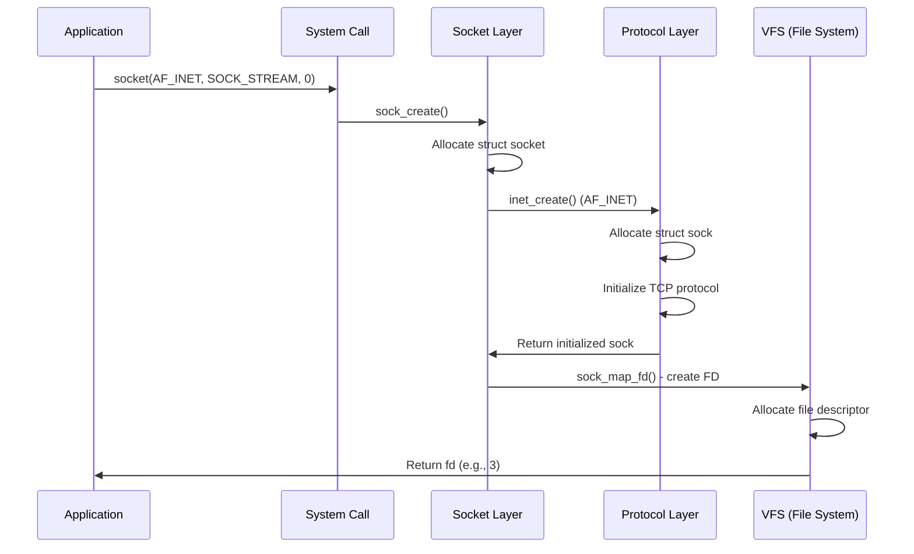

### Data Send Path (TCP)

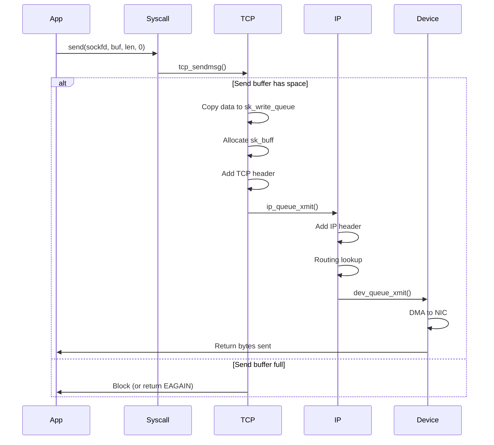

### Data Receive Path (TCP)

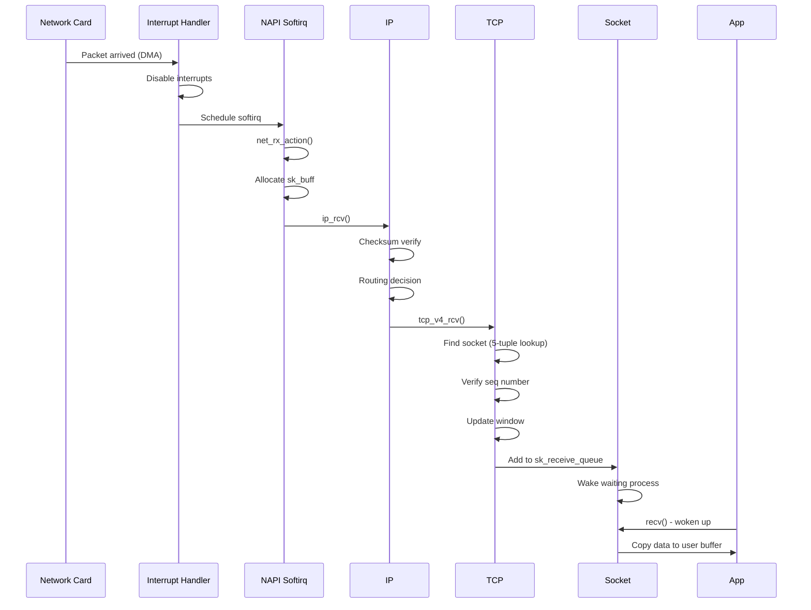

### TCP State Machine

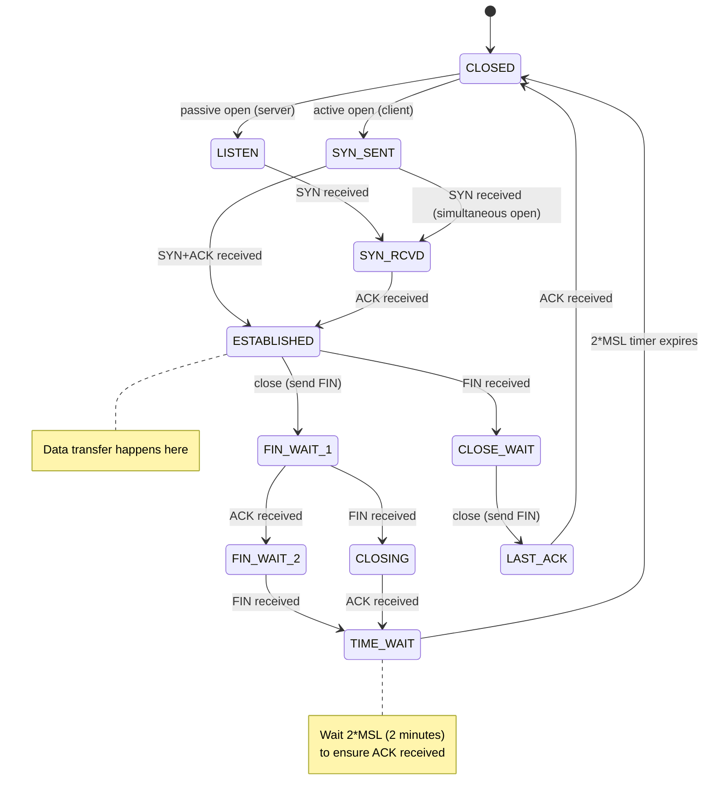

---

## Socket Buffer Management

### sk_buff Structure Deep Dive

```c
struct sk_buff {
    // Linked list pointers
    struct sk_buff *next;
    struct sk_buff *prev;

    // Socket owner
    struct sock *sk;

    // Device
    struct net_device *dev;

    // Timestamps
    ktime_t tstamp;

    // Length fields
    unsigned int len;        // Total length
    unsigned int data_len;   // Length of data in frags
    __u16 mac_len;
    __u16 hdr_len;
    __u16 queue_mapping;

    // Data pointers
    unsigned char *head;     // Start of buffer
    unsigned char *data;     // Start of valid data
    unsigned char *tail;     // End of valid data
    unsigned char *end;      // End of buffer

    // Protocol headers
    __u16 transport_header;  // Offset to TCP/UDP header
    __u16 network_header;    // Offset to IP header
    __u16 mac_header;        // Offset to Ethernet header

    // Checksums
    __wsum csum;
    __u32 csum_offset;

    // TCP specific
    __u32 seq;               // TCP sequence number
    __u32 end_seq;           // TCP ending sequence number

    // Fragmentation
    struct sk_buff *frag_list;
    skb_frag_t frags[MAX_SKB_FRAGS];
};
```

### Buffer Layout Example

```
sk_buff structure:
+----------------+
| head           |--------> +---------------------------+
| data           |--------->|  Headroom (for headers)   |
| tail           |--------->+---------------------------+
| end            |--------->|  Application Data         |
+----------------+          +---------------------------+
                            |  Tailroom (expansion)     |
                            +---------------------------+

After adding headers:
                            +---------------------------+
                            | Ethernet | IP | TCP | Data |
                            +---------------------------+
                            ^          ^    ^    ^
                            mac_hdr    net  transport
                                       _hdr _header
```

### Zero-Copy Techniques

**sendfile():**
```c
// Avoid copying data through user space
ssize_t sendfile(int out_fd, int in_fd, off_t *offset, size_t count);

// Kernel transfers directly: file → socket
// No user-space buffer needed!
```

**splice():**
```c
// Move data between file descriptors via pipe
ssize_t splice(int fd_in, loff_t *off_in, int fd_out, loff_t *off_out,
               size_t len, unsigned int flags);
```

**MSG_ZEROCOPY:**
```c
// Async zero-copy send (Linux 4.14+)
send(sockfd, buffer, len, MSG_ZEROCOPY);

// Kernel uses DMA directly from user buffer
// Application notified when safe to reuse buffer
```

---

## Blocking vs Non-Blocking Operations

### Blocking Mode (Default)

```c
// Blocks until data available
ssize_t n = recv(sockfd, buffer, size, 0);
```

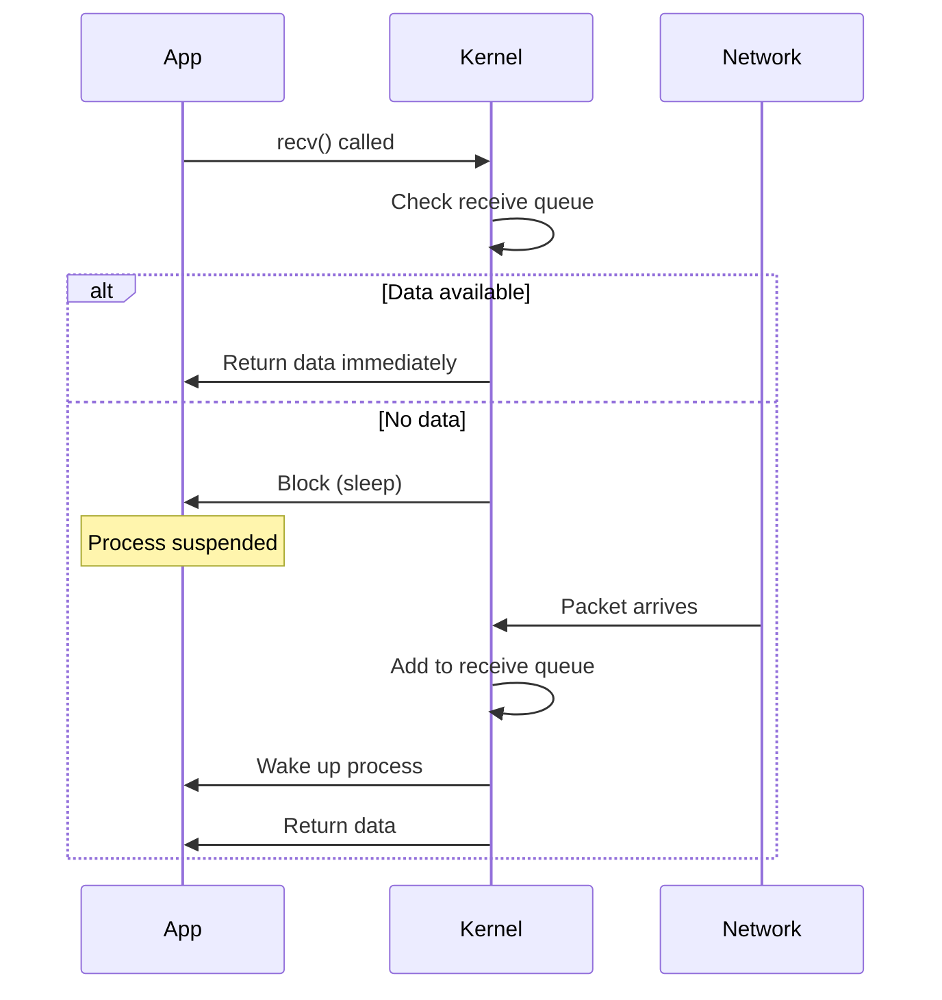

### Non-Blocking Mode

```c
// Set non-blocking
int flags = fcntl(sockfd, F_GETFL, 0);
fcntl(sockfd, F_SETFL, flags | O_NONBLOCK);

// Returns immediately with EAGAIN if no data
ssize_t n = recv(sockfd, buffer, size, 0);
if (n < 0 && errno == EAGAIN) {
    // No data available, try later
}
```

### Multiplexing with select()

```c
fd_set readfds;
struct timeval timeout;

while (1) {
    FD_ZERO(&readfds);
    FD_SET(sockfd1, &readfds);
    FD_SET(sockfd2, &readfds);
    FD_SET(sockfd3, &readfds);

    timeout.tv_sec = 5;
    timeout.tv_usec = 0;

    int ready = select(max_fd + 1, &readfds, NULL, NULL, &timeout);

    if (ready > 0) {
        if (FD_ISSET(sockfd1, &readfds)) {
            // Handle sockfd1
        }
        if (FD_ISSET(sockfd2, &readfds)) {
            // Handle sockfd2
        }
        // ...
    }
}
```

### High-Performance with epoll()

```c
int epollfd = epoll_create1(0);

struct epoll_event ev;
ev.events = EPOLLIN;
ev.data.fd = sockfd;
epoll_ctl(epollfd, EPOLL_CTL_ADD, sockfd, &ev);

struct epoll_event events[MAX_EVENTS];
while (1) {
    int nfds = epoll_wait(epollfd, events, MAX_EVENTS, -1);

    for (int i = 0; i < nfds; i++) {
        if (events[i].events & EPOLLIN) {
            // Data available on events[i].data.fd
            handle_read(events[i].data.fd);
        }
    }
}
```

**Performance Comparison:**

| Mechanism | Max FDs | Kernel Overhead | Use Case |
|-----------|---------|-----------------|----------|
| select() | 1024 | O(n) | Small # of sockets |
| poll() | Unlimited | O(n) | Medium # of sockets |
| epoll() | Unlimited | O(1) | Large # of sockets (servers) |

---

## Real-World Usage

### 1. Redis - Unix Socket Performance

Redis uses Unix domain sockets for local clients to avoid TCP overhead.

**Configuration:**
```conf
# redis.conf
unixsocket /var/run/redis/redis.sock
unixsocketperm 770
```

**Performance Benchmark:**
```bash
# TCP loopback
redis-benchmark -h 127.0.0.1 -p 6379 -t get,set -q
SET: 89285.71 requests per second
GET: 94339.62 requests per second

# Unix socket
redis-benchmark -s /var/run/redis/redis.sock -t get,set -q
SET: 152439.02 requests per second  # 70% faster!
GET: 158730.16 requests per second  # 68% faster!
```

**Why faster:**
- No TCP/IP stack traversal
- No checksumming
- No congestion control
- Shorter code path in kernel

### 2. Nginx - Unix Socket Backends

Nginx communicates with PHP-FPM, uWSGI, or Gunicorn via Unix sockets.

**nginx.conf:**
```nginx
upstream backend {
    server unix:/run/php-fpm.sock;
}

server {
    listen 80;

    location ~ \.php$ {
        fastcgi_pass unix:/run/php-fpm.sock;
        fastcgi_index index.php;
        include fastcgi_params;
    }
}
```

**Performance:**
- **~15-20% faster than TCP loopback**
- Lower latency
- Reduced memory usage (no TCP buffers)

### 3. Docker - Container Networking

Docker uses Unix sockets for CLI communication:

```bash
# Default Docker socket
/var/run/docker.sock

# Docker client connects via Unix socket
docker ps
# Actually: HTTP request to /var/run/docker.sock
# GET /v1.41/containers/json
```

**Architecture:**
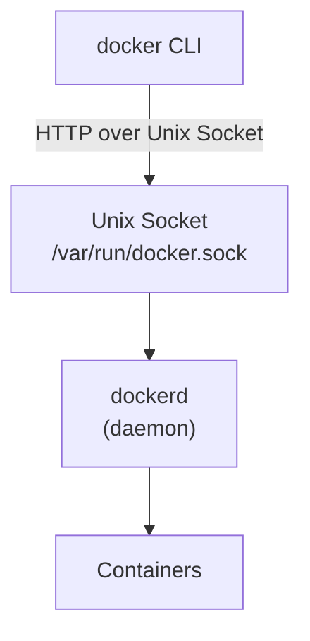

### 4. PostgreSQL - Local Connections

PostgreSQL defaults to Unix socket for local connections.

**Configuration:**
```conf
# postgresql.conf
unix_socket_directories = '/var/run/postgresql'
```

**Connection:**
```bash
# TCP connection
psql -h 127.0.0.1 -U postgres

# Unix socket connection (faster)
psql -h /var/run/postgresql -U postgres
```

**Performance:**
- **~10-15% lower latency**
- Simplified authentication (peer auth)

### 5. systemd - Socket Activation

systemd can listen on sockets and launch services on-demand.

**nginx.socket:**
```ini
[Unit]
Description=Nginx Socket

[Socket]
ListenStream=80
ListenStream=443

[Install]
WantedBy=sockets.target
```

**nginx.service:**
```ini
[Unit]
Description=Nginx Web Server
Requires=nginx.socket

[Service]
ExecStart=/usr/sbin/nginx -g 'daemon off;'
```

**Benefits:**
- Faster boot time
- Services started only when needed
- Socket handed off to service via FD passing

---

## TCP vs UDP Theory

### TCP (Transmission Control Protocol)

**Features:**

1. **Connection-oriented:**
   - 3-way handshake (SYN, SYN-ACK, ACK)
   - Connection state maintained

2. **Reliable:**
   - Acknowledgments (ACK)
   - Retransmission on loss
   - Sequence numbers ensure ordering

3. **Flow Control:**
   - Sliding window protocol
   - Receiver advertises window size
   - Prevents buffer overflow

4. **Congestion Control:**
   - Slow start
   - Congestion avoidance
   - Fast retransmit/recovery
   - Prevents network collapse

**TCP Congestion Window:**

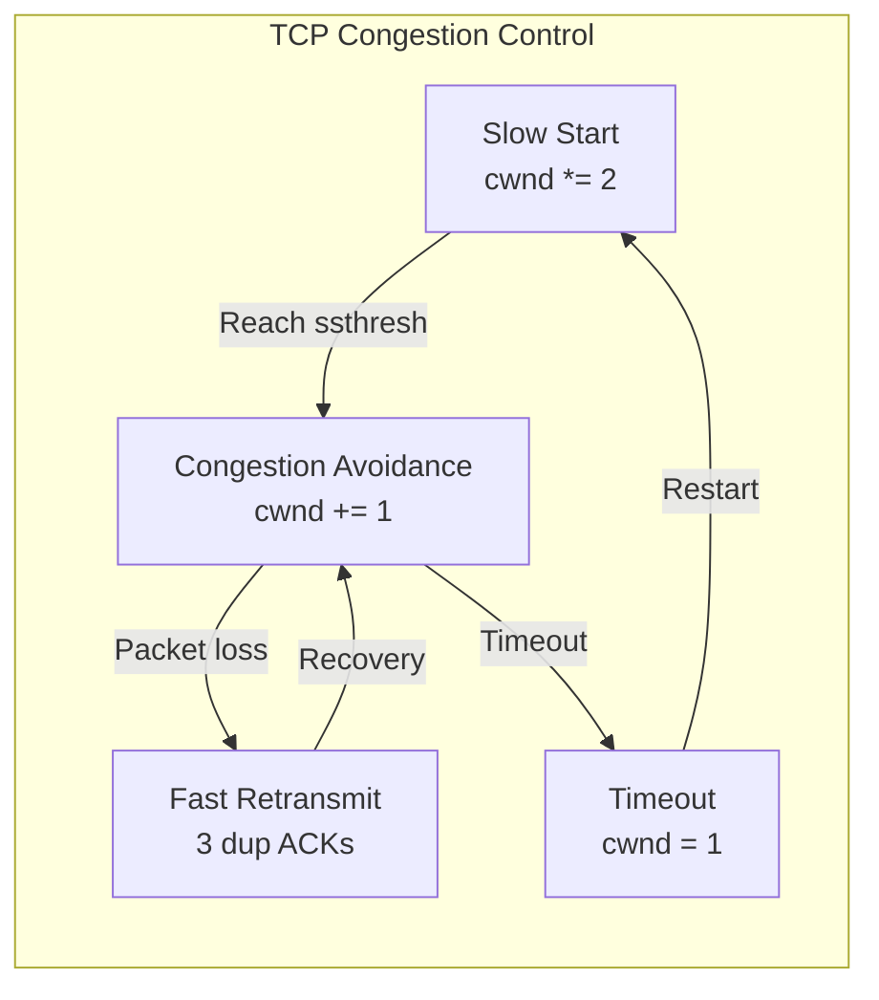

**Overhead:**
- 20 bytes TCP header (min)
- 20 bytes IP header (min)
- **Total: 40 bytes overhead per packet**

### UDP (User Datagram Protocol)

**Features:**

1. **Connectionless:**
   - No handshake
   - No connection state

2. **Unreliable:**
   - No acknowledgments
   - No retransmission
   - Packets may be lost, duplicated, or reordered

3. **Lightweight:**
   - 8-byte header only
   - Minimal processing

4. **Message boundaries:**
   - Preserves application message structure

**Use Cases:**
- **DNS**: Quick query/response
- **Streaming**: Packet loss acceptable
- **Gaming**: Low latency critical
- **VoIP**: Real-time, drop tolerance
- **DHCP**: Bootstrap protocol

### TCP vs UDP Comparison

| Feature | TCP | UDP |
|---------|-----|-----|
| **Connection** | Yes (3-way handshake) | No |
| **Reliability** | Guaranteed delivery | Best effort |
| **Ordering** | In-order delivery | No guarantee |
| **Speed** | Slower (overhead) | Faster (minimal) |
| **Header Size** | 20+ bytes | 8 bytes |
| **Flow Control** | Yes (sliding window) | No |
| **Congestion Control** | Yes | No |
| **Use Case** | HTTP, SSH, FTP | DNS, Streaming, Gaming |

---

## Advanced Concepts

### TCP Delayed ACK

**Problem:** Sending an ACK for every packet wastes bandwidth.

**Solution:** Wait up to 200ms for more data to piggyback ACK.

```c
// Disable delayed ACK
int flag = 1;
setsockopt(sockfd, IPPROTO_TCP, TCP_QUICKACK, &flag, sizeof(flag));
```

### Nagle's Algorithm

**Problem:** Sending many small packets wastes bandwidth.

**Solution:** Buffer small writes, send when:
- MTU-sized data available, OR
- ACK received for previous data

```c
// Disable Nagle (for real-time apps)
int flag = 1;
setsockopt(sockfd, IPPROTO_TCP, TCP_NODELAY, &flag, sizeof(flag));
```

### TCP Keep-Alive

**Purpose:** Detect dead connections.

```c
int keepalive = 1;
int keepidle = 60;    // Wait 60s before sending keepalive
int keepintvl = 10;   // Send every 10s
int keepcnt = 5;      // Send 5 probes

setsockopt(sockfd, SOL_SOCKET, SO_KEEPALIVE, &keepalive, sizeof(keepalive));
setsockopt(sockfd, IPPROTO_TCP, TCP_KEEPIDLE, &keepidle, sizeof(keepidle));
setsockopt(sockfd, IPPROTO_TCP, TCP_KEEPINTVL, &keepintvl, sizeof(keepintvl));
setsockopt(sockfd, IPPROTO_TCP, TCP_KEEPCNT, &keepcnt, sizeof(keepcnt));
```

### SO_REUSEPORT (Load Balancing)

**Feature:** Multiple sockets can bind to same port.

```c
int opt = 1;
setsockopt(sockfd, SOL_SOCKET, SO_REUSEPORT, &opt, sizeof(opt));
bind(sockfd, ...);  // Multiple processes can bind!
```

**Benefit:** Kernel distributes connections across sockets (load balancing).

### TCP Fast Open (TFO)

**Optimization:** Send data with SYN packet.

```c
// Server
int qlen = 5;
setsockopt(sockfd, IPPROTO_TCP, TCP_FASTOPEN, &qlen, sizeof(qlen));

// Client
sendto(sockfd, data, len, MSG_FASTOPEN, &addr, addrlen);
```

**Benefit:** Saves 1 RTT on subsequent connections.

---

## Best Practices

### 1. Always Check Return Values

```c
// WRONG
send(sockfd, buffer, len, 0);

// CORRECT
ssize_t sent = send(sockfd, buffer, len, 0);
if (sent < 0) {
    perror("send");
    // Handle error
} else if (sent < len) {
    // Partial send (TCP can do this!)
    // Need to send remaining bytes
}
```

### 2. Handle Partial Reads/Writes

```c
// Send all data
ssize_t send_all(int sockfd, const void *buf, size_t len) {
    size_t total = 0;
    const char *ptr = buf;

    while (total < len) {
        ssize_t sent = send(sockfd, ptr + total, len - total, 0);
        if (sent <= 0) {
            return sent;  // Error
        }
        total += sent;
    }

    return total;
}
```

### 3. Set Socket Options

```c
// Reuse address (avoid "Address already in use")
int opt = 1;
setsockopt(sockfd, SOL_SOCKET, SO_REUSEADDR, &opt, sizeof(opt));

// Set timeouts
struct timeval timeout;
timeout.tv_sec = 5;
timeout.tv_usec = 0;
setsockopt(sockfd, SOL_SOCKET, SO_RCVTIMEO, &timeout, sizeof(timeout));
setsockopt(sockfd, SOL_SOCKET, SO_SNDTIMEO, &timeout, sizeof(timeout));
```

### 4. Graceful Shutdown

```c
// Half-close: stop sending, still receive
shutdown(sockfd, SHUT_WR);

// Read remaining data
while (recv(sockfd, buffer, size, 0) > 0) {
    // Process data
}

close(sockfd);
```

### 5. Use Connection Pooling

```c
// Don't create new connections for every request
// Reuse existing connections (HTTP keep-alive)

Connection pool[] = { ... };
Connection *get_connection() {
    // Return available connection or create new
}
void release_connection(Connection *conn) {
    // Return to pool
}
```

---

## Limitations and Considerations

### 1. Port Exhaustion

**Problem:** Client has only ~64K ephemeral ports.

```
Available ports: 65535 - 1024 (privileged) = 64511
```

**Solution:**
- Use connection pooling
- Enable `SO_REUSEADDR`
- Increase port range: `/proc/sys/net/ipv4/ip_local_port_range`

### 2. File Descriptor Limits

```bash
# Check limits
ulimit -n

# Increase (temporary)
ulimit -n 65536

# Increase (permanent) - /etc/security/limits.conf
* soft nofile 65536
* hard nofile 65536
```

### 3. TIME_WAIT Sockets

**Problem:** Sockets stay in TIME_WAIT for 2*MSL (2 minutes).

**Mitigation:**
```bash
# Check TIME_WAIT sockets
ss -tan | grep TIME-WAIT | wc -l

# Enable reuse (Linux)
echo 1 > /proc/sys/net/ipv4/tcp_tw_reuse
```

### 4. TCP Head-of-Line Blocking

**Problem:** Lost packet blocks entire stream.

**Solution:** Use UDP (QUIC) or multiple TCP connections.

### 5. Slow Loris Attack

**Attack:** Keep many connections open, send data very slowly.

**Defense:**
- Connection timeouts
- Request rate limiting
- Load balancers with protection

---

## Comprehensive Resources

### Official Documentation

1. **POSIX Sockets**
   - socket(7): https://man7.org/linux/man-pages/man7/socket.7.html
   - tcp(7): https://man7.org/linux/man-pages/man7/tcp.7.html
   - udp(7): https://man7.org/linux/man-pages/man7/udp.7.html
   - unix(7): https://man7.org/linux/man-pages/man7/unix.7.html

2. **Linux Kernel**
   - Networking: https://linux-kernel-labs.github.io/refs/heads/master/labs/networking.html
   - net/socket.c: https://github.com/torvalds/linux/blob/master/net/socket.c
   - net/ipv4/tcp.c: https://github.com/torvalds/linux/blob/master/net/ipv4/tcp.c

### Books

3. **"Unix Network Programming"** by W. Richard Stevens
   - Volume 1: The definitive guide
   - Sockets API in depth

4. **"TCP/IP Illustrated"** by W. Richard Stevens
   - Volume 1: Protocols
   - Volume 2: Implementation

5. **"Linux Kernel Networking"** by Rami Rosen
   - Kernel implementation details

### Performance

6. **Benchmarks**
   - Unix vs TCP: https://www.baeldung.com/linux/ipc-performance-comparison
   - Redis benchmarks: https://redis.io/docs/management/optimization/benchmarks/

7. **Tools**
   - ss (socket statistics)
   - netstat
   - tcpdump
   - Wireshark

### Real-World Examples

8. **Nginx**
   - Socket configuration: https://nginx.org/en/docs/

9. **Redis**
   - Unix socket setup: https://redis.io/docs/management/config/

10. **PostgreSQL**
    - Connection methods: https://www.postgresql.org/docs/current/runtime-config-connection.html

---

**Summary:**

✅ **Sockets are best for:**
- Network communication (TCP/IP)
- Local IPC (Unix sockets - fastest)
- Bidirectional, full-duplex communication
- Client-server architectures
- Real-time applications (UDP)

❌ **Not suitable for:**
- Single-machine simple IPC (use pipes/shared memory)
- When message boundaries critical with TCP (use UDP or application protocol)

**Key Takeaways:**
- Berkeley Sockets (1983) - standard API
- Unix sockets: 2-3x faster than TCP loopback
- TCP: reliable, ordered, connection-oriented
- UDP: fast, unreliable, connectionless
- epoll/kqueue for high-performance servers
- Used everywhere: web servers, databases, Docker, systemd
