# Memory-Mapped Files (mmap) - Complete Guide

## Table of Contents
1. [Introduction](#introduction)
2. [Historical Context](#historical-context)
3. [Core Concepts](#core-concepts)
4. [System Calls](#system-calls)
5. [Kernel Architecture](#kernel-architecture)
6. [Virtual Memory and Page Tables](#virtual-memory-and-page-tables)
7. [Page Fault Handling](#page-fault-handling)
8. [Copy-on-Write (COW)](#copy-on-write-cow)
9. [Memory Mapping Types](#memory-mapping-types)
10. [Performance Characteristics](#performance-characteristics)
11. [Real-World Usage](#real-world-usage)
12. [IPC with mmap](#ipc-with-mmap)
13. [Advanced Concepts](#advanced-concepts)
14. [mmap vs read/write](#mmap-vs-readwrite)
15. [Limitations and Pitfalls](#limitations-and-pitfalls)
16. [Best Practices](#best-practices)
17. [Resources](#resources)

---

## Introduction

**Memory-mapped files** allow a process to map files or devices into memory. The contents of a file are mapped directly into the process's address space, enabling direct memory access to file contents without explicit read/write operations.

### What Problem Does mmap Solve?

Traditional file I/O:
```c
// Traditional approach - multiple copies
char buffer[SIZE];
read(fd, buffer, SIZE);    // Copy from kernel to buffer
process(buffer);           // Process data
write(fd, buffer, SIZE);   // Copy from buffer to kernel
```

Memory-mapped approach:
```c
// mmap - zero copy
char *ptr = mmap(NULL, size, PROT_READ | PROT_WRITE, MAP_SHARED, fd, 0);
ptr[0] = 'X';              // Direct memory access = file modification
```

**Key Advantages:**
- **Zero-copy**: No copying between kernel and user space
- **Demand paging**: Only load pages when accessed
- **Shared memory**: Multiple processes can map the same file
- **Simplified programming**: File access via pointer dereference

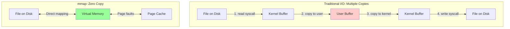

---

## Historical Context

### Timeline

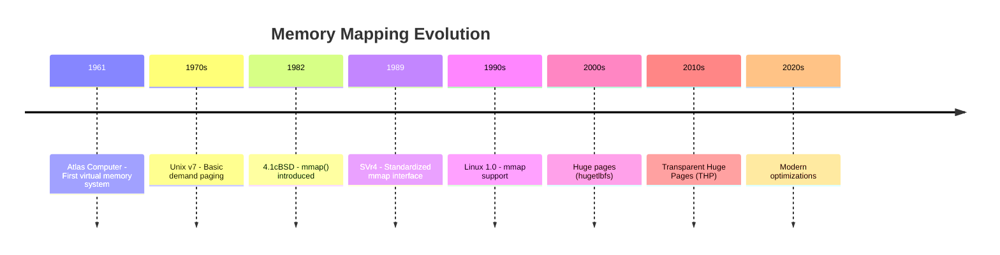

### 1982: 4.1cBSD - Birth of mmap()

Berkeley Unix introduced `mmap()` to:
- Support memory-mapped devices
- Enable shared libraries
- Improve file I/O performance

**Original motivation**: Shared libraries needed efficient code sharing between processes.

### 1990s: Linux Implementation

Linux kernel adopted mmap with enhancements:
- Demand paging implementation
- COW (Copy-on-Write) for fork()
- Memory-mapped devices (`/dev/mem`)

**Linus Torvalds**: "mmap is the right way to access files if you care about performance."

### 2000s: Large Pages

Problem: Large address spaces caused TLB (Translation Lookaside Buffer) thrashing.

Solution: **Huge pages** (2MB or 1GB pages instead of 4KB):
```c
fd = open("/mnt/hugepages/file", O_CREAT | O_RDWR, 0755);
ptr = mmap(NULL, size, PROT_READ | PROT_WRITE, MAP_SHARED, fd, 0);
```

**Performance impact**: Database workloads saw 10-30% performance improvement.

### 2010s: Transparent Huge Pages

Kernel automatically promotes 4KB pages to 2MB huge pages without application changes.

**Trade-off**: Performance vs memory fragmentation.

---

## Core Concepts

### Virtual Memory Mapping

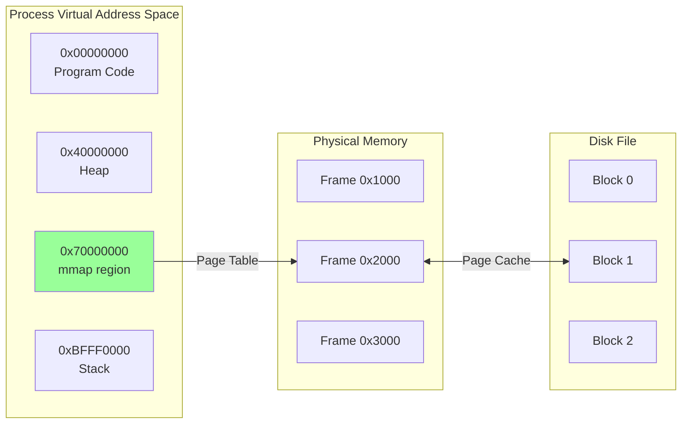

**Key concept**: Virtual addresses are translated to physical addresses via page tables.

### Memory Mapping Workflow

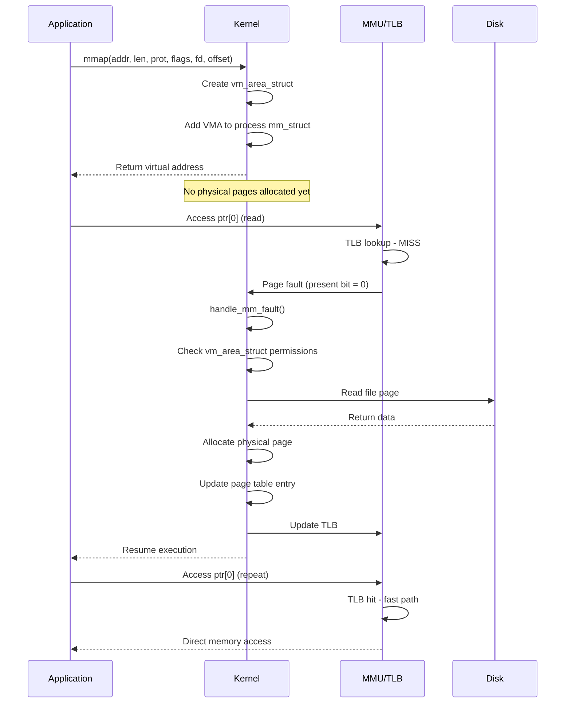

**Critical insight**: `mmap()` does **not** allocate physical memory or read from disk. It only establishes the virtual memory mapping. Physical pages are allocated on-demand via page faults.

---

## System Calls

### mmap() - Create Mapping

```c
#include <sys/mman.h>

void *mmap(void *addr, size_t length, int prot, int flags, int fd, off_t offset);
```

**Parameters:**
- `addr`: Preferred address (usually NULL for kernel to choose)
- `length`: Size of mapping (rounded up to page size)
- `prot`: Protection flags
- `flags`: Mapping type and options
- `fd`: File descriptor (or -1 for anonymous)
- `offset`: File offset (must be page-aligned)

**Returns:** Pointer to mapped region, or `MAP_FAILED` on error.

#### Protection Flags (prot)

```c
PROT_NONE   // No access
PROT_READ   // Read permission
PROT_WRITE  // Write permission
PROT_EXEC   // Execute permission

// Example: readable and writable
prot = PROT_READ | PROT_WRITE;
```

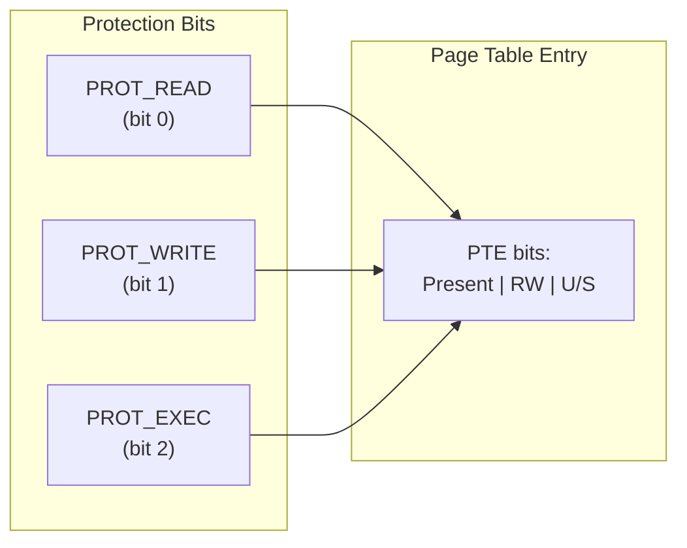

#### Mapping Flags (flags)

**Sharing:**
```c
MAP_SHARED   // Changes visible to other processes and written to file
MAP_PRIVATE  // Copy-on-write; changes not visible to others
```

**Allocation:**
```c
MAP_ANONYMOUS  // Not backed by file (fd = -1)
MAP_FIXED      // Use exact address specified
MAP_FIXED_NOREPLACE  // Like MAP_FIXED but fail if already mapped
```

**Performance:**
```c
MAP_POPULATE   // Prefault pages (avoid page faults later)
MAP_LOCKED     // Lock pages in memory (prevent swapping)
MAP_HUGETLB    // Use huge pages (2MB/1GB)
```

**Kernel (since Linux 4.15):**
```c
MAP_SYNC       // DAX mapping with persistent memory
```

### munmap() - Remove Mapping

```c
int munmap(void *addr, size_t length);
```

**Effect:**
- Removes mapping from process address space
- Frees virtual memory
- For `MAP_SHARED`, flushes dirty pages to disk

### msync() - Synchronize Mapping

```c
int msync(void *addr, size_t length, int flags);
```

**Flags:**
```c
MS_SYNC     // Synchronous write (block until complete)
MS_ASYNC    // Asynchronous write (schedule write, return immediately)
MS_INVALIDATE  // Invalidate cached data
```

**Use case**: Ensure data is written to disk before continuing.

```c
// Write-through to disk
ptr[0] = 'X';
msync(ptr, size, MS_SYNC);  // Block until written
```

### mprotect() - Change Protection

```c
int mprotect(void *addr, size_t length, int prot);
```

**Use cases:**
- Implementing guard pages
- JIT compilers (write code, then mark executable)
- Security (W^X: write XOR execute)

```c
// JIT compiler pattern
void *code = mmap(NULL, 4096, PROT_READ | PROT_WRITE,
                  MAP_PRIVATE | MAP_ANONYMOUS, -1, 0);
memcpy(code, machine_code, code_size);           // Write code
mprotect(code, 4096, PROT_READ | PROT_EXEC);     // Make executable
((void(*)())code)();                              // Execute
```

### madvise() - Give Advice

```c
int madvise(void *addr, size_t length, int advice);
```

**Advice flags:**
```c
MADV_NORMAL      // Default behavior
MADV_RANDOM      // Random access pattern
MADV_SEQUENTIAL  // Sequential access (read-ahead)
MADV_WILLNEED    // Expect access soon (prefetch)
MADV_DONTNEED    // Don't need pages (can drop)
MADV_HUGEPAGE    // Use huge pages if possible
```

**Performance impact**:
```c
// Sequential file processing
madvise(ptr, size, MADV_SEQUENTIAL);  // 2-3x faster for large files
```

### mincore() - Check Residency

```c
int mincore(void *addr, size_t length, unsigned char *vec);
```

Returns which pages are resident in memory (not swapped out).

**Use case**: Database buffer pool management.

---

## Kernel Architecture

### Key Data Structures

#### struct mm_struct - Process Memory Descriptor

```c
struct mm_struct {
    struct vm_area_struct *mmap;         // List of VMAs
    struct rb_root mm_rb;                // Red-black tree of VMAs
    pgd_t *pgd;                          // Page Global Directory
    atomic_t mm_users;                   // Number of users
    atomic_t mm_count;                   // Reference count
    unsigned long start_code, end_code;  // Code segment
    unsigned long start_data, end_data;  // Data segment
    unsigned long start_brk, brk;        // Heap
    unsigned long start_stack;           // Stack
    unsigned long arg_start, arg_end;    // Arguments
    unsigned long env_start, env_end;    // Environment
    unsigned long total_vm;              // Total pages mapped
    unsigned long locked_vm;             // Pages locked in memory
    // ...
};
```

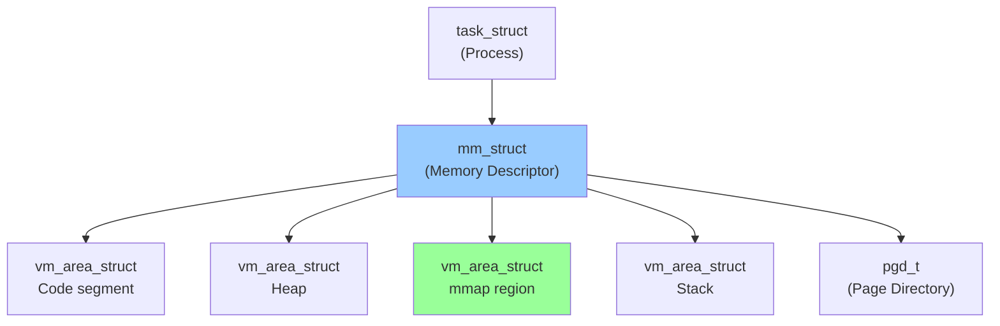

#### struct vm_area_struct - Virtual Memory Area

```c
struct vm_area_struct {
    unsigned long vm_start;              // Start address
    unsigned long vm_end;                // End address (exclusive)
    struct vm_area_struct *vm_next;      // Next VMA in list
    struct rb_node vm_rb;                // Red-black tree node
    pgprot_t vm_page_prot;              // Access permissions
    unsigned long vm_flags;              // Flags (VM_READ, VM_WRITE, etc.)
    struct file *vm_file;                // Mapped file (or NULL)
    const struct vm_operations_struct *vm_ops;  // Operations
    unsigned long vm_pgoff;              // Offset in file (pages)
    // ...
};
```

**VMA represents a contiguous virtual memory region** with uniform properties.

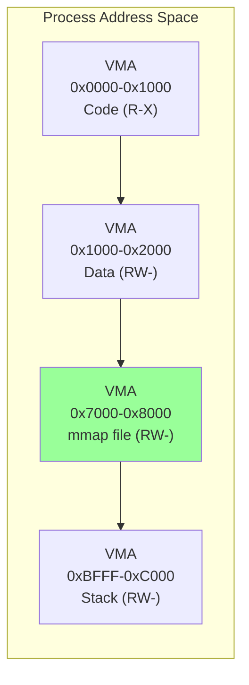

**VMA flags:**
```c
#define VM_READ      0x00000001  // Readable
#define VM_WRITE     0x00000002  // Writable
#define VM_EXEC      0x00000004  // Executable
#define VM_SHARED    0x00000008  // Shared mapping
#define VM_GROWSDOWN 0x00000100  // Stack-like (grows down)
#define VM_LOCKED    0x00002000  // Pages locked in memory
#define VM_HUGETLB   0x00400000  // Huge TLB pages
```

#### struct vm_operations_struct - VMA Operations

```c
struct vm_operations_struct {
    void (*open)(struct vm_area_struct *area);
    void (*close)(struct vm_area_struct *area);
    vm_fault_t (*fault)(struct vm_fault *vmf);          // Page fault handler
    vm_fault_t (*page_mkwrite)(struct vm_fault *vmf);   // COW handler
    // ...
};
```

**Key operation**: `fault()` is called on page fault to bring page into memory.

---

## Virtual Memory and Page Tables

### Multi-Level Page Table

Modern architectures use **multi-level page tables** to reduce memory overhead.

**x86-64 (4-level paging):**
```
Virtual Address (48 bits):
[47:39] PGD index (Page Global Directory)
[38:30] PUD index (Page Upper Directory)
[29:21] PMD index (Page Middle Directory)
[20:12] PTE index (Page Table Entry)
[11:0]  Offset within page (4KB)
```

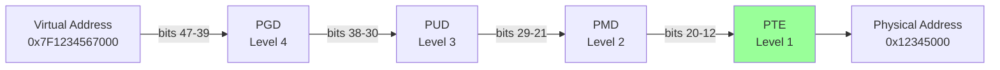

### Page Table Entry (PTE) Format

**x86-64 PTE (64 bits):**
```
[63]    Execute-disable (NX)
[62:52] Reserved
[51:12] Physical frame number (PFN)
[11:9]  Available for OS
[8]     Global (G)
[7]     Page size (PS)
[6]     Dirty (D) - page has been written
[5]     Accessed (A) - page has been accessed
[4]     Cache disable (PCD)
[3]     Write-through (PWT)
[2]     User/Supervisor (U/S)
[1]     Read/Write (R/W)
[0]     Present (P) - page is in memory
```

```c
// Simplified PTE structure
typedef struct {
    unsigned long present    : 1;   // 1 = in memory
    unsigned long rw         : 1;   // 1 = writable
    unsigned long user       : 1;   // 1 = user mode accessible
    unsigned long accessed   : 1;   // 1 = accessed since last clear
    unsigned long dirty      : 1;   // 1 = written since last clear
    unsigned long pfn        : 40;  // Physical frame number
    unsigned long nx         : 1;   // 1 = no execute
    // ...
} pte_t;
```

**Key insight**: When `present = 0`, accessing the page triggers a **page fault**.

### Translation Lookaside Buffer (TLB)

The TLB is a **hardware cache** for virtual-to-physical address translations.

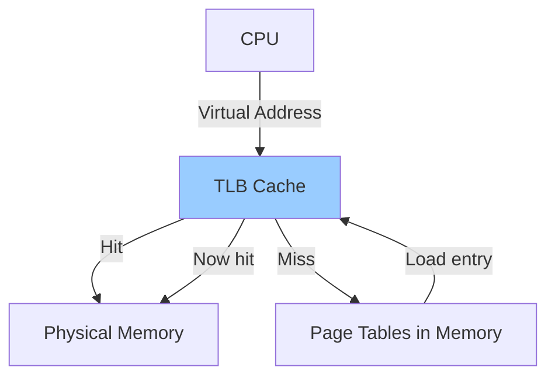

**TLB characteristics:**
- **Size**: 64-1024 entries (per core)
- **Hit rate**: 95-99% for typical workloads
- **Miss penalty**: 10-100 cycles (page table walk)

**Problem**: Large address spaces → low TLB hit rate → performance degradation.

**Solution**: Huge pages (2MB or 1GB) → fewer TLB entries needed.

```c
// TLB coverage calculation
// Standard pages: 1024 entries * 4KB = 4MB coverage
// Huge pages: 1024 entries * 2MB = 2GB coverage (500x better)
```

### TLB Shootdowns

When a page table entry changes, the TLB must be invalidated.

**Single core**: `invlpg` instruction.

**Multi-core**: Send **Inter-Processor Interrupt (IPI)** to all cores.

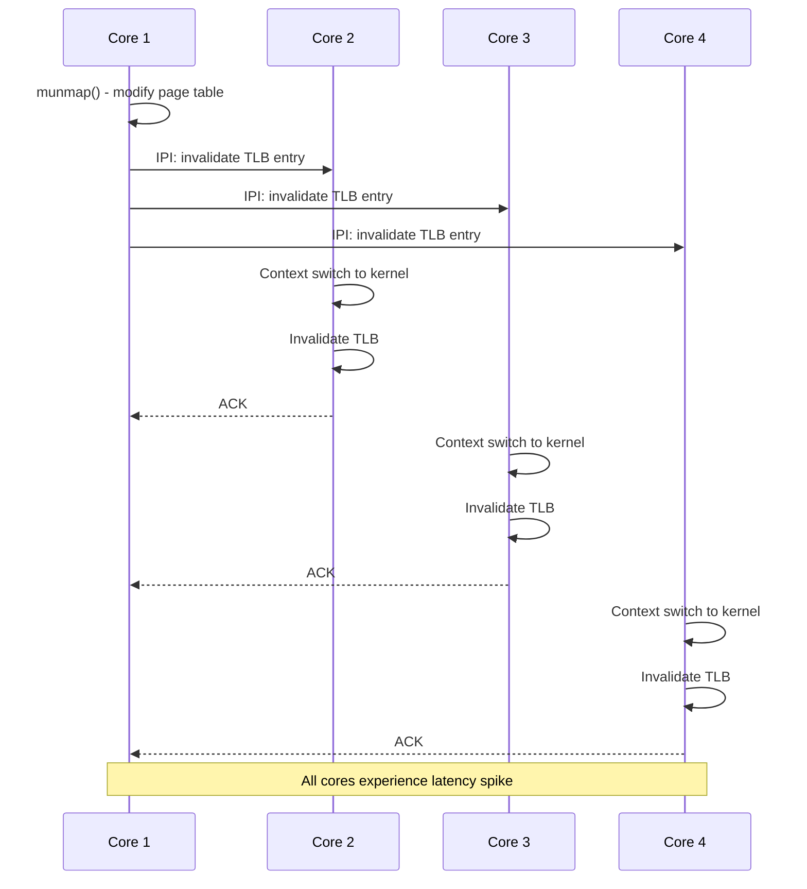

**Performance impact**: TLB shootdowns can cause **millisecond-scale latency spikes**.

**Mitigation**: Recent kernels skip TLB flushes for reused pages in mmap.

---

## Page Fault Handling

### Page Fault Types

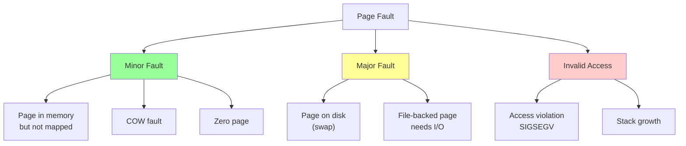

**Minor fault**: Resolved without disk I/O (~1 microsecond).

**Major fault**: Requires disk I/O (~1-10 milliseconds).

### Page Fault Handling Flow

```c
// Simplified kernel page fault handler
void do_page_fault(struct pt_regs *regs, unsigned long error_code,
                   unsigned long address)
{
    struct mm_struct *mm = current->mm;
    struct vm_area_struct *vma;

    // 1. Find VMA containing faulting address
    vma = find_vma(mm, address);
    if (!vma || vma->vm_start > address) {
        // Invalid access - no VMA covers this address
        goto bad_area;
    }

    // 2. Check permissions
    if (error_code & FAULT_FLAG_WRITE) {
        if (!(vma->vm_flags & VM_WRITE))
            goto bad_area;
    }

    // 3. Handle the fault
    return handle_mm_fault(vma, address, flags);

bad_area:
    // Send SIGSEGV to process
    do_segfault(regs, error_code, address);
}
```

### Page Fault Handling Sequence

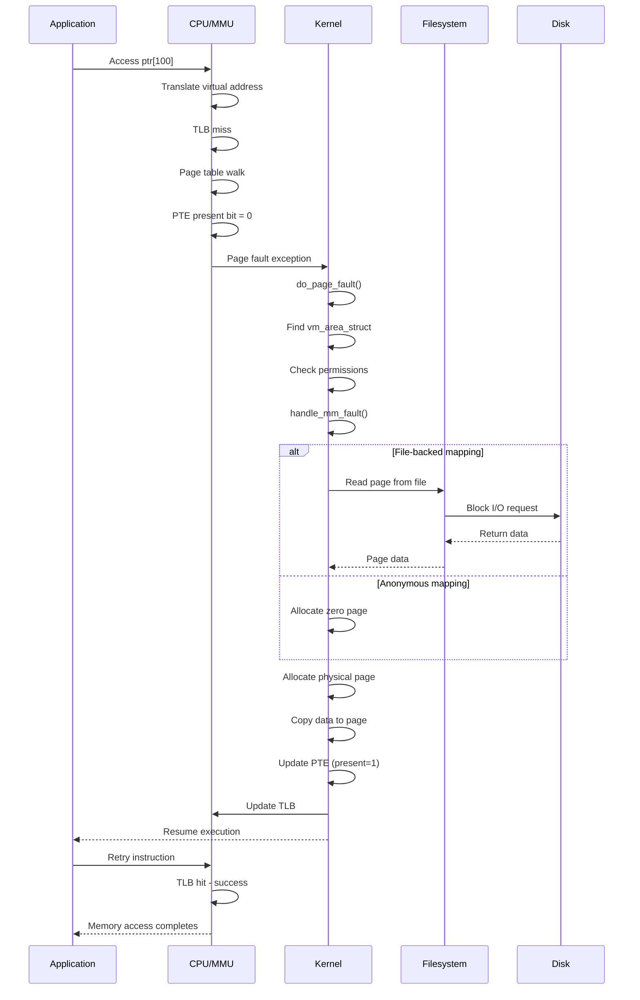

### Demand Paging in Action

**Example**: Map a 1GB file, access only 4KB.

```c
// Map 1GB file
void *ptr = mmap(NULL, 1UL << 30, PROT_READ | PROT_WRITE,
                 MAP_SHARED, fd, 0);
// Kernel: Create VMA, NO physical memory allocated

// Access first byte
char c = ptr[0];
// Kernel: Page fault → allocate 1 page (4KB) → read from disk

// Result: Only 4KB of 1GB is actually loaded
```

**Benefit**: Fast mmap() call, memory allocated only as needed.

---

## Copy-on-Write (COW)

### COW with fork()

When a process forks, the child initially **shares** all pages with the parent using COW.

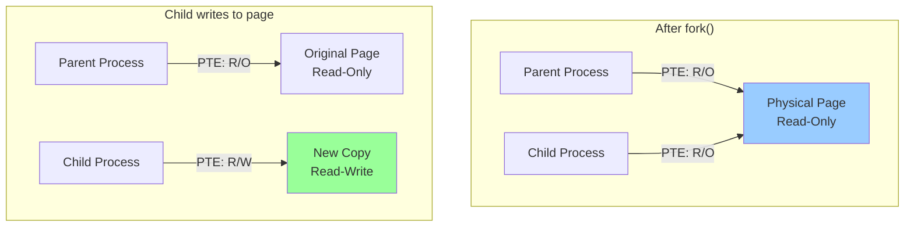

**Implementation**:
1. During `fork()`, mark all pages as read-only in both parent and child
2. Share physical pages between processes
3. On write attempt → page fault
4. Kernel allocates new page, copies data, updates PTE to writable

```c
// Simplified COW fault handler
vm_fault_t do_cow_fault(struct vm_fault *vmf)
{
    struct vm_area_struct *vma = vmf->vma;
    struct page *old_page = vmf->page;

    // 1. Check if we're the only user
    if (page_mapcount(old_page) == 1) {
        // Only one user - just make it writable
        wp_page_reuse(vmf);
        return VM_FAULT_WRITE;
    }

    // 2. Multiple users - need to copy
    struct page *new_page = alloc_page_vma(GFP_HIGHUSER_MOVABLE, vma, vmf->address);
    copy_user_highpage(new_page, old_page, vmf->address, vma);

    // 3. Update page table to point to new page
    set_pte_at(vma->vm_mm, vmf->address, vmf->pte,
               pte_mkdirty(pte_mkwrite(mk_pte(new_page, vma->vm_page_prot))));

    // 4. Decrement reference count on old page
    put_page(old_page);

    return VM_FAULT_WRITE;
}
```

### COW with MAP_PRIVATE

`MAP_PRIVATE` mappings use COW for modifications.

```c
// Map file privately
void *ptr = mmap(NULL, size, PROT_READ | PROT_WRITE,
                 MAP_PRIVATE, fd, 0);

// Read: Uses original file page
char c = ptr[0];

// Write: COW fault → allocate new page
ptr[0] = 'X';  // Original file unchanged
```

**Use case**: Load shared libraries - code sections shared, data sections COW.

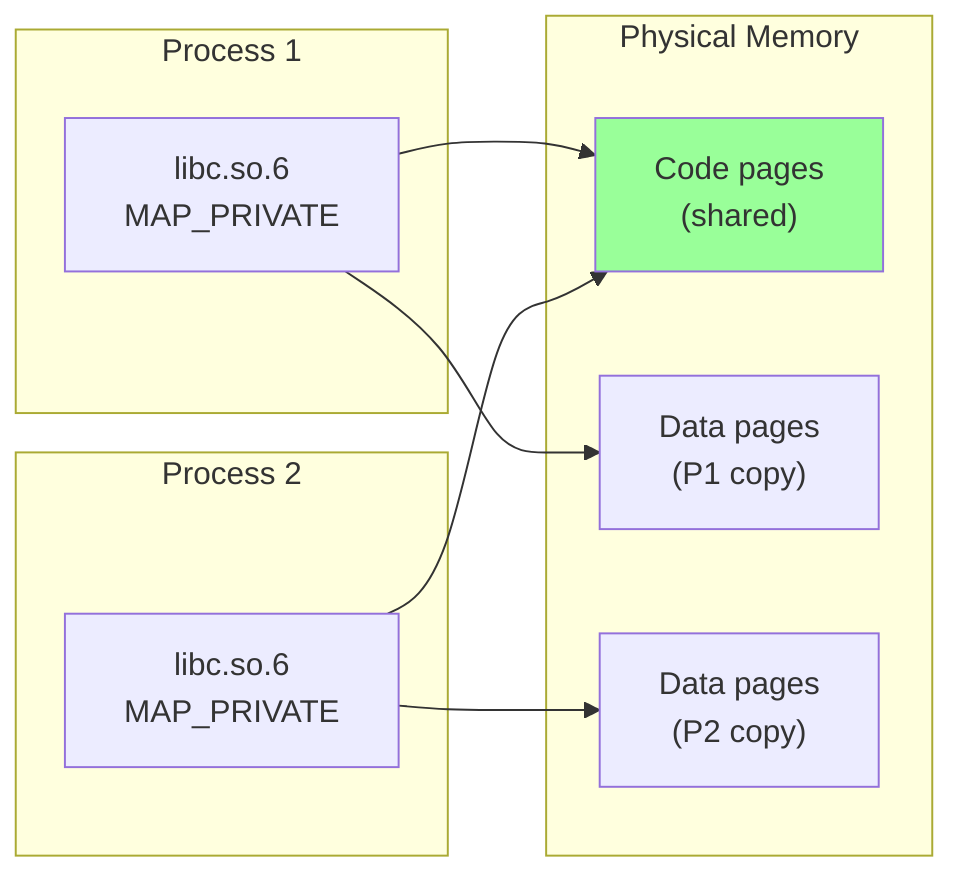

### Reference Counting

The kernel tracks how many processes reference each page.

```c
struct page {
    atomic_t _refcount;           // Reference count
    atomic_t _mapcount;           // Number of PTEs mapping this page
    // ...
};

// Page freed only when both counts reach 0
if (atomic_read(&page->_refcount) == 0 &&
    atomic_read(&page->_mapcount) == 0) {
    free_page(page);
}
```

---

## Memory Mapping Types

### 1. File-Backed Mapping

Map a file into memory.

```c
int fd = open("data.bin", O_RDWR);
void *ptr = mmap(NULL, size, PROT_READ | PROT_WRITE, MAP_SHARED, fd, 0);
ptr[0] = 'X';  // Modifies file
msync(ptr, size, MS_SYNC);  // Ensure written to disk
munmap(ptr, size);
close(fd);
```

**Characteristics:**
- Pages backed by file on disk
- Major faults read from file
- Dirty pages written back on `msync()` or `munmap()`

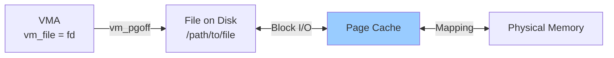

### 2. Anonymous Mapping

Memory not backed by any file.

```c
void *ptr = mmap(NULL, size, PROT_READ | PROT_WRITE,
                 MAP_PRIVATE | MAP_ANONYMOUS, -1, 0);
ptr[0] = 42;  // Just memory allocation
```

**Use cases:**
- Heap allocations (malloc for large sizes)
- Anonymous shared memory (MAP_SHARED | MAP_ANONYMOUS)
- Stack expansion

**Backing store**: Swap space (if enabled).

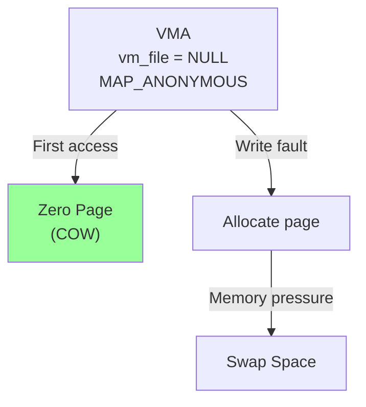

**Optimization**: Initial reads served by a **global zero page** (COW).

### 3. Shared Anonymous Mapping

Shared memory between related processes.

```c
// Parent creates shared region
void *shared = mmap(NULL, 4096, PROT_READ | PROT_WRITE,
                    MAP_SHARED | MAP_ANONYMOUS, -1, 0);

pid_t pid = fork();
if (pid == 0) {
    // Child can access shared memory
    *(int*)shared = 42;
    exit(0);
}

wait(NULL);
printf("Value: %d\n", *(int*)shared);  // 42
```

**Advantage**: No file needed (unlike `shm_open()`).

### 4. Device Mapping

Map device memory (e.g., GPU framebuffer).

```c
int fd = open("/dev/fb0", O_RDWR);  // Framebuffer device
void *fb = mmap(NULL, screensize, PROT_READ | PROT_WRITE,
                MAP_SHARED, fd, 0);
// Direct access to video memory
((uint32_t*)fb)[0] = 0xFF0000;  // Draw red pixel
```

**Characteristics:**
- No page cache
- Direct mapping to device memory
- May be uncached or write-combining

---

## Performance Characteristics

### Memory Overhead

```c
// Per-VMA overhead
sizeof(struct vm_area_struct) = ~200 bytes

// Per-page overhead (if mapped)
sizeof(struct page) = 64 bytes (for 4KB page)
// Overhead: 64 / 4096 = 1.56%

// Page table overhead (4-level)
// Worst case: 8 bytes per level per page
// For 1GB: 1GB / 4KB * 32 bytes = 8MB page tables
```

### mmap() Performance

```c
// mmap() is fast - O(1) typically
// Just creates VMA, no physical memory allocation
time_t start = time(NULL);
void *ptr = mmap(NULL, 1UL << 30, PROT_READ, MAP_PRIVATE, fd, 0);  // 1GB
time_t end = time(NULL);
// Typically < 1 microsecond
```

### Page Fault Overhead

**Minor fault**: 1-10 microseconds.

**Major fault**: 1-10 milliseconds (disk I/O).

```c
// Measure page faults
struct rusage usage;
getrusage(RUSAGE_SELF, &usage);
printf("Minor faults: %ld\n", usage.ru_minflt);
printf("Major faults: %ld\n", usage.ru_majflt);
```

### Prefaulting with MAP_POPULATE

```c
// Prefault all pages at mmap() time
void *ptr = mmap(NULL, size, PROT_READ | PROT_WRITE,
                 MAP_PRIVATE | MAP_POPULATE, fd, 0);
// All pages faulted in - no page faults later
```

**Trade-off**: Slower mmap(), but faster subsequent access.

**Use case**: Real-time applications that can't tolerate page faults.

### Large Pages Performance

```c
// Standard 4KB pages
// 1GB mapped → 262,144 pages → 262,144 TLB entries needed

// 2MB huge pages
// 1GB mapped → 512 pages → 512 TLB entries needed
// TLB hit rate: 95% → 99%
```

**Performance gain**: 10-30% for memory-intensive workloads.

### Zero-Copy Benefit

**Traditional read/write**:
```c
// 4 copies total
read(fd, buffer, size);   // 1. Disk → Page cache
                          // 2. Page cache → User buffer
write(fd2, buffer, size); // 3. User buffer → Page cache
                          // 4. Page cache → Disk
```

**mmap approach**:
```c
void *ptr = mmap(NULL, size, PROT_READ | PROT_WRITE, MAP_SHARED, fd, 0);
// 0 copies (direct access to page cache)
ptr[0] = 'X';             // Modify page cache directly
```

**Speedup**: 2-3x for large files (> 1MB).

---

## Real-World Usage

### 1. Databases - Buffer Pools

**Problem**: Should databases use mmap?

**Historical**: MongoDB MMAPv1 storage engine used mmap.

**Current**: Most databases avoid mmap for data files.

#### Why Databases Avoid mmap

**Paper**: "Are You Sure You Want to Use MMAP in Your Database Management System?" (CMU, 2016)

**Three key bottlenecks**:

1. **Page Table Contention**
   - Large databases → large page tables → lock contention
   - Solution: Buffer pools with custom page management

2. **Single-Threaded Page Eviction**
   - OS page eviction is single-threaded
   - Database workloads need multi-threaded eviction

3. **TLB Shootdowns**
   - Multi-core systems experience IPI storms
   - Causes millisecond-scale latency spikes

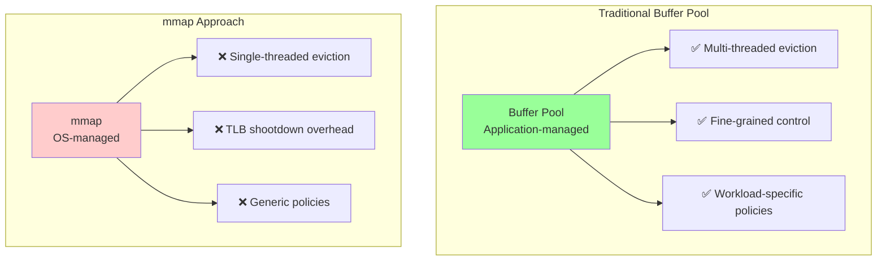

**Exception**: **LMDB** (Lightning Memory-Mapped Database)
- Uses mmap exclusively
- No buffer pool, no WAL
- Designed for read-heavy workloads
- Copy-on-write B+ tree
- Performance: 10x faster than SQLite

```c
// LMDB relies on mmap
MDB_env *env;
mdb_env_create(&env);
mdb_env_open(env, "data.mdb", MDB_NOSUBDIR, 0644);
// All operations via direct memory access
```

### 2. Shared Libraries - Dynamic Linker

Shared libraries (`.so` files) are mapped into every process.

```bash
$ ldd /bin/ls
    linux-vdso.so.1
    libc.so.6 => /lib/x86_64-linux-gnu/libc.so.6
```

```c
// Dynamic linker (ld.so) maps shared library
int fd = open("libc.so.6", O_RDONLY);

// Code segment: shared, read-only
void *code = mmap(NULL, code_size, PROT_READ | PROT_EXEC,
                  MAP_PRIVATE, fd, 0);

// Data segment: private, COW
void *data = mmap(NULL, data_size, PROT_READ | PROT_WRITE,
                  MAP_PRIVATE, fd, code_offset);
```

**Memory savings**: 1 copy of libc.so code shared by all processes.

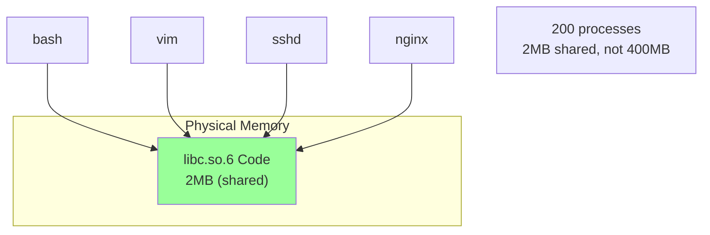

### 3. Memory-Mapped I/O (MMIO)

**Use case**: Access hardware registers.

```c
// Map GPIO registers on Raspberry Pi
#define GPIO_BASE 0x3F200000
int fd = open("/dev/mem", O_RDWR | O_SYNC);
volatile uint32_t *gpio = mmap(NULL, 4096, PROT_READ | PROT_WRITE,
                               MAP_SHARED, fd, GPIO_BASE);

// Direct hardware access
gpio[7] = (1 << 4);   // Set GPIO pin 4 high
```

**Advantage**: Direct memory access, no system calls.

### 4. Java - Direct ByteBuffers

Java NIO uses mmap for large file operations.

```java
FileChannel channel = FileChannel.open(path, StandardOpenOption.READ);
MappedByteBuffer buffer = channel.map(FileChannel.MapMode.READ_ONLY, 0, channel.size());
// Access file via buffer - backed by mmap
byte b = buffer.get(1000);
```

**Performance**: 2-4x faster than BufferedInputStream for large files.

### 5. Zero-Copy File Transfer

```c
// sendfile() - zero-copy file transmission
int sock = socket(AF_INET, SOCK_STREAM, 0);
int fd = open("large_file.bin", O_RDONLY);
off_t offset = 0;
sendfile(sock, fd, &offset, file_size);
// File sent without copying to user space
```

**Implementation**: Uses mmap internally (or direct DMA).

### 6. Git - Pack Files

Git uses mmap to access pack files efficiently.

```c
// Git's use-mmap wrapper
void *xmmap(void *start, size_t length, int prot, int flags, int fd, off_t offset)
{
    void *ret = mmap(start, length, prot, flags, fd, offset);
    if (ret == MAP_FAILED)
        die("Out of memory? mmap failed");
    return ret;
}
```

**Benefit**: Fast object lookup without explicit I/O.

---

## IPC with mmap

### Shared Memory via File-Backed mmap

Two unrelated processes can communicate via a shared file.

**Process 1 (Writer)**:
```c
#include <sys/mman.h>
#include <fcntl.h>
#include <string.h>

int main() {
    // Create and resize file
    int fd = open("/tmp/shared", O_CREAT | O_RDWR, 0666);
    ftruncate(fd, 4096);

    // Map file
    char *ptr = mmap(NULL, 4096, PROT_READ | PROT_WRITE, MAP_SHARED, fd, 0);

    // Write data
    strcpy(ptr, "Hello from process 1");

    // Ensure written to memory
    msync(ptr, 4096, MS_SYNC);

    munmap(ptr, 4096);
    close(fd);
    return 0;
}
```

**Process 2 (Reader)**:
```c
#include <sys/mman.h>
#include <fcntl.h>
#include <stdio.h>

int main() {
    // Open existing file
    int fd = open("/tmp/shared", O_RDONLY);

    // Map file
    char *ptr = mmap(NULL, 4096, PROT_READ, MAP_SHARED, fd, 0);

    // Read data
    printf("Received: %s\n", ptr);

    munmap(ptr, 4096);
    close(fd);
    return 0;
}
```

**Synchronization**: Use semaphores or file locks.

### Shared Anonymous Mapping

Faster alternative for related processes (parent-child).

```c
#include <sys/mman.h>
#include <sys/wait.h>
#include <stdio.h>

struct shared_data {
    int counter;
    char message[256];
};

int main() {
    // Create shared region
    struct shared_data *data = mmap(NULL, sizeof(*data),
                                     PROT_READ | PROT_WRITE,
                                     MAP_SHARED | MAP_ANONYMOUS, -1, 0);

    data->counter = 0;

    pid_t pid = fork();
    if (pid == 0) {
        // Child
        data->counter = 42;
        strcpy(data->message, "Hello from child");
        exit(0);
    }

    // Parent
    wait(NULL);
    printf("Counter: %d\n", data->counter);
    printf("Message: %s\n", data->message);

    munmap(data, sizeof(*data));
    return 0;
}
```

**Advantage**: No file creation needed.

### Performance Comparison

**mmap IPC vs other mechanisms**:

| Mechanism | Latency | Throughput | Setup |
|-----------|---------|------------|-------|
| mmap (anonymous) | ~50 ns | ~20 GB/s | Easy |
| mmap (file-backed) | ~100 ns | ~15 GB/s | Easy |
| POSIX shm | ~50 ns | ~20 GB/s | Moderate |
| Pipes | ~500 ns | ~10 GB/s | Easy |
| Unix sockets | ~2 µs | ~3 GB/s | Moderate |

**Conclusion**: mmap is fastest for large data transfers between processes on same machine.

---

## Advanced Concepts

### 1. Huge Pages (HugeTLB)

**Problem**: Standard 4KB pages cause TLB thrashing for large memory regions.

**Solution**: Use 2MB or 1GB pages.

#### Transparent Huge Pages (THP)

Kernel automatically promotes pages to huge pages.

```bash
# Check THP status
cat /sys/kernel/mm/transparent_hugepage/enabled
# [always] madvise never

# Enable for specific region
madvise(ptr, size, MADV_HUGEPAGE);
```

#### Explicit Huge Pages

```c
// Mount hugetlbfs
// sudo mount -t hugetlbfs none /mnt/hugepages

int fd = open("/mnt/hugepages/myfile", O_CREAT | O_RDWR, 0755);
ftruncate(fd, 1UL << 30);  // 1GB

void *ptr = mmap(NULL, 1UL << 30, PROT_READ | PROT_WRITE,
                 MAP_SHARED | MAP_HUGETLB, fd, 0);
```

**Performance gain**:
```c
// Standard 4KB pages: 1GB = 262,144 TLB entries
// 2MB huge pages: 1GB = 512 TLB entries (500x fewer)
```

### 2. Memory Overcommit

Linux allows allocating more memory than physically available.

```c
void *ptr = mmap(NULL, 1UL << 40, PROT_READ | PROT_WRITE,
                 MAP_PRIVATE | MAP_ANONYMOUS, -1, 0);
// Returns success even if only 8GB RAM
// Actual allocation happens on access (demand paging)
```

**Risk**: OOM (Out-Of-Memory) killer may terminate processes.

**Control**:
```bash
# /proc/sys/vm/overcommit_memory
# 0: Heuristic (default)
# 1: Always overcommit
# 2: Never overcommit more than swap + RAM * ratio
```

### 3. Page Cache and File-Backed Mapping

File-backed mappings share the **page cache** with normal file I/O.

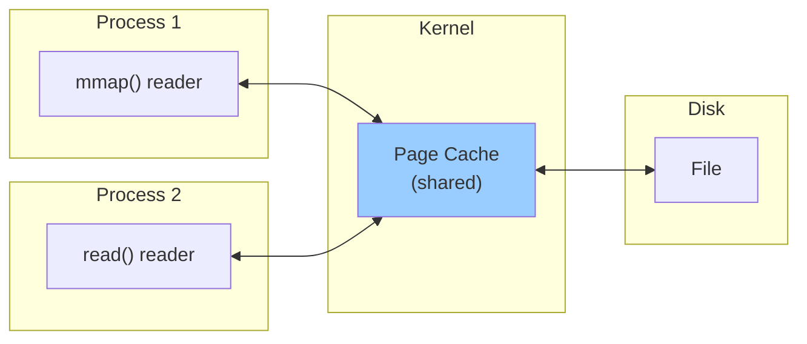

**Implication**: Reading file via `read()` populates page cache for mmap (and vice versa).

### 4. Dirty Page Writeback

Modified pages are written back asynchronously.

```c
// Dirty page writeback parameters
// /proc/sys/vm/dirty_ratio - Max % of RAM that can be dirty
// /proc/sys/vm/dirty_background_ratio - Background writeback threshold
// /proc/sys/vm/dirty_expire_centisecs - Age before forced writeback
```

**Force immediate writeback**:
```c
msync(ptr, size, MS_SYNC);      // Block until complete
msync(ptr, size, MS_ASYNC);     // Schedule writeback, return immediately
```

### 5. mlock() - Lock Pages in Memory

Prevent pages from being swapped out.

```c
// Lock pages in RAM
mlock(ptr, size);

// Check locked memory limit
struct rlimit rl;
getrlimit(RLIMIT_MEMLOCK, &rl);
printf("Max locked: %lu KB\n", rl.rlim_cur / 1024);
```

**Use case**: Real-time systems, cryptographic keys.

### 6. mmap and NUMA

On NUMA systems, page placement matters.

```c
#include <numaif.h>

void *ptr = mmap(NULL, size, PROT_READ | PROT_WRITE,
                 MAP_PRIVATE | MAP_ANONYMOUS, -1, 0);

// Bind pages to specific NUMA node
unsigned long nodemask = 1 << 0;  // Node 0
mbind(ptr, size, MPOL_BIND, &nodemask, 2, MPOL_MF_STRICT);
```

**Performance impact**: Local vs remote memory access can differ by 2-3x.

### 7. DAX (Direct Access)

For persistent memory (NVDIMM), bypass page cache entirely.

```c
int fd = open("/mnt/pmem/file", O_RDWR | O_DIRECT);
void *ptr = mmap(NULL, size, PROT_READ | PROT_WRITE,
                 MAP_SHARED | MAP_SYNC, fd, 0);
// Direct access to persistent memory, no page cache
```

**Latency**: ~100 ns (vs ~10 ms for disk).

---

## mmap vs read/write

### Performance Comparison

**Benchmark setup**: Read 1GB file sequentially.

| Method | Time | Throughput | CPU |
|--------|------|------------|-----|
| read() | 1.2s | 850 MB/s | 15% |
| mmap (no prefault) | 0.8s | 1250 MB/s | 10% |
| mmap (MAP_POPULATE) | 0.6s | 1600 MB/s | 8% |

**Conclusion**: mmap is 30-100% faster for large files.

### When to Use read/write

**Prefer read/write when**:
1. **Small reads**: < 16KB (syscall overhead negligible)
2. **Sequential processing**: Streaming data once
3. **Portability**: mmap has platform-specific quirks
4. **Error handling**: SIGBUS vs errno

```c
// read() has predictable error handling
ssize_t n = read(fd, buf, size);
if (n < 0) {
    perror("read failed");
}

// mmap can cause SIGBUS on access
char *ptr = mmap(...);
char c = ptr[0];  // May SIGBUS if file truncated
```

### When to Use mmap

**Prefer mmap when**:
1. **Random access**: Jumping around in file
2. **Large files**: > 1MB
3. **Shared access**: Multiple processes reading same file
4. **Memory-mapped data structures**: Directly accessing structured data

```c
// Random access example
void *ptr = mmap(NULL, size, PROT_READ, MAP_PRIVATE, fd, 0);

// Jump to offset 1GB instantly
char c = ptr[1UL << 30];  // No seek needed

// Access different regions without penalty
process(ptr + 100000);
process(ptr + 500000);
```

### Code Comparison

**read() approach**:
```c
int fd = open("large.dat", O_RDONLY);
struct stat st;
fstat(fd, &st);

char *buf = malloc(st.st_size);
ssize_t total = 0;
while (total < st.st_size) {
    ssize_t n = read(fd, buf + total, st.st_size - total);
    if (n <= 0) break;
    total += n;
}

// Process buffer
process(buf, st.st_size);

free(buf);
close(fd);
```

**mmap approach**:
```c
int fd = open("large.dat", O_RDONLY);
struct stat st;
fstat(fd, &st);

char *ptr = mmap(NULL, st.st_size, PROT_READ, MAP_PRIVATE, fd, 0);

// Process directly
process(ptr, st.st_size);

munmap(ptr, st.st_size);
close(fd);
```

**Advantages**:
- Fewer lines of code
- No buffer allocation
- No explicit I/O loop
- Kernel handles demand paging

---

## Limitations and Pitfalls

### 1. 32-bit Address Space Exhaustion

**Problem**: 32-bit systems have only 4GB address space (3GB user-accessible).

```c
// On 32-bit system
void *ptr = mmap(NULL, 4UL << 30, PROT_READ, MAP_PRIVATE, fd, 0);  // 4GB
// Likely fails: not enough virtual address space
```

**Solution**: Use 64-bit systems or window into file.

### 2. SIGBUS on File Truncation

**Problem**: Accessing mapped region after file is truncated.

```c
// Process 1
int fd = open("file", O_RDWR);
ftruncate(fd, 4096);
char *ptr = mmap(NULL, 4096, PROT_READ | PROT_WRITE, MAP_SHARED, fd, 0);

// Process 2 truncates file
ftruncate(fd, 0);

// Process 1 accesses memory
char c = ptr[100];  // SIGBUS! Page no longer backed by file
```

**Solution**: Handle SIGBUS or use file locking.

```c
void sigbus_handler(int sig) {
    fprintf(stderr, "SIGBUS: file was truncated\n");
    exit(1);
}

signal(SIGBUS, sigbus_handler);
```

### 3. Memory Leaks

**Problem**: Forgetting to unmap.

```c
void leak() {
    void *ptr = mmap(NULL, 1 << 20, PROT_READ | PROT_WRITE,
                     MAP_PRIVATE | MAP_ANONYMOUS, -1, 0);
    // Forgot munmap!
    return;
}

// Virtual memory leaked (not freed until process exits)
```

**Solution**: Always `munmap()`.

### 4. Overcommit and OOM

**Problem**: Allocating huge regions that are later accessed.

```c
void *ptr = mmap(NULL, 100UL << 30, PROT_READ | PROT_WRITE,
                 MAP_PRIVATE | MAP_ANONYMOUS, -1, 0);  // 100GB
// Succeeds due to overcommit

// Later...
memset(ptr, 0, 100UL << 30);  // OOM killer may terminate process
```

**Solution**: Check `/proc/sys/vm/overcommit_memory`, use MAP_NORESERVE cautiously.

### 5. Performance with Many Small Files

**Problem**: mmap overhead exceeds benefits for small files.

```c
// Bad: mmap for 1KB file
void *ptr = mmap(NULL, 1024, PROT_READ, MAP_PRIVATE, fd, 0);
// Setup overhead (TLB, page table) > savings

// Better: just read()
char buf[1024];
read(fd, buf, 1024);
```

**Rule of thumb**: mmap beneficial for files > 16KB.

### 6. Write Ordering

**Problem**: Writes may not be ordered as expected.

```c
ptr[0] = 1;
ptr[100] = 2;
// Order NOT guaranteed to reach disk as written
// OS may reorder for performance
```

**Solution**: Use `msync()` with `MS_SYNC` for ordering guarantees.

### 7. TLB Shootdowns on Multi-Core

**Problem**: Unmapping on one core triggers IPIs to all cores.

```c
// On 96-core system
munmap(large_region, size);
// 95 IPIs sent, all cores pause briefly
// Can cause millisecond-scale latency spikes
```

**Mitigation**: Minimize munmap frequency, batch operations.

### 8. Fragmentation

**Problem**: Many small mmap/munmap calls fragment address space.

```c
for (int i = 0; i < 10000; i++) {
    void *ptr = mmap(NULL, 4096, ...);
    if (i % 2 == 0) munmap(ptr, 4096);  // Free every other
}
// Address space fragmented, large allocations may fail
```

**Solution**: Use custom allocators, allocate large pools.

---

## Best Practices

### 1. Use MAP_POPULATE for Predictable Latency

```c
// Prefault pages to avoid later page faults
void *ptr = mmap(NULL, size, PROT_READ | PROT_WRITE,
                 MAP_PRIVATE | MAP_POPULATE, fd, 0);
// All pages resident in memory
```

**Use case**: Real-time applications, latency-sensitive code.

### 2. Use MADV_SEQUENTIAL for Streaming

```c
void *ptr = mmap(NULL, size, PROT_READ, MAP_PRIVATE, fd, 0);
madvise(ptr, size, MADV_SEQUENTIAL);
// Kernel does aggressive read-ahead, drops pages early
```

**Performance**: 2-3x faster for large sequential reads.

### 3. Check for MAP_FAILED

```c
void *ptr = mmap(NULL, size, PROT_READ | PROT_WRITE,
                 MAP_PRIVATE | MAP_ANONYMOUS, -1, 0);
if (ptr == MAP_FAILED) {
    perror("mmap failed");
    exit(1);
}
```

**Common mistake**: Checking `ptr == NULL` (wrong!).

### 4. Round Size to Page Size

```c
size_t page_size = sysconf(_SC_PAGESIZE);  // Usually 4096
size_t rounded_size = (size + page_size - 1) & ~(page_size - 1);
void *ptr = mmap(NULL, rounded_size, ...);
```

**Reason**: mmap operates on full pages.

### 5. Use MAP_SHARED for IPC

```c
// Ensure changes visible to other processes
void *ptr = mmap(NULL, size, PROT_READ | PROT_WRITE,
                 MAP_SHARED, fd, 0);
```

**Mistake**: Using `MAP_PRIVATE` for IPC (COW prevents sharing).

### 6. Handle SIGBUS

```c
void sigbus_handler(int sig, siginfo_t *si, void *unused) {
    fprintf(stderr, "SIGBUS at address: %p\n", si->si_addr);
    exit(1);
}

struct sigaction sa;
sa.sa_flags = SA_SIGINFO;
sa.sa_sigaction = sigbus_handler;
sigaction(SIGBUS, &sa, NULL);
```

### 7. Use msync() Before Important Operations

```c
// Ensure data on disk before commit
write_data(ptr, size);
msync(ptr, size, MS_SYNC);  // Block until written
commit_transaction();
```

### 8. Unmap in Reverse Order

```c
// Map multiple regions
void *ptr1 = mmap(NULL, size, ...);
void *ptr2 = mmap(NULL, size, ...);

// Unmap in reverse order
munmap(ptr2, size);
munmap(ptr1, size);
```

**Reason**: Reduces page table fragmentation.

### 9. Monitor Memory Usage

```bash
# Check mmap usage
cat /proc/PID/maps

# Check page faults
cat /proc/PID/stat | awk '{print "Minor faults: " $10 ", Major faults: " $12}'

# Check dirty pages
cat /proc/PID/smaps | grep Dirty
```

### 10. Use Huge Pages for Large Mappings

```c
// For 1GB+ mappings
void *ptr = mmap(NULL, size, PROT_READ | PROT_WRITE,
                 MAP_PRIVATE | MAP_ANONYMOUS | MAP_HUGETLB, -1, 0);
madvise(ptr, size, MADV_HUGEPAGE);
```

**Performance gain**: 10-30% for memory-intensive workloads.

---

## Resources

### Official Documentation

**Man Pages:**
- `man 2 mmap` - mmap system call
- `man 2 munmap` - munmap system call
- `man 2 msync` - msync system call
- `man 2 mprotect` - mprotect system call
- `man 2 madvise` - madvise system call
- `man 2 mincore` - mincore system call
- `man 2 mlock` - mlock/munlock system calls

**Linux Kernel Documentation:**
- https://www.kernel.org/doc/html/latest/admin-guide/mm/concepts.html - Memory management concepts
- https://www.kernel.org/doc/gorman/html/understand/understand006.html - Page table management
- https://www.kernel.org/doc/html/latest/admin-guide/mm/transhuge.html - Transparent huge pages
- https://www.kernel.org/doc/html/latest/admin-guide/mm/hugetlbpage.html - HugeTLB pages

### Academic Papers

**Must-read:**
- "Are You Sure You Want to Use MMAP in Your Database Management System?" (CMU, 2016)
  https://cs.brown.edu/people/acrotty/pubs/p13-crotty.pdf
  - Analyzes three key mmap bottlenecks for databases
  - Page table contention, single-threaded eviction, TLB shootdowns

**Virtual Memory:**
- "Virtual Memory in Linux Kernel" (Gorman, 2004)
  Classic reference for Linux VM implementation

**Performance:**
- "Skip TLB flushes for reused pages within mmap's" (2024)
  https://arxiv.org/html/2409.10946v1
  - Recent optimization to reduce TLB shootdown overhead

### Books

**Operating Systems:**
- "Operating Systems: Three Easy Pieces" - Chapter on Paging
  Free online: https://pages.cs.wisc.edu/~remzi/OSTEP/
  - Excellent introduction to virtual memory

- "Linux Kernel Development" (Robert Love)
  - Chapter 15: Memory Management
  - Chapter 16: The Page Cache and Page Writeback

**Systems Programming:**
- "The Linux Programming Interface" (Michael Kerrisk)
  - Chapter 49: Memory Mappings
  - Comprehensive coverage of mmap API

### Kernel Source Code

**Core mmap implementation:**
- `mm/mmap.c` - Main mmap implementation (`do_mmap()`, `mmap_region()`)
- `mm/memory.c` - Page fault handling (`handle_mm_fault()`, `do_anonymous_page()`)
- `mm/filemap.c` - File-backed mappings (`filemap_fault()`)
- `mm/huge_memory.c` - Transparent huge pages
- `mm/swap_state.c` - Swap handling

**Browse online:**
https://elixir.bootlin.com/linux/latest/source/mm/mmap.c

### Tools

**Analysis:**
```bash
# View process memory maps
cat /proc/PID/maps

# Detailed memory statistics
cat /proc/PID/smaps

# Page fault monitoring
perf stat -e page-faults,minor-faults,major-faults ./program

# TLB statistics
perf stat -e dTLB-loads,dTLB-load-misses,iTLB-loads,iTLB-load-misses ./program
```

**Debugging:**
```bash
# Enable memory debugging
valgrind --tool=memcheck ./program

# Check for leaks
valgrind --leak-check=full ./program

# Memory profiling
valgrind --tool=massif ./program
```

### Tutorials and Articles

**Beginner-friendly:**
- "Demand Paging in Linux" - https://offlinemark.com/2020/10/14/demand-paging/
  - Excellent explanation of how demand paging works

**Performance:**
- "Memory-Mapped File I/O Performance" - https://mechanical-sympathy.blogspot.com/2011/12/java-sequential-io-performance.html
  - Java benchmark comparing mmap vs traditional I/O

**Zero-copy:**
- "It's all about buffers: zero-copy, mmap and Java NIO"
  https://shawn-xu.medium.com/its-all-about-buffers-zero-copy-mmap-and-java-nio-50f2a1bfc05c
  - Excellent overview of zero-copy techniques

### Videos

**Lectures:**
- "Understanding the Linux Kernel: Memory Management" - MIT 6.828
  https://pdos.csail.mit.edu/6.828/

**Talks:**
- "The Linux Memory Management System" - Matthew Wilcox (various conferences)
  - Deep dive into kernel VM implementation

### Blogs

**Kernel Developers:**
- Linux Weekly News (LWN) - Memory Management Section
  https://lwn.net/Kernel/Index/#Memory_management
  - Articles on THP, page cache, memory allocators

**Performance:**
- Brendan Gregg's Blog - Memory section
  http://www.brendangregg.com/
  - Excellent performance analysis techniques

### Community

**Mailing Lists:**
- linux-mm@kvack.org - Linux memory management discussions
  https://lore.kernel.org/linux-mm/

**Stack Overflow Tags:**
- [mmap] - https://stackoverflow.com/questions/tagged/mmap
- [linux-kernel] + [memory-management] - Kernel-specific questions

---

**Previous:** Read `06_sockets.md` for socket-based IPC.

**Next:** Read `08_comparison.md` for comprehensive IPC mechanism comparison and decision guide.
