# IPC Mechanisms - Comprehensive Comparison

## Table of Contents
1. [Introduction](#introduction)
2. [Performance Comparison](#performance-comparison)
3. [Overhead Analysis](#overhead-analysis)
4. [Feature Comparison](#feature-comparison)
5. [Use Case Analysis](#use-case-analysis)
6. [Decision Framework](#decision-framework)
7. [Real-World Usage](#real-world-usage)
8. [Trade-offs and Constraints](#trade-offs-and-constraints)
9. [Benchmark Data](#benchmark-data)
10. [Architecture Patterns](#architecture-patterns)
11. [Selection Guide](#selection-guide)
12. [Common Mistakes](#common-mistakes)
13. [Resources](#resources)

---

## Introduction

This document provides a comprehensive comparison of all IPC (Inter-Process Communication) mechanisms covered in this guide. Understanding the trade-offs between different IPC mechanisms is crucial for building efficient, scalable systems.

### IPC Mechanisms Covered

1. **Pipes** - Unidirectional byte streams (anonymous and named)
2. **Message Queues** - Structured message passing (POSIX and System V)
3. **Shared Memory** - Direct memory sharing
4. **Semaphores** - Synchronization primitives
5. **Sockets** - Network-capable IPC (Unix domain and TCP/UDP)
6. **mmap** - Memory-mapped files


---

## Performance Comparison

### Latency Benchmarks

Based on multiple benchmark studies (rigtorp/ipc-bench, goldsborough/ipc-bench, Baeldung Linux IPC comparison):

**Single message round-trip latency (128-byte message, modern x86-64 system):**

| Mechanism | Latency | Relative Speed |
|-----------|---------|----------------|
| Shared Memory (atomic) | **50 ns** | 1.0x (baseline) |
| Shared Memory (mutex) | **200 ns** | 4.0x |
| Anonymous Pipe | **500 ns** | 10x |
| Unix Domain Socket (STREAM) | **2 µs** | 40x |
| Named Pipe (FIFO) | **2.5 µs** | 50x |
| POSIX Message Queue | **3 µs** | 60x |
| TCP Socket (localhost) | **10 µs** | 200x |
| System V Message Queue | **15 µs** | 300x |


**Key insight**: Shared memory is **200x faster** than TCP sockets for local communication.

### Throughput Benchmarks

**Large data transfer (1MB payload, sequential operations):**

| Mechanism | Throughput | Bandwidth |
|-----------|------------|-----------|
| Shared Memory (zero-copy) | **20 GB/s** | ⭐⭐⭐⭐⭐ |
| mmap (MAP_SHARED) | **15 GB/s** | ⭐⭐⭐⭐⭐ |
| Anonymous Pipe | **10 GB/s** | ⭐⭐⭐⭐ |
| Unix Domain Socket | **3 GB/s** | ⭐⭐⭐ |
| TCP Socket (localhost) | **1 GB/s** | ⭐⭐ |
| Message Queue | **500 MB/s** | ⭐ |


### Scalability Characteristics

**Performance with increasing number of processes:**

| Mechanism | 2 Processes | 10 Processes | 100 Processes |
|-----------|-------------|--------------|---------------|
| Shared Memory | Excellent | Excellent | Good (contention) |
| Pipes | Excellent | N/A | N/A |
| Unix Sockets | Excellent | Good | Fair |
| Message Queues | Good | Good | Good |
| TCP Sockets | Good | Fair | Fair |

---

## Overhead Analysis

### System Call Overhead

Different IPC mechanisms incur different numbers of system calls per operation.

**System calls per message (send + receive):**

| Mechanism | System Calls | Cost |
|-----------|--------------|------|
| Shared Memory (fast path) | **0** | None (user-space only) |
| Shared Memory (futex sleep) | **2** | ~200 ns × 2 |
| Pipe | **2** | write() + read() |
| Unix Socket | **2** | send() + recv() |
| Message Queue (POSIX) | **2** | mq_send() + mq_receive() |
| TCP Socket | **2+** | send() + recv() + TCP overhead |

```c
// System call costs on modern Linux (approximate)
System call overhead:     ~100 ns  (best case)
Context switch:           ~1-2 µs
TLB flush:                ~500 ns
Cache effects:            ~10-100 ns per miss
```


### Memory Copy Overhead

**Data copies per message transmission:**


**Copy costs**:
- **Zero-copy** (shared memory, mmap): No CPU involvement
- **One-copy** (pipes, sockets): ~3 GB/s memory bandwidth consumed
- **Double-copy** (traditional read/write): ~6 GB/s bandwidth consumed

### Context Switch Overhead

Context switches occur when the kernel must switch execution between processes.

**Context switch triggers**:

| Mechanism | Context Switch Frequency |
|-----------|-------------------------|
| Shared Memory (spin) | Never (busy-wait) |
| Shared Memory (futex) | On contention |
| Pipes | Always (blocking I/O) |
| Sockets | Always (blocking I/O) |
| Message Queues | Always (blocking I/O) |

**Context switch cost breakdown**:
```
Direct costs:
- Save/restore registers:           ~50 ns
- Switch page tables:                ~100 ns
- TLB flush:                         ~500 ns
- Update kernel structures:          ~100 ns
                                     -------
Total direct cost:                   ~750 ns

Indirect costs:
- Cache warming (L1/L2/L3):          ~1-10 µs
- TLB miss penalty:                  ~10-100 ns per miss
- Pipeline stalls:                   ~100 ns
                                     -------
Total including indirect:            ~1-2 µs
```


### Cache Effects

**Cache hierarchy (typical modern CPU):**
```
L1 cache:     32 KB per core,    ~1 ns access    (hit rate: 95%)
L2 cache:     256 KB per core,   ~4 ns access    (hit rate: 80%)
L3 cache:     8-32 MB shared,    ~20 ns access   (hit rate: 60%)
Main memory:  GB-TB,              ~100 ns access
```

**Cache pollution by IPC mechanism**:

| Mechanism | Cache Footprint | Cache Pollution |
|-----------|-----------------|-----------------|
| Shared Memory | Minimal (data only) | Low |
| Pipes | Moderate (kernel buffer) | Moderate |
| Sockets | Large (protocol stack) | High |
| Message Queues | Large (queue structures) | High |

---

## Feature Comparison

### Complete Feature Matrix

| Feature | Pipes | Message Queues | Shared Memory | Semaphores | Sockets | mmap |
|---------|-------|----------------|---------------|------------|---------|------|
| **Performance** |
| Speed | Fast | Moderate | **Fastest** | N/A | Slow | Fast |
| Latency | 500 ns | 3-15 µs | **50 ns** | N/A | 2-10 µs | 100 ns |
| Throughput | 10 GB/s | 500 MB/s | **20 GB/s** | N/A | 1-3 GB/s | 15 GB/s |
| **Setup** |
| Complexity | Easy | Moderate | Complex | Easy | Moderate | Easy |
| Lines of code | ~5 | ~10 | ~15 | ~5 | ~20 | ~7 |
| **Data Handling** |
| Message boundaries | ❌ | ✅ | N/A | N/A | ✅ (DGRAM) | N/A |
| Structured data | ❌ | ✅ | ✅ | N/A | ✅ | ✅ |
| Max message size | 64 KB | Limited | Large | N/A | Unlimited | File size |
| **Communication** |
| Bidirectional | ❌ | ❌ | ✅ | N/A | ✅ | ✅ |
| One-to-many | ❌ | ✅ | ✅ | N/A | ❌ | ✅ |
| Many-to-many | ❌ | ✅ | ✅ | N/A | ❌ | ✅ |
| **Scope** |
| Network capable | ❌ | ❌ | ❌ | ❌ | ✅ | ❌ |
| Same machine only | ✅ | ✅ | ✅ | ✅ | Optional | ✅ |
| Related processes | Need | No | No | No | No | No |
| **Persistence** |
| Survives process exit | ❌ | ✅ (SysV) | ❌ | ✅ | ❌ | ✅ |
| Named/discoverable | FIFO only | ✅ | ✅ | ✅ | ✅ | ✅ |
| **Synchronization** |
| Built-in sync | Auto | Auto | Manual | Provides | Auto | Manual |
| Atomic operations | N/A | Yes | Manual | N/A | Yes | Manual |
| **Reliability** |
| Data integrity | ✅ | ✅ | Manual | N/A | ✅ | ✅ |
| Error detection | ✅ | ✅ | Manual | N/A | ✅ | ✅ |
| Overflow handling | Block/fail | Block/fail | Overwrite | N/A | Block/fail | N/A |

### Synchronization Requirements


### Data Copy Analysis

**Copies required per data transfer:**


---

## Use Case Analysis

### Data Size Considerations

**Optimal IPC mechanism by data size:**

| Data Size | Best Choice | Reason |
|-----------|-------------|--------|
| < 1 KB | **Pipes** or **Sockets** | Low setup overhead, syscall cost negligible |
| 1-16 KB | **Pipes** or **Unix Sockets** | Good balance of simplicity and performance |
| 16 KB - 1 MB | **Shared Memory** or **mmap** | Avoid copy overhead |
| > 1 MB | **Shared Memory** or **mmap** | Zero-copy essential |
| Structured messages | **Message Queues** | Built-in message boundaries |

```mermaid
graph TB
    Size[Data Size]

    Size -->|< 1 KB| Small[Small Messages]
    Size -->|1-16 KB| Medium[Medium Messages]
    Size -->|16 KB - 1 MB| Large[Large Messages]
    Size -->|> 1 MB| Huge[Huge Messages]

    Small --> Pipe1[Pipes ✅]
    Small --> Socket1[Sockets ✅]

    Medium --> Pipe2[Pipes ✅]
    Medium --> USocket[Unix Sockets ✅]

    Large --> SHM1[Shared Memory ✅]
    Large --> MMap1[mmap ✅]

    Huge --> SHM2[Shared Memory ✅✅]
    Huge --> MMap2[mmap ✅✅]

    style SHM2 fill:#0f0
    style MMap2 fill:#0f0
```



### Frequency Considerations

**By message frequency:**

| Frequency | Best Choice | Worst Choice |
|-----------|-------------|--------------|
| Rare (< 1/sec) | Any | N/A |
| Occasional (1-100/sec) | Pipes, Sockets | N/A |
| Frequent (100-10K/sec) | Shared Memory, Pipes | Message Queues |
| High (10K-1M/sec) | Shared Memory | Sockets, MQ |
| Extreme (> 1M/sec) | Shared Memory (lock-free) | Everything else |

### Communication Pattern Analysis


### Relationship Requirements

**By process relationship:**

```mermaid
flowchart TD
    Start[Process Relationship]

    Start --> Related{Related<br/>processes?}

    Related -->|Parent-Child| PC[Parent-Child]
    Related -->|Unrelated| UR[Unrelated]

    PC --> PC1[✅ Anonymous Pipe<br/>Simplest]
    PC --> PC2[✅ Shared Memory<br/>Fastest]
    PC --> PC3[✅ mmap anonymous<br/>No file needed]

    UR --> Network{Network<br/>needed?}

    Network -->|Yes| Net[✅ Network Socket]

    Network -->|No| Local{Communication<br/>type?}

    Local -->|Stream| LS[✅ Unix Socket<br/>✅ Named Pipe]
    Local -->|Messages| LM[✅ Message Queue<br/>✅ Unix Socket DGRAM]
    Local -->|High perf| LP[✅ Shared Memory<br/>✅ mmap file]

    style PC1 fill:#9f9
    style Net fill:#9cf
    style LP fill:#0f0
```



---

## Decision Framework

### Primary Decision Tree


### Secondary Considerations

**Refine choice based on**:


### Trade-off Matrix

**Primary trade-offs:**

| Criterion | Shared Memory | Pipes | Sockets | Message Queues |
|-----------|---------------|-------|---------|----------------|
| **Maximize Performance** | ✅✅✅ | ✅✅ | ✅ | ❌ |
| **Minimize Complexity** | ❌ | ✅✅✅ | ✅✅ | ✅ |
| **Maximize Flexibility** | ✅ | ❌ | ✅✅✅ | ✅✅ |
| **Minimize Risk** | ❌ | ✅✅ | ✅✅ | ✅ |
| **Ease of Debugging** | ❌❌ | ✅✅✅ | ✅✅ | ✅ |
| **Network Capability** | ❌ | ❌ | ✅✅✅ | ❌ |

---

## Real-World Usage

### Web Browsers

#### Chrome/Chromium Architecture


**Chrome's IPC Strategy**:
- **Mojo**: Custom IPC framework built on Unix domain sockets
- **Control channel**: `\\.\pipe\chromeipc` (Windows) or Unix socket (Linux/Mac)
- **Data transfer**: Shared memory for large objects (images, videos)
- **Message passing**: Structured messages for control flow

**Performance**:
- Control messages: ~2 µs latency
- Large data (video frames): Zero-copy via shared memory

#### Firefox Architecture


**Firefox's IPC Strategy**:
- **IPDL** (Inter-Process Domain Language): Custom protocol layer
- **JSActors**: Preferred method for JavaScript cross-process communication
- **Parent process**: Central broker coordinating all child processes
- **Synchronous IPC**: Avoided where possible (performance + deadlock risk)

**Design principle**: Separate privileged (parent) from untrusted (content) processes.

### Database Systems

#### PostgreSQL


**PostgreSQL's IPC Usage**:
- **Shared memory**: Buffer pool (typically 25% of RAM)
- **Semaphores**: Transaction locks, process coordination
- **Unix sockets**: Client-server communication (local connections)
- **TCP sockets**: Remote client connections

**Configuration**:
```sql
-- Shared memory settings
shared_buffers = 8GB          -- Shared buffer pool
shared_memory_type = mmap     -- Use mmap (vs sysv)

-- Semaphore usage
max_connections = 100         -- Each connection uses semaphores
```

**Performance**: Shared buffer pool provides ~100 GB/s internal throughput.

#### Redis


**Redis IPC Strategy**:
- **Unix domain sockets**: Local clients (70% faster than TCP)
- **TCP sockets**: Remote clients
- **Shared memory**: Background persistence (RDB/AOF)

**Benchmark results** (from Redis documentation):
```
TCP localhost:     100,000 SET/s
Unix socket:       170,000 SET/s  (70% improvement)
```

### Microservices Architecture

#### Service Mesh Pattern


**IPC in service mesh**:
- **Within node**: Unix sockets (service ↔ sidecar proxy)
- **Across nodes**: TCP sockets with TLS (proxy ↔ proxy)
- **Shared configuration**: Memory-mapped files (reload without restart)

### Operating Systems

#### systemd


**systemd IPC Mechanisms**:
- **Socket activation**: Pre-create Unix sockets, launch service on first connection
- **D-Bus**: Inter-service communication and control
- **File descriptors**: Passed between processes via Unix sockets (SCM_RIGHTS)

**Benefit**: Services can be started on-demand, reducing boot time.

---

## Trade-offs and Constraints

### Performance vs Complexity


**Complexity factors**:

| Mechanism | Lines of Code | Debugging Difficulty | Concurrency Bugs |
|-----------|---------------|---------------------|------------------|
| Pipes | 5-10 | Easy | Low |
| Sockets | 15-25 | Moderate | Low |
| Message Queues | 10-20 | Moderate | Low |
| Shared Memory | 20-50 | **Hard** | **High** |

### Reliability vs Performance

**Failure modes:**

| Mechanism | Process Crash | Data Loss | Recovery |
|-----------|---------------|-----------|----------|
| Pipes | Broken pipe | In-flight data | Reopen |
| Message Queues (SysV) | Survives | Persistent | Reattach |
| Message Queues (POSIX) | Cleared | Lost | Recreate |
| Shared Memory | Cleared | Lost | Recreate |
| Sockets | Connection closed | In-flight data | Reconnect |

```mermaid
graph TB
    subgraph "Persistence Hierarchy"
        P1["Most Persistent<br/>System V Message Queue<br/>Survives process exit"]
        P2["Moderate<br/>Named Pipes (FIFO)<br/>Survives if kept open"]
        P3["Volatile<br/>Pipes, Shared Memory<br/>Cleared on process exit"]
        P4["Most Volatile<br/>Anonymous Pipes<br/>Only exists during lifetime"]
    end

    P1 --> P2
    P2 --> P3
    P3 --> P4

    style P1 fill:#0f0
    style P4 fill:#fcc
```

### Portability Constraints

**Cross-platform support:**

| Mechanism | Linux | macOS | Windows | POSIX |
|-----------|-------|-------|---------|-------|
| Pipes | ✅ | ✅ | ✅ | ✅ |
| Named Pipes | ✅ | ✅ | Different | ❌ |
| POSIX MQ | ✅ | ✅ | ❌ | ✅ |
| System V MQ | ✅ | ✅ | ❌ | ❌ |
| Shared Memory (POSIX) | ✅ | ✅ | ❌ | ✅ |
| Unix Sockets | ✅ | ✅ | ✅ (Win10+) | ✅ |
| TCP Sockets | ✅ | ✅ | ✅ | ✅ |
| mmap | ✅ | ✅ | Different API | ✅ |

**Most portable**: **Pipes** and **TCP sockets**.

**Least portable**: **System V IPC** (message queues, semaphores).

### Security Considerations

**Security features:**

```mermaid
graph TB
    subgraph "Security Mechanisms"
        A1[Pipes] --> A1S[File descriptors<br/>Kernel enforced]
        A2[Unix Sockets] --> A2S[Filesystem permissions<br/>Peer credentials]
        A3[Shared Memory] --> A3S[Permissions<br/>Access control]
        A4[Message Queues] --> A4S[Permissions<br/>User/group access]
    end

    subgraph "Attack Surface"
        B1[Pipes] --> B1A[Small - in process tree]
        B2[Unix Sockets] --> B2A[Medium - filesystem exposure]
        B3[Shared Memory] --> B3A[Large - memory corruption]
        B4[TCP Sockets] --> B4A[Largest - network exposure]
    end

    style B1A fill:#0f0
    style B4A fill:#fcc
```

**Vulnerability classes:**

| Mechanism | Memory Corruption | Race Conditions | Privilege Escalation |
|-----------|-------------------|-----------------|---------------------|
| Pipes | Low | Low | Low |
| Message Queues | Low | Low | Medium |
| Shared Memory | **High** | **High** | Medium |
| Sockets | Medium | Medium | **High** (if networked) |

**Security principle**: Simplest mechanism = smallest attack surface.

---

## Benchmark Data

### Real-World Benchmarks

Based on multiple sources (ipc-bench, Baeldung, academic papers):

#### Latency Benchmark (detailed)

**Test setup**:
- System: Intel i7-9700K, Linux 5.15
- Message size: 128 bytes
- Iterations: 1,000,000 round-trips

| Mechanism | Min | Avg | 95th %ile | 99th %ile | Max |
|-----------|-----|-----|-----------|-----------|-----|
| Shared Memory (atomic) | 40 ns | **50 ns** | 60 ns | 80 ns | 150 ns |
| Shared Memory (futex) | 150 ns | **200 ns** | 250 ns | 400 ns | 2 µs |
| Anonymous Pipe | 400 ns | **500 ns** | 600 ns | 800 ns | 50 µs |
| Unix Socket (STREAM) | 1.5 µs | **2 µs** | 3 µs | 5 µs | 100 µs |
| Named Pipe (FIFO) | 2 µs | **2.5 µs** | 3.5 µs | 6 µs | 120 µs |
| POSIX MQ | 2.5 µs | **3 µs** | 4 µs | 7 µs | 150 µs |
| TCP localhost | 8 µs | **10 µs** | 15 µs | 25 µs | 500 µs |
| System V MQ | 12 µs | **15 µs** | 20 µs | 35 µs | 300 µs |

#### Throughput Benchmark (detailed)

**Test setup**:
- Message size: Varied (1 KB to 1 MB)
- Workload: Sequential write → read

**Small messages (1 KB)**:

| Mechanism | Messages/sec | Throughput |
|-----------|--------------|------------|
| Shared Memory | 10,000,000 | 10 GB/s |
| Pipes | 2,000,000 | 2 GB/s |
| Unix Sockets | 500,000 | 500 MB/s |
| TCP Sockets | 200,000 | 200 MB/s |

**Large messages (1 MB)**:

| Mechanism | Messages/sec | Throughput |
|-----------|--------------|------------|
| Shared Memory | 20,000 | **20 GB/s** |
| mmap | 15,000 | **15 GB/s** |
| Pipes | 10,000 | **10 GB/s** |
| Unix Sockets | 3,000 | **3 GB/s** |
| TCP Sockets | 1,000 | **1 GB/s** |

```mermaid
graph TB
    subgraph "Throughput by Message Size"
        Small["1 KB messages"]
        Medium["64 KB messages"]
        Large["1 MB messages"]
    end

    Small --> S1["Pipes: 2 GB/s ✅"]
    Small --> S2["SHM: 10 GB/s ✅✅"]

    Medium --> M1["Pipes: 8 GB/s ✅"]
    Medium --> M2["SHM: 18 GB/s ✅✅"]

    Large --> L1["Pipes: 10 GB/s ✅"]
    Large --> L2["SHM: 20 GB/s ✅✅✅"]

    style S2 fill:#0f0
    style M2 fill:#0f0
    style L2 fill:#0f0
```

### Scalability Benchmarks

**Multi-process performance (10 concurrent writers → 1 reader)**:

| Mechanism | Throughput | Scalability |
|-----------|------------|-------------|
| Shared Memory | 18 GB/s | Good (lock contention) |
| Message Queue | 400 MB/s | Excellent (serialization) |
| Unix Sockets | 2.5 GB/s | Good |
| Pipes | N/A | 1:1 only |

**CPU overhead (% CPU time for 1 GB transfer)**:

| Mechanism | User CPU | System CPU | Total |
|-----------|----------|------------|-------|
| Shared Memory | 2% | 0% | **2%** |
| Pipes | 5% | 8% | **13%** |
| Unix Sockets | 8% | 15% | **23%** |
| TCP Sockets | 15% | 25% | **40%** |

---

## Architecture Patterns

### Producer-Consumer

```mermaid
graph LR
    subgraph "Using Message Queue"
        P1[Producer 1] -->|Send| MQ[Message Queue]
        P2[Producer 2] -->|Send| MQ
        P3[Producer 3] -->|Send| MQ
        MQ -->|Receive| C1[Consumer 1]
        MQ -->|Receive| C2[Consumer 2]
    end

    style MQ fill:#ff9
```

**Best choices**:
1. **Message Queue**: Natural fit, handles multiple producers/consumers
2. **Unix Sockets**: With thread pool
3. **Shared Memory**: With ring buffer + semaphores

### Request-Response

```mermaid
sequenceDiagram
    participant Client
    participant Server

    Client->>Server: Request (via socket/pipe)
    Server->>Server: Process
    Server->>Client: Response (via socket/pipe)
```

**Best choices**:
1. **Sockets** (Unix or TCP): Bidirectional, connection-oriented
2. **Two Pipes**: Simple for parent-child
3. **Shared Memory**: With request/response buffers

### Pub-Sub (Publish-Subscribe)

```mermaid
graph TB
    Publisher[Publisher]

    Sub1[Subscriber 1]
    Sub2[Subscriber 2]
    Sub3[Subscriber 3]
    Sub4[Subscriber 4]

    Publisher -->|Broadcast| Shared[Shared Memory<br/>Circular Buffer]

    Shared --> Sub1
    Shared --> Sub2
    Shared --> Sub3
    Shared --> Sub4

    style Shared fill:#0f0
```

**Best choices**:
1. **Shared Memory**: Zero-copy broadcast
2. **Message Queue**: Multiple readers (not all implementations)
3. **Network sockets**: UDP multicast for network pub-sub

### Pipeline

```mermaid
graph LR
    Stage1[Stage 1] -->|Pipe| Stage2[Stage 2]
    Stage2 -->|Pipe| Stage3[Stage 3]
    Stage3 -->|Pipe| Stage4[Stage 4]

    style Stage1 fill:#9cf
    style Stage4 fill:#9f9
```

**Classic example**: Unix shell pipeline
```bash
cat file.txt | grep "error" | sort | uniq -c
```

**Best choice**: **Pipes** - designed for this pattern.

---

## Selection Guide

### Quick Selection Table

| Your Requirement | Recommended IPC |
|------------------|-----------------|
| **Simplest possible** | Anonymous Pipe |
| **Fastest possible** | Shared Memory (with atomics) |
| **Best balance** | Unix Domain Socket |
| **Network capable** | TCP/UDP Socket |
| **Parent-child only** | Anonymous Pipe or Shared Memory |
| **Unrelated processes** | Named Pipe, Message Queue, or Unix Socket |
| **Large data (> 1 MB)** | Shared Memory or mmap |
| **Small messages** | Pipe or Socket |
| **Structured data** | Message Queue |
| **Priority ordering** | Message Queue (System V) |
| **Broadcast** | Shared Memory |
| **Persistence** | System V Message Queue or mmap |
| **Debugging ease** | Pipe or Socket |
| **Production reliability** | Socket (with error handling) |

### Decision Flowchart (Simplified)

```mermaid
flowchart TD
    Start[Choose IPC]

    Start --> Q1{Need<br/>network?}
    Q1 -->|Yes| Socket[Network Socket ✅]

    Q1 -->|No| Q2{Size<br/>> 1MB?}
    Q2 -->|Yes| SHM[Shared Memory ✅]

    Q2 -->|No| Q3{Parent<br/>child?}
    Q3 -->|Yes| Pipe[Pipe ✅]

    Q3 -->|No| Q4{Structured<br/>messages?}
    Q4 -->|Yes| MQ[Message Queue ✅]
    Q4 -->|No| USocket[Unix Socket ✅]

    style Socket fill:#9cf
    style SHM fill:#0f0
    style Pipe fill:#9f9
    style MQ fill:#ff9
    style USocket fill:#9f9
```

### Anti-Patterns

**Don't do this**:

| ❌ Anti-Pattern | ✅ Better Approach |
|----------------|-------------------|
| Shared memory for small messages | Use pipes or sockets |
| TCP sockets for local IPC | Use Unix sockets (5x faster) |
| Polling shared memory | Use futex or semaphore for notification |
| Message queue for large data | Use shared memory or mmap |
| Complex custom protocol over pipes | Use message queue or sockets |
| Global shared memory without synchronization | Add semaphores or mutexes |

---

## Common Mistakes

### Mistake 1: Using TCP Sockets for Local IPC

```c
// ❌ BAD: TCP socket for local communication
int sock = socket(AF_INET, SOCK_STREAM, 0);
struct sockaddr_in addr = {
    .sin_family = AF_INET,
    .sin_addr.s_addr = inet_addr("127.0.0.1"),
    .sin_port = htons(8080)
};
connect(sock, (struct sockaddr*)&addr, sizeof(addr));
```

```c
// ✅ GOOD: Unix socket for local communication (5x faster)
int sock = socket(AF_UNIX, SOCK_STREAM, 0);
struct sockaddr_un addr = {
    .sun_family = AF_UNIX,
    .sun_path = "/tmp/myapp.sock"
};
connect(sock, (struct sockaddr*)&addr, sizeof(addr));
```

**Performance difference**: Unix socket ~2 µs vs TCP localhost ~10 µs.

### Mistake 2: Shared Memory Without Synchronization

```c
// ❌ BAD: Race condition
struct shared_data *data = ...; // Shared memory
data->counter++;  // NOT ATOMIC!
```

```c
// ✅ GOOD: Proper synchronization
sem_wait(sem);
data->counter++;
sem_post(sem);

// Or use atomics
atomic_fetch_add(&data->counter, 1);
```

### Mistake 3: Ignoring Pipe Buffer Size Limits

```c
// ❌ BAD: May deadlock if buffer fills
write(pipe_fd, large_buffer, 1000000);  // 1 MB
// If buffer is 64 KB, this blocks until reader consumes
```

```c
// ✅ GOOD: Check buffer size and loop
size_t total = 0;
while (total < size) {
    ssize_t n = write(pipe_fd, buffer + total, size - total);
    if (n < 0) break;
    total += n;
}
```

### Mistake 4: Not Cleaning Up IPC Resources

```c
// ❌ BAD: Leaks resources
int mqd = mq_open("/myqueue", O_CREAT | O_RDWR, 0644, &attr);
// ... use queue ...
// Never calls mq_close() or mq_unlink()
```

```c
// ✅ GOOD: Proper cleanup
int mqd = mq_open("/myqueue", O_CREAT | O_RDWR, 0644, &attr);
// ... use queue ...
mq_close(mqd);
mq_unlink("/myqueue");  // Remove persistent queue
```

**Check for orphaned resources**:
```bash
# Show System V IPC
ipcs -a

# Remove orphaned queue
ipcrm -q <queue_id>

# Show POSIX message queues
ls /dev/mqueue/
```

### Mistake 5: Busy-Waiting Instead of Blocking

```c
// ❌ BAD: Wastes CPU
while (shared_data->ready == 0) {
    // Busy-wait - burns CPU
}
```

```c
// ✅ GOOD: Block on semaphore
sem_wait(&shared_data->ready_sem);  // Sleep until signal
```

---

## Resources

### Benchmark Tools

**Open-source IPC benchmark suites**:

1. **rigtorp/ipc-bench**
   - https://github.com/rigtorp/ipc-bench
   - Latency benchmarks for pipes, sockets, queues, shared memory
   - Modern C++, active maintenance

2. **goldsborough/ipc-bench**
   - https://github.com/goldsborough/ipc-bench
   - Comprehensive comparison
   - Good documentation

3. **Baeldung IPC Performance Comparison**
   - https://www.baeldung.com/linux/ipc-performance-comparison
   - Tutorial with benchmarks
   - Anonymous pipes, named pipes, Unix sockets, TCP sockets

### Academic Papers

**Essential reading**:

1. "Evaluation of Inter-Process Communication Mechanisms"
   - Aditya Venkataraman, University of Wisconsin
   - https://pages.cs.wisc.edu/~adityav/Evaluation_of_Inter_Process_Communication_Mechanisms.pdf
   - Comprehensive empirical comparison

2. "Are You Sure You Want to Use MMAP in Your Database Management System?" (CMU, 2016)
   - https://cs.brown.edu/people/acrotty/pubs/p13-crotty.pdf
   - Analyzes mmap vs traditional buffer pool

3. "Context Switching and IPC Performance Comparison"
   - Semantic Scholar
   - Overhead analysis of context switches and IPC

### Documentation

**Browser IPC**:
- Firefox IPC Documentation: https://firefox-source-docs.mozilla.org/ipc/
- Chrome Mojo: https://chromium.googlesource.com/chromium/src/+/master/mojo/README.md

**Operating Systems**:
- Linux IPC: `man 7 svipc`, `man 7 mq_overview`, `man 7 shm_overview`
- PostgreSQL Internals: https://www.postgresql.org/docs/current/runtime-config-resource.html

### Books

**Systems Programming**:
- "The Linux Programming Interface" (Michael Kerrisk) - Chapters 44-53
  - Comprehensive coverage of all IPC mechanisms

- "Unix Network Programming" (W. Richard Stevens)
  - Volume 2: Interprocess Communication
  - Classic reference

**Performance**:
- "Systems Performance" (Brendan Gregg)
  - Chapter 5: Applications
  - IPC performance analysis techniques

### Tools

**Monitoring and Debugging**:
```bash
# List IPC resources
ipcs -a

# Monitor IPC usage
watch -n 1 'ipcs -a'

# Trace IPC system calls
strace -e trace=ipc ./program

# Profile IPC performance
perf record -e syscalls:sys_enter_* ./program
perf report

# Network socket statistics
ss -tulpn

# Unix socket statistics
netstat -x
```

**Benchmarking**:
```bash
# Pipe throughput
dd if=/dev/zero bs=1M count=1000 | dd of=/dev/null

# Socket throughput
iperf3 -c localhost

# Shared memory latency
sysbench memory run
```

---

## Summary

### Performance Hierarchy

**Speed (fastest to slowest)**:
1. ⚡ **Shared Memory** (50 ns, 20 GB/s)
2. 🚀 **mmap** (100 ns, 15 GB/s)
3. 💨 **Pipes** (500 ns, 10 GB/s)
4. 🏃 **Unix Sockets** (2 µs, 3 GB/s)
5. 🚶 **TCP Sockets** (10 µs, 1 GB/s)
6. 🐌 **Message Queues** (3-15 µs, 500 MB/s)

### Simplicity Hierarchy

**Ease of use (simplest to hardest)**:
1. 😊 **Pipes** (~5 lines of code)
2. 🙂 **Sockets** (~20 lines)
3. 😐 **Message Queues** (~10-15 lines)
4. 😬 **Shared Memory** (~20-50 lines)

### Flexibility Hierarchy

**Capability (most to least flexible)**:
1. 🌟 **Sockets** (network, local, stream, datagram)
2. ⭐ **Message Queues** (priority, boundaries, persistence)
3. ⭐ **Shared Memory** (zero-copy, large data)
4. • **Pipes** (simple streaming)

### Final Recommendations

**Default choice**: **Unix Domain Sockets**
- Good performance (2 µs latency, 3 GB/s)
- Reasonable complexity
- Flexible (stream or datagram)
- Good debugging

**Performance-critical**: **Shared Memory**
- Best latency (50 ns)
- Best throughput (20 GB/s)
- Requires careful synchronization

**Simplest**: **Pipes**
- Minimal code
- Built-in synchronization
- Perfect for parent-child

**Network-capable**: **TCP/UDP Sockets**
- Standard protocol
- Works across network
- Mature ecosystem

---

**Previous**: Read `07_mmap.md` for memory-mapped files.

**Next**: Read `ipc_crash_course.md` for a condensed overview.
