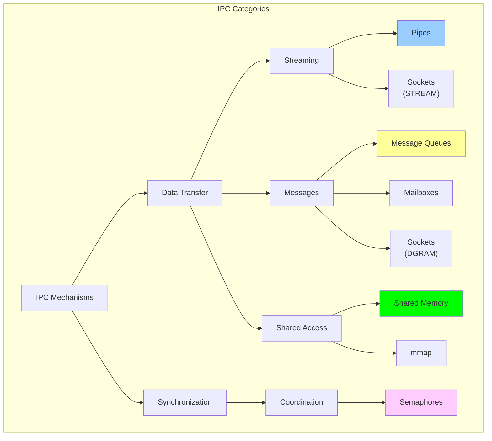
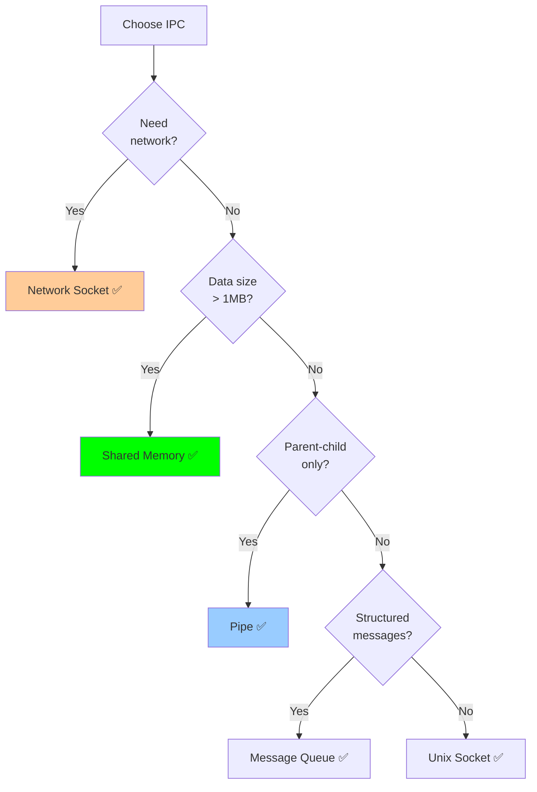
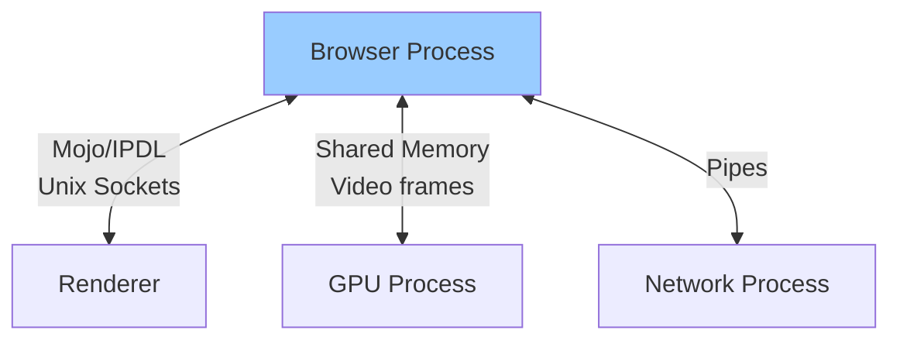
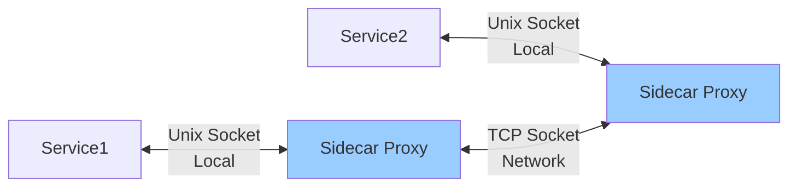

# IPC - Quick Reference Guide

## Overview

This document provides a **condensed overview** of all Inter-Process Communication (IPC) mechanisms. For detailed theory, kernel internals, and comprehensive examples, refer to the individual mechanism files.

---

## What is IPC?

**Interprocess Communication (IPC)** enables processes to exchange data and synchronize their operations in modern operating systems.

### Why IPC?

Modern applications are built as multiple cooperating processes:
- **Web browsers**: Separate processes for rendering, networking, GPU
- **Databases**: Multiple backend processes sharing buffer pools
- **Microservices**: Distributed services communicating across boundaries



---

## 1. Pipes

**Type**: Unidirectional byte stream

**Best for**: Parent-child communication, command pipelines

### Key Characteristics
- ✅ **Simplest** IPC mechanism (~5 lines of code)
- ✅ Fast (500 ns latency, 10 GB/s throughput)
- ✅ Automatic synchronization (blocking I/O)
- ❌ Unidirectional (need two pipes for bidirectional)
- ❌ Related processes only (anonymous pipes)
- ❌ No message boundaries

### Quick Example
```c
int pipefd[2];
pipe(pipefd);

if (fork() == 0) {
    close(pipefd[0]);  // Child: close read end
    write(pipefd[1], "Hello", 5);
    close(pipefd[1]);
} else {
    close(pipefd[1]);  // Parent: close write end
    char buf[100];
    read(pipefd[0], buf, 100);
    close(pipefd[0]);
}
```

**Read more**: `01_pipes.md` - Complete guide with theory, kernel implementation, and real-world usage

---

## 2. Message Queues

**Type**: Discrete, structured messages

**Best for**: Task distribution, priority-based processing, multiple producers/consumers

### Key Characteristics
- ✅ Message boundaries preserved
- ✅ Priority levels (POSIX: 0-31)
- ✅ Type-based filtering (System V)
- ✅ Persistent (System V survives process exit)
- ✅ Multiple producers/consumers
- ❌ Slower than pipes (3-15 µs latency)
- ❌ Limited message size

### Two Implementations

**POSIX (Modern)**:
```c
mqd_t mq = mq_open("/myqueue", O_CREAT | O_RDWR, 0644, &attr);
mq_send(mq, "message", 7, priority);
mq_receive(mq, buffer, 256, NULL);
mq_close(mq);
mq_unlink("/myqueue");
```

**System V (Legacy)**:
```c
key_t key = ftok("/tmp", 'A');
int msgid = msgget(key, 0666 | IPC_CREAT);
msgsnd(msgid, &msg, size, 0);
msgrcv(msgid, &msg, size, type, 0);
msgctl(msgid, IPC_RMID, NULL);
```

**Read more**: `02_message_queues.md` - Full API reference, kernel structures, and producer-consumer patterns

---

## 3. Mailboxes

**Type**: Port-based message passing

**Best for**: RPC systems, client-server with reply mechanism, actor model

### Key Characteristics
- ✅ Explicit sender identification
- ✅ Built-in reply mechanism
- ✅ Port-based addressing
- ✅ Request-response patterns
- ❌ Not standard POSIX (need to implement)
- ❌ Platform-specific (Mach on macOS)

### Conceptual Model


### Implementation Pattern
```c
struct mailbox_msg {
    char reply_to[64];  // Sender's mailbox for reply
    int msg_type;
    char data[256];
};

// Send request with reply address
strcpy(request.reply_to, "/client_mailbox");
mailbox_send("/server_mailbox", &request);

// Server replies to sender
mailbox_send(request.reply_to, &response);
```

**Read more**: `03_mailboxes.md` - Theory, Mach ports, and client-server implementations

---

## 4. Shared Memory

**Type**: Direct memory sharing

**Best for**: High-performance data transfer, large datasets, frequent access

### Key Characteristics
- ✅ **Fastest** IPC (50 ns latency, 20 GB/s throughput)
- ✅ **Zero-copy** - no data copying
- ✅ Direct pointer access
- ✅ Can share large regions (GB+)
- ❌ **Requires manual synchronization** (semaphores)
- ❌ Complex to use correctly
- ❌ Race condition risks

### POSIX Shared Memory
```c
// Create and map
int fd = shm_open("/myshm", O_CREAT | O_RDWR, 0666);
ftruncate(fd, 4096);
void *ptr = mmap(NULL, 4096, PROT_READ | PROT_WRITE, MAP_SHARED, fd, 0);

// Use directly
struct data *shared_data = (struct data *)ptr;
shared_data->value = 42;

// Cleanup
munmap(ptr, 4096);
close(fd);
shm_unlink("/myshm");
```

### Critical: Synchronization Required
```c
// WITHOUT semaphore - WRONG!
shared_data->counter++;  // Race condition!

// WITH semaphore - CORRECT
sem_wait(sem);
shared_data->counter++;
sem_post(sem);
```

**Read more**: `04_shared_memory.md` - Kernel implementation, memory management, zero-copy techniques

---

## 5. Semaphores

**Type**: Synchronization primitive

**Best for**: Protecting shared resources, signaling between processes, producer-consumer

### Key Characteristics
- ✅ Atomic operations (P/V, wait/post)
- ✅ Prevents race conditions
- ✅ Supports counting (resource pools)
- ✅ Process synchronization
- ❌ **Not for data transfer** (synchronization only)
- ❌ Deadlock risks if misused

### Named Semaphores
```c
// Create (initial value = 1 for mutex)
sem_t *sem = sem_open("/mysem", O_CREAT, 0666, 1);

// Critical section protection
sem_wait(sem);   // P operation (lock)
// ... critical section ...
sem_post(sem);   // V operation (unlock)

// Cleanup
sem_close(sem);
sem_unlink("/mysem");
```

### Common Patterns

**Mutex (Binary Semaphore)**:
```c
sem_t *mutex = sem_open("/mutex", O_CREAT, 0666, 1);
```

**Counting Semaphore (Resource Pool)**:
```c
sem_t *pool = sem_open("/pool", O_CREAT, 0666, 5);  // 5 resources
```

**Producer-Consumer**:
```c
sem_t *empty = sem_open("/empty", O_CREAT, 0666, BUFFER_SIZE);
sem_t *full = sem_open("/full", O_CREAT, 0666, 0);
sem_t *mutex = sem_open("/mutex", O_CREAT, 0666, 1);
```

**Read more**: `05_semaphores.md` - Dijkstra's algorithm, futex implementation, classical problems

---

## 6. Sockets

**Type**: Network-capable communication endpoints

**Best for**: Client-server, network communication, bidirectional streams

### Key Characteristics
- ✅ **Network capable** (local or remote)
- ✅ Bidirectional
- ✅ Connection-oriented (STREAM) or connectionless (DGRAM)
- ✅ Flexible and powerful
- ✅ Standard across platforms
- ❌ Slower than local IPC (2-10 µs latency)
- ❌ More complex setup

### Unix Domain Sockets (Local)
```c
// Server
int server_fd = socket(AF_UNIX, SOCK_STREAM, 0);
struct sockaddr_un addr = { .sun_family = AF_UNIX, .sun_path = "/tmp/sock" };
bind(server_fd, (struct sockaddr*)&addr, sizeof(addr));
listen(server_fd, 5);
int client_fd = accept(server_fd, NULL, NULL);

// Client
int sock = socket(AF_UNIX, SOCK_STREAM, 0);
connect(sock, (struct sockaddr*)&addr, sizeof(addr));

// Communicate
send(sock, data, len, 0);
recv(sock, buf, len, 0);
```

### Network Sockets (TCP)
```c
// Server
int server_fd = socket(AF_INET, SOCK_STREAM, 0);
struct sockaddr_in addr = {
    .sin_family = AF_INET,
    .sin_addr.s_addr = INADDR_ANY,
    .sin_port = htons(8080)
};
bind(server_fd, (struct sockaddr*)&addr, sizeof(addr));
listen(server_fd, 5);

// Client connects to 127.0.0.1:8080
```

**Performance Note**: Unix sockets are ~5x faster than TCP localhost (2 µs vs 10 µs)

**Read more**: `06_sockets.md` - TCP/UDP, kernel sk_buff, epoll, real-world examples (Redis, Nginx)

---

## 7. Memory-Mapped Files (mmap)

**Type**: File-backed or anonymous memory mapping

**Best for**: Large files, random access, file-based IPC, shared libraries

### Key Characteristics
- ✅ Zero-copy file I/O (100 ns latency, 15 GB/s)
- ✅ Direct memory access to files
- ✅ Demand paging (load only what's accessed)
- ✅ IPC via shared file mapping
- ✅ Random access efficient
- ❌ Page fault overhead on first access
- ❌ Manual synchronization needed (like shared memory)

### File-Backed mmap
```c
int fd = open("file.dat", O_RDWR);
struct stat st;
fstat(fd, &st);

// Map file to memory
char *ptr = mmap(NULL, st.st_size, PROT_READ | PROT_WRITE, MAP_SHARED, fd, 0);

// Access like memory
ptr[0] = 'X';  // Modifies file

// Flush to disk
msync(ptr, st.st_size, MS_SYNC);

// Cleanup
munmap(ptr, st.st_size);
close(fd);
```

### Anonymous mmap (IPC)
```c
// Create shared region (parent-child)
void *shared = mmap(NULL, 4096, PROT_READ | PROT_WRITE,
                    MAP_SHARED | MAP_ANONYMOUS, -1, 0);

if (fork() == 0) {
    // Child writes
    strcpy(shared, "Hello from child");
} else {
    wait(NULL);
    printf("%s\n", (char*)shared);  // Parent reads
}

munmap(shared, 4096);
```

**Read more**: `07_mmap.md` - Virtual memory, page tables, TLB, COW, database buffer pools

---

## Performance Comparison

### Latency (Single Message Round-Trip)

| Mechanism | Latency | Use When |
|-----------|---------|----------|
| **Shared Memory (atomic)** | **50 ns** | Highest performance critical |
| Shared Memory (mutex) | 200 ns | High performance with safety |
| **Pipes** | **500 ns** | Simple parent-child |
| **Unix Sockets** | **2 µs** | Local client-server |
| Named Pipes | 2.5 µs | Unrelated process streams |
| POSIX Message Queue | 3 µs | Structured messages |
| **TCP Sockets (localhost)** | **10 µs** | Network-capable |
| System V Message Queue | 15 µs | Legacy systems |

### Throughput (Large Data Transfer)

| Mechanism | Throughput | Best For |
|-----------|------------|----------|
| **Shared Memory** | **20 GB/s** | Large data, frequent access |
| **mmap** | **15 GB/s** | File I/O, random access |
| **Pipes** | **10 GB/s** | Streaming data |
| Unix Sockets | 3 GB/s | Local bidirectional |
| TCP Sockets | 1 GB/s | Network communication |
| Message Queues | 500 MB/s | Discrete messages |

**Key Insight**: Shared memory is **200x faster** than TCP sockets for local communication!

---

## Decision Framework

### Quick Selection Guide



### By Requirement

| Your Need | Recommended Choice |
|-----------|-------------------|
| **Simplest possible** | Anonymous Pipe |
| **Fastest possible** | Shared Memory (with atomics) |
| **Best balance** | Unix Domain Socket |
| **Network capable** | TCP/UDP Socket |
| **Parent-child only** | Pipe or Shared Memory |
| **Unrelated processes** | Message Queue or Unix Socket |
| **Large data (> 1 MB)** | Shared Memory or mmap |
| **Small messages** | Pipe or Socket |
| **Structured data** | Message Queue |
| **Priority ordering** | POSIX/System V Message Queue |
| **Broadcast** | Shared Memory |
| **Persistence** | System V Message Queue or mmap |

---

## Complete Comparison Matrix

| Feature | Pipes | Message Queues | Shared Memory | Semaphores | Sockets | mmap |
|---------|-------|----------------|---------------|------------|---------|------|
| **Latency** | 500 ns | 3-15 µs | **50 ns** | N/A | 2-10 µs | 100 ns |
| **Throughput** | 10 GB/s | 500 MB/s | **20 GB/s** | N/A | 1-3 GB/s | 15 GB/s |
| **Setup** | Easy | Moderate | Complex | Easy | Moderate | Easy |
| **Bidirectional** | ❌ | ❌ | ✅ | N/A | ✅ | ✅ |
| **Network** | ❌ | ❌ | ❌ | ❌ | ✅ | ❌ |
| **Persistence** | ❌ | ✅ (SysV) | ❌ | ✅ | ❌ | ✅ |
| **Sync** | Auto | Auto | Manual | Provides | Auto | Manual |
| **Message boundaries** | ❌ | ✅ | N/A | N/A | ✅ (DGRAM) | N/A |

---

## Real-World Examples

### Web Browsers (Chrome/Firefox)



- **Control messages**: Unix sockets (2 µs latency)
- **Large data** (video frames): Shared memory (zero-copy)
- **Process isolation**: Separate processes for security

### Databases (PostgreSQL)

```mermaid
graph TB
    Backend1[Backend 1] <-->|Shared Memory<br/>~100 GB/s| BufferPool[(Shared Buffer Pool)]
    Backend2[Backend 2] <-->|Shared Memory| BufferPool
    Backend3[Backend 3] <-->|Shared Memory| BufferPool

    Backend1 <-->|Semaphores| Locks[Lock Table]
    Backend2 <-->|Semaphores| Locks

    Client <-->|Unix Socket<br/>(local)| Backend1
    Remote <-->|TCP Socket<br/>(network)| Backend2

    style BufferPool fill:#0f0
```

- **Buffer pool**: Shared memory (25% of RAM)
- **Locks**: Semaphores
- **Clients**: Unix sockets (local) or TCP (remote)

### Microservices (Service Mesh)



- **Within node**: Unix sockets (faster)
- **Across nodes**: TCP with TLS
- **Config reload**: Memory-mapped files

---

## Common Pitfalls

### 1. Using TCP for Local IPC
```c
// ❌ BAD: TCP localhost (10 µs latency)
socket(AF_INET, SOCK_STREAM, 0);

// ✅ GOOD: Unix socket (2 µs latency, 5x faster!)
socket(AF_UNIX, SOCK_STREAM, 0);
```

### 2. Shared Memory Without Sync
```c
// ❌ BAD: Race condition
shared_data->counter++;

// ✅ GOOD: Protected
sem_wait(sem);
shared_data->counter++;
sem_post(sem);
```

### 3. Not Cleaning Up Resources
```c
// ❌ BAD: Resource leak
mq_open("/queue", O_CREAT | O_RDWR, 0644, &attr);
// ... never calls mq_unlink()

// ✅ GOOD: Cleanup
mq_close(mq);
mq_unlink("/queue");

// Check orphans: ipcs -a
```

### 4. Ignoring Pipe Buffer Limits
```c
// ❌ BAD: May deadlock (buffer full)
write(pipefd, huge_data, 1000000);

// ✅ GOOD: Loop
while (remaining > 0) {
    ssize_t n = write(pipefd, data, remaining);
    remaining -= n;
}
```

### 5. Busy-Waiting
```c
// ❌ BAD: Burns CPU
while (shared_data->ready == 0);

// ✅ GOOD: Block
sem_wait(&ready_sem);
```

---

## Compilation

### Link Libraries
```bash
# Message queues, shared memory, semaphores
gcc program.c -o program -lrt

# Pthreads (if using pthread mutexes)
gcc program.c -o program -lpthread

# Sockets (usually no extra flags)
gcc program.c -o program
```

### System Tools
```bash
# List System V IPC resources
ipcs -a

# Remove orphaned resources
ipcrm -q <queue_id>    # Message queue
ipcrm -m <shm_id>      # Shared memory
ipcrm -s <sem_id>      # Semaphore

# POSIX message queues
ls /dev/mqueue/
rm /dev/mqueue/queue_name
```

---

## Summary: When to Use What

### Performance Priority
1. **Shared Memory** - Absolute fastest (50 ns, 20 GB/s)
2. **Pipes** - Simple and fast (500 ns, 10 GB/s)
3. **Unix Sockets** - Flexible and fast (2 µs, 3 GB/s)

### Simplicity Priority
1. **Pipes** - Simplest (~5 lines)
2. **Unix Sockets** - Good balance (~20 lines)
3. **Message Queues** - Structured (~10-15 lines)

### Flexibility Priority
1. **Sockets** - Network + local, stream + datagram
2. **Message Queues** - Priority, boundaries, persistence
3. **Shared Memory** - Zero-copy, large data

---

## Read More

For detailed information on each mechanism, see:

- **01_pipes.md** - Complete pipes guide (anonymous, named, kernel implementation)
- **02_message_queues.md** - Message queues (POSIX, System V, producer-consumer)
- **03_mailboxes.md** - Mailbox theory (RPC, actor model, Mach ports)
- **04_shared_memory.md** - Shared memory (zero-copy, memory management, performance)
- **05_semaphores.md** - Semaphores (Dijkstra, futex, classical problems)
- **06_sockets.md** - Sockets (TCP/UDP, kernel sk_buff, epoll, real-world)
- **07_mmap.md** - Memory mapping (virtual memory, page tables, COW, databases)
- **08_comparison.md** - Comprehensive comparison (benchmarks, decision trees, architecture)

---

## Final Recommendations

**Default choice**: **Unix Domain Sockets**
- Good performance (2 µs, 3 GB/s)
- Reasonable complexity
- Bidirectional
- Flexible

**Performance-critical**: **Shared Memory**
- Best latency (50 ns)
- Best throughput (20 GB/s)
- Requires careful synchronization

**Simplest**: **Pipes**
- Minimal code
- Built-in synchronization
- Perfect for parent-child

**Network-capable**: **TCP Sockets**
- Standard protocol
- Works across network
- Mature ecosystem

---

**End of IPC Quick Reference**

For deep dives into theory, kernel internals, and real-world usage, explore the individual mechanism files.
