# Interprocess Communication - Complete Crash Course

## Table of Contents
1. [IPC Overview](#ipc-overview)
2. [Message Queues](#message-queues)
3. [Mailboxes](#mailboxes)
4. [Shared Memory](#shared-memory)
5. [Semaphores](#semaphores)
6. [Sockets](#sockets)
7. [Memory-Mapped Files](#memory-mapped-files)
8. [Comparison Matrix](#comparison-matrix)
9. [Choosing the Right IPC](#choosing-the-right-ipc)

---

## IPC Overview

### What is IPC?

**Interprocess Communication (IPC)** enables processes to exchange data and synchronize their operations.

### Why Multiple IPC Mechanisms?

Different use cases require different solutions:

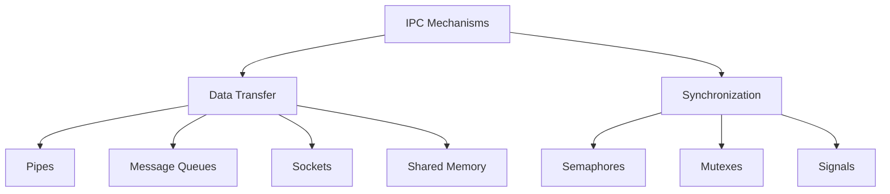

### IPC Categories

| Category | Mechanisms | Purpose |
|----------|------------|---------|
| **Byte Stream** | Pipes, Sockets | Continuous data flow |
| **Message-Based** | Message Queues, Sockets | Discrete messages |
| **Shared Resource** | Shared Memory | Direct memory access |
| **Synchronization** | Semaphores, Mutexes | Coordinate access |

---

## Message Queues

### What are Message Queues?

Message queues allow processes to exchange **discrete messages** with:
- Message boundaries preserved
- Priority levels
- Type-based filtering
- Persistence (messages survive process termination)

### Conceptual Model

```
┌─────────────┐         ┌──────────────────────┐         ┌─────────────┐
│  Process A  │ ─send──>│  Message Queue       │<─recv──│  Process B  │
│  (Writer)   │         │  [msg1][msg2][msg3]  │         │  (Reader)   │
└─────────────┘         └──────────────────────┘         └─────────────┘
```

**Key Differences from Pipes:**
- Messages are discrete units (not byte stream)
- Can have multiple readers and writers
- Messages can have priorities and types
- Survives process termination

### Two Implementations

1. **POSIX Message Queues** (Modern, preferred)
2. **System V Message Queues** (Legacy, but widely used)

---

## POSIX Message Queues

### Overview

**Features:**
- Name-based identification (`/mq_name`)
- Priority-based delivery
- Notification mechanism
- Simpler API than System V

### Header Files

```c
#include <mqueue.h>
#include <fcntl.h>
#include <sys/stat.h>
```

### Core Functions

#### 1. `mq_open()` - Create/Open Queue

```c
mqd_t mq_open(const char *name, int oflag, mode_t mode, struct mq_attr *attr);
```

**Parameters:**
- `name`: Queue name starting with `/` (e.g., `/myqueue`)
- `oflag`: Flags
  - `O_RDONLY`: Read only
  - `O_WRONLY`: Write only
  - `O_RDWR`: Read and write
  - `O_CREAT`: Create if doesn't exist
  - `O_EXCL`: Fail if already exists
- `mode`: Permissions (e.g., 0644)
- `attr`: Queue attributes (or NULL for defaults)

**Returns:**
- Message queue descriptor on success
- `-1` on error

#### 2. `mq_send()` - Send Message

```c
int mq_send(mqd_t mqdes, const char *msg_ptr, size_t msg_len, unsigned int msg_prio);
```

**Parameters:**
- `mqdes`: Queue descriptor
- `msg_ptr`: Pointer to message data
- `msg_len`: Message size (bytes)
- `msg_prio`: Priority (0-31, higher = more urgent)

**Returns:**
- `0` on success
- `-1` on error

**Blocking:** If queue is full, blocks until space available

#### 3. `mq_receive()` - Receive Message

```c
ssize_t mq_receive(mqd_t mqdes, char *msg_ptr, size_t msg_len, unsigned int *msg_prio);
```

**Parameters:**
- `mqdes`: Queue descriptor
- `msg_ptr`: Buffer for message
- `msg_len`: Buffer size (must be ≥ queue's max message size)
- `msg_prio`: Pointer to store message priority (or NULL)

**Returns:**
- Number of bytes received
- `-1` on error

**Blocking:** If queue is empty, blocks until message arrives

#### 4. `mq_close()` - Close Queue

```c
int mq_close(mqd_t mqdes);
```

**Note:** Doesn't delete the queue, just closes this process's descriptor

#### 5. `mq_unlink()` - Delete Queue

```c
int mq_unlink(const char *name);
```

**Removes queue from system**

#### 6. `mq_getattr()` / `mq_setattr()` - Get/Set Attributes

```c
int mq_getattr(mqd_t mqdes, struct mq_attr *attr);
int mq_setattr(mqd_t mqdes, const struct mq_attr *newattr, struct mq_attr *oldattr);
```

### Message Queue Attributes

```c
struct mq_attr {
    long mq_flags;       // Flags: 0 or O_NONBLOCK
    long mq_maxmsg;      // Max number of messages
    long mq_msgsize;     // Max message size (bytes)
    long mq_curmsgs;     // Current number of messages
};
```

### Example 1: Simple Send/Receive

**Sender:**

```c
#include <mqueue.h>
#include <fcntl.h>
#include <stdio.h>
#include <string.h>

int main() {
    mqd_t mq;
    struct mq_attr attr;

    // Set queue attributes
    attr.mq_flags = 0;
    attr.mq_maxmsg = 10;        // Max 10 messages
    attr.mq_msgsize = 256;      // Max 256 bytes per message
    attr.mq_curmsgs = 0;

    // Create queue
    mq = mq_open("/test_queue", O_CREAT | O_WRONLY, 0644, &attr);
    if (mq == (mqd_t)-1) {
        perror("mq_open");
        return 1;
    }

    // Send messages
    char *messages[] = {
        "Hello",
        "World",
        "From sender",
        NULL
    };

    for (int i = 0; messages[i] != NULL; i++) {
        if (mq_send(mq, messages[i], strlen(messages[i]) + 1, 0) == -1) {
            perror("mq_send");
        } else {
            printf("Sent: %s\n", messages[i]);
        }
    }

    mq_close(mq);
    return 0;
}
```

**Receiver:**

```c
#include <mqueue.h>
#include <fcntl.h>
#include <stdio.h>

int main() {
    mqd_t mq;
    struct mq_attr attr;
    char buffer[256];

    // Open existing queue
    mq = mq_open("/test_queue", O_RDONLY);
    if (mq == (mqd_t)-1) {
        perror("mq_open");
        return 1;
    }

    // Get queue attributes to know max message size
    mq_getattr(mq, &attr);

    printf("Queue info:\n");
    printf("  Max messages: %ld\n", attr.mq_maxmsg);
    printf("  Max message size: %ld\n", attr.mq_msgsize);
    printf("  Current messages: %ld\n", attr.mq_curmsgs);

    // Receive messages
    for (int i = 0; i < 3; i++) {
        ssize_t bytes = mq_receive(mq, buffer, attr.mq_msgsize, NULL);
        if (bytes >= 0) {
            printf("Received: %s\n", buffer);
        } else {
            perror("mq_receive");
        }
    }

    mq_close(mq);
    mq_unlink("/test_queue");  // Delete queue
    return 0;
}
```

**Compile:**
```bash
gcc sender.c -o sender -lrt
gcc receiver.c -o receiver -lrt
```

### Example 2: Priority Messages

```c
#include <mqueue.h>
#include <fcntl.h>
#include <stdio.h>
#include <string.h>

int main() {
    mqd_t mq;
    struct mq_attr attr = {0, 10, 256, 0};

    mq = mq_open("/priority_queue", O_CREAT | O_RDWR, 0644, &attr);

    // Send messages with different priorities
    mq_send(mq, "Low priority", 13, 1);
    mq_send(mq, "High priority", 14, 10);
    mq_send(mq, "Medium priority", 16, 5);

    // Receive messages (highest priority first)
    char buffer[256];
    unsigned int prio;

    while (mq_receive(mq, buffer, 256, &prio) > 0) {
        printf("Priority %u: %s\n", prio, buffer);
    }

    mq_close(mq);
    mq_unlink("/priority_queue");
    return 0;
}
```

**Output:**
```
Priority 10: High priority
Priority 5: Medium priority
Priority 1: Low priority
```

### Data Flow Diagram

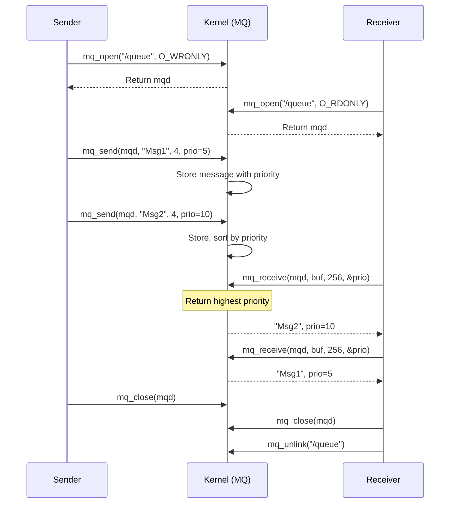

### Non-Blocking Mode

```c
mqd_t mq = mq_open("/queue", O_RDONLY | O_NONBLOCK);

char buffer[256];
ssize_t bytes = mq_receive(mq, buffer, 256, NULL);

if (bytes == -1) {
    if (errno == EAGAIN) {
        printf("No messages available\n");
    } else {
        perror("mq_receive");
    }
}
```

### Notification Mechanism

Get notified when message arrives:

```c
#include <signal.h>

void handler(int sig) {
    printf("Message arrived!\n");
}

int main() {
    signal(SIGUSR1, handler);

    mqd_t mq = mq_open("/queue", O_RDONLY);

    struct sigevent sev;
    sev.sigev_notify = SIGEV_SIGNAL;
    sev.sigev_signo = SIGUSR1;

    // Request notification
    mq_notify(mq, &sev);

    // Wait for signal
    pause();

    // Read message
    char buffer[256];
    mq_receive(mq, buffer, 256, NULL);

    mq_close(mq);
    return 0;
}
```

---

## System V Message Queues

### Overview

Legacy but still widely used. Key differences from POSIX:
- Identified by integer key (not name)
- Message type field for filtering
- More complex API
- Requires `ipcs` and `ipcrm` commands for management

### Header Files

```c
#include <sys/types.h>
#include <sys/ipc.h>
#include <sys/msg.h>
```

### Core Functions

#### 1. `ftok()` - Generate Key

```c
key_t ftok(const char *pathname, int proj_id);
```

**Purpose:** Create unique key from pathname and project ID

```c
key_t key = ftok("/tmp/myfile", 'A');
```

#### 2. `msgget()` - Create/Access Queue

```c
int msgget(key_t key, int msgflg);
```

**Parameters:**
- `key`: Unique identifier
- `msgflg`: Flags
  - `IPC_CREAT`: Create if doesn't exist
  - `IPC_EXCL`: Fail if already exists
  - Permissions (e.g., 0644)

**Returns:** Message queue identifier

#### 3. `msgsnd()` - Send Message

```c
int msgsnd(int msqid, const void *msgp, size_t msgsz, int msgflg);
```

**Message structure:**
```c
struct msgbuf {
    long mtype;        // Message type (must be > 0)
    char mtext[256];   // Message data
};
```

**Parameters:**
- `msqid`: Queue ID
- `msgp`: Pointer to message structure
- `msgsz`: Size of mtext (not including mtype)
- `msgflg`: Flags (0 or IPC_NOWAIT)

#### 4. `msgrcv()` - Receive Message

```c
ssize_t msgrcv(int msqid, void *msgp, size_t msgsz, long msgtyp, int msgflg);
```

**Parameters:**
- `msqid`: Queue ID
- `msgp`: Buffer for message
- `msgsz`: Max size of mtext
- `msgtyp`: Message type filter
  - `0`: Get first message
  - `> 0`: Get first message of type msgtyp
  - `< 0`: Get first message with lowest type ≤ |msgtyp|
- `msgflg`: Flags (0 or IPC_NOWAIT)

#### 5. `msgctl()` - Control Operations

```c
int msgctl(int msqid, int cmd, struct msqid_ds *buf);
```

**Commands:**
- `IPC_STAT`: Get info
- `IPC_SET`: Set permissions
- `IPC_RMID`: Delete queue

### Example: Simple System V Message Queue

**Sender:**

```c
#include <stdio.h>
#include <sys/types.h>
#include <sys/ipc.h>
#include <sys/msg.h>
#include <string.h>

struct message {
    long mtype;
    char mtext[100];
};

int main() {
    key_t key;
    int msgid;
    struct message msg;

    // Generate unique key
    key = ftok("/tmp", 'A');

    // Create message queue
    msgid = msgget(key, 0666 | IPC_CREAT);
    if (msgid == -1) {
        perror("msgget");
        return 1;
    }

    // Send messages
    msg.mtype = 1;
    strcpy(msg.mtext, "Hello from sender");

    if (msgsnd(msgid, &msg, strlen(msg.mtext) + 1, 0) == -1) {
        perror("msgsnd");
        return 1;
    }

    printf("Sent: %s\n", msg.mtext);
    return 0;
}
```

**Receiver:**

```c
#include <stdio.h>
#include <sys/types.h>
#include <sys/ipc.h>
#include <sys/msg.h>

struct message {
    long mtype;
    char mtext[100];
};

int main() {
    key_t key;
    int msgid;
    struct message msg;

    // Get same key
    key = ftok("/tmp", 'A');

    // Access existing queue
    msgid = msgget(key, 0666);
    if (msgid == -1) {
        perror("msgget");
        return 1;
    }

    // Receive message
    if (msgrcv(msgid, &msg, sizeof(msg.mtext), 1, 0) == -1) {
        perror("msgrcv");
        return 1;
    }

    printf("Received (type %ld): %s\n", msg.mtype, msg.mtext);

    // Delete queue
    msgctl(msgid, IPC_RMID, NULL);

    return 0;
}
```

### Example: Message Types for Filtering

```c
#include <stdio.h>
#include <sys/msg.h>
#include <sys/ipc.h>
#include <string.h>

struct message {
    long mtype;
    char mtext[100];
};

int main() {
    key_t key = ftok("/tmp", 'X');
    int msgid = msgget(key, 0666 | IPC_CREAT);

    struct message msg;

    // Send different types
    msg.mtype = 1;
    strcpy(msg.mtext, "Type 1 message");
    msgsnd(msgid, &msg, strlen(msg.mtext) + 1, 0);

    msg.mtype = 2;
    strcpy(msg.mtext, "Type 2 message");
    msgsnd(msgid, &msg, strlen(msg.mtext) + 1, 0);

    msg.mtype = 1;
    strcpy(msg.mtext, "Another type 1");
    msgsnd(msgid, &msg, strlen(msg.mtext) + 1, 0);

    // Receive only type 2 messages
    msgrcv(msgid, &msg, 100, 2, 0);
    printf("Got type 2: %s\n", msg.mtext);

    // Receive any type
    msgrcv(msgid, &msg, 100, 0, 0);
    printf("Got first: %s (type %ld)\n", msg.mtext, msg.mtype);

    msgctl(msgid, IPC_RMID, NULL);
    return 0;
}
```

### System Commands

```bash
# List all message queues
ipcs -q

# Remove specific queue
ipcrm -q <msgid>

# Remove all message queues
ipcrm -a msg
```

---

## Mailboxes

### What are Mailboxes?

**Mailbox** is a conceptual IPC abstraction that combines message queues with port-based addressing. The term is used in different contexts:

1. **Academic/Theoretical:** Abstract message-passing mechanism
2. **Mach Kernel (macOS/iOS):** Primary IPC mechanism using ports
3. **Actor Model:** Message queues for actor-based concurrency

### Mailbox Concept

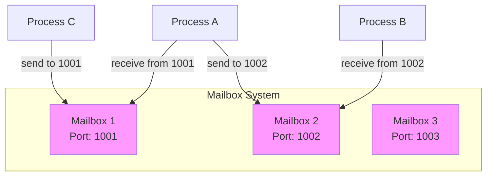

**Key Characteristics:**
- Each mailbox has a unique identifier (port number)
- Processes can send to any mailbox (if they know the port)
- Only mailbox owner can receive messages
- Messages have explicit sender identification
- Can be used for request-reply patterns

### Mailbox vs Message Queue

| Feature | Mailbox | Message Queue |
|---------|---------|---------------|
| **Identity** | Port-based | Name/key-based |
| **Sender info** | Explicit reply port | Not included |
| **Access pattern** | Owner receives, anyone sends | Shared receive |
| **Reply mechanism** | Built-in | Manual |
| **Use case** | RPC, client-server | Producer-consumer |

### Theoretical Mailbox Operations

```c
// Conceptual API (not standard POSIX)

// Create mailbox
mailbox_id create_mailbox();

// Send message to mailbox
int send(mailbox_id dest, void *msg, size_t len, mailbox_id reply_port);

// Receive from own mailbox
int receive(mailbox_id mb, void **msg, size_t *len, mailbox_id *sender);

// Reply to sender
int reply(mailbox_id dest, void *msg, size_t len);

// Destroy mailbox
int destroy_mailbox(mailbox_id mb);
```

### Mailbox Communication Pattern

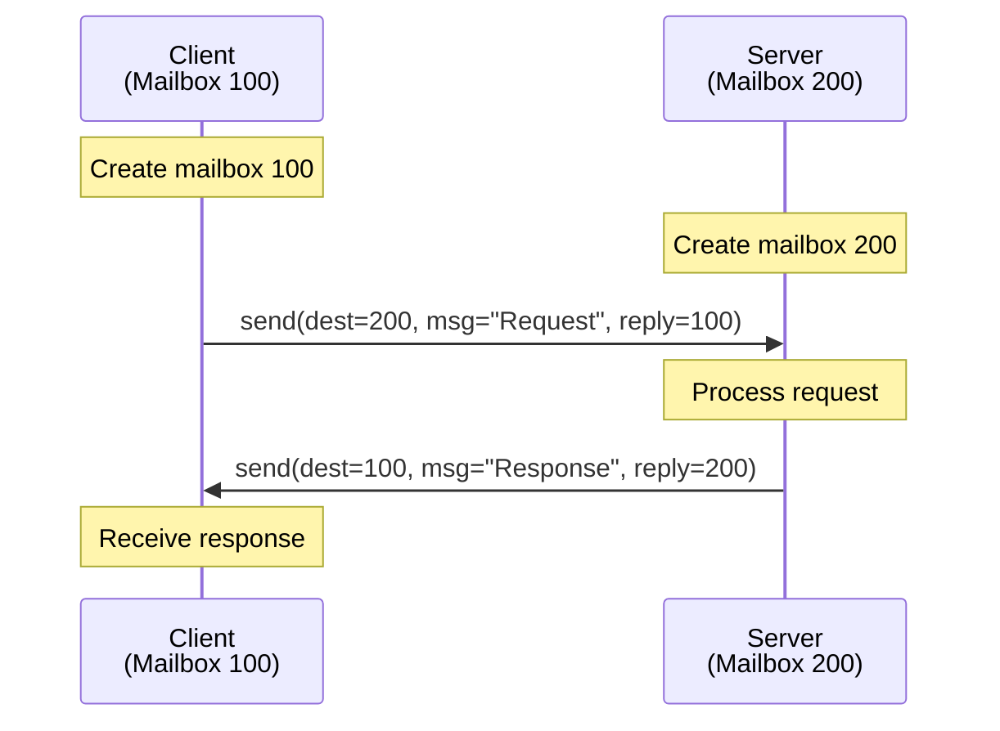

### Implementing Mailbox using POSIX Message Queues

Since POSIX doesn't have native mailboxes, we can simulate them:

```c
#include <mqueue.h>
#include <stdio.h>
#include <string.h>
#include <fcntl.h>
#include <stdlib.h>

// Message structure with sender info
struct mailbox_msg {
    char reply_to[64];  // Sender's mailbox name
    int msg_type;       // Message type
    char data[256];     // Actual data
};

// Mailbox abstraction
typedef struct {
    char name[64];
    mqd_t mq;
} mailbox_t;

// Create mailbox
mailbox_t* mailbox_create(const char *name) {
    mailbox_t *mb = malloc(sizeof(mailbox_t));
    strncpy(mb->name, name, 64);

    struct mq_attr attr = {0, 10, sizeof(struct mailbox_msg), 0};
    mb->mq = mq_open(name, O_CREAT | O_RDWR, 0644, &attr);

    if (mb->mq == (mqd_t)-1) {
        perror("mq_open");
        free(mb);
        return NULL;
    }

    return mb;
}

// Send to mailbox
int mailbox_send(const char *dest_name, struct mailbox_msg *msg) {
    mqd_t dest_mq = mq_open(dest_name, O_WRONLY);
    if (dest_mq == (mqd_t)-1) {
        perror("mq_open");
        return -1;
    }

    int ret = mq_send(dest_mq, (char*)msg, sizeof(struct mailbox_msg), 0);
    mq_close(dest_mq);
    return ret;
}

// Receive from own mailbox
int mailbox_receive(mailbox_t *mb, struct mailbox_msg *msg) {
    return mq_receive(mb->mq, (char*)msg, sizeof(struct mailbox_msg), NULL);
}

// Close and destroy mailbox
void mailbox_destroy(mailbox_t *mb) {
    mq_close(mb->mq);
    mq_unlink(mb->name);
    free(mb);
}
```

### Example: Client-Server with Mailboxes

**Server:**

```c
#include <stdio.h>
#include "mailbox.h"  // Include above code

int main() {
    // Create server mailbox
    mailbox_t *server_mb = mailbox_create("/server_mb");
    printf("Server ready at mailbox: /server_mb\n");

    while (1) {
        struct mailbox_msg request;

        // Receive request
        if (mailbox_receive(server_mb, &request) == -1) {
            perror("receive");
            continue;
        }

        printf("Received from %s: %s\n", request.reply_to, request.data);

        // Process request and send response
        struct mailbox_msg response;
        strcpy(response.reply_to, server_mb->name);
        response.msg_type = 2;  // Response type
        sprintf(response.data, "Response to: %s", request.data);

        mailbox_send(request.reply_to, &response);
        printf("Sent response to %s\n", request.reply_to);

        // Exit after one request (for demo)
        break;
    }

    mailbox_destroy(server_mb);
    return 0;
}
```

**Client:**

```c
#include <stdio.h>
#include "mailbox.h"

int main() {
    // Create client mailbox
    mailbox_t *client_mb = mailbox_create("/client_mb");

    // Prepare request
    struct mailbox_msg request;
    strcpy(request.reply_to, client_mb->name);
    request.msg_type = 1;  // Request type
    strcpy(request.data, "Hello server");

    // Send to server
    printf("Sending request to server...\n");
    mailbox_send("/server_mb", &request);

    // Wait for response
    struct mailbox_msg response;
    mailbox_receive(client_mb, &response);

    printf("Received from server: %s\n", response.data);

    mailbox_destroy(client_mb);
    return 0;
}
```

### Request-Reply Pattern

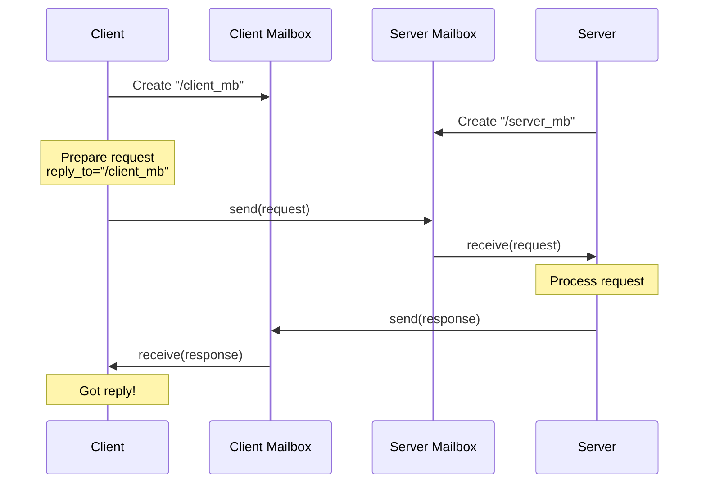

### Synchronous vs Asynchronous Send

**Synchronous (Blocking):**
```c
// Sender waits until receiver receives message
int send_sync(mailbox_id dest, void *msg) {
    send(dest, msg);
    // Wait for acknowledgment
    receive(own_mailbox, &ack);
    return 0;
}
```

**Asynchronous (Non-blocking):**
```c
// Sender doesn't wait
int send_async(mailbox_id dest, void *msg) {
    send(dest, msg);
    return 0;  // Continue immediately
}
```

### Many-to-One Communication

Multiple clients can send to one server mailbox:

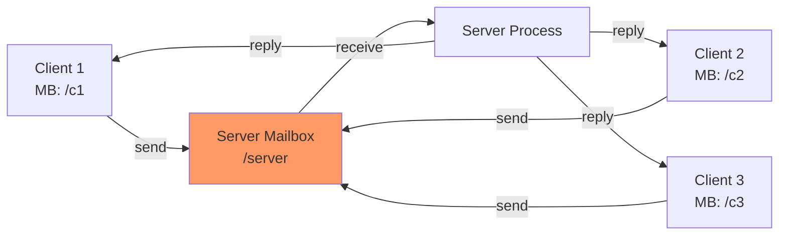

### Mailbox in Mach Kernel (macOS)

macOS uses Mach messaging with ports:

```c
// Mach port (mailbox) operations
#include <mach/mach.h>

mach_port_t port;

// Allocate port (mailbox)
mach_port_allocate(mach_task_self(), MACH_PORT_RIGHT_RECEIVE, &port);

// Send message
mach_msg_header_t msg;
msg.msgh_remote_port = dest_port;
msg.msgh_local_port = reply_port;
mach_msg(&msg, MACH_SEND_MSG, ...);

// Receive message
mach_msg(&msg, MACH_RCV_MSG, ...);
```

**Features:**
- Kernel-mediated communication
- Port rights (send, receive, send-once)
- Used for all macOS IPC
- Foundation of XPC (inter-process communication framework)

### Mailbox Use Cases

#### 1. RPC (Remote Procedure Call)
```
Client                    Server
  |                          |
  |--request(args)---------->|
  |                       process
  |<--------return(result)---|
```

#### 2. Service Discovery
```
Client --"Who provides X?"-> Registry
       <-"Server at port 500"--
Client --"Request"-----------> Server (port 500)
```

#### 3. Message Broker Pattern
```
Publisher --> Broker Mailbox --> Subscriber 1
                             --> Subscriber 2
                             --> Subscriber 3
```

#### 4. Actor Model
```
Actor A (Mailbox A) --> Message --> Actor B (Mailbox B)
                                    |
                                 Process
                                    |
                                  Reply
```

### Advanced: Multiplexed Server

Server handling multiple clients with select():

```c
#include <sys/select.h>
#include <mqueue.h>
#include <stdio.h>

int main() {
    mqd_t server_mq = mq_open("/server", O_CREAT | O_RDWR | O_NONBLOCK, 0644, NULL);

    fd_set readfds;

    while (1) {
        FD_ZERO(&readfds);
        FD_SET(server_mq, &readfds);

        // Wait for message
        if (select(server_mq + 1, &readfds, NULL, NULL, NULL) > 0) {
            if (FD_ISSET(server_mq, &readfds)) {
                struct mailbox_msg msg;
                mq_receive(server_mq, (char*)&msg, sizeof(msg), NULL);

                printf("Message from %s: %s\n", msg.reply_to, msg.data);

                // Handle message...
            }
        }
    }

    return 0;
}
```

### Mailbox Comparison

| Implementation | Pros | Cons |
|----------------|------|------|
| **Message Queues** | Standard POSIX | No built-in reply |
| **Sockets** | Bidirectional | Connection overhead |
| **Named Pipes** | Simple | Unidirectional |
| **Mach Ports** | Powerful | macOS-specific |
| **Custom** | Full control | More code |

### Best Practices

1. **Include reply address in messages**
   ```c
   struct msg {
       char reply_to[64];
       char data[256];
   };
   ```

2. **Use timeouts for receives**
   ```c
   struct timespec timeout = {5, 0};  // 5 seconds
   mq_timedreceive(mq, buf, size, NULL, &timeout);
   ```

3. **Clean up mailboxes**
   ```c
   mq_unlink("/mailbox_name");
   ```

4. **Handle multiple clients**
   - Use non-blocking receives
   - Or use select/poll for multiplexing

5. **Error handling**
   ```c
   if (mq_send(...) == -1) {
       if (errno == EAGAIN) {
           // Mailbox full
       }
   }
   ```

### Summary

**Mailboxes provide:**
- Port-based addressing
- Sender identification
- Request-reply patterns
- Client-server architectures

**Implementation options:**
- POSIX message queues (wrapper needed)
- Unix sockets
- Mach ports (macOS)
- Custom using existing IPC

**Best for:**
- RPC systems
- Service-oriented architectures
- Actor model implementations
- Client-server with multiple clients

---

## Shared Memory

### What is Shared Memory?

**Shared memory** allows multiple processes to access the same physical memory region.

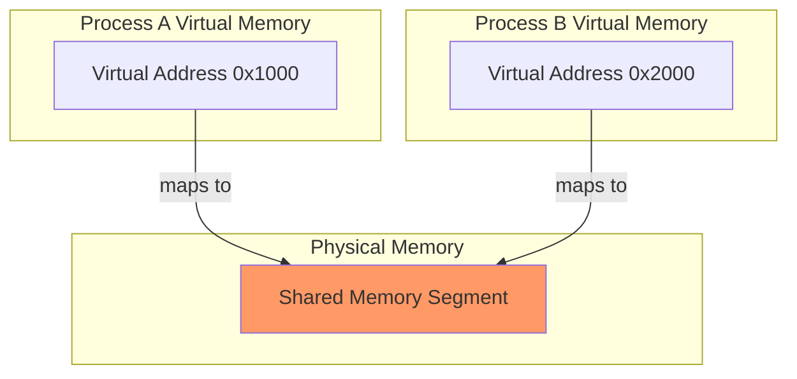

**Key Characteristics:**
- **Fastest IPC:** No data copying
- **Direct access:** Read/write like normal memory
- **Requires synchronization:** Use semaphores to prevent race conditions
- **Fixed size:** Must be determined at creation

### POSIX Shared Memory

#### Core Functions

##### 1. `shm_open()` - Create/Open Shared Memory

```c
#include <sys/mman.h>
#include <fcntl.h>

int shm_open(const char *name, int oflag, mode_t mode);
```

**Parameters:**
- `name`: Name starting with `/` (e.g., `/myshm`)
- `oflag`: `O_CREAT`, `O_RDWR`, `O_RDONLY`
- `mode`: Permissions

**Returns:** File descriptor

##### 2. `ftruncate()` - Set Size

```c
int ftruncate(int fd, off_t length);
```

**Must be called after shm_open() to set size**

##### 3. `mmap()` - Map to Memory

```c
void *mmap(void *addr, size_t length, int prot, int flags, int fd, off_t offset);
```

**Parameters:**
- `addr`: Suggested address (usually NULL)
- `length`: Size to map
- `prot`: Protection
  - `PROT_READ`: Read access
  - `PROT_WRITE`: Write access
- `flags`: `MAP_SHARED` (shared memory)
- `fd`: File descriptor from shm_open()
- `offset`: Usually 0

**Returns:** Pointer to mapped memory

##### 4. `munmap()` - Unmap Memory

```c
int munmap(void *addr, size_t length);
```

##### 5. `shm_unlink()` - Delete Shared Memory

```c
int shm_unlink(const char *name);
```

### Example 1: Basic Shared Memory

**Writer:**

```c
#include <stdio.h>
#include <sys/mman.h>
#include <fcntl.h>
#include <unistd.h>
#include <string.h>

int main() {
    const char *name = "/myshm";
    const size_t SIZE = 4096;

    // Create shared memory
    int fd = shm_open(name, O_CREAT | O_RDWR, 0666);
    if (fd == -1) {
        perror("shm_open");
        return 1;
    }

    // Set size
    ftruncate(fd, SIZE);

    // Map to memory
    char *ptr = mmap(NULL, SIZE, PROT_READ | PROT_WRITE, MAP_SHARED, fd, 0);
    if (ptr == MAP_FAILED) {
        perror("mmap");
        return 1;
    }

    // Write data
    strcpy(ptr, "Hello from shared memory!");
    printf("Written: %s\n", ptr);

    // Don't unmap yet - let reader access it
    printf("Press Enter after reader runs...");
    getchar();

    // Cleanup
    munmap(ptr, SIZE);
    close(fd);
    shm_unlink(name);

    return 0;
}
```

**Reader:**

```c
#include <stdio.h>
#include <sys/mman.h>
#include <fcntl.h>
#include <unistd.h>

int main() {
    const char *name = "/myshm";
    const size_t SIZE = 4096;

    // Open existing shared memory
    int fd = shm_open(name, O_RDONLY, 0666);
    if (fd == -1) {
        perror("shm_open");
        return 1;
    }

    // Map to memory
    char *ptr = mmap(NULL, SIZE, PROT_READ, MAP_SHARED, fd, 0);
    if (ptr == MAP_FAILED) {
        perror("mmap");
        return 1;
    }

    // Read data
    printf("Read: %s\n", ptr);

    // Cleanup
    munmap(ptr, SIZE);
    close(fd);

    return 0;
}
```

**Compile:**
```bash
gcc writer.c -o writer -lrt
gcc reader.c -o reader -lrt
```

### Example 2: Shared Structure

```c
#include <stdio.h>
#include <sys/mman.h>
#include <fcntl.h>
#include <unistd.h>
#include <string.h>

// Shared data structure
struct shared_data {
    int counter;
    char message[256];
    int ready;  // Flag for synchronization
};

int main() {
    const char *name = "/data_shm";
    int fd = shm_open(name, O_CREAT | O_RDWR, 0666);
    ftruncate(fd, sizeof(struct shared_data));

    struct shared_data *data = mmap(NULL, sizeof(struct shared_data),
                                     PROT_READ | PROT_WRITE, MAP_SHARED, fd, 0);

    if (fork() == 0) {
        // Child: Writer
        data->counter = 42;
        strcpy(data->message, "Data from child");
        data->ready = 1;  // Signal ready

        munmap(data, sizeof(struct shared_data));
        close(fd);
    } else {
        // Parent: Reader
        while (!data->ready) {
            usleep(1000);  // Wait for child
        }

        printf("Counter: %d\n", data->counter);
        printf("Message: %s\n", data->message);

        munmap(data, sizeof(struct shared_data));
        close(fd);
        shm_unlink(name);
    }

    return 0;
}
```

### Race Condition Problem

```c
// Two processes incrementing shared counter
int *counter;  // Points to shared memory

// Process A:
*counter = *counter + 1;

// Process B (simultaneously):
*counter = *counter + 1;

// Expected result: counter += 2
// Actual result: May only increment by 1!
```

**Why?**

```
Process A reads counter (value=0)
Process B reads counter (value=0)
Process A computes 0+1=1
Process B computes 0+1=1
Process A writes 1
Process B writes 1
Result: counter=1 (should be 2!)
```

**Solution:** Use semaphores for synchronization

---

## Semaphores

### What are Semaphores?

**Semaphore:** Integer variable used for synchronization

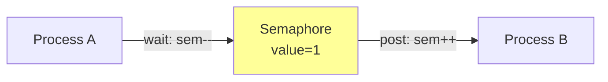

**Types:**
1. **Binary Semaphore (Mutex):** Value 0 or 1, used for mutual exclusion
2. **Counting Semaphore:** Any value, used for resource counting

### POSIX Semaphores

#### Two Flavors

1. **Named Semaphores:** System-wide, persistent
2. **Unnamed Semaphores:** Process-local or shared memory

### Named Semaphores

#### Core Functions

```c
#include <semaphore.h>
#include <fcntl.h>

// Create/open
sem_t *sem_open(const char *name, int oflag, mode_t mode, unsigned int value);

// Wait (decrement, lock)
int sem_wait(sem_t *sem);

// Post (increment, unlock)
int sem_post(sem_t *sem);

// Close
int sem_close(sem_t *sem);

// Delete
int sem_unlink(const char *name);
```

### Example: Protecting Shared Memory with Semaphore

**Writer:**

```c
#include <stdio.h>
#include <sys/mman.h>
#include <fcntl.h>
#include <semaphore.h>
#include <unistd.h>

int main() {
    // Create shared memory
    int fd = shm_open("/counter_shm", O_CREAT | O_RDWR, 0666);
    ftruncate(fd, sizeof(int));
    int *counter = mmap(NULL, sizeof(int), PROT_READ | PROT_WRITE, MAP_SHARED, fd, 0);
    *counter = 0;

    // Create semaphore (binary, initial value 1)
    sem_t *sem = sem_open("/counter_sem", O_CREAT, 0666, 1);

    // Increment counter 1000 times
    for (int i = 0; i < 1000; i++) {
        sem_wait(sem);  // Lock
        (*counter)++;
        sem_post(sem);  // Unlock
    }

    printf("Writer done. Counter = %d\n", *counter);

    sleep(2);  // Let reader finish

    sem_close(sem);
    sem_unlink("/counter_sem");
    munmap(counter, sizeof(int));
    close(fd);
    shm_unlink("/counter_shm");

    return 0;
}
```

**Reader:**

```c
#include <stdio.h>
#include <sys/mman.h>
#include <fcntl.h>
#include <semaphore.h>
#include <unistd.h>

int main() {
    // Open shared memory
    int fd = shm_open("/counter_shm", O_RDWR, 0666);
    int *counter = mmap(NULL, sizeof(int), PROT_READ | PROT_WRITE, MAP_SHARED, fd, 0);

    // Open semaphore
    sem_t *sem = sem_open("/counter_sem", 0);

    // Increment counter 1000 times
    for (int i = 0; i < 1000; i++) {
        sem_wait(sem);  // Lock
        (*counter)++;
        sem_post(sem);  // Unlock
    }

    printf("Reader done. Counter = %d\n", *counter);

    sem_close(sem);
    munmap(counter, sizeof(int));
    close(fd);

    return 0;
}
```

**Result:** Counter will be exactly 2000 (no race condition)

### Producer-Consumer with Semaphores

```c
#include <stdio.h>
#include <sys/mman.h>
#include <fcntl.h>
#include <semaphore.h>
#include <unistd.h>

#define BUFFER_SIZE 5

struct shared_buffer {
    int buffer[BUFFER_SIZE];
    int in;   // Write index
    int out;  // Read index
};

int main() {
    // Setup shared memory
    int fd = shm_open("/buffer_shm", O_CREAT | O_RDWR, 0666);
    ftruncate(fd, sizeof(struct shared_buffer));
    struct shared_buffer *buf = mmap(NULL, sizeof(struct shared_buffer),
                                      PROT_READ | PROT_WRITE, MAP_SHARED, fd, 0);
    buf->in = 0;
    buf->out = 0;

    // Semaphores
    sem_t *empty = sem_open("/empty_sem", O_CREAT, 0666, BUFFER_SIZE);  // Free slots
    sem_t *full = sem_open("/full_sem", O_CREAT, 0666, 0);              // Used slots
    sem_t *mutex = sem_open("/mutex_sem", O_CREAT, 0666, 1);            // Mutual exclusion

    if (fork() == 0) {
        // Child: Producer
        for (int i = 0; i < 10; i++) {
            sem_wait(empty);  // Wait for free slot
            sem_wait(mutex);  // Lock buffer

            buf->buffer[buf->in] = i;
            printf("Produced: %d\n", i);
            buf->in = (buf->in + 1) % BUFFER_SIZE;

            sem_post(mutex);  // Unlock buffer
            sem_post(full);   // Signal item available

            usleep(100000);
        }
    } else {
        // Parent: Consumer
        for (int i = 0; i < 10; i++) {
            sem_wait(full);   // Wait for item
            sem_wait(mutex);  // Lock buffer

            int item = buf->buffer[buf->out];
            printf("Consumed: %d\n", item);
            buf->out = (buf->out + 1) % BUFFER_SIZE;

            sem_post(mutex);  // Unlock buffer
            sem_post(empty);  // Signal slot free

            usleep(150000);
        }

        wait(NULL);

        // Cleanup
        sem_close(empty);
        sem_close(full);
        sem_close(mutex);
        sem_unlink("/empty_sem");
        sem_unlink("/full_sem");
        sem_unlink("/mutex_sem");
        munmap(buf, sizeof(struct shared_buffer));
        close(fd);
        shm_unlink("/buffer_shm");
    }

    return 0;
}
```

---

## Sockets

### What are Sockets?

**Socket:** Communication endpoint for sending/receiving data

**Types:**
1. **Unix Domain Sockets:** Local (same machine) communication
2. **Network Sockets:** Network communication (TCP/UDP)

### Unix Domain Sockets

Fast IPC for processes on same machine, using file system paths.

#### Socket Types

- **SOCK_STREAM:** Connection-oriented, reliable (like TCP)
- **SOCK_DGRAM:** Connectionless, unreliable (like UDP)

### Example: Unix Domain Stream Socket

**Server:**

```c
#include <stdio.h>
#include <sys/socket.h>
#include <sys/un.h>
#include <unistd.h>
#include <string.h>

#define SOCKET_PATH "/tmp/my_socket"

int main() {
    int server_fd, client_fd;
    struct sockaddr_un addr;

    // Create socket
    server_fd = socket(AF_UNIX, SOCK_STREAM, 0);
    if (server_fd == -1) {
        perror("socket");
        return 1;
    }

    // Setup address
    memset(&addr, 0, sizeof(addr));
    addr.sun_family = AF_UNIX;
    strncpy(addr.sun_path, SOCKET_PATH, sizeof(addr.sun_path) - 1);

    // Remove old socket file
    unlink(SOCKET_PATH);

    // Bind socket to path
    if (bind(server_fd, (struct sockaddr*)&addr, sizeof(addr)) == -1) {
        perror("bind");
        return 1;
    }

    // Listen for connections
    if (listen(server_fd, 5) == -1) {
        perror("listen");
        return 1;
    }

    printf("Server listening on %s\n", SOCKET_PATH);

    // Accept connection
    client_fd = accept(server_fd, NULL, NULL);
    if (client_fd == -1) {
        perror("accept");
        return 1;
    }

    printf("Client connected\n");

    // Receive data
    char buffer[256];
    int bytes = recv(client_fd, buffer, sizeof(buffer), 0);
    buffer[bytes] = '\0';
    printf("Received: %s\n", buffer);

    // Send response
    char *response = "Message received";
    send(client_fd, response, strlen(response), 0);

    // Cleanup
    close(client_fd);
    close(server_fd);
    unlink(SOCKET_PATH);

    return 0;
}
```

**Client:**

```c
#include <stdio.h>
#include <sys/socket.h>
#include <sys/un.h>
#include <string.h>
#include <unistd.h>

#define SOCKET_PATH "/tmp/my_socket"

int main() {
    int sock_fd;
    struct sockaddr_un addr;

    // Create socket
    sock_fd = socket(AF_UNIX, SOCK_STREAM, 0);
    if (sock_fd == -1) {
        perror("socket");
        return 1;
    }

    // Setup address
    memset(&addr, 0, sizeof(addr));
    addr.sun_family = AF_UNIX;
    strncpy(addr.sun_path, SOCKET_PATH, sizeof(addr.sun_path) - 1);

    // Connect to server
    if (connect(sock_fd, (struct sockaddr*)&addr, sizeof(addr)) == -1) {
        perror("connect");
        return 1;
    }

    printf("Connected to server\n");

    // Send data
    char *message = "Hello from client";
    send(sock_fd, message, strlen(message), 0);

    // Receive response
    char buffer[256];
    int bytes = recv(sock_fd, buffer, sizeof(buffer), 0);
    buffer[bytes] = '\0';
    printf("Server response: %s\n", buffer);

    close(sock_fd);
    return 0;
}
```

### Network Sockets (TCP)

**Server:**

```c
#include <stdio.h>
#include <sys/socket.h>
#include <netinet/in.h>
#include <string.h>
#include <unistd.h>

#define PORT 8080

int main() {
    int server_fd, client_fd;
    struct sockaddr_in addr;
    int addrlen = sizeof(addr);

    // Create socket
    server_fd = socket(AF_INET, SOCK_STREAM, 0);

    // Setup address
    addr.sin_family = AF_INET;
    addr.sin_addr.s_addr = INADDR_ANY;  // Listen on all interfaces
    addr.sin_port = htons(PORT);

    // Bind
    bind(server_fd, (struct sockaddr*)&addr, sizeof(addr));

    // Listen
    listen(server_fd, 5);
    printf("Server listening on port %d\n", PORT);

    // Accept connection
    client_fd = accept(server_fd, (struct sockaddr*)&addr, (socklen_t*)&addrlen);
    printf("Client connected\n");

    // Communicate
    char buffer[256];
    recv(client_fd, buffer, 256, 0);
    printf("Received: %s\n", buffer);

    send(client_fd, "ACK", 3, 0);

    close(client_fd);
    close(server_fd);

    return 0;
}
```

**Client:**

```c
#include <stdio.h>
#include <sys/socket.h>
#include <netinet/in.h>
#include <arpa/inet.h>
#include <string.h>
#include <unistd.h>

#define PORT 8080

int main() {
    int sock_fd;
    struct sockaddr_in addr;

    sock_fd = socket(AF_INET, SOCK_STREAM, 0);

    addr.sin_family = AF_INET;
    addr.sin_port = htons(PORT);
    inet_pton(AF_INET, "127.0.0.1", &addr.sin_addr);  // localhost

    connect(sock_fd, (struct sockaddr*)&addr, sizeof(addr));

    send(sock_fd, "Hello server", 12, 0);

    char buffer[256];
    recv(sock_fd, buffer, 256, 0);
    printf("Server: %s\n", buffer);

    close(sock_fd);
    return 0;
}
```

### Socket Data Flow

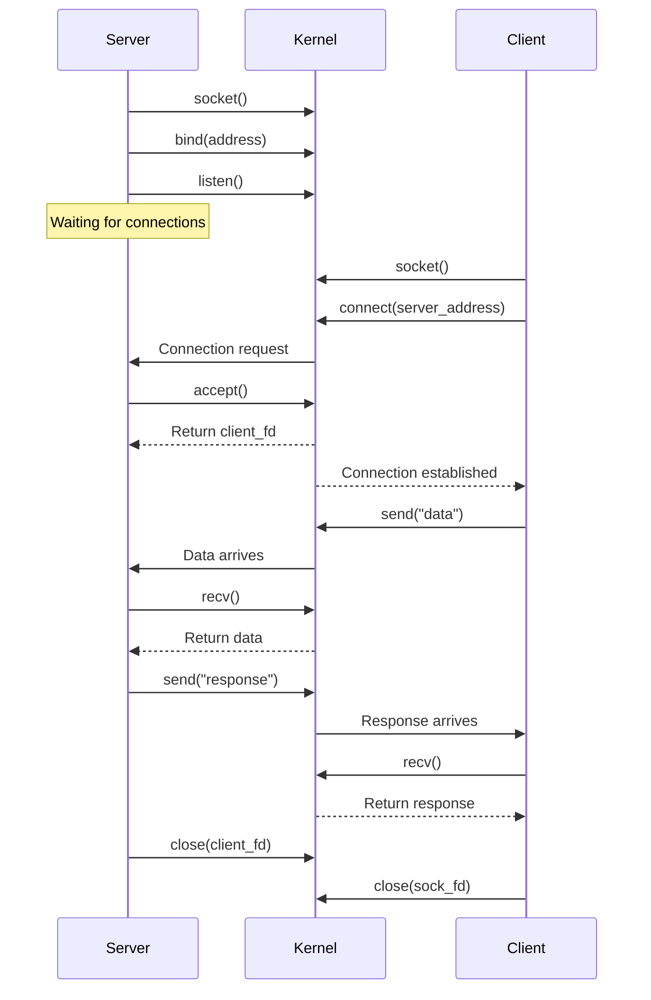

---

## Memory-Mapped Files

### What is mmap()?

Map a file directly into process memory. Changes to memory automatically written to file.

### Example: File Editing with mmap

```c
#include <stdio.h>
#include <sys/mman.h>
#include <fcntl.h>
#include <unistd.h>
#include <sys/stat.h>
#include <string.h>

int main() {
    const char *filename = "data.txt";

    // Create and write initial data
    int fd = open(filename, O_CREAT | O_RDWR, 0666);
    char *initial = "Hello World";
    write(fd, initial, strlen(initial));

    // Get file size
    struct stat st;
    fstat(fd, &st);
    size_t size = st.st_size;

    // Map file to memory
    char *mapped = mmap(NULL, size, PROT_READ | PROT_WRITE, MAP_SHARED, fd, 0);
    if (mapped == MAP_FAILED) {
        perror("mmap");
        return 1;
    }

    printf("Original: %.*s\n", (int)size, mapped);

    // Modify memory (automatically updates file)
    mapped[0] = 'h';  // Change 'H' to 'h'

    // Sync to disk (optional, happens automatically)
    msync(mapped, size, MS_SYNC);

    // Cleanup
    munmap(mapped, size);
    close(fd);

    // Verify changes
    fd = open(filename, O_RDONLY);
    char buffer[100];
    read(fd, buffer, size);
    buffer[size] = '\0';
    printf("Modified: %s\n", buffer);
    close(fd);

    return 0;
}
```

### IPC with Memory-Mapped Files

**Writer:**

```c
#include <stdio.h>
#include <sys/mman.h>
#include <fcntl.h>
#include <unistd.h>
#include <string.h>

int main() {
    int fd = open("/tmp/shared_file", O_CREAT | O_RDWR, 0666);
    ftruncate(fd, 4096);

    char *data = mmap(NULL, 4096, PROT_READ | PROT_WRITE, MAP_SHARED, fd, 0);

    strcpy(data, "Shared data via file mapping");
    msync(data, 4096, MS_SYNC);

    printf("Written data\n");
    sleep(5);  // Keep mapping active

    munmap(data, 4096);
    close(fd);
    return 0;
}
```

**Reader:**

```c
#include <stdio.h>
#include <sys/mman.h>
#include <fcntl.h>
#include <unistd.h>

int main() {
    sleep(1);  // Wait for writer

    int fd = open("/tmp/shared_file", O_RDONLY);
    char *data = mmap(NULL, 4096, PROT_READ, MAP_SHARED, fd, 0);

    printf("Read: %s\n", data);

    munmap(data, 4096);
    close(fd);
    return 0;
}
```

---

## Comparison Matrix

| Feature | Pipes | Message Queues | Shared Memory | Sockets |
|---------|-------|----------------|---------------|---------|
| **Speed** | Fast | Fast | Fastest | Moderate |
| **Setup Complexity** | Easy | Moderate | Complex | Moderate |
| **Message Boundaries** | No | Yes | N/A | Yes (DGRAM) |
| **Bidirectional** | No* | No* | Yes | Yes |
| **Network Support** | No | No | No | Yes |
| **Persistence** | No | Yes | No | No |
| **Synchronization** | Automatic | Automatic | Manual | Automatic |
| **Max Data Size** | 64KB buffer | Limited | Very large | No limit |
| **Use Case** | Simple streams | Discrete messages | High-perf data | Network/local |

*Can use two pipes/queues

### Performance Comparison


### Data Copy Comparison

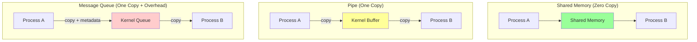

---

## Choosing the Right IPC

### Decision Tree

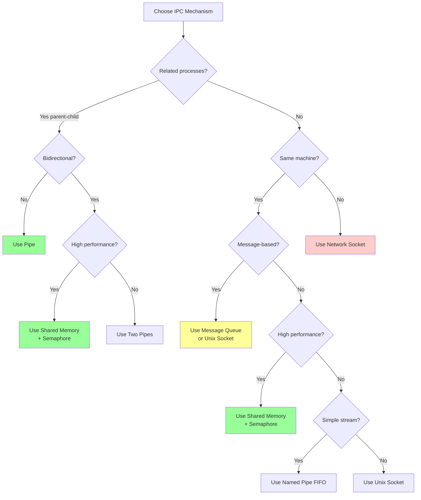

### Use Case Recommendations

#### 1. Parent-Child Simple Communication
**Choose:** Pipe
```c
int pipefd[2];
pipe(pipefd);
fork();
```

#### 2. Unrelated Processes, Message-Based
**Choose:** POSIX Message Queue
```c
mqd_t mq = mq_open("/queue", O_CREAT | O_RDWR, 0644, &attr);
mq_send(mq, msg, len, prio);
```

#### 3. High-Performance, Large Data
**Choose:** Shared Memory + Semaphore
```c
int fd = shm_open("/shm", O_CREAT | O_RDWR, 0666);
void *ptr = mmap(...);
sem_t *sem = sem_open("/sem", O_CREAT, 0666, 1);
```

#### 4. Network Communication
**Choose:** Network Socket
```c
int sock = socket(AF_INET, SOCK_STREAM, 0);
connect(sock, ...);
```

#### 5. Local Server-Client
**Choose:** Unix Domain Socket
```c
int sock = socket(AF_UNIX, SOCK_STREAM, 0);
bind(sock, ...);
```

#### 6. Command Pipeline
**Choose:** Pipe with exec
```c
pipe(pipefd);
dup2(pipefd[1], STDOUT_FILENO);
execlp("command", ...);
```

---

## Summary

### Quick Reference

#### Message Queues
```c
// POSIX
mqd_t mq = mq_open("/queue", O_CREAT | O_RDWR, 0644, &attr);
mq_send(mq, msg, len, prio);
mq_receive(mq, buf, size, &prio);
mq_close(mq);
mq_unlink("/queue");

// System V
key_t key = ftok("/tmp", 'A');
int msgid = msgget(key, 0666 | IPC_CREAT);
msgsnd(msgid, &msg, size, 0);
msgrcv(msgid, &msg, size, type, 0);
msgctl(msgid, IPC_RMID, NULL);
```

#### Shared Memory
```c
int fd = shm_open("/shm", O_CREAT | O_RDWR, 0666);
ftruncate(fd, size);
void *ptr = mmap(NULL, size, PROT_READ | PROT_WRITE, MAP_SHARED, fd, 0);
// Use ptr...
munmap(ptr, size);
close(fd);
shm_unlink("/shm");
```

#### Semaphores
```c
sem_t *sem = sem_open("/sem", O_CREAT, 0666, 1);
sem_wait(sem);  // Lock
// Critical section
sem_post(sem);  // Unlock
sem_close(sem);
sem_unlink("/sem");
```

#### Sockets
```c
// Server
int srv = socket(AF_UNIX, SOCK_STREAM, 0);
bind(srv, &addr, len);
listen(srv, 5);
int cli = accept(srv, NULL, NULL);

// Client
int sock = socket(AF_UNIX, SOCK_STREAM, 0);
connect(sock, &addr, len);

// Both
send(sock, data, len, 0);
recv(sock, buf, len, 0);
```

### Compilation Flags

```bash
# Message queues, shared memory, semaphores
gcc program.c -o program -lrt

# Sockets (usually no extra flags needed)
gcc program.c -o program

# Threads (if using pthread mutexes)
gcc program.c -o program -lpthread
```

### Common Pitfalls

1. **Forgetting to unlink resources**
   ```c
   mq_unlink("/queue");
   shm_unlink("/shm");
   sem_unlink("/sem");
   ```

2. **Race conditions with shared memory**
   - Always use semaphores!

3. **Buffer size mismatch in message queues**
   ```c
   struct mq_attr attr;
   mq_getattr(mq, &attr);
   char buf[attr.mq_msgsize];  // Use correct size
   ```

4. **Not checking return values**
   ```c
   if (mq_send(...) == -1) {
       perror("mq_send");
   }
   ```

5. **Deadlock with semaphores**
   - Always release in reverse order of acquisition
   - Use timeouts with `sem_timedwait()`

---

## Practice Exercises

### Exercise 1: Chat Application
Use message queues to create a bidirectional chat between two processes.

### Exercise 2: Shared Counter
Create 10 processes incrementing a shared counter. Use semaphores to ensure correctness.

### Exercise 3: Producer-Consumer
Implement producer-consumer with shared memory circular buffer and semaphores.

### Exercise 4: File Server
Create a server using Unix sockets that reads files requested by clients.

### Exercise 5: Benchmark
Compare performance of pipes vs message queues vs shared memory for transferring 1MB of data.

---

**End of IPC Crash Course**

This guide covers all major IPC mechanisms with theory, examples, and practical usage patterns.
